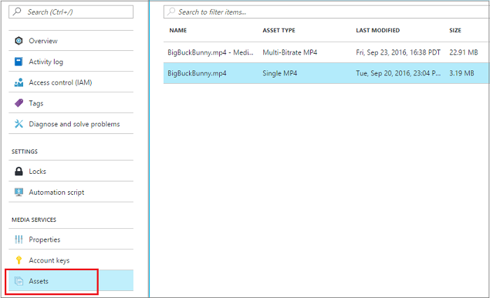
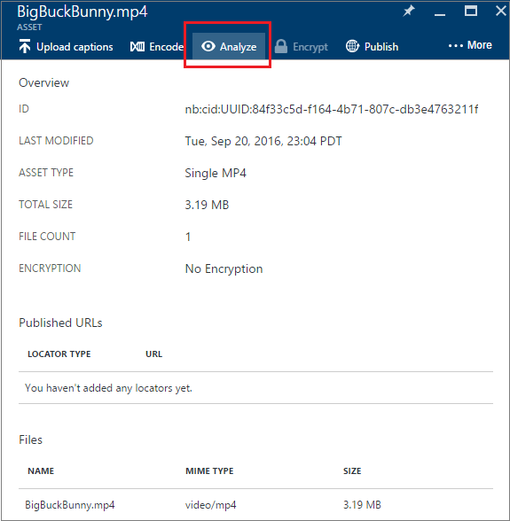
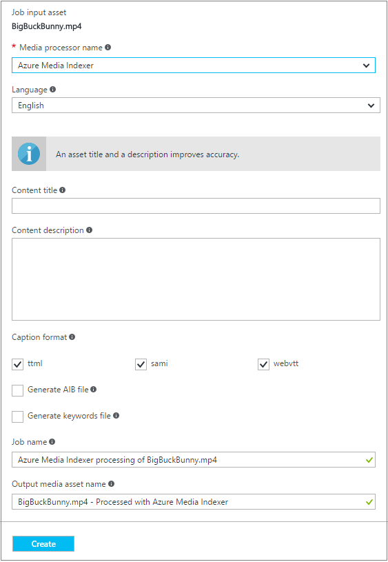
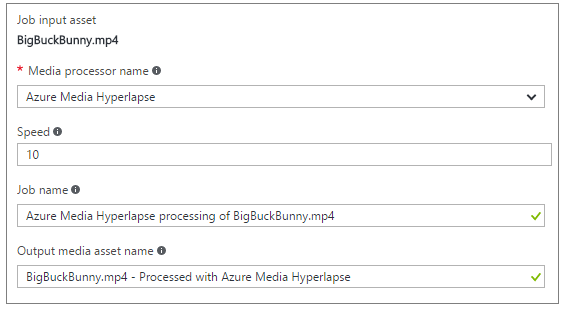
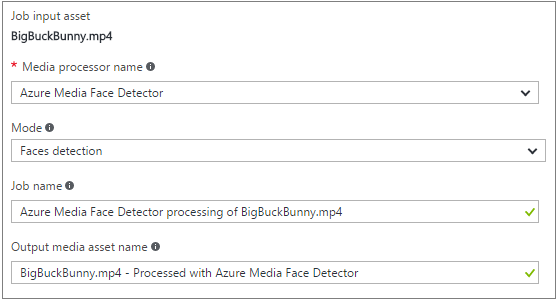
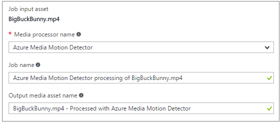
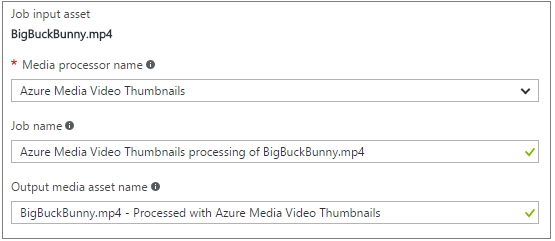

<properties
    pageTitle="Analysieren Sie Ihre Medien mit dem Portal Azure | Microsoft Azure"
    description="In diesem Thema wird erläutert, wie Ihre Medien mit Medien Analytics Medienprozessoren (Management Packs) über das Azure-Portal verarbeitet wird."
    services="media-services"
    documentationCenter=""
    authors="Juliako"
    manager="erikre"
    editor=""/>

<tags
    ms.service="media-services"
    ms.workload="media"
    ms.tgt_pltfrm="na"
    ms.devlang="na"
    ms.topic="article"
    ms.date="10/24/2016"
    ms.author="juliako"/>

# Analysieren Sie Ihre Medien mit dem Azure-portal

> [AZURE.NOTE] Damit dieses Lernprogramm abgeschlossen, benötigen Sie ein Azure-Konto an. Weitere Informationen finden Sie unter [Azure kostenlose Testversion](https://azure.microsoft.com/pricing/free-trial/). 

## (Übersicht)

Azure Media Services Analytics ist eine Sammlung von Sprachein-/Ausgabe und Vision Komponenten (bei unternehmensweite Compliance, Sicherheit und globale Reichweite), die für Organisationen und Unternehmen nützliche Einblicke in ihre Videodateien abgeleitet erleichtern. Ausführlichere Übersicht Azure Media Services Analytics finden Sie unter [in diesem](media-services-analytics-overview.md) Thema. 

In diesem Thema wird erläutert, wie Ihre Medien mit Medien Analytics Medienprozessoren (Management Packs) über das Azure-Portal verarbeitet wird. Medien Analytics Management Packs Naturprodukte MP4-Dateien oder JSON-Dateien. Wenn ein Medienprozessor MP4-Datei angefallen, können Sie die Datei schrittweise herunterladen. Wenn ein Medienprozessor eine JSON-Datei erstellt, können Sie die Datei aus dem Azure Blob-Speicher herunterladen. 

## Wählen Sie eine Anlage, die Sie analysieren möchten. 
 
1. Wählen Sie im [Portal Azure](https://portal.azure.com/)Ihrer Azure Media Services-Konto ein.
2. Wählen Sie **Posten**im Fenster **Einstellungen** aus.  
.
    

2. Wählen Sie die Anlage, die Sie analysieren, und drücken Sie die Taste **Analysieren** möchten.
        
    

3. Wählen Sie im Fenster **Medien-Anlage mit Medien Analytics Prozess** des Prozessors ein. 

    Im weiteren Verlauf des Artikels wird erläutert, warum und wie Sie jeden Prozessor verwenden. 
   
4. Drücken Sie **Erstellen** bis zum Anfang eines Auftrags.

## Azure Media Indexer

Der **Azure Medien Indexer** Media-Prozessor können Sie Mediendateien und Inhalt durchsucht Stellen sowie geschlossene Untertiteln Spuren generieren. In diesem Abschnitt erhalten einige Informationen zu den Optionen, die Sie für diese MP angeben können.

### Sprache

Die natürlicher Sprache in der Multimediadatei erkannt werden. Englisch oder Spanisch. 

### Beschriftungen

Sie können eine Beschriftungsformat auswählen, die von den Inhalt generiert werden. Ein Indizierung Auftrag kann Untertitel Dateien in den folgenden Formaten generiert werden:  

- **Samisch**
- **TTML**
- **WebVTT**

Caption (CC) Dateien in diesen Formaten verwendet werden können, um Audio-und Videodateien für Menschen mit Behinderung hören zugänglich gemacht wird geschlossen.

### AIB-Datei

Wählen Sie diese Option, wenn Sie die Audio Index Blob-Datei mit der benutzerdefinierten SQL Server-IFilter generieren möchten. Weitere Informationen finden Sie in [diesem](https://azure.microsoft.com/blog/using-aib-files-with-azure-media-indexer-and-sql-server/) Blog.

### Schlüsselwörter

Wählen Sie diese Option, wenn Sie eine Schlüsselwörter XML-Datei erstellen möchten. Diese Datei enthält Schlüsselwörter extrahiert aus dem Sprachinhalt mit Häufigkeit und Bereich.verschieben Informationen.

### Name der Position

Einen Anzeigenamen, in der Sie den Auftrag erkennen kann. [Dieser](media-services-portal-check-job-progress.md) Artikel beschreibt, wie Sie den Fortschritt eines Projekts überwachen können. 

### Die Ausgabedatei

Einen Anzeigenamen, in der Sie den Ausgabeinhalt erkennen kann. 

## Azure Media Hyperlapse

Azure Medien Hyperlapse ist einem Management Pack, die interpolierten Zeit abgelaufen Videos aus dem ersten-Person oder Aktion-Kamera Inhalt erstellt wird.  Weitere Informationen finden Sie [in diesem](media-services-hyperlapse-content.md) Thema. In diesem Abschnitt erhalten einige Informationen zu den Optionen, die Sie für diese MP angeben können.

### Geschwindigkeit 

Geben Sie die Geschwindigkeit, mit der zum Beschleunigen des Eingabewerte Videos an. Die Ausgabe ist eine stabilisierte und Zeit abgelaufen Formatvariante der Eingabe video an.

### Name der Position

Einen Anzeigenamen, in der Sie den Auftrag erkennen kann. [Dieser](media-services-portal-check-job-progress.md) Artikel beschreibt, wie Sie den Fortschritt eines Projekts überwachen können. 

### Die Ausgabedatei

Einen Anzeigenamen, in der Sie den Ausgabeinhalt erkennen kann. 

## Azure Media Smiley Erkennung

Der **Azure Medien Smiley Erkennung** Media-Prozessor (MP) ermöglicht es Ihnen zu zählen, abgestimmt nachverfolgen und sogar die Teilnahme an der Zielgruppe und Reaktion über Gesichtsausdrücke-Zeitachse. Dieser Dienst enthält zwei Funktionen: 

- **Smiley Erkennung**

    Smiley Erkennung findet und verfolgt personenbezogenen Flächen innerhalb eines Videos. Mehrere Flächen erkannt werden können und anschließend nachverfolgt werden, wie sie versehen, mit der Zeit und Ort Metadaten zurückgegeben, die in einer JSON-Datei verschoben. Während der Verlauf wird versucht, eine konsistente ID zur gleichen Fläche erteilen, während die Person, die auf dem Bildschirm bewegen wird auch wenn sie verdeckt werden, oder lassen Sie den Rahmen kurz.

    >[AZURE.NOTE]Diese Services führt keine Gesichtsausdruck Spracherkennung. Eine Person, die bewirkt, dass den Rahmen oder wird für verdeckt zu lang versehen wird eine neue ID sobald wieder.

- **Emotionen Erkennung**
    
    Emotionen Erkennung ist eine optionale Komponente von der Smiley Erkennung Medienprozessor, die Analyse auf mehrere emotionale Attribute aus den Flächen erkannt, einschließlich Glück, Sadness, Angst, Anger und zurückgibt. 

### Erkennungsmodus

Einer der folgenden Modi kann vom Prozessor verwendet werden:

- Smiley Erkennung
- pro Smiley Emotionen Erkennung
- Aggregieren Emotionen Erkennung

### Name der Position

Einen Anzeigenamen, in der Sie den Auftrag erkennen kann. [Dieser](media-services-portal-check-job-progress.md) Artikel beschreibt, wie Sie den Fortschritt eines Projekts überwachen können. 

### Die Ausgabedatei

Einen Anzeigenamen, in der Sie den Ausgabeinhalt erkennen kann. 

## Bewegungsmelder Azure Medien

Der **Azure Medien Bewegungsmelder** Medienprozessor (MP) können Sie effizient Abschnitte relevante innerhalb eines Videos andernfalls lange und ergebnislosen ermitteln. Bewegung Erkennung kann auf statischen Kamera entfernt verwendet werden, um Abschnitte des Videos zu identifizieren, in denen Motion auftritt. Er generiert eine JSON-Datei mit Metadaten, die mit dem Zeitstempel und der Bereich des umgebenden, in dem das Ereignis aufgetreten ist.

Als Ziel in Richtung Sicherheit video-Feeds, kann diese Technologie Bewegung relevante Ereignisse und falsche Interpretation wie Schatten und Beleuchtung Änderungen zugewiesen. So können Sie aus der Kamera Feeds von Sicherheitshinweisen generieren, ohne aufführen mit unbeschränkter irrelevante Ereignisse, während Sie Augenblicke relevante aus sehr lange Überwachung Videos zu extrahieren.

## Video Miniaturansichten Azure Medien

Dieser Prozessor helfen Ihnen die Zusammenfassung der langen Videos erstellen, indem Sie interessante Codeausschnitte automatisch aus dem Quellvideo auswählen. Dies ist nützlich, wenn Sie einen schnellen Überblick über was Sie erwartet in einem langen Video bereitstellen möchten. Ausführliche Informationen und Beispiele hierzu finden Sie unter [Verwenden Azure Medien Video Miniaturansichten zum Erstellen einer Video-Zusammenfassung](media-services-video-summarization.md)

### Name der Position

Einen Anzeigenamen, in der Sie den Auftrag erkennen kann. [Dieser](media-services-portal-check-job-progress.md) Artikel beschreibt, wie Sie den Fortschritt eines Projekts überwachen können. 

### Die Ausgabedatei

Einen Anzeigenamen, in der Sie den Ausgabeinhalt erkennen kann. 

##Nächste Schritte

Learning Wege anzeigen Media-Dienste.

[AZURE.INCLUDE [media-services-learning-paths-include](../../includes/media-services-learning-paths-include.md)]

##Angeben von feedback

[AZURE.INCLUDE [media-services-user-voice-include](../../includes/media-services-user-voice-include.md)]

