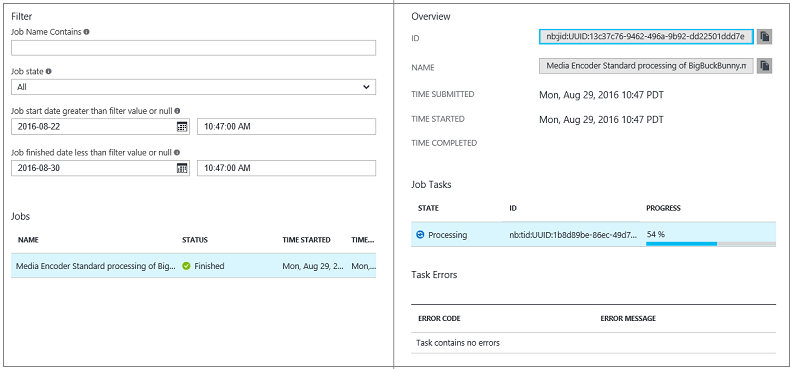

<properties 
    pageTitle="Überwachung Codierung des Projektstatus mit dem Azure-portal" 
    description="Dieses Lernprogramm führt Sie durch die Schritte für die Überwachung Ihrer Position des Vorgangsfortschritts über das Azure-Portal an." 
    services="media-services" 
    documentationCenter="" 
    authors="juliako" 
    manager="erikre" 
    editor=""/>

<tags 
    ms.service="media-services" 
    ms.workload="media" 
    ms.tgt_pltfrm="na" 
    ms.devlang="na" 
    ms.topic="article" 
    ms.date="08/29/2016"  
    ms.author="juliako"/>

#Überwachung Codierung des Projektstatus mit dem Azure-portal

> [AZURE.SELECTOR]
- [Portal](media-services-portal-check-job-progress.md)
- [.NET](media-services-check-job-progress.md)
- [REST](media-services-rest-check-job-progress.md)

## (Übersicht)

> [AZURE.NOTE] Damit dieses Lernprogramm abgeschlossen, benötigen Sie ein Azure-Konto an. Weitere Informationen finden Sie unter [Azure kostenlose Testversion](https://azure.microsoft.com/pricing/free-trial/). 

Wenn Sie Aufträge ausführen, müssen Sie oft eine Möglichkeit zum Nachverfolgen des Projektstatus. 

Klicken Sie zum Überwachen des Fortschritts des Codierung Auftrags klicken Sie auf **Einstellungen** (am oberen Rand der Seite), und wählen Sie dann auf **Projekte**.

Sie können den Auftrag, um weitere Informationen hierzu finden Sie unter klicken.

##Nächste Schritte

Nachdem Sie Ihre Codierung Aufgabe eine ist, können Sie veröffentlichen und Ihre Bestände jederzeit als beschrieben [hier](media-services-portal-publish.md)wiedergeben.

##Media-Dienste Learning Wege

[AZURE.INCLUDE [media-services-learning-paths-include](../../includes/media-services-learning-paths-include.md)]

##Angeben von feedback

[AZURE.INCLUDE [media-services-user-voice-include](../../includes/media-services-user-voice-include.md)]
