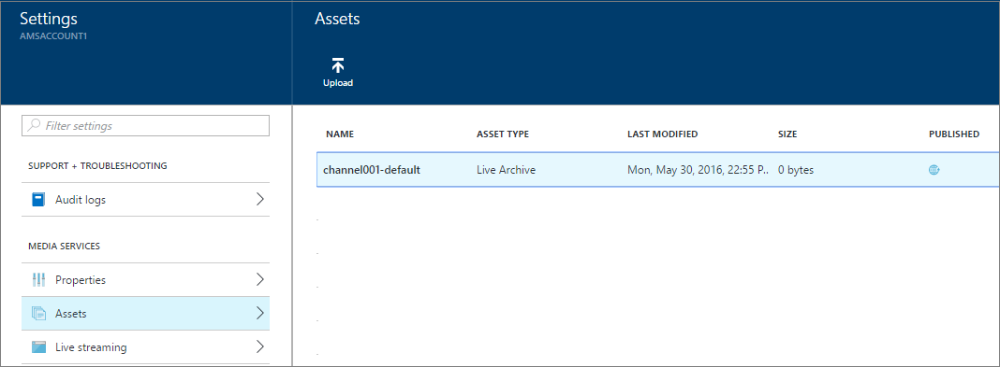

<properties 
    pageTitle="Wie Sie live streaming mithilfe von Azure Media-Dienste zum Erstellen von Multi-Bitrate Streams mit Azure-Portal durchführen | Microsoft Azure" 
    description="Dieses Lernprogramm führt Sie durch die Schritte zum Erstellen eines Channel, die einen einzelnes-Bitrate live Stream empfängt und es in Multi-Bitrate Stream über das Azure-Portal codiert." 
    services="media-services" 
    documentationCenter="" 
    authors="anilmur" 
    manager="erikre" 
    editor=""/>

<tags 
    ms.service="media-services" 
    ms.workload="media" 
    ms.tgt_pltfrm="na" 
    ms.devlang="na" 
    ms.topic="get-started-article"
    ms.date="10/24/2016"
    ms.author="juliako"/>

#Wie Sie live streaming mithilfe von Azure Media-Dienste zum Erstellen von Multi-Bitrate Streams mit Azure-Portal durchführen

> [AZURE.SELECTOR]
- [Portal](media-services-portal-creating-live-encoder-enabled-channel.md)
- [.NET](media-services-dotnet-creating-live-encoder-enabled-channel.md)
- [REST-API](https://msdn.microsoft.com/library/azure/dn783458.aspx)

Dieses Lernprogramm führt Sie durch die Schritte zum Erstellen eines **Channel** , die einen einzelnes-Bitrate live Stream empfängt und es in Stream Multi-Bitrate codiert.

>[AZURE.NOTE]Weitere grundlegende Informationen, die im Zusammenhang mit Kanäle, die für die live-Codierung aktiviert sind, finden Sie unter [Live streaming mit Azure Media Services um Multi-Bitrate Streams zu erstellen](media-services-manage-live-encoder-enabled-channels.md).

##Allgemeine Live Streaming Szenario

Im folgenden werden die allgemeinen Schritte bei der gemeinsamen live streaming Applications erstellen.

>[AZURE.NOTE] Derzeit ist die maximal zulässige empfohlene Dauer eines Ereignisses live 8 Stunden. Wenden Sie sich an Amslived unter Microsoft.com, wenn Sie einen Kanal für längere Zeiträume ausführen müssen.

1. Herstellen einer Verbindung einem Computer mit einer Videokamera. Starten und konfigurieren einen lokalen live Encoder, die einen einzelnes Bitrate Stream in eine der folgenden Protokolle ausgeben kann: RTMP, interpolierten Streaming oder RTP (MPEG-Terminaldienste). Weitere Informationen finden Sie unter [Azure Media Services RTMP Support und Live-Encoder](http://go.microsoft.com/fwlink/?LinkId=532824).
    
    Dieser Schritt konnte auch ausgeführt werden, nachdem Sie Ihre Kanal erstellt haben.

1. Erstellen Sie und starten Sie einen Kanal. 

1. Abrufen der Kanal Aufnahme URL. 

    Die URL für die Erfassung wird vom live Encoder zum Streams an den Kanal senden.
1. Abrufen der Channel Vorschau-URL an. 

    Verwenden Sie diese URL, um sicherzustellen, dass Ihre Channel ordnungsgemäß live-Streams empfängt.

3. Erstellen Sie ein Ereignis/Programm (, die auch erstellen eine Anlage). 
1. Veröffentlichen Sie das Ereignis (, die einen auf-Anforderung Locator für die zugeordnete Anlage erstellen).  

    Stellen Sie sicher, dass mindestens eine streaming reservierte Einheit für das streaming Endpunkt von der zum Streaming von Inhalten aus.
1. Starten Sie das Ereignis, wenn Sie streaming und Archivierung starten möchten.
2. Optional kann der live Encoder signalisiert werden, ist eine Werbeanzeige zu starten. Die Ankündigung wird in der Ausgabestream eingefügt.
1. Beenden Sie das Ereignis aus, sobald Sie streaming und das Ereignis Archivierung beenden möchten.
1. Das Ereignis löschen (und optional die Anlage löschen).   

##In diesem Lernprogramm

In diesem Lernprogramm wird das Azure-Portal verwendet, um die folgenden Aufgaben ausführen: 

2.  Konfigurieren Sie streaming Endpunkte.
3.  Erstellen Sie einen Kanal, der zum Ausführen der live-Codierung aktiviert ist.
1.  Rufen Sie die URL Aufnahme, um, um Encoder live angeben. Der live Encoder wird dieser URL zu den Stream in den Kanal Aufnahme verwendet. .
1.  Erstellen Sie ein Ereignis-Programm (und eine Anlage)
1.  Veröffentlichen Sie die Anlage und erhalten URLs streaming  
1.  Wiedergeben von Inhalten 
2.  Bereinigen

##Erforderliche Komponenten

Die folgenden sind für dieses Lernprogramm erforderlich erforderlich.

- Damit dieses Lernprogramm abgeschlossen, benötigen Sie ein Azure-Konto an. Wenn Sie kein Konto haben, können Sie ein kostenloses Testversion Konto nur wenigen Minuten erstellen. Weitere Informationen finden Sie unter [Azure kostenlose Testversion](https://azure.microsoft.com/pricing/free-trial/).
- Ein Konto Media-Dienste. Zum Erstellen eines Media Services-Kontos finden Sie unter [Konto erstellen](media-services-portal-create-account.md).
- Eine Webcam und ein Encoder, der einen einzelnes Bitrate live Stream senden können.

##Konfigurieren Sie streaming Endpunkte 

Media Services bietet dynamische Verpacken, dem Sie Ihre Multi-Bitrate MP4s in den folgenden streaming Formaten vorführen kann: MPEG Gedankenstrich, HLS, interpolierten Streaming, oder Festplatten, ohne dass Sie in den folgenden Formaten streaming erneut verpacken. Mit dynamischen Verpackung müssen Sie nur zu speichern und die Dateien in den einzelnen Speicherformat bezahlen und Medien-Dienste erstellen und die entsprechende Antwort basierend auf einem Client-Anfragen dienen.

Um dynamische Verpackung nutzen zu können, müssen Sie mindestens eine streaming Einheit für das streaming Endpunkt abrufen aus dem Sie die Übermittlung von Inhalten erstellen möchten.  

Zum Erstellen und ändern die Anzahl der Einheiten reservierte streaming, führen Sie folgende Schritte aus:

1. Melden Sie sich bei der [Azure-Portal](https://portal.azure.com/) , und wählen Sie Ihr Konto AMS.
1. Klicken Sie im Fenster **Einstellungen** auf **Streaming Endpunkte**. 

2. Klicken Sie auf die Standardeinstellungen für streaming-Endpunkt. 

    Das Fenster **STANDARDMÄßIG STREAMING ENDPUNKTDETAILS** wird angezeigt.

3. Um die Anzahl der Einheiten streaming anzugeben, schieben Sie den Schieberegler **Streaming Einheiten** .

    

4. Klicken Sie auf die Schaltfläche **Speichern** , um die Änderungen zu speichern.

    >[AZURE.NOTE]Die Zuordnung von allen neuen Einheiten kann bis zu 20 Minuten dauern.

##Erstellen Sie einen Kanal

1. Im [Portal Azure](https://portal.azure.com/)-Media-Dienste wählen Sie aus, und klicken Sie dann auf Ihren Kontonamen Media-Dienste.
2. Wählen Sie das **Streaming Live**aus.
3. Wählen Sie **benutzerdefinierte erstellen**. Diese Option können Sie einen Kanal erstellen, der für die live-Codierung aktiviert ist.

    
    
4. Klicken Sie auf **Einstellungen**.
    
    1.  Wählen Sie den Typ der **Codierung Live** Channel aus. Dieses Typs gibt an, dass Sie möchten einen Kanal zu erstellen, die für die live-Codierung aktiviert ist. Das bedeutet, dass die eingehende einzelnen Bitrate Stream an den Kanal gesendet und codierte in einen Multi-Bitrate Stream angegebenen live Encoder Einstellungen verwenden. Weitere Informationen finden Sie unter [Live streaming mit Azure Media Services um Multi-Bitrate Streams zu erstellen](media-services-manage-live-encoder-enabled-channels.md). Klicken Sie auf OK.
    2. Geben Sie einen Channel an.
    3. Klicken Sie auf OK, am unteren Rand des Bildschirms.
    
5. Wählen Sie die Registerkarte **Erfassung** aus.

    1. Auf dieser Seite können Sie streaming-Protokoll auswählen. Sind für den Typ **Live Codierung** Channel gültigen Protokolloptionen aus:
        
        - Einzelne Bitrate fragmentiert MP4 (interpolierten Streaming)
        - Einzelne Bitrate RTMP
        - RTP (MPEG-Terminaldienste): MPEG-2 Transportregel-Stream über RTP.
        
        Ausführliche Erläuterung zu jedem Protokoll finden Sie unter [Live streaming mit Azure Media Services um Multi-Bitrate Streams zu erstellen](media-services-manage-live-encoder-enabled-channels.md).
    
        Sie können die Protokolloption während der Kanal nicht ändern oder seine zugeordneten Ereignisse-Programme ausgeführt werden. Wenn Sie andere Protokolle benötigen, sollten Sie separate Kanäle für jedes streaming Protokoll erstellen.  

    2. Sie können auf die Erfassung IP-Einschränkung anwenden. 
    
        Sie können die IP-Adressen definieren, die auf ein Video zu diesem Channel Aufnahme zulässig ist. Zulässige IP-Adressen können als eine einzelne IP-Adresse (z. B. ' 10.0.0.1'), IP-Bereich verwenden eine IP-Adresse und eine CIDR Subnetzmaske (z. B. ' 10.0.0.1/22'), oder verwenden eine IP-Adresse und eine gepunktete decimal Subnetzmaske IP-Bereich angegeben werden (z. B. ' 10.0.0.1(255.255.252.0)').

        Wenn keine IP-Adressen angegeben sind, und es keine Regeldefinition ist wird keine IP-Adresse zulässig. Um eine beliebige IP-Adresse zulassen möchten, erstellen Sie eine Regel und 0.0.0.0/0 festgelegt.

6. Wenden Sie auf der Registerkarte **Vorschau** IP-Einschränkung in der Vorschau an.
7. Geben Sie auf der Registerkarte **Codierung** die Codierung Voreinstellung an. 

    Derzeit das einzige System Voreinstellung Sie auswählen können, wird **standardmäßig 720p**. Um eine benutzerdefinierte Vorgabe angeben möchten, öffnen Sie ein Microsoft-Support-Ticket aus. Geben Sie den Namen der Voreinstellung für Sie erstellt. 

>[AZURE.NOTE] Derzeit kann Channel Anfang bis zu 30 Minuten dauern. Channel zurücksetzen kann bis zu 5 Minuten dauern.

Nachdem Sie den Kanal erstellt haben, können Sie klicken Sie auf den Kanal und wählen Sie **Einstellungen** in dem Sie Ihre Kanäle Konfigurationen anzeigen können. 

Weitere Informationen finden Sie unter [Live streaming mit Azure Media Services um Multi-Bitrate Streams zu erstellen](media-services-manage-live-encoder-enabled-channels.md).

##Get-Aufnahme URLs

Nachdem der Kanal erstellt wurde, können Sie erste Aufnahme URLs, die für dem live Encoder bereitgestellt werden. Der Encoder verwendet diese URLs, um eine live Stream Eingabe.

##Erstellen und Verwalten von Ereignissen

###(Übersicht)

Ein Kanal ist zugeordnet Ereignisse/Programme, mit die Sie die Veröffentlichung und die Speicherung von Segmente in einem live Stream steuern können. Kanäle verwalten Ereignisse/Programme. Die Beziehung Channel und Programm ist sehr ähnlich wie herkömmliche Medien, wo ein Kanal hat einen Konstanten Videodatenstrom von Inhalten und ein Programm ist auf einigen terminierten Ereignis in diesem Kanal ausgelegte.

Sie können angeben, die Anzahl der Stunden, die den aufgezeichneten Inhalt für das Ereignis durch Festlegen der Länge **Archiv Fenster** beibehalten werden sollen. Dieser Wert kann maximal 25 Stunden aus mindestens 5 Minuten festgelegt werden. Archivieren Fensterlänge bestimmt auch, dass die maximale Größe des Zeit-Clients aus der die aktuelle Position live zeitlich rückwärts anfordern kann. Ereignisse über die angegebene Zeitspanne ausgeführt werden können, aber Inhalt, der hinter dem Fensterlänge fällt wird kontinuierlich verworfen. Dieser Wert dieser Eigenschaft bestimmt auch an, wie lange die Client-Manifeste wachsen können.

Jedes Ereignis ist eine Anlage zugeordnet. Um das Ereignis zu veröffentlichen, müssen Sie einen auf-Anforderung Locator für die zugeordnete Anlage erstellen. Diese Locator Probleme aktivieren Sie zum Erstellen eines streaming URL, die für Kunden bereitgestellt werden können.

Ein Kanal unterstützt bis zu drei gleichzeitig ausgeführte Ereignisse, damit Sie mehrere Archiven des gleichen eingehende Streams erstellen können. So können Sie veröffentlichen und anderen Teile eines Ereignisses archivieren, je nach Bedarf. Beispielsweise ist Ihre geschäftliche Anforderung 6 Stunden eines Ereignisses zu archivieren, sondern nur in den letzten 10 Minuten übertragen. Um dies zu erreichen, müssen Sie zwei gleichzeitig ausgeführter erstellen Ereignis. Archivieren von 6 Stunden des Ereignisses ein Ereignis festgelegt ist, aber das Programm wird nicht veröffentlicht. Die anderen Ereignisses für 10 Minuten archivieren festgelegt ist, und dieses Programm veröffentlicht wird.

Vorhandene Programme für neue Ereignisse sollten Sie nicht wieder verwenden. Erstellen Sie stattdessen auf, und starten Sie ein neues Programm für jedes Ereignis.

Wenn Sie zum Starten von streaming und Archivierung bereit sind, starten Sie ein Ereignis-Programm. Beenden Sie das Ereignis aus, sobald Sie streaming und das Ereignis Archivierung beenden möchten. 

Zum Löschen der archivierten Inhalte beenden Sie und löschen Sie das Ereignis, und löschen Sie die zugeordnete Anlage. Eine Anlage kann nicht gelöscht werden, wenn sie das Ereignis verwendet wird; das Ereignis muss zuerst gelöscht werden. 

Auch nach dem Beenden und löschen das Ereignis, würde der Benutzer können Ihre archivierten Inhalte als Video on Demand für übertragen, solange Sie nicht die Anlage löschen.

Wenn Sie möchten archivierte Inhalte beibehalten, aber nicht verfügbar für das streaming, löschen Sie den streaming Locator.

###Erstellen/Start/Stopp Ereignisse

Nachdem Sie den Stream in den Kanal entdeckt haben können Sie das streaming Ereignis durch Erstellen einer Anlage, Programm- und Streaming Locator beginnen. Den Stream archivieren wird und Viewer, bis das Streaming Endpunkt verfügbar machen. 

Es gibt zwei Möglichkeiten zum Starten des Ereignisses ein: 

1. Drücken Sie von der Seite **Channel** **Live Ereignis** ein neues Ereignis hinzuzufügen.

    Geben Sie an: Name des Ereignisses, Anlage Name, Archiv Fenster und Verschlüsselungsoption.
    
    
    
    Wenn Sie nach **Veröffentlichen jetzt live Ereignis** aktiviert links wird das Ereignis die URLs für die Veröffentlichung erstellt erhalten.
    
    Sie können **beginnen**, drücken Sie immer, wenn Sie bereit sind, die das Ereignis übertragen werden.

    Nachdem Sie das Ereignis beginnen möchten, können Sie **Anzeigen** , um die Wiedergabe des Inhalts starten drücken.

2. Alternativ können Sie eine Verknüpfung verwenden und Taste **Live wechseln Sie** auf der Seite **Erstellen** . Dadurch wird die standardmäßige Anlage, Programm- und Streaming Locator erstellt.

    Das Ereignis ist mit dem Namen **Default** , und klicken Sie im Fenster Archiv auf 8 Stunden festgelegt ist.

Sie können das veröffentlichte Ereignis von der Seite **Live Ereignis** anschauen. 

Wenn Sie **Deaktiviert Air**klicken, wird es alle live Ereignisse beenden. 

##Schauen Sie sich das Ereignis

Um das Ereignis ansehen möchten, klicken Sie auf **Überwachung** Azure-Portal oder kopieren Sie die URL des streaming, und verwenden Sie einen Player Ihrer Wahl. 
 

Live Ereignis konvertiert Ereignisse automatisch auf Inhalte bei Bedarf, wenn Sie nicht mehr.

##Aufräumen

Wenn Sie streaming Ereignisse fertig sind und die Ressourcen nach der Bereitstellung zuvor bereinigen möchten, führen Sie das folgende Verfahren.

- Beenden des Streams vom Encoder drücken.
- Beenden Sie den Kanal ein. Nachdem der Kanal beendet wird, wird es alle anfallen nicht. Wenn Sie neu zu starten müssen, haben sie dieselbe URL Aufnahme, sodass Sie nicht benötigen, Ihre Encoder neu zu konfigurieren.
- Es sei denn, Sie weiterhin das Archiv Ihrer live Veranstaltung als bei Bedarf Stream bereitstellen möchten, können Sie Ihre Endpunkt Streaming beenden. Wenn der Kanal Zustand beendet ist, wird es alle anfallen nicht.
  
##Archivierten Inhalte anzeigen

Auch nach dem Beenden und löschen das Ereignis, würde der Benutzer können Ihre archivierten Inhalte als Video on Demand für übertragen, solange Sie nicht die Anlage löschen. Eine Anlage kann nicht gelöscht werden, wenn es durch ein Ereignis verwendet wird; das Ereignis muss zuerst gelöscht werden. 

Verwalten Ihre Bestände jederzeit, wählen Sie die **Einstellung** , und klicken Sie auf **Posten**.

##Aspekte

- Derzeit ist die maximal zulässige empfohlene Dauer eines Ereignisses live 8 Stunden. Wenden Sie sich an Amslived unter Microsoft.com, wenn Sie einen Kanal für längere Zeiträume ausführen müssen.
- Stellen Sie sicher, dass mindestens eine streaming reservierte Einheit für das streaming Endpunkt von der zum Streaming von Inhalten aus.

##Als Nächstes

Überprüfen Sie die Pfade learning Media-Dienste.

[AZURE.INCLUDE [media-services-learning-paths-include](../../includes/media-services-learning-paths-include.md)]

##Angeben von feedback

[AZURE.INCLUDE [media-services-user-voice-include](../../includes/media-services-user-voice-include.md)]

 
