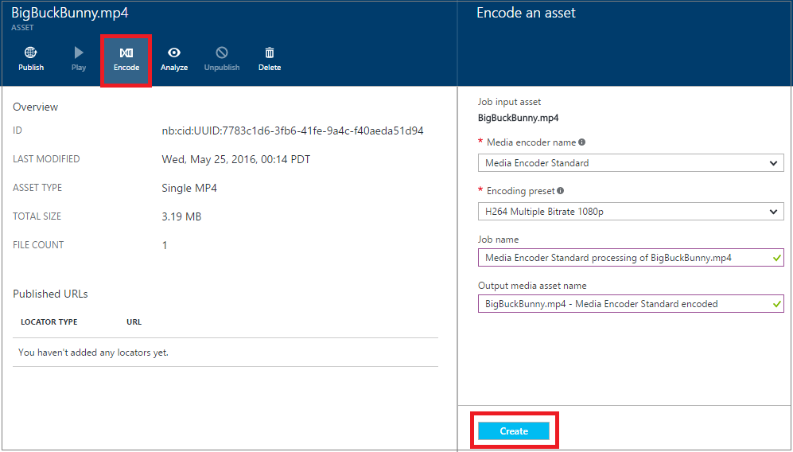

<properties
    pageTitle="Codieren eine Anlage mit Media Encoder Standard mit dem Portal Azure | Microsoft Azure"
    description="In diesem Lernprogramm führt Sie durch die Schritte zum Codieren einer Anlage mit Media Encoder Standard mit Azure-Portal an."
    services="media-services"
    documentationCenter=""
    authors="Juliako"
    manager="erikre"
    editor=""/>

<tags
    ms.service="media-services"
    ms.workload="media"
    ms.tgt_pltfrm="na"
    ms.devlang="na"
    ms.topic="article"
    ms.date="10/24/2016"
    ms.author="juliako"/>

# Codieren einer Anlage mit Media Encoder Standard mit Azure-portal

> [AZURE.NOTE] Damit dieses Lernprogramm abgeschlossen, benötigen Sie ein Azure-Konto an. Weitere Informationen finden Sie unter [Azure kostenlose Testversion](https://azure.microsoft.com/pricing/free-trial/). 

Wenn Sie mit Azure Media-Dienste zu arbeiten, die eine der häufigsten Szenarios adaptive streaming Bitrate zum Kunden übermittelt. Media-Dienste unterstützt die folgende adaptive Bitrate Technologien streaming: HTTP Live Streaming (HLS), interpolierten Streaming, MPEG Gedankenstrich und HDS (für nur Adobe vorzeigbare/Access Lizenznehmern). Um Ihre Videos adaptive Bitrate streaming vorzubereiten, müssen Sie Ihr Quellvideo in Multi-Bitrate Dateien codieren. Sie sollten den **Media Encoder Standard** Encoder Codieren von Videos verwenden.  

Media-Dienste auch bietet dynamische Verpacken, dem Sie Ihre Multi-Bitrate MP4s in den folgenden streaming Formaten vorführen kann: MPEG Gedankenstrich, HLS, interpolierten Streaming, oder Festplatten, ohne dass Sie in den folgenden Formaten streaming erneut verpacken. Mit dynamischen Verpackung müssen Sie nur zu speichern und die Dateien in den einzelnen Speicherformat bezahlen und Medien-Dienste erstellen und die entsprechende Antwort basierend auf einem Client-Anfragen dienen.

Um dynamische Verpackung nutzen zu können, müssen Sie die folgenden Aktionen ausführen:

- Codieren der Quelldatei in eine Reihe von Multi-Bitrate MP4-Dateien (die Codierung Schritte sind weiter unten in diesem Abschnitt gezeigt).
- Holen Sie mindestens eine streaming Einheit für den streaming Endpunkt, aus dem Sie bis zur Bereitstellung des Inhalts planen. Weitere Informationen finden Sie unter [Konfigurieren von Endpunkten streaming](media-services-portal-vod-get-started.md#configure-streaming-endpoints). 

Verarbeitung von Medien skaliert werden, finden Sie unter [in diesem](media-services-portal-scale-media-processing.md) Thema.

## Codieren Sie mit Azure-portal

In diesem Abschnitt werden die Schritte beschrieben, die Sie, zum Codieren von Inhalten mit Media Encoder Standard ergreifen können.

1.  Wählen Sie im [Portal Azure](https://portal.azure.com/)Ihrer Azure Media Services-Konto ein.
2.  Wählen Sie **Posten**im Fenster **Einstellungen** aus.  
2.  Wählen Sie die Anlage, die Sie codieren möchten, klicken Sie im Fenster **Posten** .
3.  Drücken Sie die **Codieren** .
4.  Wählen Sie im Fenster **Codieren eines Wirtschaftsguts** "Media Encoder Standard" Prozessor und eine Voreinstellung aus. Beispielsweise, wenn Sie wissen, von Videos weist eine Auflösung von 1920 x 1080 Pixel, dann können die "H264 mehrere Bitrate 1080p" voreingestellten. Weitere Informationen finden Sie unter [in](https://msdn.microsoft.com/library/azure/mt269960.aspx) diesem Artikel – Voreinstellungen ist es wichtig, wählen Sie die Vorgabe, die für Ihre Eingaben video am besten geeignet ist. Sie haben eine Videos mit niedriger Auflösung (640 x 360), und Sie nicht verwendet werden soll die Standardeinstellung "H264 mehrere Bitrate 1080p" voreingestellten.
    
    Zur einfacheren Verwaltung müssen Sie eine Möglichkeit, bearbeiten den Namen der Anlage Ausgabe und den Namen des Projekts.
        
    
5. Drücken Sie auf **Erstellen**.

##Als Nächstes

Sie können die Codierung des Projektstatus mit dem Azure-Portal überwachen, wie in [diesem](media-services-portal-check-job-progress.md) Artikel beschrieben.  

##Media-Dienste Learning Wege

[AZURE.INCLUDE [media-services-learning-paths-include](../../includes/media-services-learning-paths-include.md)]

##Angeben von feedback

[AZURE.INCLUDE [media-services-user-voice-include](../../includes/media-services-user-voice-include.md)]

