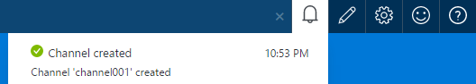
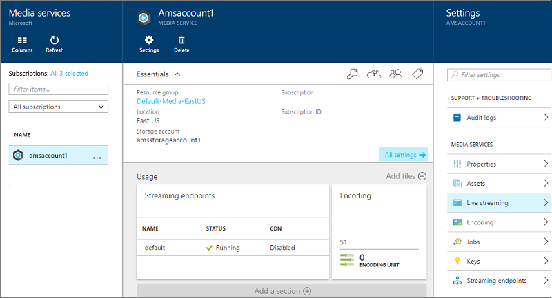
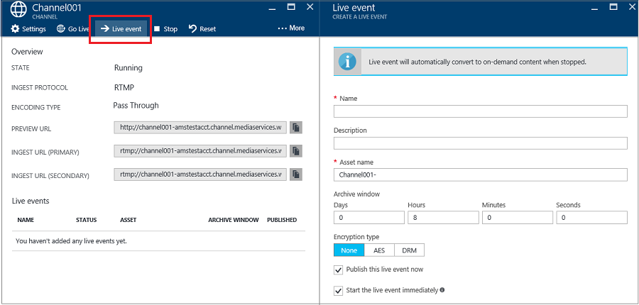
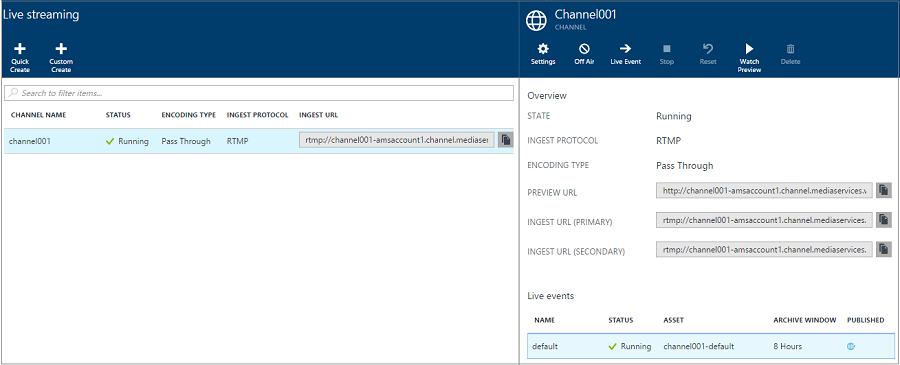
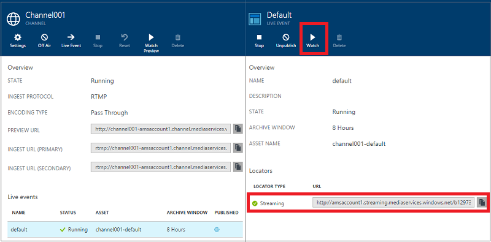
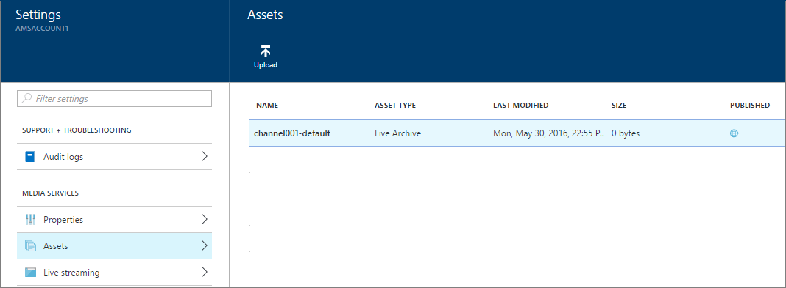

<properties 
    pageTitle="Wie Sie live streaming mit lokal Encoder über das Azure-Portal durchführen | Microsoft Azure" 
    description="Dieses Lernprogramm führt Sie durch die Schritte zum Erstellen eines Kanals, der für eine Pass-Through-Übermittlung konfiguriert ist." 
    services="media-services" 
    documentationCenter="" 
    authors="juliako" 
    manager="erikre" 
    editor=""/>

<tags 
    ms.service="media-services" 
    ms.workload="media" 
    ms.tgt_pltfrm="na" 
    ms.devlang="na" 
    ms.topic="get-started-article"
    ms.date="10/24/2016" 
    ms.author="juliako"/>

#So führen Sie live streaming mit lokal Encoder über das Azure-portal

> [AZURE.SELECTOR]
- [Portal]( media-services-portal-live-passthrough-get-started.md)
- [.NET]( media-services-dotnet-live-encode-with-onpremises-encoders.md)
- [REST]( https://msdn.microsoft.com/library/azure/dn783458.aspx)

In diesem Lernprogramm führt Sie durch die Schritte zum Verwenden des Azure-Portals einen **Channel** zu erstellen, die für eine Pass-Through-Übermittlung konfiguriert ist. 

##Erforderliche Komponenten

Die folgenden sind für dieses Lernprogramm erforderlich erforderlich:

- Ein Azure-Konto. Weitere Informationen finden Sie unter [Azure kostenlose Testversion](https://azure.microsoft.com/pricing/free-trial/). 
- Ein Konto Media-Dienste. Zum Erstellen eines Media Services-Kontos finden Sie unter [Erstellen eines Media Services-Kontos](media-services-portal-create-account.md).
- Eine Webcam. Beispielsweise [Telestream Wirecast Encoder](http://www.telestream.net/wirecast/overview.htm).

Es wird dringend empfohlen, um zu überprüfen, die folgenden Artikeln:

- [Azure Media Services RTMP unterstützen und Live Encoder](https://azure.microsoft.com/blog/2014/09/18/azure-media-services-rtmp-support-and-live-encoders/)
- [Übersicht über Live gekocht Azure Media Services verwenden](media-services-manage-channels-overview.md)
- [Live streaming mit lokal Encoder, die Multi-Bitrate Streams erstellen](media-services-live-streaming-with-onprem-encoders.md)

##Allgemeine live streaming Szenario

Die folgenden Schritte beschreiben die Aufgaben beim Erstellen von allgemeinen live streaming Applications, die Kanäle, die so konfiguriert sind für Pass-Through-Übermittlung verwenden. In diesem Lernprogramm erfahren, wie ein Pass-Through-Kanal und live Ereignisse erstellen und verwalten.

1. Herstellen einer Verbindung einem Computer mit einer Videokamera. Starten und Konfigurieren eines lokalen live Encoders, der einen Multi-Bitrate RTMP oder fragmentiert MP4-Stream ausgegeben. Weitere Informationen finden Sie unter [Azure Media Services RTMP Support und Live-Encoder](http://go.microsoft.com/fwlink/?LinkId=532824).
    
    Dieser Schritt konnte auch ausgeführt werden, nachdem Sie Ihre Kanal erstellt haben.

1. Erstellen Sie und starten Sie einen Pass-Through-Kanal.
1. Abrufen der Kanal Aufnahme URL. 

    Die URL für die Erfassung wird vom live Encoder zum Streams an den Kanal senden.
1. Abrufen der Channel Vorschau-URL an. 

    Verwenden Sie diese URL, um sicherzustellen, dass Ihre Channel ordnungsgemäß live-Streams empfängt.

3. Erstellen einer live Ereignis-Programm. 

    Bei Verwendung das Azure-Portal erstellt ein live-Ereignis erstellen auch eine Anlage. 
      
    >[AZURE.NOTE]Stellen Sie sicher, dass mindestens eine streaming reservierte Einheit für das streaming Endpunkt von der zum Streaming von Inhalten aus.
1. Wenn Sie zum Starten von streaming und Archivierung bereit sind, starten Sie das Ereignis-Programm.
2. Optional kann der live Encoder signalisiert werden, ist eine Werbeanzeige zu starten. Die Ankündigung wird in der Ausgabestream eingefügt.
1. Wenn Sie streaming und das Ereignis Archivierung beenden möchten, beenden Sie das Ereignis-Programm.
1. Löschen Sie das Ereignis-Programm (und optional löschen Sie die Anlage).     

>[AZURE.IMPORTANT] Aufforderung zur Überarbeitung Konzepte und Aspekte im Zusammenhang mit live streaming mit lokal Encoder und Pass-Through-Kanäle lernen [Live streaming mit lokal Encoder, die Multi-Bitrate Streams erstellen](media-services-live-streaming-with-onprem-encoders.md) .

##Anzeigen von Benachrichtigungen und Fehler

Wenn Sie Benachrichtigungen und Fehlern gefertigt vom Azure Portal anzeigen möchten, klicken Sie auf das Benachrichtigungssymbol.

##Konfigurieren Sie streaming Endpunkte 

Media Services bietet dynamische Verpacken, dem Sie Ihre Multi-Bitrate MP4s in den folgenden streaming Formaten vorführen kann: MPEG Gedankenstrich, HLS, interpolierten Streaming, oder Festplatten, ohne dass Sie in den folgenden Formaten streaming erneut packen. Mit dynamischen Verpackung müssen Sie nur zu speichern und die Dateien in den einzelnen Speicherformat bezahlen und Media-Dienste erstellt und die entsprechende Antwort basierend auf einem Client-Anfragen fungiert.

Um dynamische Verpackung nutzen zu können, müssen Sie mindestens eine streaming Einheit für das streaming Endpunkt abrufen aus dem Sie die Übermittlung von Inhalten erstellen möchten.  

Zum Erstellen und ändern die Anzahl der Einheiten reservierte streaming, führen Sie folgende Schritte aus:

1. Melden Sie sich bei der [Azure-Portal](https://portal.azure.com/)an.
1. Klicken Sie im Fenster **Einstellungen** auf **Streaming Endpunkte**. 

2. Klicken Sie auf die Standardeinstellungen für streaming-Endpunkt. 

    Das Fenster **STANDARDMÄßIG STREAMING ENDPUNKTDETAILS** wird angezeigt.

3. Um die Anzahl der Einheiten streaming anzugeben, schieben Sie den Schieberegler **Streaming Einheiten** .

    

4. Klicken Sie auf die Schaltfläche **Speichern** , um die Änderungen zu speichern.

    >[AZURE.NOTE]Die Zuordnung von allen neuen Einheiten kann bis zu 20 Minuten dauern.
    
##Erstellen Sie und starten Sie Pass-Through-Kanäle und Ereignisse

Ein Kanal ist zugeordnet Ereignisse/Programme, mit die Sie die Veröffentlichung und die Speicherung von Segmente in einem live Stream steuern können. Kanäle verwalten Ereignisse an. 
    
Sie können angeben, die Anzahl der Stunden, die den aufgezeichneten Inhalt für das Programm durch Festlegen der Länge **Archiv Fenster** beibehalten werden sollen. Dieser Wert kann maximal 25 Stunden aus mindestens 5 Minuten festgelegt werden. Archivieren Fensterlänge bestimmt auch, dass die maximale Größe des Zeit-Clients aus der die aktuelle Position live zeitlich rückwärts anfordern kann. Ereignisse über die angegebene Zeitspanne ausgeführt werden können, aber Inhalt, der hinter dem Fensterlänge fällt wird kontinuierlich verworfen. Dieser Wert dieser Eigenschaft bestimmt auch an, wie lange die Client-Manifeste wachsen können.

Jedes Ereignis ist eine Anlage zugeordnet. Wenn Sie das Ereignis veröffentlichen möchten, müssen Sie einen auf-Anforderung Locator für die zugeordnete Anlage erstellen. Diese Locator Probleme haben, können Sie eine streaming-URL zu erstellen, die für Kunden bereitgestellt werden können.

Ein Kanal unterstützt bis zu drei gleichzeitig ausgeführte Ereignisse, damit Sie mehrere Archiven des gleichen eingehende Streams erstellen können. So können Sie veröffentlichen und anderen Teile eines Ereignisses archivieren, je nach Bedarf. Beispielsweise ist Ihre geschäftliche Anforderung 6 Stunden eines Programms archivieren, sondern nur in den letzten 10 Minuten übertragen. Um dies zu erreichen, müssen Sie zwei gleichzeitig ausgeführte Programme erstellen. Archivieren von 6 Stunden des Ereignisses ein Programm festgelegt ist, aber das Programm wird nicht veröffentlicht. Das andere Programm für 10 Minuten archivieren festgelegt ist, und dieses Programm veröffentlicht wird.

Vorhandene live Ereignisse sollten Sie nicht wieder verwenden. In diesem Fall erstellen Sie, und starten Sie ein neues Ereignis für jedes Ereignis.

Starten Sie das Ereignis, wenn Sie streaming und Archivierung starten möchten. Beenden Sie das Programm immer, wenn Sie streaming und das Ereignis Archivierung beenden möchten. 

Zum Löschen der archivierten Inhalte beenden Sie und löschen Sie das Ereignis, und löschen Sie die zugeordnete Anlage. Eine Anlage kann nicht gelöscht werden, wenn es durch ein Ereignis verwendet wird; das Ereignis muss zuerst gelöscht werden. 

Auch nach dem Beenden und löschen das Ereignis, würde der Benutzer können Ihre archivierten Inhalte als Video on Demand für übertragen, solange Sie nicht die Anlage löschen.

Wenn Sie möchten archivierte Inhalte beibehalten, aber nicht verfügbar für das streaming, löschen Sie den streaming Locator.

###Auf das Portal verwenden, um einen Kanal zu erstellen 

In diesem Abschnitt wird gezeigt, wie mit die Option zum **Schnellen Erstellen** einen Pass-Through-Kanal erstellt werden.

Weitere Informationen zu Pass-Through-Kanäle finden Sie unter [Live streaming mit lokal Encoder, die Multi-Bitrate Streams erstellen](media-services-live-streaming-with-onprem-encoders.md).

1. Wählen Sie im [Portal Azure](https://portal.azure.com/)Ihrer Azure Media Services-Konto ein.
2. Klicken Sie im Fenster **Einstellungen** auf **Live streaming**. 

    
    
    Das Fenster **Live streaming** wird angezeigt.

3. Klicken Sie auf der **Symbolleiste erstellen** zum Erstellen eines Pass-Through-Kanals mit den RTMP Aufnahme Protokoll.

    Klicken Sie im **Neuen Kanal erstellen** wird angezeigt.
4. Geben Sie dem neuen Kanal einen Namen ein, und klicken Sie auf **Erstellen**. 

    Dies erstellt einen Pass-Through-Kanal mit den RTMP Aufnahme Protokoll.

##Erstellen von Ereignissen

1. Wählen Sie einen Kanal, den Sie ein Ereignis hinzufügen möchten.
2. Klicken Sie auf **Ereignis Live** -Schaltfläche.

##Get-Aufnahme URLs

Nachdem der Kanal erstellt wurde, können Sie erste Aufnahme URLs, die für dem live Encoder bereitgestellt werden. Der Encoder verwendet diese URLs, um eine live Stream Eingabe.

##Schauen Sie sich das Ereignis

Um das Ereignis ansehen möchten, klicken Sie auf **Überwachung** Azure-Portal oder kopieren Sie die URL des streaming, und verwenden Sie einen Player Ihrer Wahl. 
 

Live Ereignis automatisch abrufen Konvertierung in bei Bedarf Inhalt beim beendet.

##Aufräumen

Weitere Informationen zu Pass-Through-Kanäle finden Sie unter [Live streaming mit lokal Encoder, die Multi-Bitrate Streams erstellen](media-services-live-streaming-with-onprem-encoders.md).

- Nur, wenn alle Ereignisse/Programme auf dem Kanal beendet wurden, kann ein Kanal abgebrochen werden.  Nachdem der Kanal beendet wird, wird es alle anfallen nicht. Wenn Sie neu zu starten müssen, haben sie dieselbe URL Aufnahme, sodass Sie nicht benötigen, Ihre Encoder neu zu konfigurieren.
- Nur, wenn alle live Ereignisse im Kanal gelöscht wurden, kann ein Kanal gelöscht werden.

##Archivierten Inhalte anzeigen

Auch nach dem Beenden und löschen das Ereignis, würde der Benutzer können Ihre archivierten Inhalte als Video on Demand für übertragen, solange Sie nicht die Anlage löschen. Eine Anlage kann nicht gelöscht werden, wenn es durch ein Ereignis verwendet wird; das Ereignis muss zuerst gelöscht werden. 

Verwalten Ihre Bestände jederzeit, wählen Sie die **Einstellung** , und klicken Sie auf **Posten**.

##Als Nächstes

Überprüfen Sie die Pfade learning Media-Dienste.

[AZURE.INCLUDE [media-services-learning-paths-include](../../includes/media-services-learning-paths-include.md)]

##Angeben von feedback

[AZURE.INCLUDE [media-services-user-voice-include](../../includes/media-services-user-voice-include.md)]
