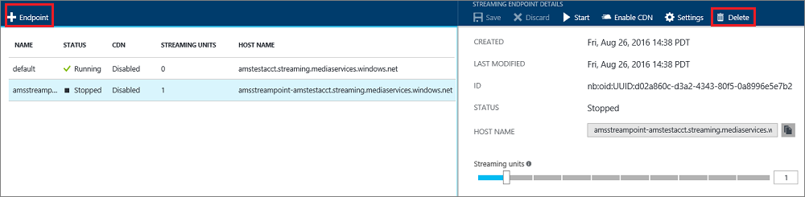
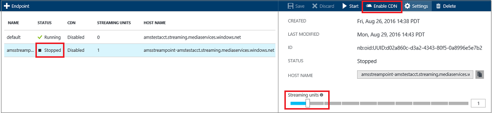

<properties 
    pageTitle="Verwalten von streaming Endpunkte mit dem Portal Azure | Microsoft Azure" 
    description="In diesem Thema wird gezeigt, wie streaming Endpunkte mit Azure-Portal zu verwalten." 
    services="media-services" 
    documentationCenter="" 
    authors="Juliako" 
    writer="juliako" 
    manager="erikre" 
    editor=""/>

<tags 
    ms.service="media-services" 
    ms.workload="media" 
    ms.tgt_pltfrm="na" 
    ms.devlang="na" 
    ms.topic="article" 
    ms.date="10/24/2016"
    ms.author="juliako"/>

#Verwalten von streaming Endpunkte mit Azure-portal

## (Übersicht)

> [AZURE.NOTE] Damit dieses Lernprogramm abgeschlossen, benötigen Sie ein Azure-Konto an. Weitere Informationen finden Sie unter [Azure kostenlose Testversion](https://azure.microsoft.com/pricing/free-trial/). 

Im Microsoft Azure Media-Dienste stellt einen **Endpunkt Streaming** einen streaming-Dienst, mit der Inhalt direkt auf eine Player-Clientanwendung oder zu einem Inhalt Delivery Network (CDN) für die weitere Verteilung vorführen kann. Media Services bietet auch nahtlose Integration von Azure CDN. Ausgehende Streams aus einem Dienst StreamingEndpoint kann live-Streams, oder ein Video bei Bedarf Anlage in Ihrem Konto Media-Dienste.

Darüber hinaus können Sie die Kapazität des Diensts Streaming Endpunkt wachsende Bandbreite Anforderungen Anpassen von streaming Einheiten zu behandeln steuern. Es wird empfohlen, eine oder mehrere Maßeinheiten für Applikationen in Herstellung-Umgebung zugewiesen werden. Streaming Einheiten bieten Ihnen dedizierten Ausgang Kapazität, die in Schritten 200 MB / erworben werden kann und zusätzliche Funktionen, wozu auch: [dynamische Verpacken](media-services-dynamic-packaging-overview.md), CDN Integration und erweiterte Konfiguration.

>[AZURE.NOTE]Sie werden nur berechnet, wenn Ihre Streaming Endpunkt ist in den Zustand "aktiv".

Dieses Thema bietet einen Überblick über die wichtigsten Funktionen, die durch die Endpunkte Streaming bereitgestellt werden. Das Thema wird gezeigt, wie das Azure Portal verwenden, um das streaming Endpunkte verwalten. Informationen dazu, wie Sie den Endpunkt streaming Skalieren finden Sie unter [in diesem](media-services-portal-scale-streaming-endpoints.md) Thema.

## Starten Sie Verwalten von streaming Endpunkte

Führen Sie die folgenden Schritte aus, um zu streaming Endpunkte für Ihr Konto verwalten.

1. Wählen Sie im [Portal Azure](https://portal.azure.com/)Ihrer Azure Media Services-Konto ein.
2. Wählen Sie im Fenster **Einstellungen** **Streaming-Endpunkte**aus.

    

##Hinzufügen oder Entfernen eines streaming Endpunkts

Zum Hinzufügen, und streaming über das Azure-Portal Endpunkt löschen, führen Sie folgende Schritte aus:

1. Um einen Endpunkt streaming hinzuzufügen, klicken Sie auf das **+ -Endpunkt** am oberen Rand der Seite. 
2. Drücken Sie zum Löschen eines streaming Endpunkts Schaltfläche **Löschen** aus. 

    Der Endpunkt streaming standardmäßigen kann nicht gelöscht werden.
2. Klicken Sie auf die Schaltfläche **Start** , um den Endpunkt streaming zu starten.

    

Standardmäßig können Sie bis zu zwei streaming Endpunkte aufweisen. Wenn Sie weitere anfordern müssen, finden Sie unter [Kontingente und Einschränkungen](media-services-quotas-and-limitations.md).
    
##Konfigurieren des Streaming Endpunkts

Streaming Endpunkt, können Sie die folgenden Eigenschaften konfigurieren, wenn Sie mindestens 1 Mengen Einheit haben: 

- Steuerung des Benutzerzugriffs
- Cache-Steuerelement
- Access-Richtlinien Cross

Ausführliche Informationen zu diesen Eigenschaften finden Sie unter [StreamingEndpoint](https://msdn.microsoft.com/library/azure/dn783468.aspx).

Sie können streaming Endpunkt mit den folgenden Schritten konfigurieren:

1. Wählen Sie den streaming Endpunkt, den Sie konfigurieren möchten.
1. Klicken Sie auf **Einstellungen**.
  
Folgt eine kurze Beschreibung der Felder.

  
1. Maximale Cacherichtlinie: verwendet, um den Cache für Anlagen served durch diesen streaming Endpunkt zu konfigurieren. Wenn kein Wert festgelegt ist, ist der Standardwert verwendet. Die angezeigten Werte können auch direkt in Azure-Speicher definiert werden. Wenn für den Endpunkt streaming Azure CDN aktiviert ist, sollten Sie den Cache Richtlinienwert nicht auf weniger als 600 Sekunden festgelegt.  

2. Zugelassene IP-Adressen: verwendet, um die IP-Adressen angeben, die Verbindung zu den veröffentlichten streaming Endpunkt zulässig sind. Wenn keine IP-Adressen angegebenen wäre eine beliebige IP-Adresse eine Verbindung herstellen. IP-Adressen können als eine einzelne IP-Adresse (beispielsweise "10.0.0.1"), einen IP-Adressenbereich verwenden eine IP-Adresse und eine CIDR Subnetzmaske (z. B. ' 10.0.0.1/22') oder einen IP-Adressenbereich IP-Adresse und eine gepunktete decimal Subnetzmaske angegeben werden (z. B. ' 10.0.0.1(255.255.255.0)').

3. Konfiguration für Akamai Signatur Kopfzeile Authentifizierung: verwendet, um anzugeben, wie die Signatur Kopfzeile Authentifizierung anfordern von Akamai-Servern konfiguriert ist. Ablauf wird in UTC angezeigt.

##Aktivieren Sie die Integration von Azure CDN

Sie können angeben, dass die Integration Azure CDN für einen Endpunkt Streaming aktivieren (es ist standardmäßig deaktiviert.)

Integration von Azure CDN true festlegen:

- Der streaming Endpunkt müssen Sie mindestens eine streaming Einheit. Wenn Sie später Maßeinheiten auf 0 festgelegt werden soll, müssen Sie zuerst die CDN Integration deaktivieren. Beim Erstellen einer neuen streaming, wird eine streaming Einheit Endpunkt standardmäßig automatisch festgelegt.

- Der streaming Endpunkt muss beendet werden. Nachdem das CDN aktiviert wird, können Sie den Endpunkt streaming starten. 

Es kann bis zu 90 min für die Integration Azure CDN aktiviert erhalten dauern.  Es dauert bis zu zwei Stunden, damit die Änderungen über alle der CDN anzeigen, die Sie aktiv sein.

CDN-Integration in alle die Azure Data Centers aktiviert ist: uns "Westen", uns Osten, North Europe, Westen Europa, Japan "Westen", Japan OST, Süd Ostasien und Ostasien.

Nachdem es aktiviert ist, wird die **Steuerung des Benutzerzugriffs** Konfiguration deaktiviert.

>[AZURE.IMPORTANT] Azure Media Services-Integration in Azure CDN wird auf **Azure CDN von Verizon**implementiert.  Wenn Sie **Azure CDN von Akamai** für Azure Media-Dienste verwenden möchten, müssen Sie [den Endpunkt manuell konfigurieren](../cdn/cdn-create-new-endpoint.md).  Weitere Informationen zu den Features von Azure CDN finden Sie unter der [CDN Übersicht](../cdn/cdn-overview.md).

###Weitere Aspekte

- Wenn für einen Endpunkt streaming CDN aktiviert ist, können keine Clients Inhalte direkt vom Ursprung anfordern. Wenn Sie die Möglichkeit zum Testen von Inhalten mit oder ohne CDN benötigen, können Sie einen anderen streaming Endpunkt erstellen, die nicht CDN aktiviert ist.
- Ihre streaming Endpunkt Hostname bleibt unverändert nach dem CDN aktivieren. Sie benötigen keine nehmen Sie Änderungen an den Media Services Workflow, nachdem CDN aktiviert ist. Beispielsweise ist Ihre streaming Endpunkt Hostname strasbourg.streaming.mediaservices.windows.net, nach dem CDN aktivieren, wird die genaue derselben Hostname verwendet.
- Für neue streaming Endpunkte können Sie die CDN einfach durch Erstellen eines neuen Endpunkts aktivieren. für vorhandene streaming Endpunkte müssen Sie zuerst den Endpunkt zu beenden, und aktivieren Sie dann das CDN.
 

Weitere Informationen finden Sie unter [Ankündigung Azure Media Services-Integration in Azure CDN (Content Delivery Network)](http://azure.microsoft.com/blog/2015/03/17/announcing-azure-media-services-integration-with-azure-cdn-content-delivery-network/).

##Nächste Schritte

Überprüfen Sie die Pfade learning Media-Dienste.

[AZURE.INCLUDE [media-services-learning-paths-include](../../includes/media-services-learning-paths-include.md)]

##Angeben von feedback

[AZURE.INCLUDE [media-services-user-voice-include](../../includes/media-services-user-voice-include.md)]
 
