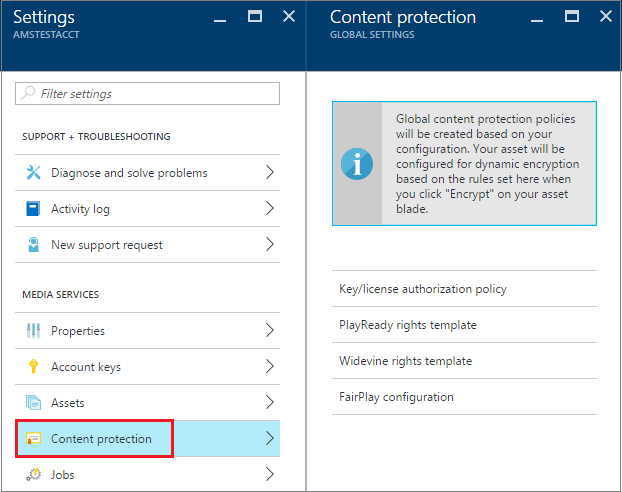
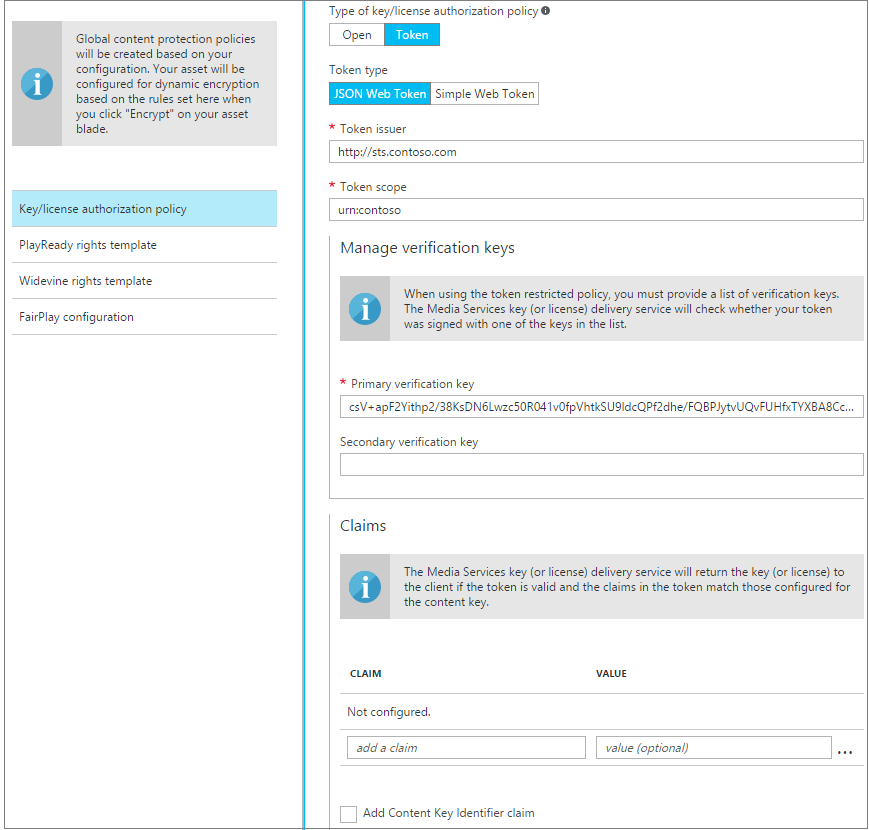
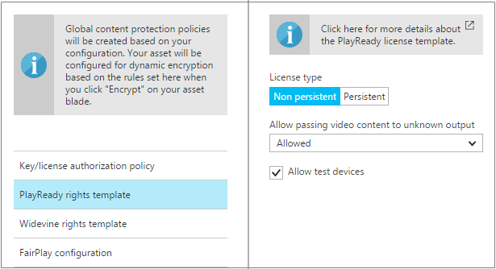
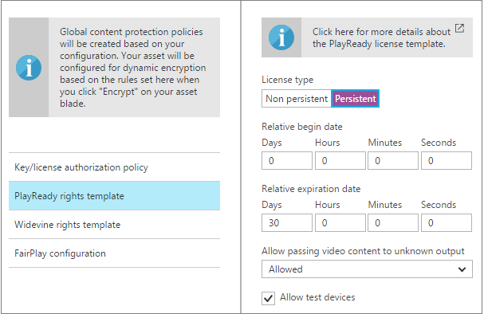
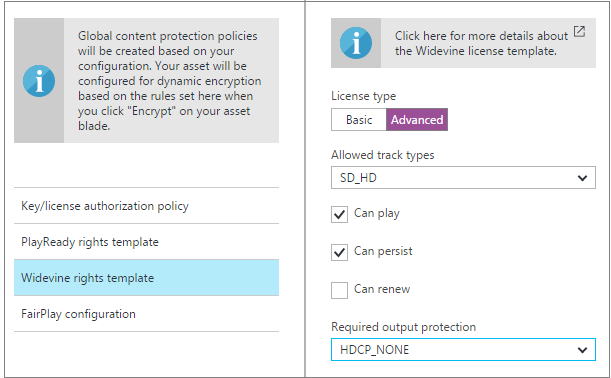
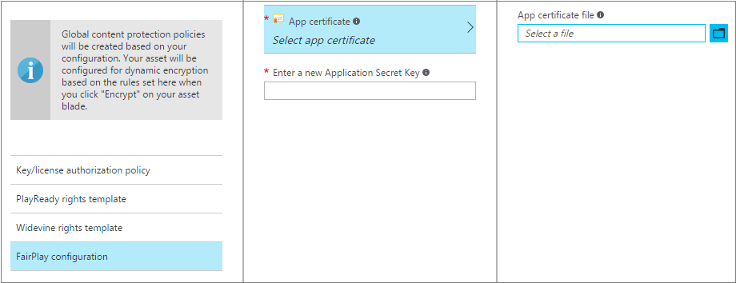
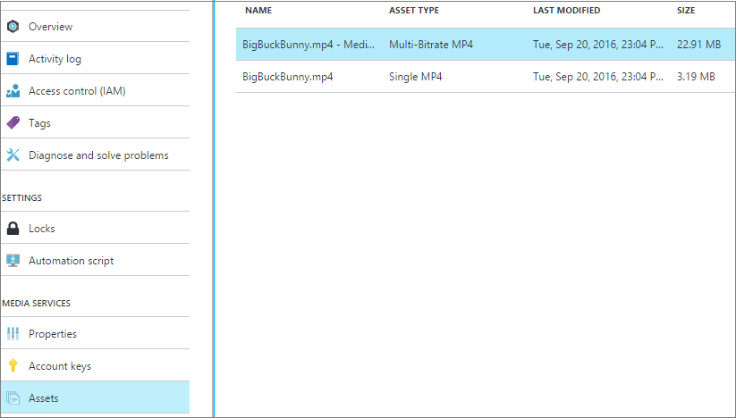
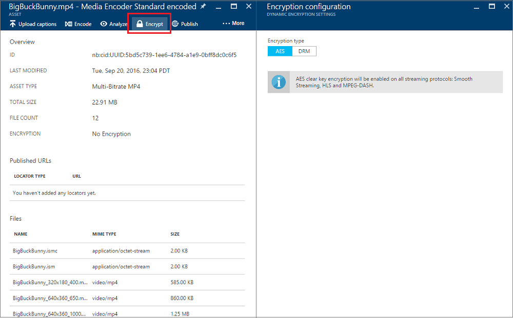
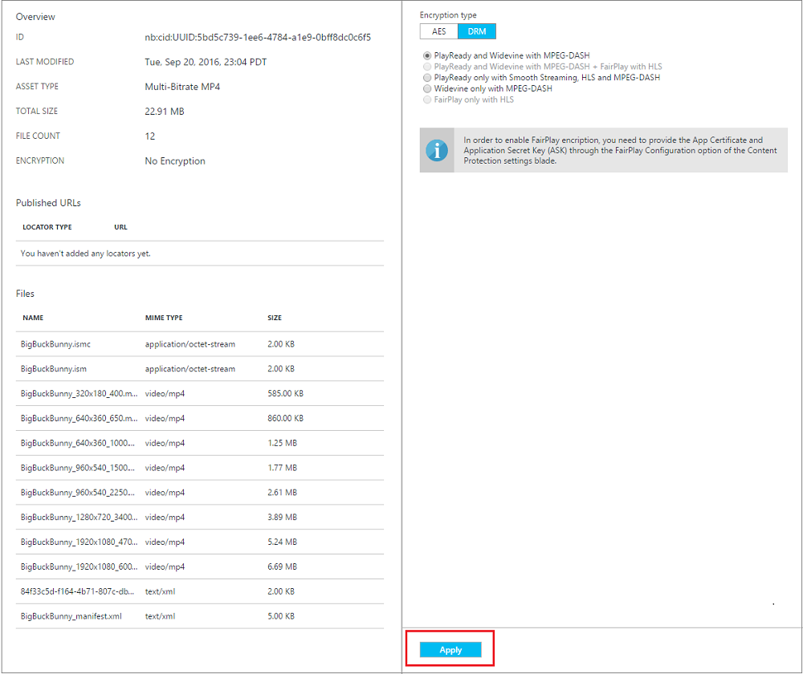

<properties 
    pageTitle="Konfigurieren von Inhalten Schutzrichtlinien über das Azure-Portal | Microsoft Azure" 
    description="In diesem Artikel veranschaulicht, wie das Azure-Portal Content Schutzrichtlinien konfigurieren. Im Artikel wird gezeigt, wie dynamische Verschlüsselung für Ihre Anlagen zu aktivieren." 
    services="media-services" 
    documentationCenter="" 
    authors="Juliako" 
    manager="erikre" 
    editor=""/>

<tags 
    ms.service="media-services" 
    ms.workload="media" 
    ms.tgt_pltfrm="na" 
    ms.devlang="na" 
    ms.topic="article" 
    ms.date="10/24/2016"    
    ms.author="juliako"/>

# Konfigurieren von Inhalten Schutzrichtlinien über das Azure-portal

> [AZURE.NOTE] Damit dieses Lernprogramm abgeschlossen, benötigen Sie ein Azure-Konto an. Weitere Informationen finden Sie unter [Azure kostenlose Testversion](https://azure.microsoft.com/pricing/free-trial/).

## (Übersicht)

Microsoft Azure Media Services (AMS) ermöglicht Ihnen, Ihre Medien ab dem Zeitpunkt zu schützen, wenn sie Ihren Computer über Speicher, Verarbeitung und Übermittlung verlässt. Media Services ermöglicht es Ihnen Vorführen von Inhalten verschlüsselt dynamisch mit erweiterte Verschlüsselung AES (Standard) (mit 128-Bit-Verschlüsselung Tasten), allgemeine Verschlüsselung (CENC) mit PlayReady und/oder Widevine DRM und Apple FairPlay. 

AMS bietet einen Dienst Zielcomputern DRM-Lizenzen und AES Tasten auf autorisierte Clients löschen. Azure-Portal können Sie eine **Autorisierungsrichtlinie Schlüssel/Lizenz** für alle Arten von Verschlüsselung zu erstellen.

In diesem Artikel veranschaulicht, wie Inhalt Schutzrichtlinien mit Azure-Portal zu konfigurieren. Im Artikel wird gezeigt, wie Ihre Bestände jederzeit dynamic-Verschlüsselung zuweisen.

> [AZURE.NOTE]  Wenn Sie das klassische Azure-Portal Schutzrichtlinien erstellen verwendet haben, können die Richtlinien im [Azure-Portal](https://portal.azure.com/)nicht angezeigt. Es gibt jedoch alle alten Richtlinien weiterhin. Sie können sie mithilfe der Azure Media Services .NET SDK oder auf das Tool [Azure-Media-Services-Explorer](https://github.com/Azure/Azure-Media-Services-Explorer/releases) untersuchen (um die Richtlinien anzuzeigen, mit der rechten Maustaste auf die Anlage-Informationen (F4) -> Anzeigen > Klicken Sie auf der Registerkarte Inhalt Schlüssel -> Klicken Sie auf die Taste). 
> 
> Wenn Sie Ihre neue Richtlinien mit Anlage verschlüsseln möchten, mit dem Azure-Portal zu konfigurieren Sie, klicken Sie auf Speichern und erneutes Anwenden Sie dynamic-Verschlüsselung. 

## Starten Sie das Content-Schutz konfigurieren

Führen Sie folgende Schritte aus, um das Portal verwenden, um Inhalte für Ihr Konto AMS global Schutz konfigurieren zu beginnen:

1. Wählen Sie im [Portal Azure](https://portal.azure.com/)Ihrer Azure Media Services-Konto ein.
2. Wählen Sie **Einstellungen**aus > **Schutz von Inhalten**.

 

## Taste/Lizenz Autorisierungsrichtlinie

AMS unterstützt mehrere Methoden für die Authentifizierung von Benutzern, die Taste oder Lizenz anzufordern. Die Autorisierungsrichtlinie Inhalt Key muss so konfiguriert, dass von Ihnen und erfüllt, indem Sie Ihren Kunden in der Reihenfolge der Schlüssel-Lizenz zu Desktopclient delived werden werden. Die Autorisierungsrichtlinie Inhalt Key konnte eine oder mehrere Autorisierung Einschränkungen haben: **Öffnen** oder **token** Einschränkung.

Azure-Portal können Sie eine **Autorisierungsrichtlinie Schlüssel/Lizenz** für alle Arten von Verschlüsselung zu erstellen.

###Öffnen 

Öffnen der Einschränkung also Vorführen des Systems die Taste an eine Person, die wichtigsten anfordert. Diese Einschränkung kann Testzwecken nützlich sein. 

### Token

Die token eingeschränkte Richtlinie ein Token ausgestellt von einem Secure Token Service (STS) beizufügen. Media Services unterstützt Token in den einfachen Web Token (SWT) und JSON Web Token (JWT) Format an. Media Services bietet keine Secure Token Services. Erstellen eines benutzerdefinierten STS oder Microsoft Azure ACS zu Problem Token nutzen können. Der STS müssen konfiguriert sein, um ein Token mit der angegebenen Schlüssel und Problem Ansprüchen aus, die Sie in der Konfiguration token Einschränkung angegeben angemeldet zu erstellen. Die wichtigsten Übermittlung Medien Dienste gibt die angeforderten Schlüssel (oder Lizenz) den Client, wenn das Token gültig ist und die Ansprüche im token Übereinstimmung so konfiguriert, die dass für die Taste (oder Lizenz) zurück.

Wenn die Richtlinie konfigurieren das Token beschränkt werden, müssen Sie die primäre Überprüfung Schlüssel, Herausgeber und Zielgruppe Parameter angeben. Die primäre Überprüfung Taste enthält den Schlüssel, dem mit das Token signiert wurde, Herausgeber ist der secure token Dienst, der das Token ausgestellt. Die Zielgruppe (auch als Bereich bezeichnet) beschreibt die Absicht des Token oder die Ressource das Token autorisiert Zugriff auf. Die wichtigsten Übermittlung Medien Dienste überprüft, dass diese Werte im Token die Werte in der Vorlage übereinstimmen.

## PlayReady Rights-Vorlage

Ausführliche Informationen zur Verwaltung von Informationsrechten PlayReady Vorlage finden Sie unter [Übersicht über Media Services PlayReady Lizenz Vorlage](media-services-playready-license-template-overview.md).

### Beständiger nicht

Wenn Sie als nicht beständige Lizenz konfiguriert haben, ist es nur im Speicher frei, während der Player die Lizenz verwendet wird.  

### Beständiger

Wenn Sie die Lizenz als beständigen konfiguriert haben, wird es im permanenten Speicher auf dem Client gespeichert.

## Widevine Rechtevorlage

Ausführliche Informationen zur Verwaltung von Informationsrechten Vorlage Widevine finden Sie unter [Widevine Lizenz Vorlage (Übersicht)](media-services-widevine-license-template-overview.md).

### Grundlegende

Wenn Sie **grundlegende**auswählen, wird die Vorlage mit allen Standardeinstellungen Werten erstellt.

### Erweiterte

Ausführliche Erläuterung Advance-Option Widevine Konfigurationen finden Sie unter [in diesem](media-services-widevine-license-template-overview.md) Thema.

## FairPlay Konfiguration

Zum Aktivieren der FairPlay Verschlüsselung müssen Sie über die Option FairPlay Konfiguration der App Zertifikats- und die Anwendung geheim Schlüssel (Fragen) eingeben. Ausführliche Informationen zu FairPlay Konfiguration und Anforderungen finden Sie unter [in](media-services-protect-hls-with-fairplay.md) diesem Artikel.

## Gelten Sie dynamic-Verschlüsselung für Ihre Anlage.

Um dynamische Verschlüsselung nutzen zu können, müssen Sie die folgenden Aktionen ausführen:

- Codieren Sie die Quelldatei in eine Reihe von adaptive Bitrate MP4-Dateien ein.
- Holen Sie mindestens eine bei Bedarf streaming Einheit für den streaming Endpunkt von Inhalten vorführen möchten. Weitere Informationen finden Sie unter [So bei Bedarf streaming reservierte Einheiten skalieren](media-services-portal-manage-streaming-endpoints.md).

### Wählen Sie eine Anlage, die Sie verschlüsseln möchten.

Wenn Sie Ihre Bestände jederzeit anzeigen möchten, wählen Sie **Einstellungen** > **Posten**.

### Mit AES oder DRM verschlüsseln

Nachdem Sie auf eine Anlage **Verschlüsseln** drücken, werden Sie mit zwei Optionen angezeigt: **AES** oder **DRM**. 

#### AES

AES löschen Verschlüsselung wird auf alle streaming Protokolle aktiviert werden: interpolierten Streaming, HLS und MPEG-Strich.

#### DRM

Wenn Sie auf die Registerkarte DRM auswählen, werden Sie unterschiedliche Auswahl von Inhalten Schutzrichtlinien überschauen (das Sie jetzt konfiguriert haben müssen) + eine Reihe von streaming Protokolle.

- **PlayReady und Widevine mit MPEG-Strich** - wird der MPEG-Strich Stream mit PlayReady und Widevine DRMs dynamisch verschlüsselt werden.
- **PlayReady und Widevine mit MPEG-Strich + FairPlay mit HLS** - wird dynamisch verschlüsseln Sie MPEG-Strich Stream mit PlayReady und Widevine DRMs. Wird auch der HLS Streams mit FairPlay verschlüsselt werden.
- **Nur mit interpolierten Streaming, HLS und MPEG-Strich PlayReady** - verschlüsselt dynamisch interpolierten Streaming auf HLS, MPEG-Strich Streams mit PlayReady DRM.
- Dynamisch wird **nur für MPEG-Strich Widevine** - verschlüsseln Sie MPEG-Strich mit Widevine DRM.
- **FairPlay nur mit HLS** - wird dynamisch Ihre HLS Stream mit FairPlay verschlüsseln.

Um FairPlay Verschlüsselung zu aktivieren, müssen Sie die App Zertifikats- und die Anwendung geheim Schlüssel (Fragen) über die Option FairPlay Konfiguration des Content Protection Einstellungen Blades bereitstellen.

Nachdem Sie die Verschlüsselungsauswahl zu erstellen, drücken Sie **anwenden**.

##Nächste Schritte

Überprüfen Sie die Pfade learning Media-Dienste.

[AZURE.INCLUDE [media-services-learning-paths-include](../../includes/media-services-learning-paths-include.md)]

##Angeben von feedback

[AZURE.INCLUDE [media-services-user-voice-include](../../includes/media-services-user-voice-include.md)]

