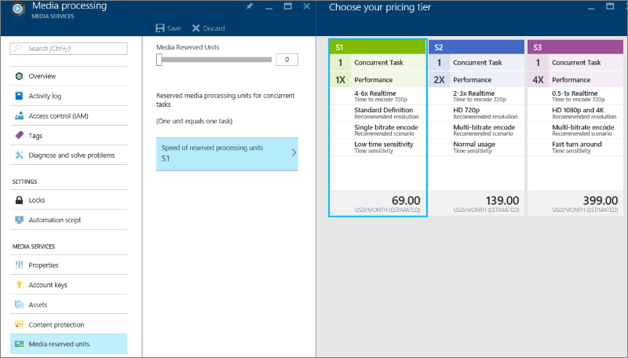

<properties
    pageTitle=" Medien Verarbeitung über das Azure-Portal skalieren | Microsoft Azure"
    description="In diesem Lernprogramm führt Sie durch die Schritte zum Anpassungsbereich für Medien Verarbeitung über das Azure-Portal an."
    services="media-services"
    documentationCenter=""
    authors="Juliako"
    manager="erikre"
    editor=""/>

<tags
    ms.service="media-services"
    ms.workload="media"
    ms.tgt_pltfrm="na"
    ms.devlang="na"
    ms.topic="article"
    ms.date="10/24/2016"
    ms.author="juliako"/>

# Ändern Sie den Einheitentyp reservierte

> [AZURE.SELECTOR]
- [.NET](media-services-dotnet-encoding-units.md)
- [Portal](media-services-portal-scale-media-processing.md)
- [REST](https://msdn.microsoft.com/library/azure/dn859236.aspx)
- [Java](https://github.com/southworkscom/azure-sdk-for-media-services-java-samples)
- [PHP](https://github.com/Azure/azure-sdk-for-php/tree/master/examples/MediaServices)

## (Übersicht)

>[AZURE.IMPORTANT] Vergewissern Sie sich, um zu überprüfen, im Thema [Übersicht](media-services-scale-media-processing-overview.md) , um weitere Informationen zum Thema Verarbeitung Medien skalieren zu erhalten.

## Maßstab Medien Verarbeitung

Um den Typ der reservierte Einheit und die Anzahl der Einheiten reservierte ändern möchten, führen Sie folgende Schritte aus:

1. Wählen Sie im [Portal Azure](https://portal.azure.com/)Ihrer Azure Media Services-Konto ein.

2. Wählen Sie im Fenster **Einstellungen** **Medien reserviert Einheiten**ein.

    Wenn die Anzahl der reservierte Einheiten für den ausgewählten reservierte Einheitentyp ändern möchten, verwenden Sie den Schieberegler **Medien Served Einheiten** .

    Drücken Sie zum Ändern der **RESERVIERTE EINHEITENTYP**S1, S2 oder S3 aus.

    

3. Drücken Sie die Schaltfläche speichern, um Ihre Änderungen zu speichern.

    Die neue reservierten Einheiten werden zugeordnet wird, wenn Sie speichern drücken.

##Nächste Schritte

Überprüfen Sie die Pfade learning Media-Dienste.

[AZURE.INCLUDE [media-services-learning-paths-include](../../includes/media-services-learning-paths-include.md)]

##Angeben von feedback

[AZURE.INCLUDE [media-services-user-voice-include](../../includes/media-services-user-voice-include.md)]

