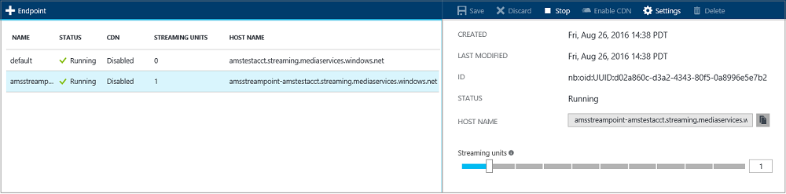

<properties
    pageTitle=" Maßstab streaming Endpunkte mit dem Portal Azure | Microsoft Azure"
    description="In diesem Lernprogramm führt Sie durch die Schritte der Skalierung streaming Endpunkte mit Azure-Portal an."
    services="media-services"
    documentationCenter=""
    authors="Juliako"
    manager="erikre"
    editor=""/>

<tags
    ms.service="media-services"
    ms.workload="media"
    ms.tgt_pltfrm="na"
    ms.devlang="na"
    ms.topic="article"
    ms.date="10/24/2016"
    ms.author="juliako"/>

# Skalieren Sie streaming Endpunkte mit Azure-portal

##(Übersicht)

> [AZURE.NOTE] Damit dieses Lernprogramm abgeschlossen, benötigen Sie ein Azure-Konto an. Weitere Informationen finden Sie unter [Azure kostenlose Testversion](https://azure.microsoft.com/pricing/free-trial/). 

Wenn Sie mit Azure Media-Dienste zu arbeiten, die eine der häufigsten Szenarios über adaptive Bitrate streaming Video zum Kunden übermittelt. Media-Dienste unterstützt die folgende adaptive Bitrate Technologien streaming: HTTP Live Streaming (HLS), interpolierten Streaming, MPEG Gedankenstrich und HDS (für nur Adobe vorzeigbare/Access Lizenznehmern).

Media Services bietet dynamische Verpacken, dem Sie Ihre adaptive Bitrate MP4-codierte Inhalte von Media-Dienste (MPEG Gedankenstrich HLS, interpolierten Streaming, HDS) nur-Time, ohne dass Sie vorkonfigurierte Versionen von jedem der folgenden streaming-Formaten speichern unterstützten Formate streaming vorführen kann.

Um dynamische Verpackung nutzen zu können, müssen Sie die folgenden Aktionen ausführen:

- Codieren der Datei Mezzanine (Quelle) in eine Reihe von adaptive Bitrate MP4-Dateien (die Codierung Schritte sind weiter unten in diesem Lernprogramm gezeigt).  
- Erstellen Sie mindestens eine streaming Einheit für das *streaming Endpunkt* aus der Sie die Übermittlung von Inhalten erstellen möchten. Schritte anzeigen zum Ändern der Anzahl der streaming Einheiten

Mit dynamischen Verpackung müssen Sie nur zu speichern und die Dateien in den einzelnen Speicherformat bezahlen und Medien-Dienste erstellen und die entsprechende Antwort basierend auf einem Client-Anfragen dienen.

Darüber hinaus können Sie die Kapazität des Diensts Streaming Endpunkt wachsende Bandbreite Anforderungen Anpassen von streaming Einheiten zu behandeln steuern. Es wird empfohlen, eine oder mehrere Maßeinheiten für Applikationen in Herstellung-Umgebung zugewiesen werden. Streaming Einheiten bieten Sie beide dedizierten Ausgang Kapazität, die in Schritten von 200 MB und zusätzliche Funktionen welche Funktionalität erworben werden kann die enthält: [dynamische Verpacken](media-services-dynamic-packaging-overview.md), CDN Integration und erweiterte Konfiguration. Weitere Informationen finden Sie unter [Verwalten von streaming Endpunkte mit Azure-Portal](media-services-portal-manage-streaming-endpoints.md).

## Streaming Endpunkte skalieren

Zum Erstellen und ändern die Anzahl der Einheiten reservierte streaming, führen Sie folgende Schritte aus:

1. Wählen Sie im [Portal Azure](https://portal.azure.com/)Ihrer Azure Media Services-Konto ein.
2. Wählen Sie im Fenster **Einstellungen** **Streaming-Endpunkte**aus.
3. Klicken Sie auf den streaming Endpunkt, den Sie skalieren möchten. 
4. Bewegen Sie den Schieberegler, um die Anzahl der Einheiten streaming anzugeben
 

Folgendes gilt:

- Die Zuordnung von allen neuen streaming Einheiten kann ungefähr 20 Minuten dauern. 
- Derzeit können aus jeder positive Wert von Einheiten auf keine streaming abgelegt, deaktivieren bei Bedarf streaming für bis zu einer Stunde.
- Der maximale Wert für den 24-Stunden-Zeitraum angegebenen Einheiten bei der Berechnung der Kosten verwendet. Informationen zur Preisgestaltung Details finden Sie unter [Medien Services Preise Details](http://go.microsoft.com/fwlink/?LinkId=275107).

##Nächste Schritte

Überprüfen Sie die Pfade learning Media-Dienste.

[AZURE.INCLUDE [media-services-learning-paths-include](../../includes/media-services-learning-paths-include.md)]

##Angeben von feedback

[AZURE.INCLUDE [media-services-user-voice-include](../../includes/media-services-user-voice-include.md)]

