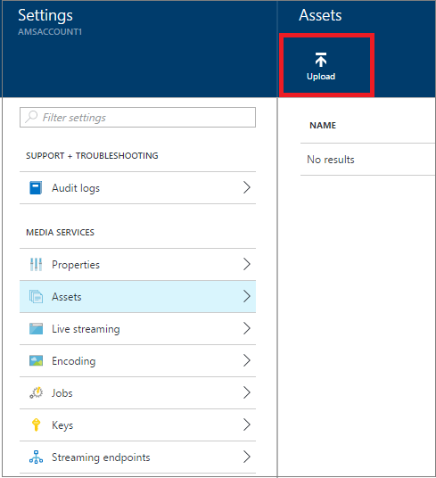

<properties
    pageTitle=" Hochladen von Dateien in ein Media-Dienste-Konto über das Azure-Portal | Microsoft Azure"
    description="Dieses Lernprogramm führt Sie durch die Schritte zum Hochladen von Dateien in ein Media-Dienste-Konto über das Azure-portal"
    services="media-services"
    documentationCenter=""
    authors="Juliako"
    manager="erikre"
    editor=""/>

<tags
    ms.service="media-services"
    ms.workload="media"
    ms.tgt_pltfrm="na"
    ms.devlang="na"
    ms.topic="get-started-article"
    ms.date="10/14/2016"
    ms.author="juliako"/>

# Hochladen von Dateien in ein Media-Dienste-Konto über das Azure-portal 

> [AZURE.SELECTOR]
- [Portal](media-services-portal-upload-files.md)
- [.NET](media-services-dotnet-upload-files.md)
- [REST](media-services-rest-upload-files.md)

> [AZURE.NOTE] Damit dieses Lernprogramm abgeschlossen, benötigen Sie ein Azure-Konto an. Weitere Informationen finden Sie unter [Azure kostenlose Testversion](https://azure.microsoft.com/pricing/free-trial/). 

In Media-Dienste laden Sie Ihre digitalen Dateien in einer Anlage hoch. Die Anlage kann Video, Audio, Bilder, Miniaturansichten Sammlungen, Text Spuren und Untertitel Dateien (und die Metadaten für diese Dateien.) enthalten. Sobald die Dateien hochgeladen werden, werden Ihre Inhalte in der Cloud für die weitere Verarbeitung und streaming sicher gespeichert.
 
1. Wählen Sie im [Portal Azure](https://portal.azure.com/)Ihrer Azure Media Services-Konto ein.

2. Klicken Sie auf das Blade **Einstellungen** klicken Sie auf **Posten**.

    

3. Klicken Sie auf die Schaltfläche **Hochladen** .

    Das Fenster **Hochladen eine video-Anlage** wird angezeigt.

    >[AZURE.NOTE] Es gibt keine Begrenzung der Größe aus.
    
4. Suchen Sie das gewünschte Video auf Ihrem Computer, wählen Sie ihn aus, und drücken Sie OK.  

    Startet der Upload und Sie können den Fortschritt unter den Dateinamen anzeigen.  

Sobald der Upload abgeschlossen ist, sehen Sie die neue Anlage im Fenster **Anlagen** aufgelistet. 

## Nächste Schritte

Jetzt können Sie Ihre hochgeladenen Anlagen codieren. Weitere Informationen finden Sie unter [Codieren Posten](media-services-portal-encode.md).

## Media-Dienste Learning Wege

[AZURE.INCLUDE [media-services-learning-paths-include](../../includes/media-services-learning-paths-include.md)]

##Angeben von feedback

[AZURE.INCLUDE [media-services-user-voice-include](../../includes/media-services-user-voice-include.md)]

