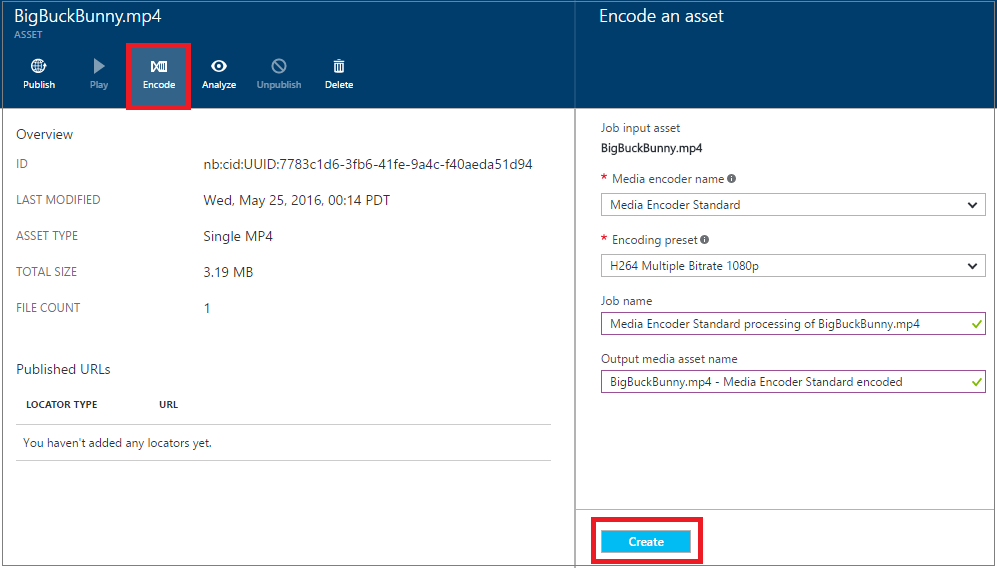

<properties
    pageTitle=" Erste Schritte mit der Bereitstellung von Inhalten bei Bedarf mit dem Portal Azure | Microsoft Azure"
    description="In diesem Lernprogramm führt Sie durch die Schritte des grundlegenden Demand (VoD) Bereitstellung von Inhalten Dienst mit Azure Media Services (AMS)-Anwendung, die mit dem Portal Azure implementieren."
    services="media-services"
    documentationCenter=""
    authors="Juliako"
    manager="erikre"
    editor=""/>

<tags
    ms.service="media-services"
    ms.workload="media"
    ms.tgt_pltfrm="na"
    ms.devlang="na"
    ms.topic="get-started-article"
    ms.date="08/30/2016"
    ms.author="juliako"/>

# Erste Schritte mit der Bereitstellung von Inhalten bei Bedarf mit dem Azure-portal

[AZURE.INCLUDE [media-services-selector-get-started](../../includes/media-services-selector-get-started.md)]

In diesem Lernprogramm führt Sie durch die Schritte des grundlegenden Demand (VoD) Bereitstellung von Inhalten Dienst mit Azure Media Services (AMS)-Anwendung, die mit dem Portal Azure implementieren.

> [AZURE.NOTE] Damit dieses Lernprogramm abgeschlossen, benötigen Sie ein Azure-Konto an. Weitere Informationen finden Sie unter [Azure kostenlose Testversion](https://azure.microsoft.com/pricing/free-trial/). 

In diesem Lernprogramm umfasst die folgenden Aufgaben:

1.  Erstellen Sie ein Azure Media Services-Konto an.
2.  Konfigurieren Sie streaming Endpunkt.
1.  Hochladen Sie eine Videodatei.
1.  Codieren Sie die Quelldatei in eine Reihe von adaptive Bitrate MP4-Dateien ein.
1.  Veröffentlichen der Anlage und streaming abrufen und URLs schrittweisen herunterladen.  
1.  Wiedergeben von Inhalten an.

## Erstellen Sie ein Konto Azure Media Services

Die Schritte in diesem Abschnitt zeigen, wie ein Konto AMS zu erstellen.

1. Melden Sie sich bei der [Azure-Portal](https://portal.azure.com/)an.
2. Klicken Sie auf **+ neue** > **Web + Mobile** > **Media-Dienste**.

    

3. Geben Sie die gewünschten Werte, in **MEDIA SERVICES-Kontos zu erstellen** .

    
    
    1. Geben Sie in das Feld **Kontoname**den Namen des neuen AMS-Kontos ein. Ein Kontonamen Media-Dienste ist alle Kleinbuchstaben Ziffern oder Buchstaben ohne Leerzeichen und 3 bis 24 Zeichen lang ist.
    2. Wählen Sie im Abonnement zwischen den verschiedenen Azure-Abonnements, denen Sie Zugriff haben.
    
    2. Wählen Sie in der **Ressourcengruppe**der neuen oder vorhandenen Ressource ein.  Eine Ressourcengruppe ist eine Sammlung von Ressourcen, die Lebenszyklus, Berechtigungen und Richtlinien gemeinsam nutzen. Weitere finden Sie [hier](azure-resource-manager/resource-group-overview.md#resource-groups).
    3. **Speicherort**werden auswählen die geografische Region verwendet, um die Einträge Medien und Metadaten für Ihr Konto Media-Dienste zu speichern. Diese Region wird zum Verarbeiten und Streamen von Medien verwendet. Die verfügbaren Media-Dienste Regionen werden im Dropdown-Listenfeld angezeigt. 
    
    3. Wählen Sie in **Speicher-Konto**ein Speicherkonto, um Blob-Speicher des Inhalts Medien über Ihr Konto Media-Dienste bereitzustellen. Sie können ein vorhandenes Speicherkonto in der gleichen geografische Region als Ihr Konto Media-Dienste auswählen, oder Sie können ein Speicherkonto erstellen. Ein neues Speicherkonto wird in der gleichen Region erstellt. Die Regeln für Speicher Kontonamen sind die gleichen wie bei Medien Dienstkonten.

        Weitere Informationen zu Speicher [hier](storage-introduction.md).

    4. Wählen Sie die **Pin zum Dashboard** , um den Fortschritt der Bereitstellung Konto finden Sie unter.
    
7. Klicken Sie auf **Erstellen** am unteren Rand des Formulars.

    Nachdem das Konto erfolgreich erstellt wurde, ändert sich der Status für die **Ausführung von**. 

    

    Verwalten Sie Ihr Konto AMS (z. B. Hochladen von Videos, Codieren von Anlagen, Überwachung des Projektstatus) verwenden Sie das Fenster **Einstellungen** .

## Verwalten von Tasten

Sie benötigen den Namen des Kontos und die Informationen zu Primärschlüsseln der Media Services-Kontos programmgesteuert Zugriff auf.

1. Wählen Sie im Portal Azure Ihr Konto ein. 

    Das Fenster **Einstellungen** wird auf der rechten Seite angezeigt. 

2. Wählen Sie im Fenster **Einstellungen** **Schlüssel**aus. 

    Windows **Verwalten Tasten** zeigt den Kontonamen und der primären und sekundären Schlüssel wird angezeigt. 
3. Drücken Sie die Schaltfläche Kopieren, um die Werte zu kopieren.
    
    

## Konfigurieren Sie streaming Endpunkte

Wenn Sie mit Azure Media-Dienste zu arbeiten, die eine der häufigsten Szenarios über adaptive Bitrate streaming Video zum Kunden übermittelt. Media-Dienste unterstützt die folgende adaptive Bitrate Technologien streaming: HTTP Live Streaming (HLS), interpolierten Streaming, MPEG Gedankenstrich und HDS (für nur Adobe vorzeigbare/Access Lizenznehmern).

Media Services bietet dynamische Verpacken, dem Sie Ihre adaptive Bitrate MP4-codierte Inhalte von Media-Dienste (MPEG Gedankenstrich HLS, interpolierten Streaming, HDS) nur-Time, ohne dass Sie vorkonfigurierte Versionen von jedem der folgenden streaming-Formaten speichern unterstützten Formate streaming vorführen kann.

Um dynamische Verpackung nutzen zu können, müssen Sie die folgenden Aktionen ausführen:

- Codieren der Datei Mezzanine (Quelle) in eine Reihe von adaptive Bitrate MP4-Dateien (die Codierung Schritte sind weiter unten in diesem Lernprogramm gezeigt).  
- Erstellen Sie mindestens eine streaming Einheit für das *streaming Endpunkt* aus der Sie die Übermittlung von Inhalten erstellen möchten. Schritte anzeigen zum Ändern der Anzahl der streaming Einheiten

Dynamische Verpackung, müssen Sie nur zu speichern und die Dateien in den einzelnen Speicherformat bezahlen und Media-Dienste erstellt und die entsprechende Antwort basierend auf einem Client-Anfragen fungiert.

Zum Erstellen und ändern die Anzahl der Einheiten reservierte streaming, führen Sie folgende Schritte aus:

1. Klicken Sie im Fenster **Einstellungen** auf **Streaming Endpunkte**. 

2. Klicken Sie auf die Standardeinstellungen für streaming-Endpunkt. 

    Das Fenster **STANDARDMÄßIG STREAMING ENDPUNKTDETAILS** wird angezeigt.

3. Um die Anzahl der Einheiten streaming anzugeben, schieben Sie den Schieberegler **Streaming Einheiten** .

    

4. Klicken Sie auf die Schaltfläche **Speichern** , um die Änderungen zu speichern.

    >[AZURE.NOTE]Die Zuordnung von allen neuen Einheiten kann bis zu 20 Minuten dauern.

## Hochladen von Dateien

In Stream Videos Azure Media-Dienste verwenden, müssen Sie die Quelle Videos hochladen, müssen Sie diese in mehreren eine Bitrate codieren und das Ergebnis veröffentlichen. In diesem Abschnitt ist der erste Schritt behandelt. 

1. Klicken Sie auf **Posten**, klicken Sie im Fenster **Einstellung** .

    

3. Klicken Sie auf die Schaltfläche **Hochladen** .

    Das Fenster **Hochladen eine video-Anlage** wird angezeigt.

    >[AZURE.NOTE] Es gibt keine Begrenzung der Größe aus.
    
4. Suchen Sie das gewünschte Video auf Ihrem Computer, wählen Sie ihn aus, und drücken Sie OK.  

    Startet der Upload und Sie können den Fortschritt unter den Dateinamen anzeigen.  

Sobald der Upload abgeschlossen ist, wird die neue Anlage im Fenster **Anlagen** aufgelistet. 

## Codieren von Anlagen

Wenn Sie mit Azure Media-Dienste zu arbeiten, die eine der häufigsten Szenarios adaptive streaming Bitrate zum Kunden übermittelt. Media-Dienste unterstützt die folgende adaptive Bitrate Technologien streaming: HTTP Live Streaming (HLS), interpolierten Streaming, MPEG Gedankenstrich und HDS (für nur Adobe vorzeigbare/Access Lizenznehmern). Um Ihre Videos adaptive Bitrate streaming vorzubereiten, müssen Sie Ihr Quellvideo in Multi-Bitrate Dateien codieren. Sie sollten den **Media Encoder Standard** Encoder Codieren von Videos verwenden.  

Media-Dienste auch bietet dynamische Verpacken, dem Sie Ihre Multi-Bitrate MP4s in den folgenden streaming Formaten vorführen kann: MPEG Gedankenstrich, HLS, interpolierten Streaming, oder Festplatten, ohne dass Sie in den folgenden Formaten streaming erneut packen. Dynamische Verpackung, müssen Sie nur zu speichern und die Dateien in den einzelnen Speicherformat bezahlen und Media-Dienste erstellt und die entsprechende Antwort basierend auf einem Client-Anfragen fungiert.

Um dynamische Verpackung nutzen zu können, müssen Sie die folgenden Aktionen ausführen:

- Codieren der Quelldatei in eine Reihe von Multi-Bitrate MP4-Dateien (die Codierung Schritte sind weiter unten in diesem Abschnitt gezeigt).
- Holen Sie mindestens eine streaming Einheit für den streaming Endpunkt, aus dem Sie bis zur Bereitstellung des Inhalts planen. Weitere Informationen finden Sie unter [Konfigurieren von Endpunkten streaming](media-services-portal-vod-get-started.md#configure-streaming-endpoints). 

### Mit dem Portal zu codieren

In diesem Abschnitt werden die Schritte beschrieben, die Sie, zum Codieren von Inhalten mit Media Encoder Standard ergreifen können.

1.  Wählen Sie **Posten**im Fenster **Einstellungen** aus.  
2.  Wählen Sie die Anlage, die Sie codieren möchten, klicken Sie im Fenster **Posten** .
3.  Drücken Sie die **Codieren** .
4.  Wählen Sie im Fenster **Codieren eines Wirtschaftsguts** "Media Encoder Standard" Prozessor und eine Voreinstellung aus. Beispielsweise, wenn Sie wissen, von Videos weist eine Auflösung von 1920 x 1080 Pixel, dann können die "H264 mehrere Bitrate 1080p" voreingestellten. Weitere Informationen finden Sie unter [in](https://msdn.microsoft.com/library/azure/mt269960.aspx) diesem Artikel – Voreinstellungen ist es wichtig, wählen Sie die Vorgabe, die für Ihre Eingaben video am besten geeignet ist. Sie haben eine Videos mit niedriger Auflösung (640 x 360), und Sie nicht verwendet werden soll die Standardeinstellung "H264 mehrere Bitrate 1080p" voreingestellten.
    
    Zur einfacheren Verwaltung müssen Sie eine Möglichkeit, bearbeiten den Namen der Anlage Ausgabe und den Namen des Projekts.
        
    
5. Drücken Sie auf **Erstellen**.

### Überwachen des Projektstatus Codierung

Klicken Sie zum Überwachen des Fortschritts des Codierung Auftrags klicken Sie auf **Einstellungen** (am oberen Rand der Seite), und wählen Sie dann auf **Projekte**.

## Veröffentlichen von Inhalten

Um Ihre Benutzer mit einer URL angeben, das zum übertragen oder Herunterladen von Inhalten verwendet werden können, müssen Sie zuerst der Anlage "Veröffentlichen", indem Sie einen Locator erstellen. Locator ermöglichen den Zugriff auf Dateien in der Anlage. Media Services unterstützt zwei Arten von Locator: 

- Streaming (OnDemandOrigin) Locator, für adaptives streaming (z. B., Stream MPEG Gedankenstrich HLS oder interpolierten Streaming) verwendet. Um einen streaming Locator Ihrer Ressource erstellen müssen eine Datei .ism enthalten. 
- Schrittweisen (SAS) Locator, für die Übermittlung Videos über schrittweisen Download verwendet.

Streaming URL weist das folgende Format, und Sie können Anlagen interpolierten Streaming zum Ausprobieren verwenden.

    {streaming endpoint name-media services account name}.streaming.mediaservices.windows.net/{locator ID}/{filename}.ism/Manifest

Zum Erstellen einer URL streaming HLS anfügen (Format = m3u8-Aapl) zur URL.

    {streaming endpoint name-media services account name}.streaming.mediaservices.windows.net/{locator ID}/{filename}.ism/Manifest(format=m3u8-aapl)

Zum Erstellen einer URL streaming MPEG-Gedankenstrich anfügen (Format = Mpd-Uhrzeit-csf) zur URL.

    {streaming endpoint name-media services account name}.streaming.mediaservices.windows.net/{locator ID}/{filename}.ism/Manifest(format=mpd-time-csf)

Eine SAS-URL weist das folgende Format.

    {blob container name}/{asset name}/{file name}/{SAS signature}

>[AZURE.NOTE] Wenn Sie im Portal Locator vor März 2015 erstellt, wurden Locator mit einem zwei Jahre Ablaufdatum erstellt.  

Verwenden Sie zum Aktualisieren einer Locator ein Ablaufdatum [REST](http://msdn.microsoft.com/library/azure/hh974308.aspx#update_a_locator ) oder [.NET](http://go.microsoft.com/fwlink/?LinkID=533259) APIs aus. Wenn Sie das Ablaufdatum der SAS Locator aktualisieren, ändert sich die URL ein.

### Verwenden Sie im Portal veröffentlichen eine Anlage

Wenn Sie im Portal verwenden, um eine Anlage zu veröffentlichen, führen Sie folgende Schritte aus:

1. Wählen Sie **Einstellungen**aus > **Posten**.
1. Wählen Sie die Anlage, die Sie veröffentlichen möchten.
1. Klicken Sie auf die Schaltfläche **Veröffentlichen** .
1. Wählen Sie die URL-Typ aus.
2. Drücken Sie auf **Hinzufügen**.

    

Die URL wird die Liste der **URLs veröffentlicht**hinzugefügt.

## Wiedergeben von Inhalten aus dem portal

Azure-Portal bietet einen Inhalten Player, den Sie verwenden können, um das Video zu testen.

Klicken Sie auf das gewünschte Video, und klicken Sie dann auf **die Wiedergabeschaltfläche** .

Einige Überlegungen Ursachen zurückzuführen:

- Stellen Sie sicher, dass das Video veröffentlicht wurde.
- Diese **MediaPlayer** wiedergegeben wird, aus der Standardeinstellungen für streaming-Endpunkt. Wenn Sie von einer nicht standardmäßigen streaming Endpunkt wiedergeben möchten, klicken Sie auf zum Kopieren der URL und einen anderen Spieler verwenden. Beispielsweise [Azure Services Medienwiedergabe](http://amsplayer.azurewebsites.net/azuremediaplayer.html).

##Nächste Schritte

Überprüfen Sie die Pfade learning Media-Dienste.

[AZURE.INCLUDE [media-services-learning-paths-include](../../includes/media-services-learning-paths-include.md)]

##Angeben von feedback

[AZURE.INCLUDE [media-services-user-voice-include](../../includes/media-services-user-voice-include.md)]

