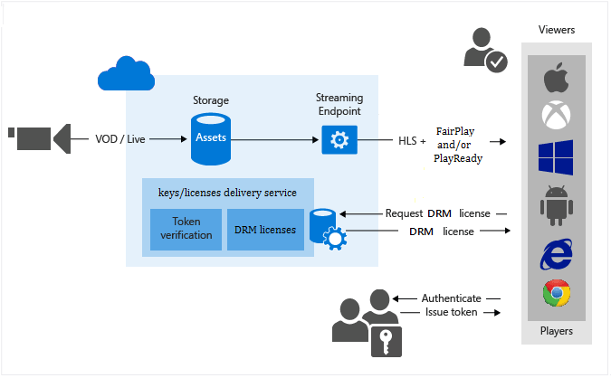

<properties 
    pageTitle="Schützen Ihrer Inhalt mit Apple FairPlay und/oder Microsoft PlayReady HLS | Microsoft Azure" 
    description="Dieses Thema bietet einen Überblick und zeigt, wie Azure Media-Dienste zu verwenden, um dynamisch HTTP Live Streaming (HLS) Inhalt mit Apple FairPlay verschlüsseln. Es wird gezeigt, wie die Medien Lizenz Übermittlung Dienste verwenden FairPlay Lizenzen Clients vorführen." 
    services="media-services" 
    documentationCenter="" 
    authors="Juliako" 
    manager="erikre" 
    editor=""/>

<tags 
    ms.service="media-services" 
    ms.workload="media" 
    ms.tgt_pltfrm="na" 
    ms.devlang="na" 
    ms.topic="article" 
    ms.date="09/27/2016"
    ms.author="juliako"/>

# Schützen Sie Ihrer Inhalt mit Apple FairPlay und/oder Microsoft PlayReady HLS

Azure Media Services können Sie Ihre HTTP-Live Streaming (HLS) Inhalte mit den folgenden Formaten dynamisch verschlüsseln:  

- **AES-128 Umschlag löschen-Taste** 

    Der gesamte Textbaustein ist verschlüsselt **AES-128 CBC** -Modus verwenden. Das Entschlüsseln des Streams wird durch den iOS und OSX Player unterstützt. Weitere Informationen finden Sie [in diesem Artikel](media-services-protect-with-aes128.md)aus.

- **Apple FairPlay** 

    Die einzelnen Beispiele für video und audio verschlüsselt sind, mit dem **AES-128 CBC** -Modus. **FairPlay Streaming** (F/s) ist in den Gerätebetriebssystemen mit systemeigene Unterstützung für iOS und Apple TV integriert. Safari auf OS X ermöglicht f/s mit Benutzeroberflächen-Support verschlüsselt Medien Erweiterungen (EME).
- **Microsoft PlayReady**

Die folgende Abbildung zeigt den Workflow **HLS + FairPlay und/oder PlayReady dynamic-Verschlüsselung** .

In diesem Thema veranschaulicht, wie Azure Media Services dynamisch HLS Inhalt mit Apple FairPlay verschlüsseln. Es wird gezeigt, wie die Medien Lizenz Übermittlung Dienste verwenden FairPlay Lizenzen Clients vorführen.

>[AZURE.NOTE] Wenn Sie Ihre HLS Inhalte mit PlayReady verschlüsseln möchten, müssen Sie einen gemeinsamen Inhalten Schlüssel erstellen und Ihrer Ressource zugeordnet. Sie müssen außerdem den Inhalt Schlüssel Autorisierungsrichtlinie konfigurieren, wie [PlayReady mithilfe von dynamischen allgemeine Verschlüsselung](media-services-protect-with-drm.md) beschrieben.

    
## Anforderungen und Aspekte

- Die folgenden sind erforderlich, wenn AMS HLS mit FairPlay verschlüsselt vorführen und Vorführen FairPlay Lizenzen verwenden.

    - Ein Azure-Konto. Weitere Informationen finden Sie unter [Azure kostenlose Testversion](/pricing/free-trial/?WT.mc_id=A261C142F).
    - Ein Konto Media-Dienste. Zum Erstellen eines Media Services-Kontos finden Sie unter [Konto erstellen](media-services-portal-create-account.md).
    - Melden Sie sich mit [Apple Entwicklungsprogramm](https://developer.apple.com/).
    - Apple erfordert den Besitzer des Inhalten der [Bereitstellungspaket](https://developer.apple.com/contact/fps/)zu erhalten. Nennen Sie die Anforderung, dass Sie bereits implementiert KSM (Taste Sicherheitsmodul) mit Azure Media Services und, dass Sie das endgültige f/s-Paket anfordern. Es werden Anweisungen im endgültigen f/s Verpacken Zertifizierung generieren, und erhalten Fragen, die Sie zum Konfigurieren von FairPlay verwenden möchten. 

    - Azure Media Services .NET SDK Version **3.6.0** oder höher.

- Legen Sie die folgenden Elemente AMS Key Übermittlung auf:
    - **App-Zertifikat (IK)** – PFX-Datei, die privaten Schlüssel enthält. Diese Datei ist durch den Kunden erstellt und von den gleichen Kunden mit einem Kennwort verschlüsselt. 
        
        Wenn Sie der Kunden Key Übermittlung Richtlinie konfiguriert hat, müssen sie das Kennwort und die PFX-Datei im Format base64 bieten.

        Die folgenden Schritte beschreiben, wie Sie ein Zertifikat Pfx für FairPlay zu generieren.
        
        1. Installieren von OpenSSL aus https://slproweb.com/products/Win32OpenSSL.html
        
            Wechseln Sie zu dem Ordner, in dem das Zertifikat FairPlay und andere Dateien, die von Apple übermittelt werden.
        
        2. Befehlszeile der Cer in Pem konvertieren:
        
            "C:\OpenSSL-Win32\bin\openssl.exe" X509-Informieren der-in fairplay.cer-, Fairplay-out.pem
        
        3. Befehlszeile Pem in Pfx mit dem privaten Schlüssel konvertieren (das Kennwort für die Pfx-Datei wird dann durch OpenSSL gestellte).
        
            "C:\OpenSSL-Win32\bin\openssl.exe" pkcs12-exportieren-, Fairplay-out.pfx-inkey privatekey.pem-in Fairplay-out.pem - Passin file:privatekey-pem-pass.txt 
        
    - **App-Zertifikat Kennwort** - Kundenkennwort für die PFX-Datei erstellen.
    - **Kennwort-ID des app-Zertifikat** – der Kunde muss das Kennwort ähnlich wie er anderen AMS Tasten und Verwenden von **ContentKeyType.FairPlayPfxPassword** Enumerationswert hochladen hochladen. Als Ergebnis erhalten sie AMS-Id, dies ist, was sie in die Option Key Übermittlung Websitesammlungsrichtlinie verwenden müssen.
    - **iv** - 16 Bytes Zufallszahl Wert muss die iv in der Anlage Übermittlung Richtlinie übereinstimmen. Kunden der IV generiert und verschiebt sie in beiden Orten: Anlage Übermittlung Richtlinie und Schlüssel Übermittlungsoption Richtlinie. 
    - **Fragen** - Fragen (Anwendungstaste geheim) empfangen wird, wenn Sie die Zertifizierung mit Apple-Entwicklerportal generieren. Jedes Entwicklungsteam erhalten eine eindeutige Fragen. Speichern einer Kopie der Fragen, und speichern Sie es an einem sicheren Ort. Sie müssen als FairPlayAsk in Azure Media Services später Fragen zu konfigurieren. 
    -  **BITTEN Sie ID** - entsteht der Kunde ASk in AMS hochlädt. Der Kunde muss Fragen mit **ContentKeyType.FairPlayASk** Enumerationswert hochladen. Als Ergebnis die AMS-Id zurückgegeben wird, und dies ist, was beim Festlegen der Option Key Übermittlung Richtlinie verwendet werden soll.

- Legen Sie die folgenden Elemente nebeneinander Client f/s:
    - **App-Zertifikat (IK)** –.cer/.der-Datei, die mit öffentlichen Schlüssel die OS verwendet, um einige Nutzlast verschlüsseln. AMS muss es kennen, da sie von der Player benötigt wird. Der Übermittlungsdienst Key entschlüsselt ihn mit dem zugehörigen privaten Schlüssel.

- Wiedergabe einer FairPlay verschlüsselten Stream müssen Sie real Fragen erste abrufen, und klicken Sie dann generieren ein Zertifikat real. Der Prozess erstellt alle 3 Teilen:

    -  .der, 
    -  PFX und 
    -  das Kennwort für die PFX-Datei.
 
- Clients, die HLS mit **AES-128 CBC** -Verschlüsselung unterstützt: Safari auf OS X, Apple TV, iOS.

##Schritte zum Konfigurieren von FairPlay dynamische-Übermittlung Verschlüsselung und Lizenz services

Im folgenden werden die allgemeinen Schritte ausführen, die Sie ausführen, wenn Sie Ihre Bestände jederzeit mit FairPlay, mithilfe des Diensts für Media-Dienste Lizenz Übermittlung und auch mithilfe von dynamischen Verschlüsselung Schützen von müssten.

1. Erstellen eines Wirtschaftsguts und Hochladen von Dateien in der Anlage. 
1. Codieren der Anlage, die die Datei die adaptive Bitrate MP4 festgelegten enthält.
1. Erstellen Sie einen Schlüssel Inhalten und die codierte Anlage zugeordnet wird.  
1. Konfigurieren Sie die Inhalte Taste Autorisierungsrichtlinie ein. Beim Erstellen der Autorisierungsrichtlinie Inhalt Key müssen Sie Folgendes angeben: 
    
    - Zustellungsart (in diesem Fall FairPlay), 
    - Konfiguration von FairPlay Richtlinien Optionen. Weitere Informationen zum Konfigurieren von FairPlay finden Sie unter ConfigureFairPlayPolicyOptions() Methode im Beispiel unten.
    
        >[AZURE.NOTE] In der Regel, sollten Sie FairPlay Richtlinienoptionen konfigurieren nur einmal, da Sie nur eine Reihe von Fragen-Zertifizierung verfügen.
-Einschränkungen (Öffnen oder token)- und Informationen zu den wichtigsten Übermittlungstyp, die definiert, wie die Taste an den Kunden geliefert wird. 
    
2. Konfigurieren Sie die Anlage Übermittlung Richtlinie. Konfiguration der Übermittlung umfasst: 

    - Übermittlungsprotokoll (HLS), 
    - die Art der dynamischen Verschlüsselung (Allgemeine CBC Verschlüsselung) 
    - Lizenz Acquisition URL. 
    
    >[AZURE.NOTE]Wenn Sie einen Stream vorführen, der verschlüsselt sind mit FairPlay + ein anderes DRM möchten, müssen Sie separate Übermittlung Richtlinien konfigurieren 
    >
    >- Eine IAssetDeliveryPolicy Gedankenstrich mit CENC (PlayReady + WideVine) und optimierten mit PlayReady konfigurieren. 
    >- Eine andere IAssetDeliveryPolicy FairPlay für HLS konfigurieren

1. Erstellen eines auf-Anforderung Locators um eine streaming URL zu gelangen.

##FairPlay Key Übermittlung verwenden, indem Sie die Player-Client-apps

Kunden konnte Player-apps mit iOS SDK entwickeln. Damit FairPlay wiedergegeben werden müssen Kunden Lizenz Exchange-Protokoll implementieren. Das Exchange-Protokoll Lizenz von Apple nicht angegeben. Es ist auf jede app so Key Übermittlung Anfragen zu senden. Die AMS FairPlay Key Übermittlung Dienste erwartet das ASP kommen als Www-form-url codierte Beitrag Nachricht in folgender Form: 

    spc=<Base64 encoded SPC>

>[AZURE.NOTE] Azure Media Player unterstützt keine Wiedergabe von FairPlay einsatzbereit. Kunden benötigen den Stichprobe-Player aus Apple Developer-Konto für FairPlay Wiedergabe auf MAC OSX ausgeführt werden. 
 
##Streaming URLs

Wenn Ihre Anlage mit mehreren DRM verschlüsselt wurde, sollten Sie eine Kategorie Verschlüsselung verwenden, in der streaming URL: (Format = 'm3u8-Aapl' Verschlüsselung = 'Funktionen Länge und LÄNGEB').

Folgendes gilt:

- Nur 0 (null) oder eine können Verschlüsselung angegeben werden.
- Verschlüsselungstyp muss nicht in der Url angegeben werden muss, wenn nur eine Verschlüsselung auf die Anlage angewendet wurde.
- Verschlüsselung Datentyp Groß-/Kleinschreibung wird.
- Die folgenden Arten von Verschlüsselung können angegeben werden:  
    - **Cenc**: Allgemeine Verschlüsselung (Playready oder Widevine)
    - **CBCs-Aapl**: Fairplay
    - **CBC**: AES Umschlag-Verschlüsselung.

##Beispiel für .NET

Im folgende Beispiel wird veranschaulicht, Funktionen, die in Azure Media Services SDK für .net eingeführt wurde-Version 3.6.0 (die Möglichkeit, Azure Media-Dienste zu verwenden, um Ihre Inhalte mit FairPlay verschlüsselt übermitteln). Mit dem folgende Befehl des Nuget-Paket wurde verwendet, um das Paket zu installieren:

    PM> Install-Package windowsazure.mediaservices -Version 3.6.0

1. Erstellen eines Projekts Console.
1. Formular mit NuGet installieren und Azure Media Services .NET SDK hinzufügen.
2. Fügen Sie zusätzliche Verweise: System.Configuration.
2. Fügen Sie Config-Datei mit den Kontonamen und wichtige Informationen:
    
        <?xml version="1.0" encoding="utf-8"?>
        <configuration>
            <startup> 
                <supportedRuntime version="v4.0" sku=".NETFramework,Version=v4.5" />
            </startup>
              <appSettings>
            
                <add key="MediaServicesAccountName" value="AccountName"/>
                <add key="MediaServicesAccountKey" value="AccountKey"/>
            
                <add key="Issuer" value="http://testacs.com"/>
                <add key="Audience" value="urn:test"/>
              </appSettings>
        </configuration>

1. Holen Sie mindestens eine streaming Einheit für den streaming Endpunkt, aus dem Sie bis zur Bereitstellung des Inhalts planen. Weitere Informationen finden Sie unter: [streaming Endpunkte konfigurieren](media-services-dotnet-get-started.md#configure-streaming-endpoint-using-the-portal).

1. Überschreiben Sie den Code in der Datei Program.cs mit dem Code in diesem Abschnitt dargestellt.
            
        
        using System;
        using System.Collections.Generic;
        using System.Configuration;
        using System.IO;
        using System.Linq;
        using System.Threading;
        using Microsoft.WindowsAzure.MediaServices.Client;
        using Microsoft.WindowsAzure.MediaServices.Client.ContentKeyAuthorization;
        using Microsoft.WindowsAzure.MediaServices.Client.DynamicEncryption;
        using Microsoft.WindowsAzure.MediaServices.Client.FairPlay;
        using Newtonsoft.Json;
        using System.Security.Cryptography.X509Certificates;
        
        namespace DynamicEncryptionWithFairPlay
        {
            class Program
            {
                // Read values from the App.config file.
                private static readonly string _mediaServicesAccountName =
                    ConfigurationManager.AppSettings["MediaServicesAccountName"];
                private static readonly string _mediaServicesAccountKey =
                    ConfigurationManager.AppSettings["MediaServicesAccountKey"];
        
                private static readonly Uri _sampleIssuer =
                    new Uri(ConfigurationManager.AppSettings["Issuer"]);
                private static readonly Uri _sampleAudience =
                    new Uri(ConfigurationManager.AppSettings["Audience"]);
        
                // Field for service context.
                private static CloudMediaContext _context = null;
                private static MediaServicesCredentials _cachedCredentials = null;
        
                private static readonly string _mediaFiles =
                    Path.GetFullPath(@"../..\Media");
        
                private static readonly string _singleMP4File =
                    Path.Combine(_mediaFiles, @"BigBuckBunny.mp4");
        
                static void Main(string[] args)
                {
                    // Create and cache the Media Services credentials in a static class variable.
                    _cachedCredentials = new MediaServicesCredentials(
                                    _mediaServicesAccountName,
                                    _mediaServicesAccountKey);
                    // Used the cached credentials to create CloudMediaContext.
                    _context = new CloudMediaContext(_cachedCredentials);
        
                    bool tokenRestriction = false;
                    string tokenTemplateString = null;
        
                    IAsset asset = UploadFileAndCreateAsset(_singleMP4File);
                    Console.WriteLine("Uploaded asset: {0}", asset.Id);
        
                    IAsset encodedAsset = EncodeToAdaptiveBitrateMP4Set(asset);
                    Console.WriteLine("Encoded asset: {0}", encodedAsset.Id);
        
                    IContentKey key = CreateCommonCBCTypeContentKey(encodedAsset);
                    Console.WriteLine("Created key {0} for the asset {1} ", key.Id, encodedAsset.Id);
                    Console.WriteLine("FairPlay License Key delivery URL: {0}", key.GetKeyDeliveryUrl(ContentKeyDeliveryType.FairPlay));
                    Console.WriteLine();
        
                    if (tokenRestriction)
                        tokenTemplateString = AddTokenRestrictedAuthorizationPolicy(key);
                    else
                        AddOpenAuthorizationPolicy(key);
        
                    Console.WriteLine("Added authorization policy: {0}", key.AuthorizationPolicyId);
                    Console.WriteLine();
        
                    CreateAssetDeliveryPolicy(encodedAsset, key);
                    Console.WriteLine("Created asset delivery policy. \n");
                    Console.WriteLine();
        
                    if (tokenRestriction && !String.IsNullOrEmpty(tokenTemplateString))
                    {
                        // Deserializes a string containing an Xml representation of a TokenRestrictionTemplate
                        // back into a TokenRestrictionTemplate class instance.
                        TokenRestrictionTemplate tokenTemplate =
                            TokenRestrictionTemplateSerializer.Deserialize(tokenTemplateString);
        
                        // Generate a test token based on the the data in the given TokenRestrictionTemplate.
                        // Note, you need to pass the key id Guid because we specified 
                        // TokenClaim.ContentKeyIdentifierClaim in during the creation of TokenRestrictionTemplate.
                        Guid rawkey = EncryptionUtils.GetKeyIdAsGuid(key.Id);
                        string testToken = TokenRestrictionTemplateSerializer.GenerateTestToken(tokenTemplate, null, rawkey,
                                                                                DateTime.UtcNow.AddDays(365));
                        Console.WriteLine("The authorization token is:\nBearer {0}", testToken);
                        Console.WriteLine();
                    }
        
                    string url = GetStreamingOriginLocator(encodedAsset);
                    Console.WriteLine("Encrypted HLS URL: {0}/manifest(format=m3u8-aapl)", url);
        
                    Console.ReadLine();
                }
        
                static public IAsset UploadFileAndCreateAsset(string singleFilePath)
                {
                    if (!File.Exists(singleFilePath))
                    {
                        Console.WriteLine("File does not exist.");
                        return null;
                    }
        
                    var assetName = Path.GetFileNameWithoutExtension(singleFilePath);
                    IAsset inputAsset = _context.Assets.Create(assetName, AssetCreationOptions.None);
        
                    var assetFile = inputAsset.AssetFiles.Create(Path.GetFileName(singleFilePath));
        
                    Console.WriteLine("Created assetFile {0}", assetFile.Name);
        
                    var policy = _context.AccessPolicies.Create(
                                            assetName,
                                            TimeSpan.FromDays(30),
                                            AccessPermissions.Write | AccessPermissions.List);
        
                    var locator = _context.Locators.CreateLocator(LocatorType.Sas, inputAsset, policy);
        
                    Console.WriteLine("Upload {0}", assetFile.Name);
        
                    assetFile.Upload(singleFilePath);
                    Console.WriteLine("Done uploading {0}", assetFile.Name);
        
                    locator.Delete();
                    policy.Delete();
        
                    return inputAsset;
                }
        
                static public IAsset EncodeToAdaptiveBitrateMP4Set(IAsset inputAsset)
                {
                    var encodingPreset = "H264 Multiple Bitrate 720p";
        
                    IJob job = _context.Jobs.Create(String.Format("Encoding into Mp4 {0} to {1}",
                                            inputAsset.Name,
                                            encodingPreset));
        
                    var mediaProcessors =
                        _context.MediaProcessors.Where(p => p.Name.Contains("Media Encoder Standard")).ToList();
        
                    var latestMediaProcessor =
                        mediaProcessors.OrderBy(mp => new Version(mp.Version)).LastOrDefault();
        
                    ITask encodeTask = job.Tasks.AddNew("Encoding", latestMediaProcessor, encodingPreset, TaskOptions.None);
                    encodeTask.InputAssets.Add(inputAsset);
                    encodeTask.OutputAssets.AddNew(String.Format("{0} as {1}", inputAsset.Name, encodingPreset),    AssetCreationOptions.StorageEncrypted);
        
                    job.StateChanged += new EventHandler<JobStateChangedEventArgs>(JobStateChanged);
                    job.Submit();
                    job.GetExecutionProgressTask(CancellationToken.None).Wait();
        
                    return job.OutputMediaAssets[0];
                }
        
                static public IContentKey CreateCommonCBCTypeContentKey(IAsset asset)
                {
                    // Create HLS SAMPLE AES encryption content key
                    Guid keyId = Guid.NewGuid();
                    byte[] contentKey = GetRandomBuffer(16);
        
                    IContentKey key = _context.ContentKeys.Create(
                                            keyId,
                                            contentKey,
                                            "ContentKey",
                                            ContentKeyType.CommonEncryptionCbcs);
        
                    // Associate the key with the asset.
                    asset.ContentKeys.Add(key);
        
                    return key;
                }
        
        
                static public void AddOpenAuthorizationPolicy(IContentKey contentKey)
                {
                    // Create ContentKeyAuthorizationPolicy with Open restrictions 
                    // and create authorization policy          
        
                    List<ContentKeyAuthorizationPolicyRestriction> restrictions = new List<ContentKeyAuthorizationPolicyRestriction>
                            {
                                new ContentKeyAuthorizationPolicyRestriction
                                {
                                    Name = "Open",
                                    KeyRestrictionType = (int)ContentKeyRestrictionType.Open,
                                    Requirements = null
                                }
                            };
        
        
                    // Configure FairPlay policy option.
                    string FairPlayConfiguration = ConfigureFairPlayPolicyOptions();
        
                    IContentKeyAuthorizationPolicyOption FairPlayPolicy =
                        _context.ContentKeyAuthorizationPolicyOptions.Create("",
                        ContentKeyDeliveryType.FairPlay,
                        restrictions,
                        FairPlayConfiguration);
        
        
                    IContentKeyAuthorizationPolicy contentKeyAuthorizationPolicy = _context.
                                ContentKeyAuthorizationPolicies.
                                CreateAsync("Deliver Common CBC Content Key with no restrictions").
                                Result;
        
                    contentKeyAuthorizationPolicy.Options.Add(FairPlayPolicy);
        
                    // Associate the content key authorization policy with the content key.
                    contentKey.AuthorizationPolicyId = contentKeyAuthorizationPolicy.Id;
                    contentKey = contentKey.UpdateAsync().Result;
                }
        
                public static string AddTokenRestrictedAuthorizationPolicy(IContentKey contentKey)
                {
                    string tokenTemplateString = GenerateTokenRequirements();
        
                    List<ContentKeyAuthorizationPolicyRestriction> restrictions = new List<ContentKeyAuthorizationPolicyRestriction>
                            {
                                new ContentKeyAuthorizationPolicyRestriction
                                {
                                    Name = "Token Authorization Policy",
                                    KeyRestrictionType = (int)ContentKeyRestrictionType.TokenRestricted,
                                    Requirements = tokenTemplateString,
                                }
                            };
        
                    // Configure FairPlay policy option.
                    string FairPlayConfiguration = ConfigureFairPlayPolicyOptions();
        
        
                    IContentKeyAuthorizationPolicyOption FairPlayPolicy =
                        _context.ContentKeyAuthorizationPolicyOptions.Create("Token option",
                               ContentKeyDeliveryType.FairPlay,
                               restrictions,
                               FairPlayConfiguration);
        
                    IContentKeyAuthorizationPolicy contentKeyAuthorizationPolicy = _context.
                                ContentKeyAuthorizationPolicies.
                                CreateAsync("Deliver Common CBC Content Key with token restrictions").
                                Result;
        
                    contentKeyAuthorizationPolicy.Options.Add(FairPlayPolicy);
        
                    // Associate the content key authorization policy with the content key
                    contentKey.AuthorizationPolicyId = contentKeyAuthorizationPolicy.Id;
                    contentKey = contentKey.UpdateAsync().Result;
        
                    return tokenTemplateString;
                }
        
                private static string ConfigureFairPlayPolicyOptions()
                {
                    // For testing you can provide all zeroes for ASK bytes together with the cert from Apple FPS SDK. 
                    // However, for production you must use a real ASK from Apple bound to a real prod certificate.
                    byte[] askBytes = Guid.NewGuid().ToByteArray();
                    var askId = Guid.NewGuid();
                    // Key delivery retrieves askKey by askId and uses this key to generate the response.
                    IContentKey askKey = _context.ContentKeys.Create(
                                            askId,
                                            askBytes,
                                            "askKey",
                                            ContentKeyType.FairPlayASk);
        
                    //Customer password for creating the .pfx file.
                    string pfxPassword = "<customer password for creating the .pfx file>";
                    // Key delivery retrieves pfxPasswordKey by pfxPasswordId and uses this key to generate the response.
                    var pfxPasswordId = Guid.NewGuid();
                    byte[] pfxPasswordBytes = System.Text.Encoding.UTF8.GetBytes(pfxPassword);
                    IContentKey pfxPasswordKey = _context.ContentKeys.Create(
                                            pfxPasswordId,
                                            pfxPasswordBytes,
                                            "pfxPasswordKey",
                                            ContentKeyType.FairPlayPfxPassword);
        
                    // iv - 16 bytes random value, must match the iv in the asset delivery policy.
                    byte[] iv = Guid.NewGuid().ToByteArray();
        
                    //Specify the .pfx file created by the customer.
                    var appCert = new X509Certificate2("path to the .pfx file created by the customer", pfxPassword, X509KeyStorageFlags.Exportable);
        
                    string FairPlayConfiguration =
                        Microsoft.WindowsAzure.MediaServices.Client.FairPlay.FairPlayConfiguration.CreateSerializedFairPlayOptionConfiguration(
                            appCert,
                            pfxPassword,
                            pfxPasswordId,
                            askId,
                            iv);
        
                    return FairPlayConfiguration;
                }
        
                static private string GenerateTokenRequirements()
                {
                    TokenRestrictionTemplate template = new TokenRestrictionTemplate(TokenType.SWT);
        
                    template.PrimaryVerificationKey = new SymmetricVerificationKey();
                    template.AlternateVerificationKeys.Add(new SymmetricVerificationKey());
                    template.Audience = _sampleAudience.ToString();
                    template.Issuer = _sampleIssuer.ToString();
                    template.RequiredClaims.Add(TokenClaim.ContentKeyIdentifierClaim);
        
                    return TokenRestrictionTemplateSerializer.Serialize(template);
                }
        
                static public void CreateAssetDeliveryPolicy(IAsset asset, IContentKey key)
                {
                    var kdPolicy = _context.ContentKeyAuthorizationPolicies.Where(p => p.Id == key.AuthorizationPolicyId).Single();
        
                    var kdOption = kdPolicy.Options.Single(o => o.KeyDeliveryType == ContentKeyDeliveryType.FairPlay);
        
                    FairPlayConfiguration configFP = JsonConvert.DeserializeObject<FairPlayConfiguration>(kdOption.KeyDeliveryConfiguration);
        
                    // Get the FairPlay license service URL.
                    Uri acquisitionUrl = key.GetKeyDeliveryUrl(ContentKeyDeliveryType.FairPlay);
        
                    // The reason the below code replaces "https://" with "skd://" is because
                    // in the IOS player sample code which you obtained in Apple developer account, 
                    // the player only recognizes a Key URL that starts with skd://. 
                    // However, if you are using a customized player, 
                    // you can choose whatever protocol you want. 
                    // For example, "https". 

                    Dictionary<AssetDeliveryPolicyConfigurationKey, string> assetDeliveryPolicyConfiguration =
                        new Dictionary<AssetDeliveryPolicyConfigurationKey, string>
                        {
                            {AssetDeliveryPolicyConfigurationKey.FairPlayLicenseAcquisitionUrl, acquisitionUrl.ToString().Replace("https://", "skd://")},
                            {AssetDeliveryPolicyConfigurationKey.CommonEncryptionIVForCbcs, configFP.ContentEncryptionIV}
                        };
        
                    var assetDeliveryPolicy = _context.AssetDeliveryPolicies.Create(
                            "AssetDeliveryPolicy",
                        AssetDeliveryPolicyType.DynamicCommonEncryptionCbcs,
                        AssetDeliveryProtocol.HLS,
                        assetDeliveryPolicyConfiguration);
        
                    // Add AssetDelivery Policy to the asset
                    asset.DeliveryPolicies.Add(assetDeliveryPolicy);
        
                }
        
        
                /// 

                /// Gets the streaming origin locator.
                /// 

                /// <param name="assets"></param>
                /// <returns></returns>
                static public string GetStreamingOriginLocator(IAsset asset)
                {
        
                    // Get a reference to the streaming manifest file from the  
                    // collection of files in the asset. 
        
                    var assetFile = asset.AssetFiles.Where(f => f.Name.ToLower().
                                                 EndsWith(".ism")).
                                                 FirstOrDefault();
        
                    // Create a 30-day readonly access policy. 
                    IAccessPolicy policy = _context.AccessPolicies.Create("Streaming policy",
                        TimeSpan.FromDays(30),
                        AccessPermissions.Read);
        
                    // Create a locator to the streaming content on an origin. 
                    ILocator originLocator = _context.Locators.CreateLocator(LocatorType.OnDemandOrigin, asset,
                        policy,
                        DateTime.UtcNow.AddMinutes(-5));
        
                    // Create a URL to the manifest file. 
                    return originLocator.Path + assetFile.Name;
                }
        
                static private void JobStateChanged(object sender, JobStateChangedEventArgs e)
                {
                    Console.WriteLine(string.Format("{0}\n  State: {1}\n  Time: {2}\n\n",
                        ((IJob)sender).Name,
                        e.CurrentState,
                        DateTime.UtcNow.ToString(@"yyyy_M_d__hh_mm_ss")));
                }
        
                static private byte[] GetRandomBuffer(int length)
                {
                    var returnValue = new byte[length];
        
                    using (var rng =
                        new System.Security.Cryptography.RNGCryptoServiceProvider())
                    {
                        rng.GetBytes(returnValue);
                    }
        
                    return returnValue;
                }
            }
        }

##Nächste Schritte: Media-Dienste learning Wege

[AZURE.INCLUDE [media-services-learning-paths-include](../../includes/media-services-learning-paths-include.md)]

##Angeben von feedback

[AZURE.INCLUDE [media-services-user-voice-include](../../includes/media-services-user-voice-include.md)]
