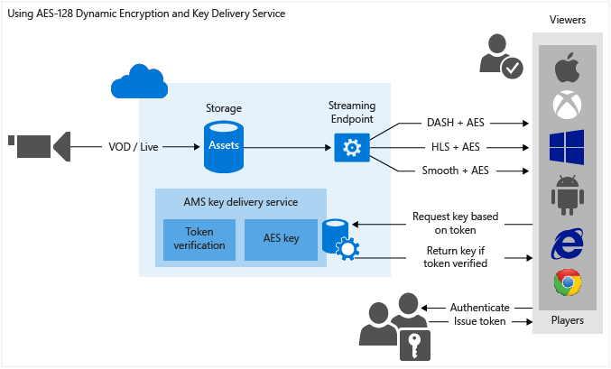

<properties
    pageTitle="Verwendung von AES-128 dynamisches Verschlüsselung und Key Übermittlungsdienst | Microsoft Azure"
    description="Microsoft Azure Media Services können Sie von Inhalten mit AES 128-Bit-Verschlüsselungsschlüssel verschlüsselt vorführen. Media Services bietet auch den Taste Übermittlung-Dienst, der Schlüssel für die Verschlüsselung an autorisierte Benutzer übermittelt. In diesem Thema wird gezeigt, wie dynamisch mit AES-128 verschlüsseln und verwenden Sie den Key Übermittlungsdienst wird."
    services="media-services"
    documentationCenter=""
    authors="Juliako"
    manager="erikre"
    editor=""/>

<tags
    ms.service="media-services"
    ms.workload="media"
    ms.tgt_pltfrm="na"
    ms.devlang="na"
    ms.topic="article" 
    ms.date="10/24/2016"
    ms.author="juliako"/>

#Verwendung von AES-128 dynamisches Verschlüsselung und Key Übermittlungsdienst

> [AZURE.SELECTOR]
- [.NET](media-services-protect-with-aes128.md)
- [Java](https://github.com/southworkscom/azure-sdk-for-media-services-java-samples)
- [PHP](https://github.com/Azure/azure-sdk-for-php/tree/master/examples/MediaServices)

##(Übersicht)

>[AZURE.NOTE] Finden Sie in [diesem](https://channel9.msdn.com/Shows/Azure-Friday/Azure-Media-Services-Protecting-your-Media-Content-with-AES-Encryption) Video erhalten Sie eine Übersicht zum Schützen Ihrer Media-Inhalten mit AES-Verschlüsselung.

Microsoft Azure Media Services können Sie Http-Live-Streaming (HLS) und interpolierten Streams verschlüsselt mit erweiterte Verschlüsselung AES (Standard) (mit 128-Bit-Schlüssel) zu übermitteln. Media Services bietet auch den Taste Übermittlung-Dienst, der Schlüssel für die Verschlüsselung an autorisierte Benutzer übermittelt. Wenn Sie für Media-Dienste zu eine Anlage verschlüsseln möchten, müssen Sie Zuordnen eines Verschlüsselungsschlüssels für die Anlage und auch Autorisierungsrichtlinien für die Taste konfigurieren. Wenn ein Spieler ein Stream anfordert, verwendet Media-Dienste den angegebenen Schlüssel, um dynamisch von Inhalten mit AES-Verschlüsselung verschlüsseln. Entschlüsseln des Streams wird der Player die Taste vom Übermittlungsdienst Key anfordern. Um zu entscheiden, und zwar unabhängig davon, ob der Benutzer berechtigt ist, können Sie die Taste gelangen, wertet der Dienst die Autorisierungsrichtlinien, die Sie für den Schlüssel angegeben haben.

Media Services unterstützt mehrere Methoden für die Authentifizierung von Benutzern, die wichtigsten anzufordern. Die Autorisierungsrichtlinie Inhalt Key konnte eine oder mehrere Autorisierung Einschränkungen haben: Öffnen oder Einschränkung token. Die token eingeschränkte Richtlinie ein Token ausgestellt von einem Secure Token Service (STS) beizufügen. Media Services unterstützt Token in den [Einfachen Web Token](https://msdn.microsoft.com/library/gg185950.aspx#BKMK_2) (SWT) und [JSON Web Token](https://msdn.microsoft.com/library/gg185950.aspx#BKMK_3) (JWT) Format an. Weitere Informationen finden Sie unter [Konfigurieren von Richtlinien für den Inhalt Schlüssel Autorisierung](media-services-protect-with-aes128.md#configure_key_auth_policy).

Um dynamische Verschlüsselung nutzen zu können, müssen Sie eine Anlage verfügen, die eine Reihe von Multi-Bitrate MP4-Dateien oder Multi-Bitrate interpolierten Streaming-Quelldateien enthält. Sie müssen außerdem die Übermittlung Richtlinie für die Anlage (weiter unten in diesem Artikel beschrieben) konfigurieren. Klicken Sie dann wird auf der Grundlage der Formats im streaming URL angegeben, der auf Anforderung Streaming Server stellen Sie sicher, dass der Stream in das Protokoll übermittelt wird, die Sie ausgewählt haben. Daher müssen Sie nur zu speichern und die Dateien in den einzelnen Speicherformat bezahlen und Media-Dienste-Dienst erstellen und die entsprechende Antwort basierend auf einem Client-Anfragen dienen.

In diesem Thema würde für Entwickler hilfreich sein, die auf Applikationen arbeiten, mit dem geschützte Medien vorführen. Das Thema wird gezeigt, wie den Übermittlungsdienst Key mit Autorisierungsrichtlinien so konfigurieren, dass nur autorisierte Clients der Schlüssel für die Verschlüsselung empfangen können. Es wird gezeigt, wie dynamic-Verschlüsselung verwenden.

>[AZURE.NOTE]Zum Verwenden von dynamischen Verschlüsselung, müssen Sie zunächst mindestens eine Skala Einheit (auch bekannt als streaming Unit) abrufen. Weitere Informationen finden Sie unter [So skalieren Media-Dienst](media-services-portal-manage-streaming-endpoints.md).

##AES-128 dynamisches Verschlüsselung und Key Übermittlung Dienst Workflow

Im folgenden werden die allgemeinen Schritte ausführen, die Sie ausführen, wenn Sie Ihre Bestände jederzeit mit AES, mithilfe des Diensts für Media-Dienste Key Übermittlung und auch mithilfe von dynamischen Verschlüsselung Verschlüsseln müssten.

1. [Erstellen Sie eine Anlage und Hochladen von Dateien in der Anlage](media-services-protect-with-aes128.md#create_asset).
1. [Codieren der Anlage, die die Datei die adaptive Bitrate MP4 festgelegten enthält](media-services-protect-with-aes128.md#encode_asset).
1. [Erstellen Sie einen Schlüssel Inhalten und ordnen Sie sie mit der codierten Anlage](media-services-protect-with-aes128.md#create_contentkey). Media-Dienste enthält den Inhalt der Anlage Verschlüsselungsschlüssels.
1. [Der Inhalt des Schlüssels Autorisierungsrichtlinie konfigurieren](media-services-protect-with-aes128.md#configure_key_auth_policy). Die Autorisierungsrichtlinie Inhalt Key muss so konfiguriert, dass von Ihnen und vom Client an den Kunden geliefert werden in der Reihenfolge der Inhalt Key erfüllt werden.
1. [Konfigurieren Sie die Richtlinie Übermittlung für eine Anlage](media-services-protect-with-aes128.md#configure_asset_delivery_policy). Enthält die Konfiguration der Übermittlung Richtlinien: wichtiger Acquisition URL und Initialisierung Vektor (IV) (AES 128 erfordert die gleichen IV angegeben werden, wenn verschlüsseln und entschlüsseln), Übermittlungsprotokoll (z. B. MPEG Gedankenstrich, HLS, Festplatten, interpolierten Streaming oder alle) und den Typ des dynamischen Verschlüsselung (z. B. Briefumschlag oder keine dynamische Verschlüsselung).

Sie können andere Richtlinie für jedes Protokoll, klicken Sie auf der gleichen Objekt anwenden. Beispielsweise könnten Sie PlayReady-Verschlüsselung auf optimierten/Gedankenstrich und AES Umschlag HLS anwenden. Alle Protokolle, die nicht in einer Richtlinie Übermittlung definiert sind (beispielsweise Sie hinzufügen eine einzelne Richtlinie, die nur HLS, wie das Protokoll angibt) von streaming blockiert werden. Eine Ausnahme ist, wenn Sie keine Anlage Übermittlung Richtlinie gar definiert haben. Klicken Sie dann alle Protokolle in löschen zulässig.

1. [Erstellen eines auf-Anforderung Locator](media-services-protect-with-aes128.md#create_locator) akzeptieren, um eine streaming URL abrufen.

Das Thema wird aufgezeigt, [wie eine Clientanwendung einen Schlüssel vom Übermittlungsdienst Key anfordern kann](media-services-protect-with-aes128.md#client_request).

Finden Sie ein vollständiges [Beispiel](media-services-protect-with-aes128.md#example) .NET am Ende des Themas.

Die folgende Abbildung veranschaulicht den oben beschriebenen Workflow an. Hier wird das Token für die Authentifizierung verwendet.

Im weiteren Verlauf dieses Themas enthält ausführliche erläuterungen, Codebeispielen und Links zu Themen, die zeigen, wie Sie die oben beschriebenen Aufgaben zu erzielen.

##Aktuelle Einschränkungen

Wenn Sie hinzufügen oder aktualisieren Ihre Anlage Übermittlung Richtlinie, müssen Sie löschen einen vorhandenen Locator (falls vorhanden) und erstellen einen neuen Locator.

##Erstellen Sie eine Anlage und Hochladen von Dateien in der Anlage

Damit verwalten, codieren und übertragen Sie Ihre Videos, müssen Sie zuerst den Inhalt in Microsoft Azure Media Services hochladen. Sobald hochgeladen wird, werden Ihre Inhalte in der Cloud für die weitere Verarbeitung und streaming sicher gespeichert. 

Ausführliche Informationen finden Sie unter [Hochladen von Dateien in ein Konto Media-Dienste](media-services-dotnet-upload-files.md).

##Codieren der Anlage, mit der die adaptive Bitrate festgelegten MP4-Datei

Mit dynamic-Verschlüsselung, die Sie benötigen lediglich eine Anlage zu erstellen, die eine Reihe von Multi-Bitrate MP4-Dateien oder Multi-Bitrate interpolierten Streaming-Quelldateien enthält. Klicken Sie dann wird basierend auf dem angegebenen Format in der Besprechungsanfrage Manifest oder Fragment, das auf Anforderung Streaming Server stellen Sie sicher, dass Sie den Stream in das Protokoll erhalten, die Sie ausgewählt haben. Daher müssen Sie nur zu speichern und die Dateien in den einzelnen Speicherformat bezahlen und Media-Dienste-Dienst erstellen und die entsprechende Antwort basierend auf einem Client-Anfragen dienen. Weitere Informationen finden Sie unter dem Thema [Dynamische Übersicht über die Verpackung](media-services-dynamic-packaging-overview.md) .

Anweisungen zum Codieren finden Sie unter [So codieren eine Anlage mit Media Encoder Standard](media-services-dotnet-encode-with-media-encoder-standard.md).

##Erstellen Sie einen Schlüssel Inhalten und die codierte Anlage zuordnen

Media-Dienste enthält den Inhalt den Schlüssel, dem Sie eine Anlage mit verschlüsseln möchten.

Ausführliche Informationen finden Sie unter [Erstellen von Key](media-services-dotnet-create-contentkey.md).

##Konfigurieren der Inhalt Schlüssel Autorisierungsrichtlinie

Media Services unterstützt mehrere Methoden für die Authentifizierung von Benutzern, die wichtigsten anzufordern. Die Autorisierungsrichtlinie Inhalt Key muss so konfiguriert ist, indem Sie und vom Client (Player) in der Reihenfolge für die Taste an den Kunden übermittelt werden konnte erfüllt werden. Die Autorisierungsrichtlinie Inhalt Key konnte eine oder mehrere Autorisierung Einschränkungen haben: öffnen, Einschränkung oder IP-Einschränkung token.

Ausführliche Informationen finden Sie unter [Konfigurieren von Key Autorisierungsrichtlinie](media-services-dotnet-configure-content-key-auth-policy.md).

##Konfigurieren der Anlage Übermittlung Richtlinie 

Konfigurieren der Richtlinie Übermittlung für Ihre Anlage. Einige Aktionen, die Konfiguration der Anlage Übermittlung umfasst:

- Die Taste Acquisition-URL. 
- Der Initialisierung Vektor (IV) für die Verschlüsselung der Umschlag verwendet werden soll. AES 128 erfordert die gleichen IV angegeben werden, wenn verschlüsseln und entschlüsseln. 
- Das Objekt Übermittlungsprotokoll (z. B. MPEG Gedankenstrich, HLS, Festplatten, interpolierten Streaming oder alle).
- Den Typ des dynamischen Verschlüsselung (z. B. AES Umschlag) oder keine dynamischen Verschlüsselung. 

Ausführliche Informationen finden Sie unter [Konfigurieren Anlage Übermittlung Richtlinie ](media-services-rest-configure-asset-delivery-policy.md).

##Erstellen eines auf-Anforderung streaming Locator akzeptieren, um eine streaming URL abrufen

Sie müssen Ihre Benutzer das streaming URL für glatt, Gedankenstrich oder HLS zur Verfügung zu stellen.

>[AZURE.NOTE]Wenn Sie hinzufügen oder aktualisieren Ihre Anlage Übermittlung Richtlinie, müssen Sie löschen einen vorhandenen Locator (falls vorhanden) und erstellen einen neuen Locator.

Anweisungen zum Veröffentlichen einer Anlageguts, und erstellen eine streaming-URL finden Sie unter [erstellen eine streaming URL](media-services-deliver-streaming-content.md).

##Erhalten Sie einen Testanruf token

Erhalten Sie einen Testanruf token basierend auf den token Einschränkung, die für die Autorisierungsrichtlinie Key verwendet wurde.

    // Deserializes a string containing an Xml representation of a TokenRestrictionTemplate
    // back into a TokenRestrictionTemplate class instance.
    TokenRestrictionTemplate tokenTemplate = 
        TokenRestrictionTemplateSerializer.Deserialize(tokenTemplateString);
    
    // Generate a test token based on the data in the given TokenRestrictionTemplate.
    //The GenerateTestToken method returns the token without the word “Bearer” in front
    //so you have to add it in front of the token string. 
    string testToken = TokenRestrictionTemplateSerializer.GenerateTestToken(tokenTemplate);
    Console.WriteLine("The authorization token is:\nBearer {0}", testToken);

[AMS-Player](http://amsplayer.azurewebsites.net/azuremediaplayer.html) können Sie um Ihre Stream zu testen.

##Wie kann Ihren Kunden einen Schlüssel vom Übermittlungsdienst Key anfordern?

Im vorherigen Schritt erstellt Sie die URL, die auf eine Manifestdatei verweist. Ihren Kunden muss die erforderlichen Informationen aus der streaming Manifestdateien zu extrahieren, um eine Anforderung an den Übermittlungsdienst Key vornehmen.

###Manifestdateien

Der Client muss, um die URL zu extrahieren (der auch Inhalt Schlüssel Id (für Kinder) enthält) Wert aus der Manifestdatei. Der Client versucht des Verschlüsselungsschlüssels aus dem Key Übermittlungsdienst abrufen. Der Client muss ebenfalls zum Extrahieren der IV Wert und die Verwendung des Streams entschlüsselt werden. Der folgende Ausschnitt zeigt die <Protection> Element des Manifests interpolierten Streaming.

    <Protection>
      <ProtectionHeader SystemID="B47B251A-2409-4B42-958E-08DBAE7B4EE9">
        <ContentProtection xmlns:sea="urn:mpeg:dash:schema:sea:2012" schemeIdUri="urn:mpeg:dash:sea:2012">
          <sea:SegmentEncryption schemeIdUri="urn:mpeg:dash:sea:aes128-cbc:2013"/>
          <sea:KeySystem keySystemUri="urn:mpeg:dash:sea:keysys:http:2013"/>
          <sea:CryptoPeriod IV="0xD7D7D7D7D7D7D7D7D7D7D7D7D7D7D7D7" 
                            keyUriTemplate="https://wamsbayclus001kd-hs.cloudapp.net/HlsHandler.ashx?
                                            kid=da3813af-55e6-48e7-aa9f-a4d6031f7b4d"/>
        </ContentProtection>
      </ProtectionHeader>
    </Protection>

Wenn HLS wird das Quadratwurzel Manifest in Segment Dateien aufgeteilt. 

Das Quadratwurzel Manifest beträgt beispielsweise: http://test001.origin.mediaservices.windows.net/8bfe7d6f-34e3-4d1a-b289-3e48a8762490/BigBuckBunny.ism/manifest(format=m3u8-aapl) und es enthält eine Liste der Dateinamen Segment.
    
    . . . 
    #EXT-X-STREAM-INF:PROGRAM-ID=1,BANDWIDTH=630133,RESOLUTION=424x240,CODECS="avc1.4d4015,mp4a.40.2",AUDIO="audio"
    QualityLevels(514369)/Manifest(video,format=m3u8-aapl)
    #EXT-X-STREAM-INF:PROGRAM-ID=1,BANDWIDTH=965441,RESOLUTION=636x356,CODECS="avc1.4d401e,mp4a.40.2",AUDIO="audio"
    QualityLevels(842459)/Manifest(video,format=m3u8-aapl)
    …

Wenn Sie eine der Segment Dateien im Texteditor öffnen (z. B. http://test001.origin.mediaservices.windows.net/8bfe7d6f-34e3-4d1a-b289-3e48a8762490/BigBuckBunny.ism/QualityLevels (514369)/Manifest(video,format=m3u8-aapl), sollte enthalten #EXT-X-KEY gibt an, dass die Datei verschlüsselt ist.
    
    #EXTM3U
    #EXT-X-VERSION:4
    #EXT-X-ALLOW-CACHE:NO
    #EXT-X-MEDIA-SEQUENCE:0
    #EXT-X-TARGETDURATION:9
    #EXT-X-KEY:METHOD=AES-128,
    URI="https://wamsbayclus001kd-hs.cloudapp.net/HlsHandler.ashx?
         kid=da3813af-55e6-48e7-aa9f-a4d6031f7b4d",
            IV=0XD7D7D7D7D7D7D7D7D7D7D7D7D7D7D7D7
    #EXT-X-PROGRAM-DATE-TIME:1970-01-01T00:00:00.000+00:00
    #EXTINF:8.425708,no-desc
    Fragments(video=0,format=m3u8-aapl)
    #EXT-X-ENDLIST
    
###Anfordern des Schlüssels vom Übermittlungsdienst Key

Im folgende Code wird so senden Sie eine Besprechungsanfrage mit Media Services Key Dienstanbieter, die mit einem Key Übermittlung Uri (die aus dem Manifest extrahiert wurde) und ein Token (in diesem Thema wird nicht dazu, wie Sie einfache Web Token in einem Secure Token Service abrufen sprechen).

    private byte[] GetDeliveryKey(Uri keyDeliveryUri, string token)
    {
        HttpWebRequest request = (HttpWebRequest)WebRequest.Create(keyDeliveryUri);
                
        request.Method = "POST";
        request.ContentType = "text/xml";
        if (!string.IsNullOrEmpty(token))
        {
            request.Headers[AuthorizationHeader] = token;
        }
        request.ContentLength = 0;
    
        var response = request.GetResponse();
     
        var stream = response.GetResponseStream();
        if (stream == null)
        {
            throw new NullReferenceException("Response stream is null");
        }
    
        var buffer = new byte[256];
        var length = 0;
        while (stream.CanRead && length <= buffer.Length)
        {
            var nexByte = stream.ReadByte();
            if (nexByte == -1)
            {
                break;
            }
            buffer[length] = (byte)nexByte;
            length++;
        }
        response.Close();
    
        // AES keys must be exactly 16 bytes (128 bits).
        var key = new byte[length];
        Array.Copy(buffer, key, length);
        return key;
    }
    
##Beispiel

1. Erstellen eines neuen Console-Projekts an.
1. Formular mit NuGet installieren und Azure Media Services .NET SDK Erweiterungen hinzufügen. Installation dieses Pakets, Media Services .NET SDK installiert und alle anderen erforderlichen Abhängigkeiten addiert.
2. Fügen Sie Config-Datei mit den Kontonamen und wichtige Informationen:

    
        <?xml version="1.0" encoding="utf-8"?>
        <configuration>
            <startup> 
                <supportedRuntime version="v4.0" sku=".NETFramework,Version=v4.5" />
            </startup>
              <appSettings>
            
                <add key="MediaServicesAccountName" value="AccountName"/>
                <add key="MediaServicesAccountKey" value="AccountKey"/>
            
                <add key="Issuer" value="http://testacs.com"/>
                <add key="Audience" value="urn:test"/>
              </appSettings>
        </configuration>

1. Überschreiben Sie den Code in der Datei Program.cs mit dem Code in diesem Abschnitt dargestellt.
    
    Vergewissern Sie sich zu aktualisierenden Variablen zu Ordnern zeigen, wo sich Ihre Eingaben Dateien befinden.
            
        
        using System;
        using System.Collections.Generic;
        using System.Configuration;
        using System.IO;
        using System.Linq;
        using System.Net;
        using System.Security.Cryptography;
        using System.Text;
        using System.Threading.Tasks;
        using Microsoft.WindowsAzure.MediaServices.Client;
        using Newtonsoft.Json.Linq;
        using System.Threading;
        using Microsoft.WindowsAzure.MediaServices.Client.ContentKeyAuthorization;
        using Microsoft.WindowsAzure.MediaServices.Client.DynamicEncryption;
        using System.Web;
        using System.Globalization;
        
        namespace AESDynamicEncryptionAndKeyDeliverySvc
        {
            class Program
            {
                // Read values from the App.config file.
                private static readonly string _mediaServicesAccountName =
                    ConfigurationManager.AppSettings["MediaServicesAccountName"];
                private static readonly string _mediaServicesAccountKey =
                    ConfigurationManager.AppSettings["MediaServicesAccountKey"];
        
                // A Uri describing the issuer of the token.  
                // Must match the value in the token for the token to be considered valid.
                private static readonly Uri _sampleIssuer =
                    new Uri(ConfigurationManager.AppSettings["Issuer"]);
                // The Audience or Scope of the token.  
                // Must match the value in the token for the token to be considered valid.
                private static readonly Uri _sampleAudience =
                    new Uri(ConfigurationManager.AppSettings["Audience"]);
        
                // Field for service context.
                private static CloudMediaContext _context = null;
                private static MediaServicesCredentials _cachedCredentials = null;
        
                private static readonly string _mediaFiles =
                    Path.GetFullPath(@"../..\Media");
        
                private static readonly string _singleMP4File =
                    Path.Combine(_mediaFiles, @"BigBuckBunny.mp4");
        
        
                static void Main(string[] args)
                {
                    // Create and cache the Media Services credentials in a static class variable.
                    _cachedCredentials = new MediaServicesCredentials(
                                    _mediaServicesAccountName,
                                    _mediaServicesAccountKey);
                    // Used the chached credentials to create CloudMediaContext.
                    _context = new CloudMediaContext(_cachedCredentials);
        
                    bool tokenRestriction = false;
                    string tokenTemplateString = null;
        
                    IAsset asset = UploadFileAndCreateAsset(_singleMP4File);
                    Console.WriteLine("Uploaded asset: {0}", asset.Id);
        
                    IAsset encodedAsset = EncodeToAdaptiveBitrateMP4Set(asset);
                    Console.WriteLine("Encoded asset: {0}", encodedAsset.Id);
        
                    IContentKey key = CreateEnvelopeTypeContentKey(encodedAsset);
                    Console.WriteLine("Created key {0} for the asset {1} ", key.Id, encodedAsset.Id);
                    Console.WriteLine();
        
                    if (tokenRestriction)
                        tokenTemplateString = AddTokenRestrictedAuthorizationPolicy(key);
                    else
                        AddOpenAuthorizationPolicy(key);
        
                    Console.WriteLine("Added authorization policy: {0}", key.AuthorizationPolicyId);
                    Console.WriteLine();
        
                    CreateAssetDeliveryPolicy(encodedAsset, key);
                    Console.WriteLine("Created asset delivery policy. \n");
                    Console.WriteLine();
        
                    if (tokenRestriction && !String.IsNullOrEmpty(tokenTemplateString))
                    {
                        // Deserializes a string containing an Xml representation of a TokenRestrictionTemplate
                        // back into a TokenRestrictionTemplate class instance.
                        TokenRestrictionTemplate tokenTemplate =
                            TokenRestrictionTemplateSerializer.Deserialize(tokenTemplateString);
        
                        // Generate a test token based on the data in the given TokenRestrictionTemplate.
                        // Note, you need to pass the key id Guid because we specified 
                        // TokenClaim.ContentKeyIdentifierClaim in during the creation of TokenRestrictionTemplate.
                        Guid rawkey = EncryptionUtils.GetKeyIdAsGuid(key.Id);
        
                        //The GenerateTestToken method returns the token without the word “Bearer” in front
                        //so you have to add it in front of the token string. 
                        string testToken = TokenRestrictionTemplateSerializer.GenerateTestToken(tokenTemplate, null, rawkey);
                        Console.WriteLine("The authorization token is:\nBearer {0}", testToken);
                        Console.WriteLine();
                    }
        
                    // You can use the bit.ly/aesplayer Flash player to test the URL 
                    // (with open authorization policy). 
                    // Paste the URL and click the Update button to play the video. 
                    //
                    string URL = GetStreamingOriginLocator(encodedAsset);
                    Console.WriteLine("Smooth Streaming Url: {0}/manifest", URL);
                    Console.WriteLine();
                    Console.WriteLine("HLS Url: {0}/manifest(format=m3u8-aapl)", URL);
                    Console.WriteLine();
        
                    Console.ReadLine();
                }
        
                static public IAsset UploadFileAndCreateAsset(string singleFilePath)
                {
                    if (!File.Exists(singleFilePath))
                    {
                        Console.WriteLine("File does not exist.");
                        return null;
                    }
        
                    var assetName = Path.GetFileNameWithoutExtension(singleFilePath);
                    IAsset inputAsset = _context.Assets.Create(assetName, AssetCreationOptions.StorageEncrypted);
        
                    var assetFile = inputAsset.AssetFiles.Create(Path.GetFileName(singleFilePath));
        
                    Console.WriteLine("Created assetFile {0}", assetFile.Name);
        
                    var policy = _context.AccessPolicies.Create(
                                            assetName,
                                            TimeSpan.FromDays(30),
                                            AccessPermissions.Write | AccessPermissions.List);
        
                    var locator = _context.Locators.CreateLocator(LocatorType.Sas, inputAsset, policy);
        
                    Console.WriteLine("Upload {0}", assetFile.Name);
        
                    assetFile.Upload(singleFilePath);
                    Console.WriteLine("Done uploading {0}", assetFile.Name);
        
                    locator.Delete();
                    policy.Delete();
        
                    return inputAsset;
                }
        
                static public IAsset EncodeToAdaptiveBitrateMP4Set(IAsset asset)
                {
                    // Declare a new job.
                    IJob job = _context.Jobs.Create("Media Encoder Standard Job");
                    // Get a media processor reference, and pass to it the name of the 
                    // processor to use for the specific task.
                    IMediaProcessor processor = GetLatestMediaProcessorByName("Media Encoder Standard");
        
                    // Create a task with the encoding details, using a string preset.
                    // In this case "H264 Multiple Bitrate 720p" preset is used.
                    ITask task = job.Tasks.AddNew("My encoding task",
                        processor,
                        "H264 Multiple Bitrate 720p",
                        TaskOptions.None);
        
                    // Specify the input asset to be encoded.
                    task.InputAssets.Add(asset);
                    // Add an output asset to contain the results of the job. 
                    // This output is specified as AssetCreationOptions.None, which 
                    // means the output asset is not encrypted. 
                    task.OutputAssets.AddNew("Output asset",
                        AssetCreationOptions.StorageEncrypted);
        
                    job.StateChanged += new EventHandler<JobStateChangedEventArgs>(JobStateChanged);
                    job.Submit();
                    job.GetExecutionProgressTask(CancellationToken.None).Wait();
        
                    return job.OutputMediaAssets[0];
                }
        
                private static IMediaProcessor GetLatestMediaProcessorByName(string mediaProcessorName)
                {
                    var processor = _context.MediaProcessors.Where(p => p.Name == mediaProcessorName).
                    ToList().OrderBy(p => new Version(p.Version)).LastOrDefault();
        
                    if (processor == null)
                        throw new ArgumentException(string.Format("Unknown media processor", mediaProcessorName));
        
                    return processor;
                }
        
                static public IContentKey CreateEnvelopeTypeContentKey(IAsset asset)
                {
                    // Create envelope encryption content key
                    Guid keyId = Guid.NewGuid();
                    byte[] contentKey = GetRandomBuffer(16);
        
                    IContentKey key = _context.ContentKeys.Create(
                                            keyId,
                                            contentKey,
                                            "ContentKey",
                                            ContentKeyType.EnvelopeEncryption);
        
                    // Associate the key with the asset.
                    asset.ContentKeys.Add(key);
        
                    return key;
                }
        
                static public void AddOpenAuthorizationPolicy(IContentKey contentKey)
                {
                    // Create ContentKeyAuthorizationPolicy with Open restrictions 
                    // and create authorization policy             
                    IContentKeyAuthorizationPolicy policy = _context.
                                            ContentKeyAuthorizationPolicies.
                                            CreateAsync("Open Authorization Policy").Result;
        
                    List<ContentKeyAuthorizationPolicyRestriction> restrictions =
                        new List<ContentKeyAuthorizationPolicyRestriction>();
        
                    ContentKeyAuthorizationPolicyRestriction restriction =
                        new ContentKeyAuthorizationPolicyRestriction
                        {
                            Name = "HLS Open Authorization Policy",
                            KeyRestrictionType = (int)ContentKeyRestrictionType.Open,
                            Requirements = null // no requirements needed for HLS
                                };
        
                    restrictions.Add(restriction);
        
                    IContentKeyAuthorizationPolicyOption policyOption =
                        _context.ContentKeyAuthorizationPolicyOptions.Create(
                        "policy",
                        ContentKeyDeliveryType.BaselineHttp,
                        restrictions,
                        "");
        
                    policy.Options.Add(policyOption);
        
                    // Add ContentKeyAutorizationPolicy to ContentKey
                    contentKey.AuthorizationPolicyId = policy.Id;
                    IContentKey updatedKey = contentKey.UpdateAsync().Result;
                    Console.WriteLine("Adding Key to Asset: Key ID is " + updatedKey.Id);
                }
        
                public static string AddTokenRestrictedAuthorizationPolicy(IContentKey contentKey)
                {
                    string tokenTemplateString = GenerateTokenRequirements();
        
                    IContentKeyAuthorizationPolicy policy = _context.
                                            ContentKeyAuthorizationPolicies.
                                            CreateAsync("HLS token restricted authorization policy").Result;
        
                    List<ContentKeyAuthorizationPolicyRestriction> restrictions =
                            new List<ContentKeyAuthorizationPolicyRestriction>();
        
                    ContentKeyAuthorizationPolicyRestriction restriction =
                            new ContentKeyAuthorizationPolicyRestriction
                            {
                                Name = "Token Authorization Policy",
                                KeyRestrictionType = (int)ContentKeyRestrictionType.TokenRestricted,
                                Requirements = tokenTemplateString
                            };
        
                    restrictions.Add(restriction);
        
                    //You could have multiple options 
                    IContentKeyAuthorizationPolicyOption policyOption =
                        _context.ContentKeyAuthorizationPolicyOptions.Create(
                            "Token option for HLS",
                            ContentKeyDeliveryType.BaselineHttp,
                            restrictions,
                            null  // no key delivery data is needed for HLS
                            );
        
                    policy.Options.Add(policyOption);
        
                    // Add ContentKeyAutorizationPolicy to ContentKey
                    contentKey.AuthorizationPolicyId = policy.Id;
                    IContentKey updatedKey = contentKey.UpdateAsync().Result;
                    Console.WriteLine("Adding Key to Asset: Key ID is " + updatedKey.Id);
        
                    return tokenTemplateString;
                }
        
                static public void CreateAssetDeliveryPolicy(IAsset asset, IContentKey key)
                {
                    Uri keyAcquisitionUri = key.GetKeyDeliveryUrl(ContentKeyDeliveryType.BaselineHttp);
        
                    string envelopeEncryptionIV = Convert.ToBase64String(GetRandomBuffer(16));
            
                    // When configuring delivery policy, you can choose to associate it
                    // with a key acquisition URL that has a KID appended or
                    // or a key acquisition URL that does not have a KID appended  
                    // in which case a content key can be reused. 

                    // EnvelopeKeyAcquisitionUrl:  contains a key ID in the key URL.
                    // EnvelopeBaseKeyAcquisitionUrl:  the URL does not contains a key ID

                    // The following policy configuration specifies: 
                    // key url that will have KID=<Guid> appended to the envelope and
                    // the Initialization Vector (IV) to use for the envelope encryption.
                    
                    Dictionary<AssetDeliveryPolicyConfigurationKey, string> assetDeliveryPolicyConfiguration =
                        new Dictionary<AssetDeliveryPolicyConfigurationKey, string>
                    {
                                {AssetDeliveryPolicyConfigurationKey.EnvelopeKeyAcquisitionUrl, keyAcquisitionUri.ToString()}
                    };
        
                    IAssetDeliveryPolicy assetDeliveryPolicy =
                        _context.AssetDeliveryPolicies.Create(
                                    "AssetDeliveryPolicy",
                                    AssetDeliveryPolicyType.DynamicEnvelopeEncryption,
                                    AssetDeliveryProtocol.SmoothStreaming | AssetDeliveryProtocol.HLS | AssetDeliveryProtocol.Dash,
                                    assetDeliveryPolicyConfiguration);
        
                    // Add AssetDelivery Policy to the asset
                    asset.DeliveryPolicies.Add(assetDeliveryPolicy);
                    Console.WriteLine();
                    Console.WriteLine("Adding Asset Delivery Policy: " +
                        assetDeliveryPolicy.AssetDeliveryPolicyType);
                }
        
                static public string GetStreamingOriginLocator(IAsset asset)
                {
        
                    // Get a reference to the streaming manifest file from the  
                    // collection of files in the asset. 
        
                    var assetFile = asset.AssetFiles.Where(f => f.Name.ToLower().
                                                EndsWith(".ism")).
                                                FirstOrDefault();
        
                    // Create a 30-day readonly access policy. 
                    // You cannot create a streaming locator using an AccessPolicy that includes write or delete permissions.            
                    IAccessPolicy policy = _context.AccessPolicies.Create("Streaming policy",
                        TimeSpan.FromDays(30),
                        AccessPermissions.Read);
        
                    // Create a locator to the streaming content on an origin. 
                    ILocator originLocator = _context.Locators.CreateLocator(LocatorType.OnDemandOrigin, asset,
                        policy,
                        DateTime.UtcNow.AddMinutes(-5));
        
                    // Create a URL to the manifest file. 
                    return originLocator.Path + assetFile.Name;
                }
        
                static private string GenerateTokenRequirements()
                {
                    TokenRestrictionTemplate template = new TokenRestrictionTemplate(TokenType.SWT);
        
                    template.PrimaryVerificationKey = new SymmetricVerificationKey();
                    template.AlternateVerificationKeys.Add(new SymmetricVerificationKey());
                    template.Audience = _sampleAudience.ToString();
                    template.Issuer = _sampleIssuer.ToString();
        
                    template.RequiredClaims.Add(TokenClaim.ContentKeyIdentifierClaim);
        
                    return TokenRestrictionTemplateSerializer.Serialize(template);
                }
        
                static private void JobStateChanged(object sender, JobStateChangedEventArgs e)
                {
                    Console.WriteLine(string.Format("{0}\n  State: {1}\n  Time: {2}\n\n",
                        ((IJob)sender).Name,
                        e.CurrentState,
                        DateTime.UtcNow.ToString(@"yyyy_M_d__hh_mm_ss")));
                }
        
                static private byte[] GetRandomBuffer(int size)
                {
                    byte[] randomBytes = new byte[size];
                    using (RNGCryptoServiceProvider rng = new RNGCryptoServiceProvider())
                    {
                        rng.GetBytes(randomBytes);
                    }
        
                    return randomBytes;
                }
            }
        }

##Media-Dienste Learning Wege

[AZURE.INCLUDE [media-services-learning-paths-include](../../includes/media-services-learning-paths-include.md)]

##Angeben von feedback

[AZURE.INCLUDE [media-services-user-voice-include](../../includes/media-services-user-voice-include.md)]
