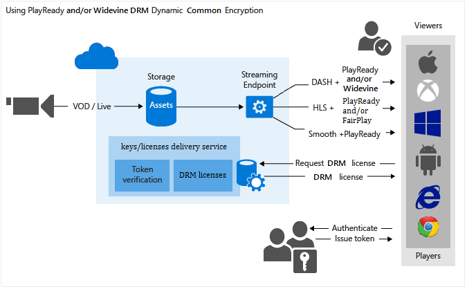

<properties
    pageTitle="Mit PlayReady und/oder Widevine dynamische allgemeine Verschlüsselung | Microsoft Azure"
    description="Microsoft Azure Media Services ermöglicht es Ihnen MPEG-Strich, interpolierten Streaming und Http-Live-Streaming (HLS) Streams mit Microsoft PlayReady DRM geschützt vorführen. Darüber hinaus können Sie auf Übermittlung Gedankenstrich mit Widevine DRM verschlüsselt. In diesem Thema wird gezeigt, wie dynamisch mit PlayReady und Widevine DRM verschlüsseln."
    services="media-services"
    documentationCenter=""
    authors="juliako"
    manager="erikre"
    editor=""/>

<tags
    ms.service="media-services"
    ms.workload="media"
    ms.tgt_pltfrm="na"
    ms.devlang="na"
    ms.topic="get-started-article" 
    ms.date="09/27/2016"
    ms.author="juliako"/>

#Verwenden von PlayReady und/oder Widevine dynamische allgemeine Verschlüsselung

> [AZURE.SELECTOR]
- [.NET](media-services-protect-with-drm.md)
- [Java](https://github.com/southworkscom/azure-sdk-for-media-services-java-samples)
- [PHP](https://github.com/Azure/azure-sdk-for-php/tree/master/examples/MediaServices)

Microsoft Azure Media Services ermöglicht es Ihnen MPEG-Strich, interpolierten Streaming und HTTP-Live-Streaming (HLS) Streams mit [Microsoft PlayReady DRM](https://www.microsoft.com/playready/overview/)geschützt vorführen. Darüber hinaus können Sie verschlüsselte Gedankenstrich Streams mit Widevine DRM Lizenzen vorführen. Sowohl die PlayReady Widevine verschlüsselt sind nach der Spezifikation der allgemeinen Verschlüsselung (ISO/IEC 23001 bis 7 CENC). [AMS.NET SDK](https://www.nuget.org/packages/windowsazure.mediaservices/) (beginnend mit der Version 3.5.1) oder die REST-API können Sie Ihre AssetDeliveryConfiguration zum Verwenden von Widevine konfigurieren.

Media Services bietet einen Zielcomputern PlayReady und Widevine DRM Lizenzen. Media Services enthält zudem APIs Ihnen die Konfiguration der Verwaltung von Informationsrechten und Einschränkungen, die Sie für die Laufzeit PlayReady oder Widevine DRM erzwingen möchten ermöglichen, wenn ein Benutzer wiedergegeben, die Inhalt geschützt. Wenn ein Benutzer einen DRM geschützten Inhalt anfordert, wird die Player-Anwendung eine Lizenz vom Dienst AMS Lizenz anfordern. AMS Lizenzdienst wird eine Lizenz für den Player auszustellen, wenn er berechtigt ist. Eine Lizenz PlayReady oder Widevine enthält die Taste entschlüsseln, die durch den Client-Player zum Entschlüsseln und den Inhalt des Streams verwendet werden kann.

Sie können auch die folgenden AMS Partner verwenden, helfen Sie Lizenzen Widevine vorführen: [Axinom](http://www.axinom.com/press/ibc-axinom-drm-6/), [EZDRM](http://ezdrm.com/), [CastLabs](http://castlabs.com/company/partners/azure/). Weitere Informationen finden Sie unter: Integration mit [Axinom](media-services-axinom-integration.md) und [CastLabs](media-services-castlabs-integration.md).

Media Services unterstützt mehrere Arten von Autorisieren von Benutzern, die wichtigsten anzufordern. Die Autorisierungsrichtlinie Inhalt Key konnte eine oder mehrere Autorisierung Einschränkungen haben: Öffnen oder Einschränkung token. Die token eingeschränkte Richtlinie ein Token ausgestellt von einem Secure Token Service (STS) beizufügen. Media Services unterstützt Token in den [Einfachen Web Token](https://msdn.microsoft.com/library/gg185950.aspx#BKMK_2) (SWT) und [JSON Web Token](https://msdn.microsoft.com/library/gg185950.aspx#BKMK_3) (JWT) Format an. Weitere Informationen finden Sie unter Konfigurieren von Richtlinien für den Inhalt Schlüssel Autorisierung.

Um dynamische Verschlüsselung nutzen zu können, müssen Sie eine Anlage verfügen, die eine Reihe von Multi-Bitrate MP4-Dateien oder Multi-Bitrate interpolierten Streaming-Quelldateien enthält. Sie müssen außerdem die Übermittlung Richtlinien für die Anlage (weiter unten in diesem Artikel beschrieben) konfigurieren. Klicken Sie dann wird auf der Grundlage der Formats im streaming URL angegeben, der auf Anforderung Streaming Server stellen Sie sicher, dass der Stream in das Protokoll übermittelt wird, die Sie ausgewählt haben. Daher müssen Sie nur zu speichern und die Dateien in einer einzelnen Speicherformat bezahlen und Media-Dienste erstellen und die entsprechende HTTP-Antwort basierend auf jede Anforderung von einem Client dienen wird.

In diesem Thema würde für Entwickler hilfreich sein, die auf Applikationen arbeiten, die mit mehreren DRMs, wie etwa PlayReady und Widevine geschützte Medien vorführen. Das Thema wird gezeigt, wie den PlayReady Lizenz Übermittlungsdienst mit Autorisierungsrichtlinien so konfigurieren, dass nur autorisierte Clients PlayReady oder Widevine Lizenzen empfangen können. Es wird gezeigt, wie dynamische Verschlüsselung Verschlüsselung mit PlayReady oder Widevine DRM über einen Gedankenstrich verwenden.

>[AZURE.NOTE]Zum Verwenden von dynamischen Verschlüsselung, müssen Sie zunächst mindestens eine Skala Einheit (auch bekannt als streaming Unit) abrufen. Weitere Informationen finden Sie unter [So skalieren Media-Dienst](media-services-portal-manage-streaming-endpoints.md).

##Beispiel für herunterladen

Sie können das Beispiel in diesem Artikel aus [hier](https://github.com/Azure-Samples/media-services-dotnet-dynamic-encryption-with-drm)beschriebenen herunterladen.

##Konfigurieren von dynamischen allgemeine Verschlüsselung und DRM Lizenz Delivery Services

Im folgenden werden die allgemeinen Schritte ausführen, die Sie ausführen, wenn Sie Ihre Bestände jederzeit mit PlayReady, mithilfe des Diensts für Media-Dienste Lizenz Übermittlung und auch mithilfe von dynamischen Verschlüsselung Schützen von müssten.

1. Erstellen eines Wirtschaftsguts und Hochladen von Dateien in der Anlage.
1. Codieren der Anlage, die die Datei die adaptive Bitrate MP4 festgelegten enthält.
1. Erstellen Sie einen Schlüssel Inhalten und die codierte Anlage zugeordnet wird. Media-Dienste enthält den Inhalt der Anlage Verschlüsselungsschlüssels.
1. Konfigurieren Sie die Inhalte Taste Autorisierungsrichtlinie ein. Die Autorisierungsrichtlinie Inhalt Key muss so konfiguriert, dass von Ihnen und vom Client an den Kunden geliefert werden in der Reihenfolge der Inhalt Key erfüllt werden.

Beim Erstellen der Autorisierungsrichtlinie Inhalt Key müssen Sie Folgendes angeben: Übermittlung Methode (PlayReady oder Widevine), Einschränkungen (Öffnen oder token), und Informationen zu den wichtigsten Übermittlungstyp, die definiert, wie die Taste an den Kunden ([PlayReady](media-services-playready-license-template-overview.md) oder [Widevine](media-services-widevine-license-template-overview.md) Lizenz Vorlage) übermittelt wird.
1. Konfigurieren der Übermittlung Richtlinie für eine Anlage. Enthält die Konfiguration der Übermittlung Richtlinien: Übermittlungsprotokoll (z. B. MPEG Gedankenstrich, HLS, Festplatten, interpolierten Streaming oder alle) und den Typ des dynamischen Verschlüsselung (z. B. allgemeine Verschlüsselung) PlayReady oder Widevine Lizenz Acquisition URL.

Sie können andere Richtlinie für jedes Protokoll, klicken Sie auf der gleichen Objekt anwenden. Beispielsweise könnten Sie PlayReady-Verschlüsselung auf optimierten/Gedankenstrich und AES Umschlag HLS anwenden. Alle Protokolle, die nicht in einer Richtlinie Übermittlung definiert sind (beispielsweise Sie hinzufügen eine einzelne Richtlinie, die nur HLS, wie das Protokoll angibt) von streaming blockiert werden. Eine Ausnahme ist, wenn Sie keine Anlage Übermittlung Richtlinie gar definiert haben. Klicken Sie dann alle Protokolle in löschen zulässig.
1. Erstellen Sie einen Locator auf-Anforderung, um eine streaming URL abrufen.

Finden Sie ein vollständiges .NET Beispiel am Ende des Themas.

Die folgende Abbildung veranschaulicht den oben beschriebenen Workflow an. Hier wird das Token für die Authentifizierung verwendet.

Im weiteren Verlauf dieses Themas enthält ausführliche erläuterungen, Codebeispielen und Links zu Themen, die zeigen, wie Sie die oben beschriebenen Aufgaben zu erzielen.

##Aktuelle Einschränkungen

Wenn Sie hinzufügen oder eine Anlage Übermittlung Richtlinie aktualisieren, müssen Sie löschen den hinzugefügten Locator (falls vorhanden) und erstellen einen neuen Locator.

Einschränkung beim Verschlüsseln mit Widevine mit Azure Media Services: mehrere Inhalt Schlüssel werden derzeit nicht unterstützt.

##Erstellen Sie eine Anlage und Hochladen von Dateien in der Anlage

Damit verwalten, codieren und übertragen Sie Ihre Videos, müssen Sie zuerst den Inhalt in Microsoft Azure Media Services hochladen. Sobald hochgeladen wird, werden Ihre Inhalte in der Cloud für die weitere Verarbeitung und streaming sicher gespeichert.

Ausführliche Informationen finden Sie unter [Hochladen von Dateien in ein Konto Media-Dienste](media-services-dotnet-upload-files.md).

##Codieren der Anlage, mit der die adaptive Bitrate festgelegten MP4-Datei

Mit dynamic-Verschlüsselung, die Sie benötigen lediglich eine Anlage zu erstellen, die eine Reihe von Multi-Bitrate MP4-Dateien oder Multi-Bitrate interpolierten Streaming-Quelldateien enthält. Klicken Sie dann wird basierend auf dem angegebenen Format in der Besprechungsanfrage Manifest und Fragment, der auf Anforderung Streaming Server stellen Sie sicher, dass Sie den Stream in das Protokoll erhalten, die Sie ausgewählt haben. Daher müssen Sie nur zu speichern und die Dateien in den einzelnen Speicherformat bezahlen und Media-Dienste-Dienst erstellen und die entsprechende Antwort basierend auf einem Client-Anfragen dienen. Weitere Informationen finden Sie unter dem Thema [Dynamische Übersicht über die Verpackung](media-services-dynamic-packaging-overview.md) .

Anweisungen zum Codieren finden Sie unter [So codieren eine Anlage mit Media Encoder Standard](media-services-dotnet-encode-with-media-encoder-standard.md).

##Erstellen Sie einen Schlüssel Inhalten und die codierte Anlage zuordnen

Media-Dienste enthält den Inhalt den Schlüssel, dem Sie eine Anlage mit verschlüsseln möchten.

Ausführliche Informationen finden Sie unter [Erstellen von Key](media-services-dotnet-create-contentkey.md).

##Konfigurieren der Inhalt Schlüssel Autorisierungsrichtlinie

Media Services unterstützt mehrere Methoden für die Authentifizierung von Benutzern, die wichtigsten anzufordern. Die Autorisierungsrichtlinie Inhalt Key muss so konfiguriert ist, indem Sie und vom Client (Player) in der Reihenfolge für die Taste an den Kunden übermittelt werden konnte erfüllt werden. Die Autorisierungsrichtlinie Inhalt Key konnte eine oder mehrere Autorisierung Einschränkungen haben: Öffnen oder Einschränkung token.

Ausführliche Informationen finden Sie unter [Konfigurieren von Key Autorisierungsrichtlinie](media-services-dotnet-configure-content-key-auth-policy.md#playready-dynamic-encryption).

##Konfigurieren der Anlage Übermittlung Richtlinie 

Konfigurieren der Richtlinie Übermittlung für Ihre Anlage. Einige Aktionen, die Konfiguration der Anlage Übermittlung umfasst:

- Die DRM-Lizenz Acquisition-URL. 
- Das Objekt Übermittlungsprotokoll (z. B. MPEG Gedankenstrich, HLS, Festplatten, interpolierten Streaming oder alle). 
- Die Art des dynamischen Verschlüsselung (in diesem Fall allgemeine Verschlüsselung). 

Ausführliche Informationen finden Sie unter [Konfigurieren Anlage Übermittlung Richtlinie ](media-services-rest-configure-asset-delivery-policy.md).

##Erstellen eines auf-Anforderung streaming Locator akzeptieren, um eine streaming URL abrufen

Sie müssen Ihre Benutzer das streaming URL für glatt, Gedankenstrich oder HLS zur Verfügung zu stellen.

>[AZURE.NOTE]Wenn Sie hinzufügen oder aktualisieren Ihre Anlage Übermittlung Richtlinie, müssen Sie löschen einen vorhandenen Locator (falls vorhanden) und erstellen einen neuen Locator.

Anweisungen zum Veröffentlichen einer Anlageguts, und erstellen eine streaming-URL finden Sie unter [erstellen eine streaming URL](media-services-deliver-streaming-content.md).

##Erhalten Sie einen Testanruf token

Erhalten Sie einen Testanruf token basierend auf den token Einschränkung, die für die Autorisierungsrichtlinie Key verwendet wurde.

    // Deserializes a string containing an Xml representation of a TokenRestrictionTemplate
    // back into a TokenRestrictionTemplate class instance.
    TokenRestrictionTemplate tokenTemplate = 
        TokenRestrictionTemplateSerializer.Deserialize(tokenTemplateString);
    
    // Generate a test token based on the data in the given TokenRestrictionTemplate.
    //The GenerateTestToken method returns the token without the word “Bearer” in front
    //so you have to add it in front of the token string. 
    string testToken = TokenRestrictionTemplateSerializer.GenerateTestToken(tokenTemplate);
    Console.WriteLine("The authorization token is:\nBearer {0}", testToken);

    
[AMS-Player](http://amsplayer.azurewebsites.net/azuremediaplayer.html) können Sie um Ihre Stream zu testen.

##Beispiel

Im folgende Beispiel wird veranschaulicht, Funktionen, die in Azure Media Services SDK für .net eingeführt wurde-Version 3.5.2 (insbesondere die Möglichkeit, eine Widevine Lizenz Vorlage definieren und Anfordern einer Lizenz Widevine aus Azure Media Services). Mit dem folgende Befehl des Nuget-Paket wurde verwendet, um das Paket zu installieren:

    PM> Install-Package windowsazure.mediaservices -Version 3.5.2

1. Erstellen eines neuen Console-Projekts an.
1. Formular mit NuGet installieren und Azure Media Services .NET SDK hinzufügen.
2. Fügen Sie zusätzliche Verweise: System.Configuration.
2. Fügen Sie Config-Datei mit den Kontonamen und wichtige Informationen:
    
        <?xml version="1.0" encoding="utf-8"?>
        <configuration>
            <startup> 
                <supportedRuntime version="v4.0" sku=".NETFramework,Version=v4.5" />
            </startup>
              <appSettings>
            
                <add key="MediaServicesAccountName" value="AccountName"/>
                <add key="MediaServicesAccountKey" value="AccountKey"/>
            
                <add key="Issuer" value="http://testacs.com"/>
                <add key="Audience" value="urn:test"/>
              </appSettings>
        </configuration>

1. Holen Sie mindestens eine streaming Einheit für den streaming Endpunkt, aus dem Sie bis zur Bereitstellung des Inhalts planen. Weitere Informationen finden Sie unter: [streaming Endpunkte konfigurieren](media-services-dotnet-get-started.md#configure-streaming-endpoint-using-the-portal).

1. Überschreiben Sie den Code in der Datei Program.cs mit dem Code in diesem Abschnitt dargestellt.
    
    Vergewissern Sie sich zu aktualisierenden Variablen zu Ordnern zeigen, wo sich Ihre Eingaben Dateien befinden.
        
        using System;
        using System.Collections.Generic;
        using System.Configuration;
        using System.IO;
        using System.Linq;
        using System.Threading;
        using Microsoft.WindowsAzure.MediaServices.Client;
        using Microsoft.WindowsAzure.MediaServices.Client.ContentKeyAuthorization;
        using Microsoft.WindowsAzure.MediaServices.Client.DynamicEncryption;
        using Microsoft.WindowsAzure.MediaServices.Client.Widevine;
        using Newtonsoft.Json;
        
        namespace DynamicEncryptionWithDRM
        {
            class Program
            {
                // Read values from the App.config file.
                private static readonly string _mediaServicesAccountName =
                    ConfigurationManager.AppSettings["MediaServicesAccountName"];
                private static readonly string _mediaServicesAccountKey =
                    ConfigurationManager.AppSettings["MediaServicesAccountKey"];
        
                private static readonly Uri _sampleIssuer =
                    new Uri(ConfigurationManager.AppSettings["Issuer"]);
                private static readonly Uri _sampleAudience =
                    new Uri(ConfigurationManager.AppSettings["Audience"]);
        
                // Field for service context.
                private static CloudMediaContext _context = null;
                private static MediaServicesCredentials _cachedCredentials = null;
        
                private static readonly string _mediaFiles =
                    Path.GetFullPath(@"../..\Media");
        
                private static readonly string _singleMP4File =
                    Path.Combine(_mediaFiles, @"BigBuckBunny.mp4");
        
                static void Main(string[] args)
                {
                    // Create and cache the Media Services credentials in a static class variable.
                    _cachedCredentials = new MediaServicesCredentials(
                                    _mediaServicesAccountName,
                                    _mediaServicesAccountKey);
                    // Used the cached credentials to create CloudMediaContext.
                    _context = new CloudMediaContext(_cachedCredentials);
        
                    bool tokenRestriction = false;
                    string tokenTemplateString = null;
        
                    IAsset asset = UploadFileAndCreateAsset(_singleMP4File);
                    Console.WriteLine("Uploaded asset: {0}", asset.Id);
        
                    IAsset encodedAsset = EncodeToAdaptiveBitrateMP4Set(asset);
                    Console.WriteLine("Encoded asset: {0}", encodedAsset.Id);
        
                    IContentKey key = CreateCommonTypeContentKey(encodedAsset);
                    Console.WriteLine("Created key {0} for the asset {1} ", key.Id, encodedAsset.Id);
                    Console.WriteLine("PlayReady License Key delivery URL: {0}", key.GetKeyDeliveryUrl(ContentKeyDeliveryType.PlayReadyLicense));
                    Console.WriteLine();
        
                    if (tokenRestriction)
                        tokenTemplateString = AddTokenRestrictedAuthorizationPolicy(key);
                    else
                        AddOpenAuthorizationPolicy(key);
        
                    Console.WriteLine("Added authorization policy: {0}", key.AuthorizationPolicyId);
                    Console.WriteLine();
        
                    CreateAssetDeliveryPolicy(encodedAsset, key);
                    Console.WriteLine("Created asset delivery policy. \n");
                    Console.WriteLine();
        
                    if (tokenRestriction && !String.IsNullOrEmpty(tokenTemplateString))
                    {
                        // Deserializes a string containing an Xml representation of a TokenRestrictionTemplate
                        // back into a TokenRestrictionTemplate class instance.
                        TokenRestrictionTemplate tokenTemplate =
                            TokenRestrictionTemplateSerializer.Deserialize(tokenTemplateString);
        
                        // Generate a test token based on the the data in the given TokenRestrictionTemplate.
                        // Note, you need to pass the key id Guid because we specified 
                        // TokenClaim.ContentKeyIdentifierClaim in during the creation of TokenRestrictionTemplate.
                        Guid rawkey = EncryptionUtils.GetKeyIdAsGuid(key.Id);
                        string testToken = TokenRestrictionTemplateSerializer.GenerateTestToken(tokenTemplate, null, rawkey, 
                                                                                DateTime.UtcNow.AddDays(365));
                        Console.WriteLine("The authorization token is:\nBearer {0}", testToken);
                        Console.WriteLine();
                    }
        
                    // You can use the http://amsplayer.azurewebsites.net/azuremediaplayer.html player to test streams.
                    // Note that DASH works on IE 11 (via PlayReady), Edge (via PlayReady), Chrome (via Widevine).
                     
                    string url = GetStreamingOriginLocator(encodedAsset);
                    Console.WriteLine("Encrypted DASH URL: {0}/manifest(format=mpd-time-csf)", url);
        
                    Console.ReadLine();
                }
        
        
                static public IAsset UploadFileAndCreateAsset(string singleFilePath)
                {
                    if (!File.Exists(singleFilePath))
                    {
                        Console.WriteLine("File does not exist.");
                        return null;
                    }
        
                    var assetName = Path.GetFileNameWithoutExtension(singleFilePath);
                    IAsset inputAsset = _context.Assets.Create(assetName, AssetCreationOptions.None);
        
                    var assetFile = inputAsset.AssetFiles.Create(Path.GetFileName(singleFilePath));
        
                    Console.WriteLine("Created assetFile {0}", assetFile.Name);
        
                    var policy = _context.AccessPolicies.Create(
                                            assetName,
                                            TimeSpan.FromDays(30),
                                            AccessPermissions.Write | AccessPermissions.List);
        
                    var locator = _context.Locators.CreateLocator(LocatorType.Sas, inputAsset, policy);
        
                    Console.WriteLine("Upload {0}", assetFile.Name);
        
                    assetFile.Upload(singleFilePath);
                    Console.WriteLine("Done uploading {0}", assetFile.Name);
        
                    locator.Delete();
                    policy.Delete();
        
                    return inputAsset;
                }
        
                static public IAsset EncodeToAdaptiveBitrateMP4Set(IAsset inputAsset)
                {
                    var encodingPreset = "H264 Multiple Bitrate 720p";
            
                    IJob job = _context.Jobs.Create(String.Format("Encoding into Mp4 {0} to {1}",
                                            inputAsset.Name,
                                            encodingPreset));
            
                    var mediaProcessors =
                        _context.MediaProcessors.Where(p => p.Name.Contains("Media Encoder Standard")).ToList();
            
                    var latestMediaProcessor =
                        mediaProcessors.OrderBy(mp => new Version(mp.Version)).LastOrDefault();
            
                    ITask encodeTask = job.Tasks.AddNew("Encoding", latestMediaProcessor, encodingPreset, TaskOptions.None);
                    encodeTask.InputAssets.Add(inputAsset);
                    encodeTask.OutputAssets.AddNew(String.Format("{0} as {1}", inputAsset.Name, encodingPreset),    AssetCreationOptions.StorageEncrypted);
            
                    job.StateChanged += new EventHandler<JobStateChangedEventArgs>(JobStateChanged);
                    job.Submit();
                    job.GetExecutionProgressTask(CancellationToken.None).Wait();
            
                    return job.OutputMediaAssets[0];
                }
        
        
                static public IContentKey CreateCommonTypeContentKey(IAsset asset)
                {
                    
                    Guid keyId = Guid.NewGuid();
                    byte[] contentKey = GetRandomBuffer(16);
        
                    IContentKey key = _context.ContentKeys.Create(
                                            keyId,
                                            contentKey,
                                            "ContentKey",
                                            ContentKeyType.CommonEncryption);
        
                    // Associate the key with the asset.
                    asset.ContentKeys.Add(key);
        
                    return key;
                }
        
                static public void AddOpenAuthorizationPolicy(IContentKey contentKey)
                {
        
                    // Create ContentKeyAuthorizationPolicy with Open restrictions 
                    // and create authorization policy          
        
                    List<ContentKeyAuthorizationPolicyRestriction> restrictions = new List<ContentKeyAuthorizationPolicyRestriction>
                    {
                        new ContentKeyAuthorizationPolicyRestriction
                        {
                            Name = "Open",
                            KeyRestrictionType = (int)ContentKeyRestrictionType.Open,
                            Requirements = null
                        }
                    };
        
                    // Configure PlayReady and Widevine license templates.
                    string PlayReadyLicenseTemplate = ConfigurePlayReadyLicenseTemplate();
        
                    string WidevineLicenseTemplate = ConfigureWidevineLicenseTemplate();
        
                    IContentKeyAuthorizationPolicyOption PlayReadyPolicy =
                        _context.ContentKeyAuthorizationPolicyOptions.Create("",
                            ContentKeyDeliveryType.PlayReadyLicense,
                                restrictions, PlayReadyLicenseTemplate);
        
                    IContentKeyAuthorizationPolicyOption WidevinePolicy =
                        _context.ContentKeyAuthorizationPolicyOptions.Create("", 
                            ContentKeyDeliveryType.Widevine, 
                            restrictions, WidevineLicenseTemplate);
        
                    IContentKeyAuthorizationPolicy contentKeyAuthorizationPolicy = _context.
                                ContentKeyAuthorizationPolicies.
                                CreateAsync("Deliver Common Content Key with no restrictions").
                                Result;
        
        
                    contentKeyAuthorizationPolicy.Options.Add(PlayReadyPolicy);
                    contentKeyAuthorizationPolicy.Options.Add(WidevinePolicy);
                    // Associate the content key authorization policy with the content key.
                    contentKey.AuthorizationPolicyId = contentKeyAuthorizationPolicy.Id;
                    contentKey = contentKey.UpdateAsync().Result;
                }
        
                public static string AddTokenRestrictedAuthorizationPolicy(IContentKey contentKey)
                {
                    string tokenTemplateString = GenerateTokenRequirements();
        
                    List<ContentKeyAuthorizationPolicyRestriction> restrictions = new List<ContentKeyAuthorizationPolicyRestriction>
                    {
                        new ContentKeyAuthorizationPolicyRestriction
                        {
                            Name = "Token Authorization Policy",
                            KeyRestrictionType = (int)ContentKeyRestrictionType.TokenRestricted,
                            Requirements = tokenTemplateString,
                        }
                    };
        
                    // Configure PlayReady and Widevine license templates.
                    string PlayReadyLicenseTemplate = ConfigurePlayReadyLicenseTemplate();
        
                    string WidevineLicenseTemplate = ConfigureWidevineLicenseTemplate();
        
                    IContentKeyAuthorizationPolicyOption PlayReadyPolicy =
                        _context.ContentKeyAuthorizationPolicyOptions.Create("Token option",
                            ContentKeyDeliveryType.PlayReadyLicense,
                                restrictions, PlayReadyLicenseTemplate);
        
                    IContentKeyAuthorizationPolicyOption WidevinePolicy =
                        _context.ContentKeyAuthorizationPolicyOptions.Create("Token option",
                            ContentKeyDeliveryType.Widevine,
                                restrictions, WidevineLicenseTemplate);
        
                    IContentKeyAuthorizationPolicy contentKeyAuthorizationPolicy = _context.
                                ContentKeyAuthorizationPolicies.
                                CreateAsync("Deliver Common Content Key with token restrictions").
                                Result;
        
                    contentKeyAuthorizationPolicy.Options.Add(PlayReadyPolicy);
                    contentKeyAuthorizationPolicy.Options.Add(WidevinePolicy);
        
                    // Associate the content key authorization policy with the content key
                    contentKey.AuthorizationPolicyId = contentKeyAuthorizationPolicy.Id;
                    contentKey = contentKey.UpdateAsync().Result;
        
                    return tokenTemplateString;
                }
        
                static private string GenerateTokenRequirements()
                {
                    TokenRestrictionTemplate template = new TokenRestrictionTemplate(TokenType.SWT);
        
                    template.PrimaryVerificationKey = new SymmetricVerificationKey();
                    template.AlternateVerificationKeys.Add(new SymmetricVerificationKey());
                    template.Audience = _sampleAudience.ToString();
                    template.Issuer = _sampleIssuer.ToString();
                    template.RequiredClaims.Add(TokenClaim.ContentKeyIdentifierClaim);
        
                    return TokenRestrictionTemplateSerializer.Serialize(template);
                }
        
                static private string ConfigurePlayReadyLicenseTemplate()
                {
                    // The following code configures PlayReady License Template using .NET classes
                    // and returns the XML string.
        
                    //The PlayReadyLicenseResponseTemplate class represents the template for the response sent back to the end user. 
                    //It contains a field for a custom data string between the license server and the application 
                    //(may be useful for custom app logic) as well as a list of one or more license templates.
                    PlayReadyLicenseResponseTemplate responseTemplate = new PlayReadyLicenseResponseTemplate();
        
                    // The PlayReadyLicenseTemplate class represents a license template for creating PlayReady licenses
                    // to be returned to the end users. 
                    //It contains the data on the content key in the license and any rights or restrictions to be 
                    //enforced by the PlayReady DRM runtime when using the content key.
                    PlayReadyLicenseTemplate licenseTemplate = new PlayReadyLicenseTemplate();
                    //Configure whether the license is persistent (saved in persistent storage on the client) 
                    //or non-persistent (only held in memory while the player is using the license).  
                    licenseTemplate.LicenseType = PlayReadyLicenseType.Nonpersistent;
        
                    // AllowTestDevices controls whether test devices can use the license or not.  
                    // If true, the MinimumSecurityLevel property of the license
                    // is set to 150.  If false (the default), the MinimumSecurityLevel property of the license is set to 2000.
                    licenseTemplate.AllowTestDevices = true;
        
                    // You can also configure the Play Right in the PlayReady license by using the PlayReadyPlayRight class. 
                    // It grants the user the ability to playback the content subject to the zero or more restrictions 
                    // configured in the license and on the PlayRight itself (for playback specific policy). 
                    // Much of the policy on the PlayRight has to do with output restrictions 
                    // which control the types of outputs that the content can be played over and 
                    // any restrictions that must be put in place when using a given output.
                    // For example, if the DigitalVideoOnlyContentRestriction is enabled, 
                    //then the DRM runtime will only allow the video to be displayed over digital outputs 
                    //(analog video outputs won’t be allowed to pass the content).
        
                    //IMPORTANT: These types of restrictions can be very powerful but can also affect the consumer experience. 
                    // If the output protections are configured too restrictive, 
                    // the content might be unplayable on some clients. For more information, see the PlayReady Compliance Rules document.
        
                    // For example:
                    //licenseTemplate.PlayRight.AgcAndColorStripeRestriction = new AgcAndColorStripeRestriction(1);
        
                    responseTemplate.LicenseTemplates.Add(licenseTemplate);
        
                    return MediaServicesLicenseTemplateSerializer.Serialize(responseTemplate);
                }
        
        
                private static string ConfigureWidevineLicenseTemplate()
                {
                    var template = new WidevineMessage
                    {
                        allowed_track_types = AllowedTrackTypes.SD_HD,
                        content_key_specs = new[]
                        {
                            new ContentKeySpecs
                            {
                                required_output_protection = new RequiredOutputProtection { hdcp = Hdcp.HDCP_NONE},
                                security_level = 1,
                                track_type = "SD"
                            }
                        },
                        policy_overrides = new
                        {
                            can_play = true,
                            can_persist = true,
                            can_renew = false
                        }
                    };
        
                    string configuration = JsonConvert.SerializeObject(template);
                    return configuration;
                }
        
                static public void CreateAssetDeliveryPolicy(IAsset asset, IContentKey key)
                {
                    // Get the PlayReady license service URL.
                    Uri acquisitionUrl = key.GetKeyDeliveryUrl(ContentKeyDeliveryType.PlayReadyLicense);
                
                    // GetKeyDeliveryUrl for Widevine attaches the KID to the URL.
                    // For example: https://amsaccount1.keydelivery.mediaservices.windows.net/Widevine/?KID=268a6dcb-18c8-4648-8c95-f46429e4927c.  
                    // The WidevineBaseLicenseAcquisitionUrl (used below) also tells Dynamaic Encryption 
                    // to append /? KID =< keyId > to the end of the url when creating the manifest.
                    // As a result Widevine license acquisition URL will have KID appended twice, 
                    // so we need to remove the KID that in the URL when we call GetKeyDeliveryUrl.
            
                    Uri widevineUrl = key.GetKeyDeliveryUrl(ContentKeyDeliveryType.Widevine);
                    UriBuilder uriBuilder = new UriBuilder(widevineUrl);
                    uriBuilder.Query = String.Empty;
                    widevineUrl = uriBuilder.Uri;
        
                    Dictionary<AssetDeliveryPolicyConfigurationKey, string> assetDeliveryPolicyConfiguration =
                        new Dictionary<AssetDeliveryPolicyConfigurationKey, string>
                        {
                            {AssetDeliveryPolicyConfigurationKey.PlayReadyLicenseAcquisitionUrl, acquisitionUrl.ToString()},
                            {AssetDeliveryPolicyConfigurationKey.WidevineBaseLicenseAcquisitionUrl, widevineUrl.ToString()}
        
                        };
        
                    // In this case we only specify Dash streaming protocol in the delivery policy,
                    // All other protocols will be blocked from streaming.
                    var assetDeliveryPolicy = _context.AssetDeliveryPolicies.Create(
                            "AssetDeliveryPolicy",
                        AssetDeliveryPolicyType.DynamicCommonEncryption,
                        AssetDeliveryProtocol.Dash,
                        assetDeliveryPolicyConfiguration);
        
        
                    // Add AssetDelivery Policy to the asset
                    asset.DeliveryPolicies.Add(assetDeliveryPolicy);
        
                }
        
                /// 

                /// Gets the streaming origin locator.
                /// 

                /// <param name="assets"></param>
                /// <returns></returns>
                static public string GetStreamingOriginLocator(IAsset asset)
                {
        
                    // Get a reference to the streaming manifest file from the  
                    // collection of files in the asset. 
        
                    var assetFile = asset.AssetFiles.Where(f => f.Name.ToLower().
                                                 EndsWith(".ism")).
                                                 FirstOrDefault();
        
                    // Create a 30-day readonly access policy. 
                    IAccessPolicy policy = _context.AccessPolicies.Create("Streaming policy",
                        TimeSpan.FromDays(30),
                        AccessPermissions.Read);
        
                    // Create a locator to the streaming content on an origin. 
                    ILocator originLocator = _context.Locators.CreateLocator(LocatorType.OnDemandOrigin, asset,
                        policy,
                        DateTime.UtcNow.AddMinutes(-5));
        
                    // Create a URL to the manifest file. 
                    return originLocator.Path + assetFile.Name;
                }
        
                static private void JobStateChanged(object sender, JobStateChangedEventArgs e)
                {
                    Console.WriteLine(string.Format("{0}\n  State: {1}\n  Time: {2}\n\n",
                        ((IJob)sender).Name,
                        e.CurrentState,
                        DateTime.UtcNow.ToString(@"yyyy_M_d__hh_mm_ss")));
                }
        
                static private byte[] GetRandomBuffer(int length)
                {
                    var returnValue = new byte[length];
        
                    using (var rng =
                        new System.Security.Cryptography.RNGCryptoServiceProvider())
                    {
                        rng.GetBytes(returnValue);
                    }
        
                    return returnValue;
                }
            }
        }

## Als Nächstes

Überprüfen Sie die Pfade learning Media-Dienste.

[AZURE.INCLUDE [media-services-learning-paths-include](../../includes/media-services-learning-paths-include.md)]

##Angeben von feedback

[AZURE.INCLUDE [media-services-user-voice-include](../../includes/media-services-user-voice-include.md)]

##Siehe auch

[CENC mit Multi-DRM und Access-Steuerelement](media-services-cenc-with-multidrm-access-control.md)

[Konfigurieren von Widevine Verpackung mit AMS](http://mingfeiy.com/how-to-configure-widevine-packaging-with-azure-media-services)

[Ankündigung von Google Widevine Lizenz Übermittlung Dienste in Azure Media Services](https://azure.microsoft.com/blog/announcing-general-availability-of-google-widevine-license-services/)
