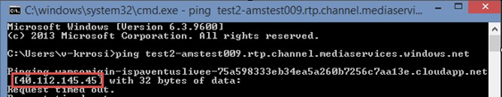

<properties 
    pageTitle="Problembehandlung Leitfaden für live streaming | Microsoft Azure" 
    description="Dieses Thema bietet Vorschläge zum live streaming Probleme zu beheben." 
    services="media-services" 
    documentationCenter="" 
    authors="juliako" 
    manager="erikre" 
    editor=""/>

<tags 
    ms.service="media-services" 
    ms.workload="media" 
    ms.tgt_pltfrm="na" 
    ms.devlang="na" 
    ms.topic="article" 
    ms.date="10/12/2016"  
    ms.author="juliako"/>

#Problembehandlungsleitfadens für live streaming

In diesem Thema wird Vorschläge, wie Sie einige live streaming Problembehandlung.

## Probleme bei der lokalen Encoder 

Dieser Abschnitt enthält Vorschläge zum Beheben von Problemen im Zusammenhang mit lokalen Encoder, die konfiguriert werden, um einen einzelnen Bitrate Stream an AMS Kanäle zu senden, die für die live-Codierung aktiviert sind.

###Problem: Möchte Protokolle finden Sie unter 

- **Mögliches Problem**: nicht suchen Encoder protokolliert, die möglicherweise bei der Debuggen Probleme.
    
    - **Telestream Wirecast**: finden Sie in der Regel Protokolle unter C:\Users\{Username} \AppData\Roaming\Wirecast\ 
    - **Elementares Live**: finden Sie Links zu Protokolle Verwaltungsportal hat. Klicken Sie auf **Stats**, und klicken Sie dann auf **Protokolle**. Klicken Sie auf der Seite **Protokolldateien** sehen Sie eine Liste der Protokolle für alle LiveEvent Elemente. Wählen Sie aus der passenden Ihre aktuellen Sitzung. 
    - **Live Media-Encoder Flash**: finden Sie **Log Directory...** durch Navigieren zur Registerkarte **Codierung Protokoll** .
    
###Problem: Es gibt keine Option zum schrittweisen Stream ausgeben

- **Mögliches Problem**: der Beantwortung Encoder nicht automatisch zusammenfügen. 

    **Schritte zur Problembehandlung**: Suchen Sie nach einer Deinterlacing Option innerhalb der Benutzeroberfläche Encoder. Nachdem Deinterlacing aktiviert ist, überprüfen Sie erneut auf die schrittweisen ausgabeeinstellungen. 
 
###Problem: Versucht, mehrere Encoder ausgabeeinstellungen und immer noch keine Verbindung herstellen. 

- **Mögliches Problem**: Azure Codierung Kanal wurde nicht richtig zurückgesetzt. 

    **Schritte zur Problembehandlung**: Stellen Sie sicher, dass der Encoder nicht mehr an AMS drücken, beenden und den Kanal zurücksetzen. Sobald erneut ausgeführt wird, versuchen Sie, die Ihre Encoder mit den neuen Einstellungen. Wenn dies das Problem dennoch nicht behoben wird, versuchen Sie, erstellen einen neuen Kanal vollständig, manchmal Kanäle können beschädigt werden nach mehreren Versuche fehlgeschlagen.  

- **Mögliches Problem**: der GOP-Größe oder Key Frame Einstellungen sind nicht optimal. 

    **Schritte zur Problembehandlung**: GOP empfohlen den Schriftgrad oder die Keyframe Intervall beträgt 2 Sekunden. Einige Encoder berechnen dieser Einstellung in Anzahl der Rahmen, während andere Sekunden verwenden. Beispiel: bei der Ausgabe von 30 Frames/s GOP-Größe wäre 60 Frames die 2 Sekunden entspricht.  
     
- **Mögliches Problem**: geschlossenen Ports Streams blockiert werden. 

    **Schritte zur Problembehandlung**: beim Streamen über RTMP, aktivieren Sie die Firewall und/oder Proxyeinstellungen Einstellungen, um zu bestätigen, dass ausgehende Ports 1935 und 1936 geöffnet sind. Beim Verwenden von RTP streaming, bestätigen Sie, dass ausgehender Port 2010 geöffnet ist. 

###Problem: Beim Konfigurieren des Encoders Stream mit dem RTP-Protokoll besteht keine Möglichkeit, einen Hostnamen eingeben. 

- **Mögliches Problem**: viele RTP Encoder lassen keine für Hostnamen und eine IP-Adresse erworben werden müssen.  

    **Schritte zur Problembehandlung**: um die IP-Adresse zu finden, öffnen Sie ein Eingabeaufforderungsfenster auf jedem Computer. Dazu unter Windows, öffnen Sie das Startprogramm für ausführen (Gewinn + R) und "Start" zu öffnen.  

    Sobald die Befehlszeile geöffnet ist, geben Sie "Ping [AMS Host Name]" ein. 

    Der Hostname kann durch die Port-Nummer aus dem Azure Aufnahme URL, wie im folgenden Beispiel hervorgehoben auslassen abgeleitet werden: 

    RTP://Test2-amstest009.RTP.Channel.mediaservices.Windows.NET:2010 / 

    

###Problem: Nicht Wiedergabe veröffentlichten Streams.
 
- **Mögliches Problem**: Es ist kein Streaming Endpunkt ausgeführt, oder es ist keine streaming Einheiten (Maßstab Einheiten) zugewiesen. 

    **Schritte zur Problembehandlung**: Navigieren Sie zur Registerkarte "Streaming Endpunkt" im Tool AMSE und bestätigt einen Streaming Endpunkt für eine streaming Einheit ausgeführt wird. 
    

>[AZURE.NOTE] Wenn nach dem befolgen die Schritte zur Problembehandlung, die Sie weiterhin erfolgreich übertragen können, übermitteln Sie eine Support-Ticket über das Azure-Portal.

##Media-Dienste Learning Wege

[AZURE.INCLUDE [media-services-learning-paths-include](../../includes/media-services-learning-paths-include.md)]

##Angeben von feedback

[AZURE.INCLUDE [media-services-user-voice-include](../../includes/media-services-user-voice-include.md)]
