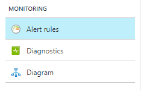

<properties
    pageTitle="Verwenden Sie zum Erstellen von Benachrichtigungen für Azure Services Azure-Portal | Microsoft Azure"
    description="Verwenden Sie das Azure-Portal Azure Benachrichtigungen erstellen, die Benachrichtigungen oder Automatisierung auslösen können, wenn die angegebenen Bedingungen erfüllt sind."
    authors="rboucher"
    manager="carolz"
    editor=""
    services="monitoring-and-diagnostics"
    documentationCenter="monitoring-and-diagnostics"/>

<tags
    ms.service="monitoring-and-diagnostics"
    ms.workload="na"
    ms.tgt_pltfrm="na"
    ms.devlang="na"
    ms.topic="article"
    ms.date="09/23/2016"
    ms.author="robb"/>

# Verwenden Sie zum Erstellen von Benachrichtigungen für Azure Services Azure-portal

> [AZURE.SELECTOR]
- [Portal](insights-alerts-portal.md)
- [PowerShell](insights-alerts-powershell.md)
- [CLI](insights-alerts-command-line-interface.md)

## (Übersicht)

In diesem Artikel wird gezeigt, wie Sie Azure Benachrichtigungen über das Azure-Portal einrichten werden kann.   

Sie können eine Benachrichtigung basierend auf Überwachung Kennzahlen zur oder Ereignisse auf Ihre Azure-Dienste erhalten.

- **Metrische Werte** - der Warnung wird ausgelöst, wenn der Wert einer angegebenen Metrik einen Schwellenwert überschreitet, die, den Sie in eine beliebige Richtung zuweisen. D. h., löst beide Wenn zuerst die Bedingung erfüllt ist, und klicken Sie dann später an, die Bedingung ist nicht mehr erfüllt.    
- **Aktivität protokollieren von Ereignissen** – auf *jedes* Ereignis oder, nur, wenn eine bestimmte Anzahl von Ereignissen auftreten, kann eine Benachrichtigung auslösen.

Sie können eine Benachrichtigung, wenn Sie die folgenden Schritte ausführen, wenn es auslöst konfigurieren:

- Senden von e-Mail-Benachrichtigungen an die Dienstadministrator und Co-Administratoren
- Senden Sie e-Mail, um zusätzliche e-Mails, die Sie angeben.
- Anrufen eines webhook
- Starten der Ausführung einer Azure Runbooks (nur vom Azure-Portal)

Sie konfigurieren können, und erhalten Informationen zum Verwenden von Warnungsregeln

- [Azure-portal](insights-alerts-portal.md)
- [PowerShell](insights-alerts-powershell.md)
- [line Interface (CLI)](insights-alerts-command-line-interface.md)
- [Azure Monitor REST-API](https://msdn.microsoft.com/library/azure/dn931945.aspx)

## Erstellen Sie eine Regel auf einer Metrik mit Azure-portal

1. Suchen Sie im [Portal](https://portal.azure.com/)der Ressource, die Sie für die Überwachung interessiert sind, und wählen Sie ihn aus.

2. Wählen Sie unter dem Abschnitt Überwachung **Benachrichtigungen** oder **Warnungsregeln** aus. Der Text und Symbol können für verschiedene Ressourcen variieren.  

    

3. Wählen Sie des Befehls **Benachrichtigung hinzufügen aus** , und füllen Sie die Felder aus.

    

4. **Name** der Benachrichtigung Regel, und wählen Sie eine **Beschreibung**, die auch in der Benachrichtigung e-Mails anzeigt.
5. Wählen Sie die **Metrik** überwachen, und klicken Sie dann einen Wert **Bedingung** und **Schwellenwert** für die Metrik auswählen möchten. Ausgewählten auch den **Zeitraum** , die die metrische Regel muss, bevor Sie die Benachrichtigung Trigger erfüllt werden aus. Wenn Sie den Zeitraum "PT5M" verwenden und Ihre Benachrichtigung nach CPU mehr als 80 sucht %, löst die Warnung also beispielsweise wenn sich die CPU konsistente oben 80 % 5 Minuten. Nachdem der erste Trigger auftritt, löst es erneut, wenn die CPU weniger als 80 % 5 Minuten bleibt. Die CPU-Maßeinheiten tritt jede Minute.   

6. Aktivieren Sie **e-Mail-Besitzer...** Bedarf Administratoren und Co-Administratoren per e-Mail gesendet werden, wenn die Benachrichtigung ausgelöst wird.

7. Wenn Sie möchten weitere e-Mails eine Benachrichtigung erhalten, wenn die Warnung ausgelöst wird, fügen sie im Feld **zusätzliche Administrator Email(s)** hinzu. Trennen Sie mehrere e-Mails durch Semikolons-*email@contoso.com;email2@contoso.com*

8. Setzen Sie in einen gültigen URI in das Feld " **Webhook** ", wenn Sie möchten, dass sie aufgerufen, wenn die Warnung wird ausgelöst.

9. Wenn Sie die Automatisierung Azure verwenden, können Sie eine Runbooks ausgeführt werden soll, wenn die Warnung wird ausgelöst, auswählen.

10. Wählen Sie **OK** anschließend die Benachrichtigung zu erstellen.   

Innerhalb weniger Minuten die Benachrichtigung aktiv ist und wie zuvor beschrieben auslöst.

## Die Benachrichtigungen verwalten

Nachdem Sie eine Benachrichtigung erstellt haben, können Sie es auswählen und:

- Anzeigen eines Diagramms mit den oberen Schwellenwert der metrischen und der tatsächlichen Werte aus den vorherigen Tag.
- Bearbeiten Sie oder löschen Sie ihn.
- **Deaktivieren** oder **Aktivieren** sie Zweck vorübergehend zu beenden oder einen Lebenslauf Empfang von Benachrichtigungen für die Benachrichtigung.

## Nächste Schritte

* [Eine Übersicht über die Überwachung Azure](monitoring-overview.md) , einschließlich der Arten von Informationen können Sie sammeln und überwachen.
* Weitere Informationen zum [Konfigurieren von Webhooks Benachrichtigungen](insights-webhooks-alerts.md).
* Weitere Informationen zu [Azure Automatisierung Runbooks](..\automation\automation-starting-a-runbook.md).
* Erhalten Sie einen [Überblick über die Diagnoseprotokolle](monitoring-overview-of-diagnostic-logs.md) und Sammeln Sie detaillierte häufig auftretenden Kennzahlen auf Ihrem Dienst.
* Erhalten Sie einen [Überblick Kennzahlen Websitesammlung](insights-how-to-customize-monitoring.md) , um sicherzustellen, dass Ihr Dienst reagiert und verfügbar ist.
