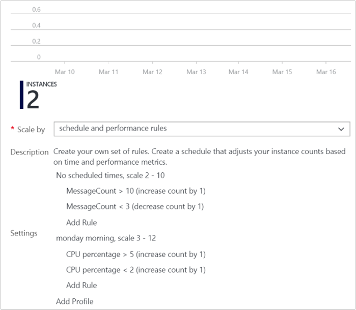

<properties
    pageTitle="Bewährte Methoden für die Azure Monitor automatische Skalierung. | Microsoft Azure"
    description="Erfahren Sie, Grundsätze, um effektiv automatische Skalierung in Azure Monitor verwenden."
    authors="kamathashwin"
    manager="carolz"
    editor=""
    services="monitoring-and-diagnostics"
    documentationCenter="monitoring-and-diagnostics"/>

<tags
    ms.service="monitoring-and-diagnostics"
    ms.workload="na"
    ms.tgt_pltfrm="na"
    ms.devlang="na"
    ms.topic="article"
    ms.date="10/20/2016"
    ms.author="ashwink"/>

# Bewährte Methoden für die Azure Monitor automatische Skalierung

In den folgenden Abschnitten in diesem Dokument können Sie bewährte Methoden für automatisch skalieren in Azure zu verstehen. Überprüfen Sie diese Informationen, werden Sie besser effektiv automatisch skalieren in Ihrer Azure Infrastruktur verwenden können.

## Automatisch skalieren Konzepte

- Eine Ressource kann nur *eine* automatisch skalieren Einstellung haben.
- Eine Einstellung automatisch skalieren kann eine oder mehrere Profile und jedes Profil können eine oder mehrere automatisch skalieren Regeln haben.
- Eine Einstellung automatisch skalieren skaliert Instanzen horizontal, welche durch Erhöhen der Instanzen und *in* die Anzahl der Instanzen verringern, indem Sie *sich* ist.
 Eine automatisch skalieren-Einstellung hat eine Maximum, Minimum und Standardwert der Instanzen.
- Eine Position automatisch skalieren liest immer die zugeordnete Metrik nach Skalieren wird überprüft, ob es der konfigurierten Schwellenwert für Skalierung oder Skala in überschritten hat. Sie können hier wird eine Liste der Kennzahlen diese automatisch skalieren durch bei [Azure Monitor automatische Skalierung allgemeine Kennzahlen](insights-autoscale-common-metrics.md)skalieren kann.
- Eine Ebene Instanz werden alle Schwellenwerte berechnet. Beispielsweise "skalieren, indem Sie 1 Instanz Wenn durchschnittliche CPU > 80 %, wenn die Anzahl der Instanzen 2 ist", bedeutet Skalierung aus, wenn die durchschnittliche CPU über alle Instanzen als 80 % ist.
- Sie erhalten immer Benachrichtigungen über Uploadfehler per e-Mail. Insbesondere erhalten die Besitzer, Mitwirkender und Leser der Zielressource-e-Mail. Erhalten Sie auch immer eine *Wiederherstellung* e-Mail automatisch skalieren nach einem Fehler wiederhergestellt, und startet normal zu funktionieren.
- Sie können Teilnahme zum erfolgreichen Maßstab Aktion per e-Mail und Webhooks aufzunehmen.

## Bewährte Methoden automatisch skalieren

Verwenden Sie die folgenden bewährten Methoden, wie Sie automatisch skalieren verwenden.

### Sicherstellen, dass die maximalen und minimalen Werte unterscheiden und zwischen ihnen eine ausreichend Abstand haben
Wenn Sie eine Einstellung vorhanden ist, Minimum = 2, maximale = 2 und der aktuellen Instanz Count gleich 2, keine Maßnahme Maßstab auftreten kann. Beibehalten eines ausreichend Rands zwischen den maximalen und minimalen Instanz zählt, die inklusive sind. Automatisch skalieren skaliert immer zwischen diese Grenzwerte.

### Manuelle Skalierung wird durch automatisch skalieren min und Max zurückgesetzt.
Wenn Sie die Anzahl der Instanzen auf einen Wert Ober- oder unterhalb der Höchstwert manuell aktualisieren, skaliert automatisch skalieren-Engine automatisch wieder in das Minimum (sofern unterhalb) oder das Maximum (sofern oben). Angenommen, legen Sie den Bereich zwischen 3 und 6. Wenn Sie eine Instanz ausgeführte haben, wird automatisch skalieren-Engine auf 3 Instanzen bei seiner nächsten Ausführung skaliert. Ebenso es würde Maßstab Add-in 8 Instanzen zurück zu 6 bei seiner nächsten Ausführung.  Manuelle Skalierung ist sehr temporär, es sei denn, Sie auch die automatisch skalieren Regeln zurücksetzen.

### Immer verwenden Sie eine Regelkombination von Skalierung und Maßstab in einer, die eine vergrößern und verkleinern ausführt
Wenn Sie nur einen Teil der Kombination verwenden, wird automatisch skalieren Maßstab-in, das einzelne heraus oder in, bis das Maximum oder Minimum, erreicht.

### Wechseln Sie beim Verwalten von automatisch skalieren nicht zwischen Azure-Portal und dem klassischen Azure-portal
Verwenden Sie für Cloud Services und App-Dienste (Web Apps) das Azure-Portal (portal.azure.com) erstellen und Verwalten von Einstellungen automatisch skalieren aus. Verwenden Sie für virtuellen Computern skalieren Mengen PoSH, CLI oder REST-API erstellen und Verwalten von Einstellung automatisch skalieren ein. Nicht wechseln Sie zwischen dem Azure klassischen Portal (manage.windowsazure.com) und dem Azure-Portal (portal.azure.com) beim Skalieren Konfigurationen verwalten. Das Azure klassischen Portal und deren zugrunde liegenden Back-End-gelten Einschränkungen. Verschieben Sie Azure-Portal automatisch Skalieren mithilfe einer Benutzeroberfläche verwalten. Die Optionen sind, die automatisch skalieren PowerShell, CLI oder REST-API (über Azure Ressource Explorer) verwenden.

### Wählen Sie die entsprechende Statistik für Ihre Diagnose Metrisch
Für Diagnose Kennzahlen können Sie zwischen den *Mittelwert*, *Minimum*, *Maximum* und *Total* als Metrik auswählen, indem Sie zu skalieren. Die am häufigsten verwendete Statistik ist *Mittelwert*.

### Wählen Sie die Schwellenwerte für alle metrischen Typen sorgfältig aus.
Es empfiehlt sich, verschiedene Schwellenwerte für die Skalierung und Maßstab Add-in basierend auf praktische Situationen sorgfältige Auswahl.

Wir *empfehlen nicht* automatisch skalieren Einstellungen wie in den Beispielen unter mit den gleichen oder ähnelt dem Schwellenwerten für aus- und Bedingungen:

- Erhöhen der Instanzen von 1 zählen wann Thread Count < = 600
- Verkleinern der Instanzen von 1 zählen wann Thread Count > = 600

Sehen wir uns ein Beispiel für was zu einem Verhalten führen können, die möglicherweise etwas verwirrend wirken. Cosider der folgenden Reihenfolge.

1. Nehmen Sie an, es zunächst gibt 2 Instanzen und dann die durchschnittliche Anzahl von Threads pro Instanz wächst auf 625.
2. Automatisch skalieren skaliert, eine 3rd Instanz hinzufügen.
3. Als Nächstes wird davon ausgegangen Sie, dass die Threadanzahl der Mittelwert über Instanz zu 575 fällt.
4. Vor der Skalierung nach unten, werden automatisch skalieren versucht, welche den endgültigen Zustand zu schätzen, wenn es in skaliert. Beispiel: 575 x 3 (Anzahl der aktuellen Instanzen) = 1,725 / 2 (endgültige Anzahl der Instanzen bei der Skalierung nach unten) = 862.5 Threads. Dies bedeutet, dass automatisch skalieren müssten sofort erneut Skalierung sogar nachdem es, wenn die Threadanzahl der Mittelwert unverändert bleibt oder sogar nur wenige liegt skaliert. Jedoch wenn es nach oben erneut, um den gesamten Prozess skaliert würde wiederholen führenden zu einer Endlosschleife.
5. Um dies ("Flügelschlagen" bezeichnet) zu vermeiden, wird automatisch skalieren nicht gar abwärts skalieren. Stattdessen überspringt und Suchpfad die Bedingung erneut das nächste Mal, das Position des Diensts ausgeführt wird. Dies kann viele Personen verwechselt werden, da automatisch skalieren würde nicht funktionieren werden, wenn die Threadanzahl der Mittelwert 575 wurde.

Abschätzung während einer Skala in soll "flappy" Situationen zu vermeiden. Beachten Sie beim auswählen die gleichen Schwellenwerte für Skalierung und in, sollten Sie dieses Verhalten behalten.

Es empfiehlt sich, eine ausreichend Rand zwischen der Skalierung und Schwellenwerte auswählen. Erwägen Sie beispielsweise die folgende bessere Regelkombination aus.

- Erhöhen der Instanzen von 1 zählen wann CPU% > = 80
- Verkleinern der Instanzen von 1 zählen wann CPU% < = 60

In diesem Fall  

1. Wird davon ausgegangen Sie, dass es 2 Instanzen zunächst sind.
2. Wenn die durchschnittliche CPU mehrerer Instanzen erstellen auf 80 geht, skaliert automatisch skalieren, eine dritte Instanz hinzufügen.
3. Jetzt wird davon ausgegangen Sie, dass über einen Zeitraum CPU (%) in 60 fällt.
4. Automatisch Skalieren des Maßstab in Regel schätzt den endgültigen Zustand wäre es zu skalieren in. Beispiel: 60 x 3 (Anzahl der aktuellen Instanzen) = 180 / 2 (endgültige Anzahl der Instanzen beim Skalieren unten) = 90. Damit automatisch skalieren nicht skalieren-in, da werden müssten erneut sofort Skalierung. In diesem Fall überspringt es Skalierung nach unten.
5. Das nächste Mal automatisch skalieren überprüft die CPU weiterhin auf 50 liegen. Schätzt er erneut - Instanz 50 x 3 = 150 / 2 Instanzen = 75, also Skalierung liegt der 80; damit es in erfolgreich auf 2 Instanzen skaliert.

### Überlegungen für die Skalierung Schwellenwerte für spezielle Kennzahlen
 Für spezielle Kennzahlen wie Speicher oder Service Bus Warteschlange Länge Metrisch ist der Schwellenwert für die durchschnittliche Anzahl von Nachrichten pro aktuelle Anzahl der Instanzen verfügbar. Wählen Sie sorgfältig aus, wählen Sie den Schwellenwert für diese Metrik.

Lassen Sie uns veranschaulichen sie anhand eines Beispiels aus, um sicherzustellen, dass Sie das Verhalten besser verstehen.

- Instanzen erhöhen, indem Sie 1 zählen beim Speicherwarteschlange Nachricht zählen > = 50
- Instanzen von 1 zählen verkleinern, wenn Speicherwarteschlange Nachricht zählen < = 10

Beachten Sie die folgende Schritte aus:

1. Es gibt 2 Speicher Warteschlange Instanzen aus.
2. Nachrichten beibehalten stammen, und beim Überprüfen der Speicherwarteschlange liest die Gesamtzahl 50. Sie könnten annehmen, dass diese automatisch skalieren eine Aktion Skalierung beginnen soll. Beachten Sie, dass es immer noch 50/2 ist jedoch = 25 Nachrichten pro Instanz. Ja, tritt die Skalierung nicht. Für die ersten Skalierung auftritt sollte die Anzahl der Gesamtgröße von Nachrichten in der Speicherwarteschlange 100 sein.
3. Als Nächstes wird davon ausgegangen Sie, dass die Gesamtgröße von Nachrichten zählen 100 erreicht.
4. Eine 3rd Speicher Warteschlange-Instanz ist aufgrund einer Aktion Skalierung hinzugefügt.  Die nächste Skalierung Aktion tritt nicht, bis die Anzahl der Gesamtgröße von Nachrichten in der Warteschlange 150 erreicht, da 150/3 = 50.
5. Jetzt wird die Anzahl der Nachrichten in der Warteschlange verkleinert. Mit 3 Instanzen, die erste Skalierung in Aktion geschieht, wenn die Gesamtzahl der Nachrichten in allen Warteschlange bis zu 30 hinzufügen, da 30/3 = 10 Nachrichten pro Instanz, die die Skalierung in Schwellenwert ist.

### Überlegungen für die Skalierung, wenn mehrere Profile in einer Einstellung automatisch skalieren konfiguriert werden

Eine Einstellung automatisch skalieren können Sie ein Standardprofils, das immer ohne jede Abhängigkeit Terminplan oder einer Uhrzeit angewendet wird, oder Sie können für einen bestimmten Zeitraum mit einer Datums- und Zeitbereich periodischen Profil oder ein Profil auswählen.

Wenn automatisch skalieren Dienst diese verarbeitet, überprüft es immer in der folgenden Reihenfolge aus:

1. Festes Datum Profil
2. Periodische Profil
3. Standard-Profil ("immer")

Wenn eine Profil Bedingung erfüllt ist, wird automatisch skalieren die nächste Profil Bedingung darunter nicht überprüft. Automatisch skalieren verarbeitet nur ein Profil nacheinander aus. Dies bedeutet, wenn Sie auch eine Verarbeitung Bedingung aus einem Profil unteren Ebene eingeschlossen werden sollen möchten, Sie diese Regeln ebenfalls in das aktuelle Profil enthalten müssen.

Sehen wir uns dies anhand eines Beispiels:

Die nachstehende Abbildung zeigt eine Einstellung automatisch skalieren mit der minimalen Instanzen eines Standardprofils = 2 und maximale Instanzen = 10. In diesem Beispiel Regeln sind so konfiguriert, dass skalieren möchten, wenn die Anzahl der Nachricht in der Warteschlange größer als 10 ist und Maßstab-in, wenn die Anzahl der Nachricht in der Warteschlange kleiner als 3 ist. Nun kann die Ressource zwischen 2 und 10 Instanzen skalieren.

Darüber hinaus ist eine laufende Profil für Montag festlegen. Für den minimalen Instanzen Ablauf = 2 und maximale Instanzen = 12. Dies bedeutet am Montag, das erste Mal automatisch skalieren überprüft diese Bedingung, wenn die Anzahl der Instanzen 2 ist, zu der neuen mindestens 3 skaliert. Solange automatisch skalieren weiterhin finden diese Bedingung Profil übereinstimmen (Montag), nur die CPU-basierten Skala-Out/in Regeln für dieses Profil konfiguriert verarbeitet. Zu diesem Zeitpunkt überprüft nicht für die Länge der Warteschlange. Jedoch, wenn auch die Warteschlange Länge Bedingung geprüft werden soll, sollten Sie diese Regeln aus dem Standardprofil als auch in Ihrem Profil Montag einschließen.

Auf ähnliche Weise, wenn automatisch skalieren zurück zur Standardprofils wechselt zu können, wird zunächst überprüft, wenn die Mindest- und Höchstwerte Bedingung erfüllt sind. Skaliert ist die Anzahl der Instanzen gleichzeitig 12, 10, die maximal zulässige für Standardprofils im.

### Überlegungen für die Skalierung, wenn mehrere Regeln in einem Profil konfiguriert sind
Es gibt Fälle, in dem Sie mehrere Regeln in ein Profil festgelegt haben. Die folgenden Regelsatzes automatisch skalieren werden von Services verwenden verwendet, wenn mehrere Regeln festgelegt sind.

Auf *Skalierung*wird automatisch skalieren ausgeführt, wenn Sie eine Regel erfüllt ist.
Klicken Sie unter *Skalieren in*automatisch skalieren alle Regeln erfüllt sein benötigen.

Um zu veranschaulichen, wird davon ausgegangen Sie, dass Sie die folgenden Regeln für 4 automatisch skalieren haben:

- Wenn CPU < 30 %, Skala Add-in von 1
- Wenn Arbeitsspeicher < 50 %, Skala Add-in von 1
- Wenn der CPU-> 75 %, Skalierung von 1
- Wenn Arbeitsspeicher > 75 %, Skalierung von 1

Tritt auf, dann folgen:

- Wenn CPU 76 % und 50 % entspricht, skalieren möchten wir.
- Wenn CPU 50 % und 76 % wir Skalierung entspricht.

Andererseits, wenn CPU 25 ist % und Arbeitsspeicher 51 % automatisch skalieren bedeutet **nicht** skalieren-in. Um Dezimalstellen in, CPU muss 29 % und Arbeitsspeicher 49 %.

### Wählen Sie immer eine sichere Standardeinstellung Instanz zählen
Die Anzahl der Instanzen ist wichtig, dass automatisch Skalieren des Diensts dieser zählen skaliert, wenn Kennzahlen nicht verfügbar sind. Wählen Sie daher Standard Instanz Anzahl, die für Ihre Last sicher ist.

### Konfigurieren von Benachrichtigungen automatisch skalieren
Automatisch skalieren benachrichtigt Administratoren und die Mitwirkenden der Ressource per e-Mail, wenn eine der folgenden Gründe auftreten:

- automatisch skalieren Dienstausfall, eine Aktion auszuführen.
- Kennzahlen sind nicht verfügbar für automatisch skalieren Dienst Maßstab Entscheidung zu treffen.
- Kennzahlen sind verfügbar (Wiederherstellung) erneut aus, um eine Skala Entscheidung zu treffen.
Zusätzlich zu den oben angegebenen Bedingungen können Sie die e-Mail- oder Webhook Benachrichtigungen für erfolgreiche Maßstab Aktionen benachrichtigt zu werden, konfigurieren.
