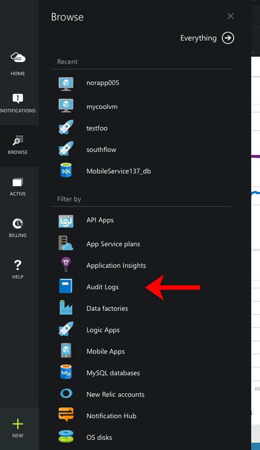
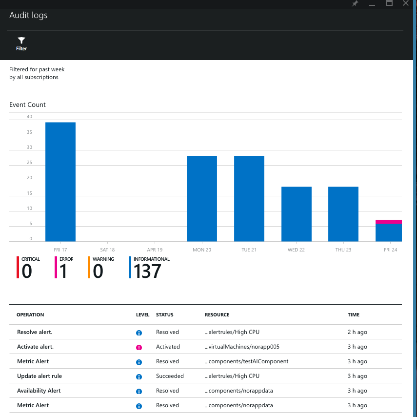
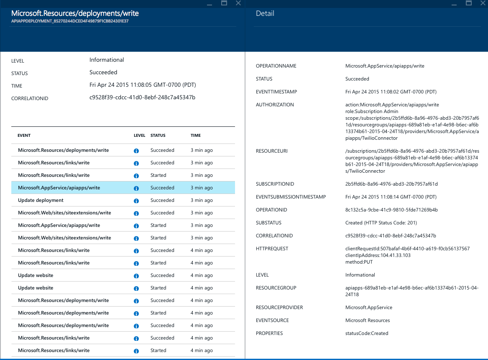
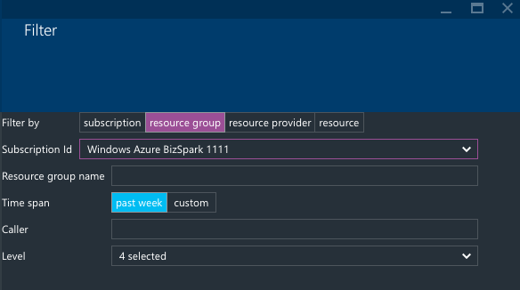
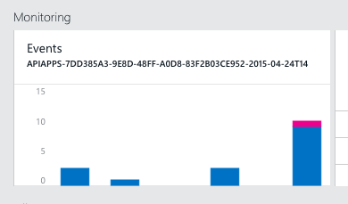

<properties
    pageTitle="Anzeigen von Ereignissen und Überwachungsprotokolle"
    description="Erfahren Sie, wie Sie alle Ereignisse angezeigt, die in Ihrem Abonnement Azure ausgeführt werden."
    authors="rboucher"
    manager="carolz"
    editor=""
    services="monitoring-and-diagnostics"
    documentationCenter="monitoring-and-diagnostics"/>

<tags
    ms.service="monitoring-and-diagnostics"
    ms.workload="na"
    ms.tgt_pltfrm="na"
    ms.devlang="na"
    ms.topic="article"
    ms.date="04/28/2015"
    ms.author="robb"/>

# Anzeigen von Ereignissen und Überwachungsprotokolle

Alle Vorgänge auf Azure Ressourcen ausgeführt werden vom Azure Ressource-Manager, von der Erstellung und Löschvorgängen vollständig überwacht zu erteilen oder Entziehen von Access. Sie können diese Protokolle Azure-Portal durchsuchen, und können Sie auch die [REST-API](https://msdn.microsoft.com/library/azure/dn931927.aspx) oder [.NET SDK](https://www.nuget.org/packages/Microsoft.Azure.Insights/) sämtlicher Ereignisse programmgesteuert Zugriff auf.

## Navigieren Sie Ihr Abonnement Azure beeinträchtigen Ereignisse

1. Melden Sie sich bei der [Azure-Portal](https://portal.azure.com/).
2. Klicken Sie auf **Durchsuchen** , und wählen Sie **Überwachungsprotokolle**.  
    
3. Dadurch wird geöffnet, von einem Blade mit alle Ereignisse, die die Abonnements für die letzten 7 Tage beeinträchtigt werden. Am Anfang ist ein Diagramm mit Daten nach Ebene und darunter die vollständige Liste der Protokolle:  

>[AZURE.NOTE] Sie können nur die neuesten 500 Ereignisse für ein Abonnement angegebenen Azure-Portal anzeigen.

4. Klicken Sie auf einen beliebigen Eintrag Log die Ereignisse angezeigt, die es bestehen. Beispielsweise, wenn Sie etwas in einer Ressourcengruppe bereitstellen, vielen unterschiedliche Ressourcen möglicherweise erstellt oder geändert werden soll. Sie können für jeden Eintrag sehen:
    * Die **Ebene** des Ereignisses - können sie z. B., etwas ist zum Nachverfolgen (**Information**) werden, oder wenn etwas schief geht, dass Sie über (**Fehler**) wissen müssen.
    * Der **Status** - ist der endgültige Status im allgemeinen **erfolgreich** oder **fehlgeschlagen**, aber es möglicherweise auch **akzeptiert** für zeitintensive Vorgänge.
    * *Wenn* das Ereignis ist.
    * *Wer* durchgeführt den Vorgang, wenn jeder. Nicht alle Vorgänge werden von Benutzern, einige von Back-End-Services ausgeführt werden, damit sie kein **Anrufer**haben möchten.
    * Hat die **Korrelations-ID** des Ereignisses – dies den eindeutigen Bezeichner für diese Gruppe von Vorgängen ist.

5. Sie können von dort aus an die Blade Details zu den Besonderheiten des Ereignisses finden Sie unter wechseln.

    

    Weitere Informationen zu Ereignissen **fehlgeschlagen** enthält dieser Seite in der Regel einen **untergeordneter** und einen Abschnitt **Eigenschaften** , die für das Debuggen nützlich Details enthalten.

## Filtern nach bestimmten Protokolle

Um Ereignisse anzuzeigen, die auf eine bestimmte Entität oder eines bestimmten Typs anwenden, können Sie das Audit Protokolle Blade filtern, durch Klicken auf den Befehl **Filtern** . Sie können auch das Blade Filter zum Ändern der **Zeitspanne** des Blades Protokolle Audit verwenden.

Nachdem Sie diesen Befehl klicken, wird ein neuer Blade öffnen:

Es gibt vier Arten von Filtern:

1. Durch Abonnement
2. Durch eine **Ressourcengruppe**
3. Durch einen **Ressourcentyp**
4. Durch eine bestimmte **Ressource** - müssen für diesen Sie ältere in die vollständige *Ressourcen-ID* , die der Ressource, die, der Sie interessiert sind

Darüber hinaus können Sie auch Filtern Ereignisse durch, die das Ereignis ausgeführt hat, oder, um die Ebene des Ereignisses.

Einmal haben Sie die Auswahl, was soll, klicken Sie auf die Schaltfläche **Aktualisieren** am unteren Rand der Blade beendet.

## Überwachen von Ereignissen beeinträchtigen bestimmte Ressourcen

1. Klicken Sie auf **Navigieren** Sie zu die Ressource zu finden, das, der Sie interessiert sind. Sie können auch alle Protokolle für eine gesamte **Ressourcengruppe**anzeigen.
2. In der Ressource Blade einen Bildlauf nach unten bis die Kachel **Ereignisse** .  
    
3. Klicken Sie auf die Kachel zu finden Sie unter Ereignisse gefiltert, dass nur die Ressource, die Sie ausgewählt haben. Der Befehl ' **Filter** ' können Sie das Ändern des Zeitraums oder spezifischere Filter anwenden.

## Nächste Schritte

* [Lassen Sie sich benachrichtigen](insights-receive-alert-notifications.md) , wenn ein Ereignis eintritt.
* [Kriterien für Monitor Service](insights-how-to-customize-monitoring.md) , um sicherzustellen, dass Ihr Dienst reagiert und verfügbar ist.
* [Dienststatus nachverfolgen](insights-service-health.md) , um herauszufinden, wann Azure Leistung Verschlechterung oder einen bestimmten Dienst Interruptions aufgetreten ist.  
