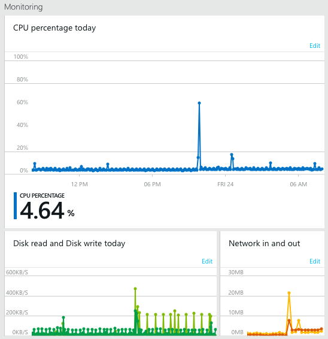
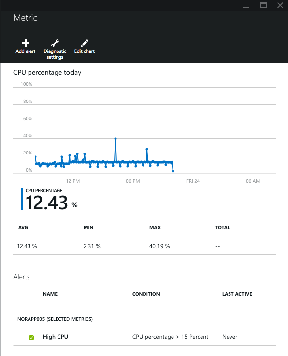
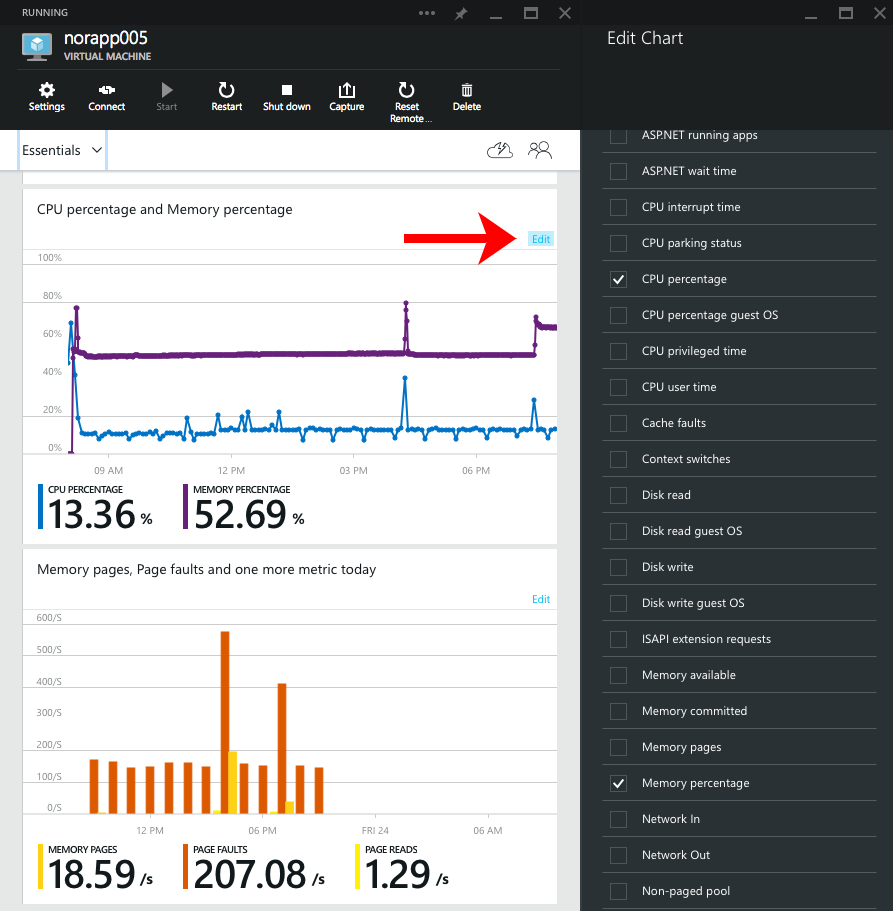
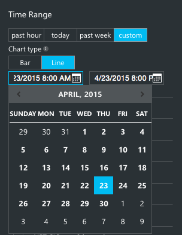
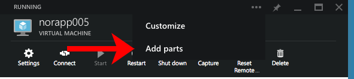
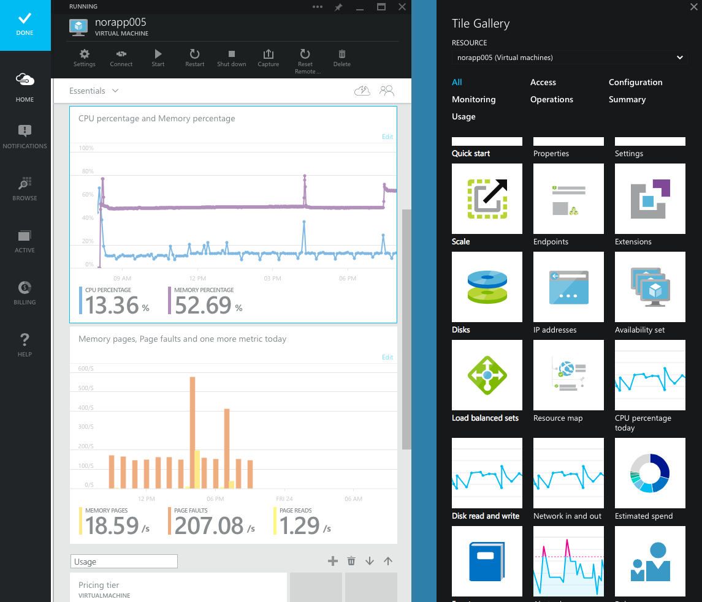
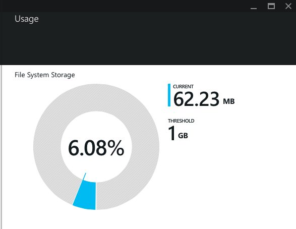

<properties
    pageTitle="Übersicht über die Kriterien in Microsoft Azure | Microsoft Azure"
    description="Informationen Sie zum Anpassen der Überwachung Diagramme in Azure."
    authors="rboucher"
    manager="carolz"
    editor=""
    services="monitoring-and-diagnostics"
    documentationCenter="monitoring-and-diagnostics"/>

<tags
    ms.service="monitoring-and-diagnostics"
    ms.workload="na"
    ms.tgt_pltfrm="na"
    ms.devlang="na"
    ms.topic="article"
    ms.date="09/08/2015"
    ms.author="robb"/>

# Übersicht über die Kriterien in Microsoft Azure

Alle Azure Dienste Nachverfolgen von wichtigen Kriterien, die Sie den Status, Leistung, Verfügbarkeit und Verwendung Ihrer Dienste überwachen können. Sie können diese Kennzahlen Azure-Portal anzeigen, und können Sie auch die [REST-API](https://msdn.microsoft.com/library/azure/dn931930.aspx) oder [.NET SDK](https://www.nuget.org/packages/Microsoft.Azure.Insights/) sämtlicher Kennzahlen programmgesteuert Zugriff auf.

Für einige Dienste müssen Sie möglicherweise Diagnose aktivieren, um über Metrik finden Sie unter. Für andere Personen, z. B. virtuellen Computern erhalten Sie eine grundlegende Reihe von Kennzahlen, aber muss so aktivieren Sie die vollständige festlegen häufig auftretenden Kennzahlen. Finden Sie weitere Informationen [für die Überwachung und Diagnose aktivieren](insights-how-to-use-diagnostics.md) aus.

## Verwenden von Diagrammen Überwachung

Können Sie keines der Metrik Diagramm diese über alle Zeitraum, wählen Sie Sie aus.

1. Klicken Sie im [Portal Azure](https://portal.azure.com/)auf **Durchsuchen**, und klicken Sie dann eine Ressource, die Sie für die Überwachung interessiert.

2. Im Abschnitt **Überwachung** enthält die wichtigsten Kennzahlen für jede Azure Ressource an. Angenommen, eine Web app hat **Anfragen und Fehler**, wobei als virtueller Computer **Prozentsatz der CPU** und **Datenträger lesen und Schreiben**müssten:  

3. Klicken auf jedes Diagramm wird das Blade **Metrisch** angezeigt werden. Klicken Sie auf das Blade, neben dem Diagramm finden eine Tabelle mit Sie Aggregationen von der Metrik (z. B. Mittelwert, Mindest- und Höchstwerte, für den Zeitraum fest, die, den Sie ausgewählt haben). Darunter befinden sich die Warnungsregeln für die Ressource.
    

4. Um die Zeilen anzupassen, die angezeigt werden, klicken Sie auf die Schaltfläche **Bearbeiten** auf das Diagramm oder den Befehl **Bearbeiten Diagramm** das metrischen Blade.

5. Klicken Sie auf das Blade Abfrage bearbeiten können Sie drei Aufgaben ausführen:
    - Ändern des Zeitraums
    - Wechseln Sie die Darstellung zwischen Leiste und Linie
    - Wählen Sie aus verschiedenen Metics 

6. Ändern des Zeitraums ist so einfach wie das Auswählen eines anderen Bereichs (z. B. **Vergangenen Stunde**), und klicken am unteren Rand der Blade **Speichern** . Sie können auch **benutzerdefinierte**auswählen, dem Sie einen bestimmten Zeitraum in den letzten 2 Wochen auswählen können. Beispielsweise können Sie die gesamte zwei Wochen oder, nur 1 Stunde von gestern anzeigen. Geben Sie in das Textfeld, geben Sie eine andere Stunde.
    

7. Wählen Sie unterhalb des Zeitraums Sie Kanal eine beliebige Anzahl von Kennzahlen, um das Diagramm anzuzeigen.

8. Wenn Sie auf Speichern klicken werden die Änderungen für die jeweilige Ressource gespeichert werden. Beispielsweise wird Wenn Sie zwei virtuellen Computern haben und einem Diagramm auf eine Änderung, es keinen anderen Einfluss auf.

## Erstellen von nebeneinander Diagrammen

Mit den leistungsstarken Anpassung im Portal können Sie beliebig viele Diagramme beliebig hinzufügen.

1. Klicken Sie im Menü am oberen Rand der Blade **...** auf **Kacheln hinzufügen**:  
    
2. Klicken Sie dann, Sie können auswählen wählen Sie ein Diagramm aus dem **Katalog** auf der rechten Seite des Bildschirms:  
3. Wenn Sie die gewünschten die Metrik nicht angezeigt wird, können Sie jederzeit eine der voreingestellten Kennzahlen und **Bearbeiten von** hinzufügen das Diagramm, um die Metrik anzeigen, die Sie benötigen.

## Überwachen der Verwendung von Kontingenten

Die meisten Kennzahlen anzeigen Sie Trends über einen Zeitraum, aber bestimmte Daten, wie die Verwendung von Kontingenten, sind Point-in-Time-Informationen mit einem Schwellenwert.

Sie können auch Verwendung von Kontingenten auf das Blade für Ressourcen anzeigen, die von Kontingenten haben:

Wie mit Kennzahlen können die [REST-API](https://msdn.microsoft.com/library/azure/dn931963.aspx) oder [.NET SDK](https://www.nuget.org/packages/Microsoft.Azure.Insights/) Sie den vollständigen Satz der Verwendung von Kontingenten programmgesteuert Zugriff.

## Nächste Schritte

* [-Benachrichtigung erhalten](insights-receive-alert-notifications.md) , wenn eine Metrik einen Schwellenwert überschreitet.
* [Aktivieren die Überwachung und Diagnose](insights-how-to-use-diagnostics.md) zum Erfassen von detaillierter häufig auftretenden Kennzahlen auf Ihrem Dienst aus.
* [Anzahl der Instanzen automatisch skalieren](insights-how-to-scale.md) , um sicherzustellen, dass Ihr Dienst reagiert und verfügbar ist.
* [Überwachen der Leistung von Anwendung](../application-insights/app-insights-azure-web-apps.md) , wenn Sie genau wie in der Cloud Code ausführt, verstehen möchten.
* Verwenden Sie [Anwendung Einsichten für JavaScript-apps und Webseiten](../application-insights/app-insights-web-track-usage.md) abzurufenden Client Analytics Informationen zu Browsern, die eine Webseite besuchen.
* [Verfügbarkeit von Monitor und Reaktionszeiten einer beliebigen Webseite](../application-insights/app-insights-monitor-web-app-availability.md) mit Anwendung Einblicken, damit Sie Ihre Seite herauszufinden, ob können ist nach unten.
