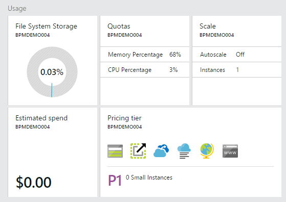
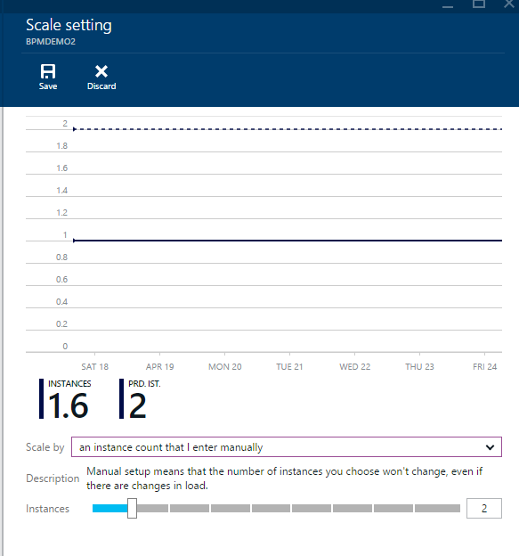
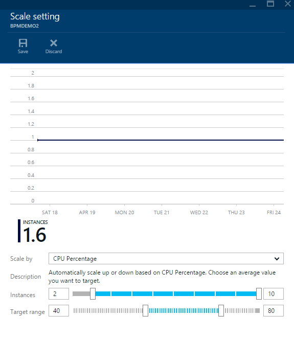
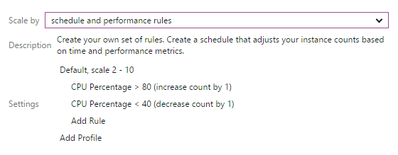
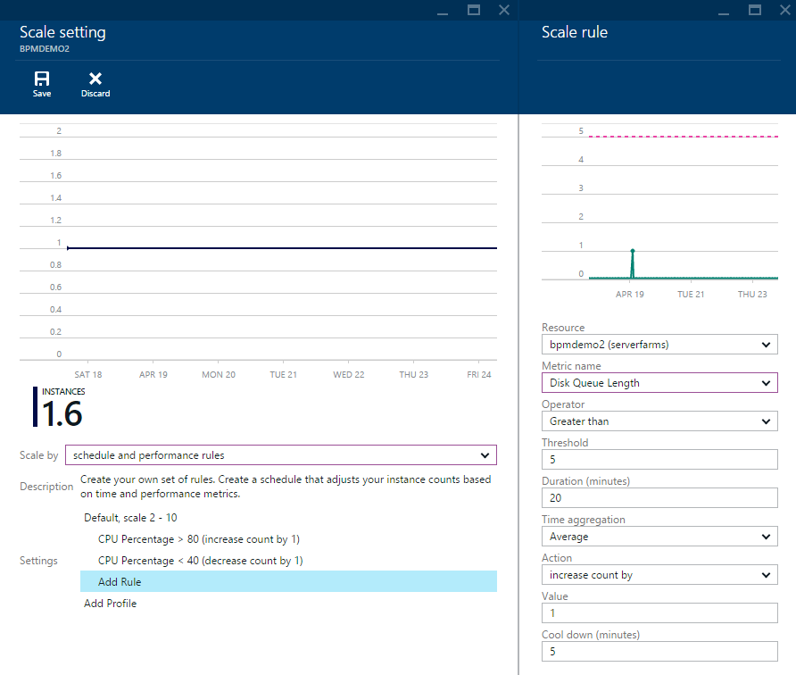
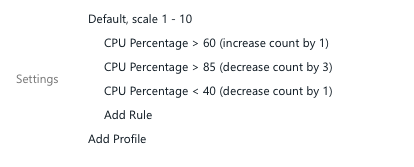
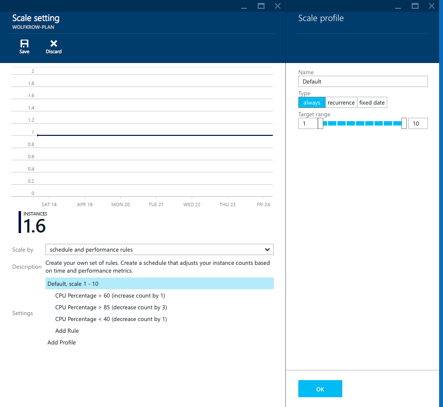
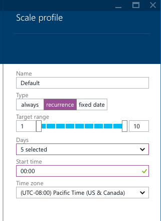
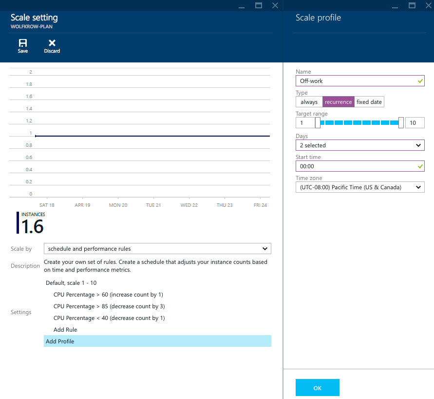
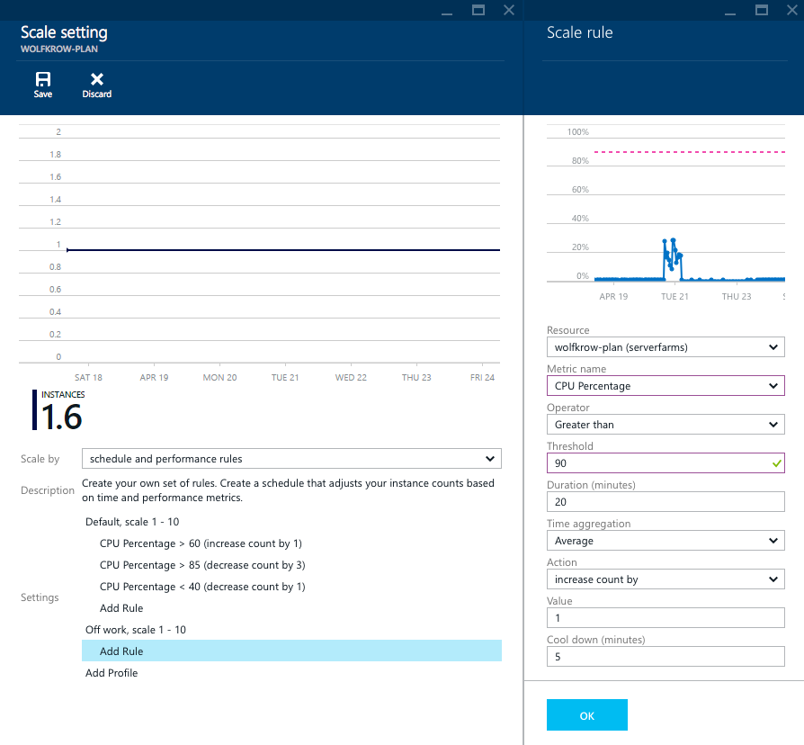

<properties
    pageTitle="Anzahl der Instanzen manuell oder automatisch zu skalieren | Microsoft Azure"
    description="Informationen Sie zum Skalieren Ihrer Dienste Azure."
    authors="rboucher"
    manager="carolz"
    editor=""
    services="monitoring-and-diagnostics"
    documentationCenter="monitoring-and-diagnostics"/>

<tags
    ms.service="monitoring-and-diagnostics"
    ms.workload="na"
    ms.tgt_pltfrm="na"
    ms.devlang="na"
    ms.topic="article"
    ms.date="09/08/2015"
    ms.author="robb"/>

# Anzahl der Instanzen manuell oder automatisch zu skalieren

Im [Portal Azure](https://portal.azure.com/)können Sie die Anzahl der Instanzen von Ihrem Dienst manuell festlegen, oder Sie können Parameter festlegen, damit diese automatisch Maßstab auf der Basis bei Bedarf. Dies wird in der Regel als *Skalierung* oder *Maßstab in*bezeichnet.

Bevor basierend auf der Anzahl der Instanzen Skalierung, sollten Sie dieselbe Skalierung sowie die Anzahl der Instanzen von **Preise Ebene** betroffen ist. Andere Preisgestaltung Ebenen können anderen Zahlen Kerne als auch Arbeitsspeicher haben und daher haben Sie eine bessere Leistung für die Anzahl der Instanzen (die *Skalierung nach oben* oder *nach unten skalieren*ist). In diesem Artikel umfasst folgende Themen *Maßstab in* und *out*.

Sie können im Portal skalieren, und Sie können auch die [REST-API](https://msdn.microsoft.com/library/azure/dn931953.aspx) oder [.NET SDK](https://www.nuget.org/packages/Microsoft.Azure.Insights/) Maßstab manuell oder automatisch anpassen.

> [AZURE.NOTE] Dieser Artikel beschreibt, wie eine Einstellung automatisch skalieren im Portal am [http://portal.azure.com](http://portal.azure.com)erstellt. Automatisch skalieren Einstellungen in diesem Portal erstellt werden können nicht bearbeitet es im klassische-Portal ([http://manage.windowsazure.com](http://manage.windowsazure.com)).

## Manuelles skalieren

1. Im [Portal Azure](https://portal.azure.com/)-klicken Sie auf **Durchsuchen**, und navigieren Sie zu der Ressource, die Sie, wie etwa einer **App-Serviceplan**skalieren möchten.

2. Informieren Sie die Kachel **Skalieren** bei **Vorgängen** den Status der Skalierung: **Deaktivieren** für wann Sie manuell Skalierung werden **auf** für wann Sie durch eine oder mehrere Leistungswerte Skalierung sind.
    

3. Klicken auf die Kachel gelangen Sie an die **Skalierung** Blade. Am oberen Rand der Skalierung Blade sehen automatisch skalieren Aktionen der Verlauf den Dienst Sie.  
    

>[AZURE.NOTE] In diesem Diagramm werden nur die Aktionen, die von automatisch skalieren durchgeführt werden angezeigt. Wenn Sie die Anzahl der Instanzen manuell anzupassen, wird diese Änderung in einem Diagramm dieses Typs nicht berücksichtigt.

4. Sie können manuell die Zahl **Instanzen** mit Schieberegler anpassen.
5. Klicken Sie auf den Befehl **Speichern** und Sie erhalten skaliert werden auf die Anzahl der Instanzen beinahe sofort.

## Skalierung ausgehend von einer voreingestellten Metrik

Wenn Sie möchten, dass die Anzahl der Instanzen automatisch anpassen einer Metrik anhand, wählen Sie in der Dropdownliste den **Maßstab, indem Sie** die gewünschte Metrik. Für eine **App-Serviceplan** können Sie beispielsweise nach dem **Prozentsatz der CPU-**skalieren.

1. Bei der Auswahl einer Metrik erhalten Sie einen Schieberegler und/oder Textfelder ein, und geben Sie die Anzahl der Instanzen, die Sie zwischen skalieren möchten:

    

    Automatisch skalieren dauert nie des Diensts unterhalb oder oberhalb der Begrenzung, die Sie, ganz gleich, Ihre laden festlegen.

2. Zweites, wählen Sie den Zielbereich für die Metrik. Beispielsweise, wenn Sie den **Prozentsatz der CPU**ausgewählt haben, können Sie ein Ziel für die durchschnittliche CPU über alle Instanzen in Ihrem Dienst festlegen. Ein Maßstab, geschieht, wenn die durchschnittliche CPU das Maximum überschreitet, die, das Sie definieren, ebenso ein Maßstab in tritt bei jedem der Mittelwert CPU unter das Minimum gefallen.

3. Klicken Sie auf den Befehl **Speichern** . Automatisch skalieren aktivieren Sie alle einige Minuten, um sicherzustellen, dass Sie in den Bereich Instanz und Ziel für Ihre metrisch sind. Wenn der Dienst zusätzlichen Datenverkehr erhält, erhalten Sie weitere Instanzen, ohne eine Aktion auszuführen.

## Basierend auf anderer Größen skalieren

Sie können basierend auf Kriterien als den Voreinstellungen skalieren, die angezeigt werden, in der Dropdownliste **skalieren, indem Sie** können auch eine komplexe Reihe von Skalierung haben und skalieren in Regeln.

### Hinzufügen oder Ändern einer Regel

1. Wählen Sie den **Zeitplan und Leistung Regeln** in der Dropdownliste **nach skalieren** : 

2. Wenn Sie zuvor automatisch skalieren hatten, sehen auf einen Überblick über die genauen Regeln Sie, die Sie aufwiesen.

3. Zum Skalieren basierend auf einem anderen metrischen klicken Sie auf die Zeile **Regel hinzufügen** . Sie können auch klicken Sie auf eine der vorhandenen Zeilen aus der Metrik ändern, die Sie zuvor in die Metrik werden geführt mit skaliert werden soll.

4. Jetzt Sie welche Metrisch auswählen müssen, die Sie durch skalieren möchten. Wenn eine Metrik auswählen, die es ein paar Dinge gibt zu beachten:
    * Die *Ressource* die Metrik stammen aus. In der Regel wird diese Ressource identisch sein, die Sie skalieren sind. Wenn Sie sich aus der Tiefe einer Warteschlange Speicher skalieren möchten, ist die Ressource jedoch die Warteschlange, der Sie durch skalieren möchten.
    * Der *metrischen Namen* selbst.
    * Die *Uhrzeit Aggregation* die Metrik. Dies ist, wie die Daten kombinieren die *Dauer*ist.

5. Wählen Sie nach Auswahl der Metrik den Schwellenwert für die Metrik und den Operator aus. Beispielsweise könnten Sie **größer als** **80 %**angenommen.

6. Wählen Sie die Aktion, die Sie nutzen möchten. Es gibt einige andere Art von Aktionen aus:
    * Vergrößern oder verkleinern, indem Sie – dies wird hinzufügen oder entfernen die Anzahl der **Wert** der Instanzen, die Sie definieren
    * Vergrößern oder verkleinern Prozent – Dadurch wird die Anzahl der Instanzen ändern, indem Sie einen Prozentsatz. Beispielsweise könnten Sie 25 in das Feld **Wert** setzen, und wenn Sie aktuell 8 Instanzen hatten, würde 2 hinzugefügt werden.
    * Vergrößern oder verkleinern auf – Dadurch wird die Anzahl der Instanzen festgelegt, auf den **Wert** Sie definieren.

7. Schließlich können Sie coole ab – wie lange diese Regel nach der vorherigen Aktion Maßstab erneut skalieren warten sollte auswählen.

8. Drücken Sie nach dem Konfigurieren der Regel **OK**aus.

9. Nachdem Sie alle Regeln konfiguriert haben, werden soll, müssen Sie den Befehl **Speichern** Treffer.

### Skalieren mit mehreren Schritten

Die oben aufgeführten Beispiele sind recht einfach. Wenn deutlicher zu Skalierung nach oben (oder unten) werden soll, können Sie mehrere Maßstab Regeln für die gleichen Metrik auch hinzufügen. Beispielsweise können Sie zwei Dezimalstellen Regeln auf Prozentsatz der CPU definieren:

1. Prozentsatz der CPU ist mehr als 60 % von 1 Instanz skalieren
2. Prozentsatz der CPU ist über 85 % von 3 Instanzen skalieren

Mit dieser Regel zusätzliche überschreitet Ihre Last 85 % vor einer Aktion Maßstab erhalten zwei zusätzliche Instanzen statt eine Sie.

## Maßstab basierend auf einem Zeitplan

Standardmäßig beim Erstellen einer Regel Skalieren wird immer angewendet. Sie sehen, die beim Klicken auf die Überschrift Profil:

Möglicherweise möchten jedoch kürzere Skalierung während den Tag oder Woche, als am Wochenende haben. Sie könnten auch dem Dienst vollständig deaktivieren Arbeitszeiten beenden.

1. Klicken Sie auf das Profil dazu, wählen Sie **Serie** statt **immer,** und wählen Sie aus der Häufigkeit, mit der Sie das Profil gelten soll.

2. Angenommen, um ein Profil zu lassen, die während der Woche gilt, in der Dropdownliste den **Tage** deaktivieren Sie **Samstag** und **Sonntag**.

3. Um ein Profil verfügen, das tagsüber angewendet wird, legen Sie die **Startzeit** die Uhrzeit aus, die am beginnen soll.
    

4. Klicken Sie auf **OK**.

5. Als Nächstes müssen Sie das Profil hinzufügen, das Sie zu anderen Zeiten anwenden möchten. Klicken Sie auf die Zeile **Profil hinzufügen** .
    

6. Benennen Sie Ihre neue, Sekunde, Profil, beispielsweise Sie konnte nennen Sie diese **nicht bei der Arbeit**.

7. Klicken Sie dann wählen **Serie** erneut aus, und wählen Sie dieses Zeitraums gewünschte Instanz zählen Bereich.

8. Während mit dem standardmäßigen Profil, wählen Sie die **Tage** , möchten Sie dieses Profil zuweisen und die **Startzeit** während des Tages.

>[AZURE.NOTE] Automatisch skalieren wird die Sommerzeit Spareinlagen Regeln für egal **Zeitzone** verwendet, die Sie auswählen. Aber bei Sommerzeit UTC-Offset wird auf der Basis Zeitzonenoffset, nicht den Spareinlagen UTC Offset angezeigt.

9. Klicken Sie auf **OK**.

10. Jetzt, müssen Sie jeden Regeln hinzufügen, während Ihr Profil zweiten anwenden möchten. Klicken Sie auf **Regel hinzufügen**, und klicken Sie dann können Sie die gleiche Regel, die Sie während des Standardprofils haben erstellen.
    

11. Achten Sie darauf, dass Sie zum Erstellen sowohl einer Regel für Skalierung und Maßstab in or else während des Profils die Anzahl der Instanzen wird nur wächst (oder verkleinern).

12. Klicken Sie abschließend auf **Speichern**.

## Nächste Schritte

* [Kriterien für Monitor Service](insights-how-to-customize-monitoring.md) , um sicherzustellen, dass Ihr Dienst reagiert und verfügbar ist.
* [Aktivieren die Überwachung und Diagnose](insights-how-to-use-diagnostics.md) zum Erfassen von detaillierter häufig auftretenden Kennzahlen auf Ihrem Dienst aus.
* [Empfangen-Benachrichtigung](insights-receive-alert-notifications.md) bei jedem Betrieb eintreten oder Kennzahlen cross einen Schwellenwert.
* [Überwachen der Leistung von Anwendung](../application-insights/app-insights-azure-web-apps.md) , wenn Sie genau wie in der Cloud Code ausführt, verstehen möchten.
* [Anzeigen von Ereignissen und Überwachungsprotokolle](insights-debugging-with-events.md) erfahren Sie alles, die in Ihrem Dienst passiert ist.
* [Verfügbarkeit von Monitor und Reaktionszeiten einer beliebigen Webseite](../application-insights/app-insights-monitor-web-app-availability.md) mit Anwendung Einblicken, damit Sie Ihre Seite herauszufinden, ob können ist nach unten.
