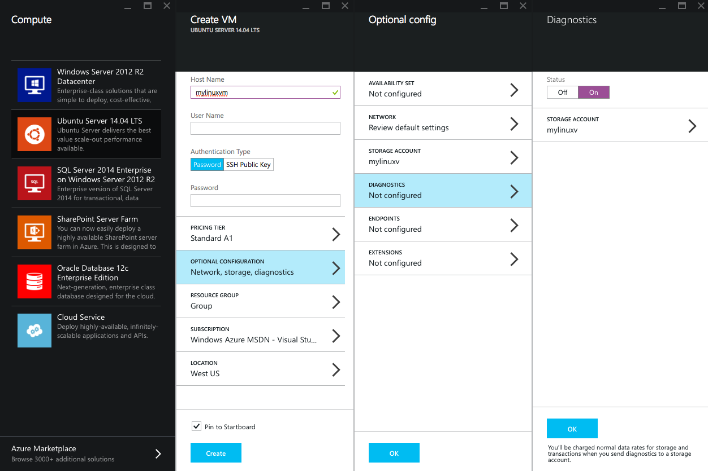
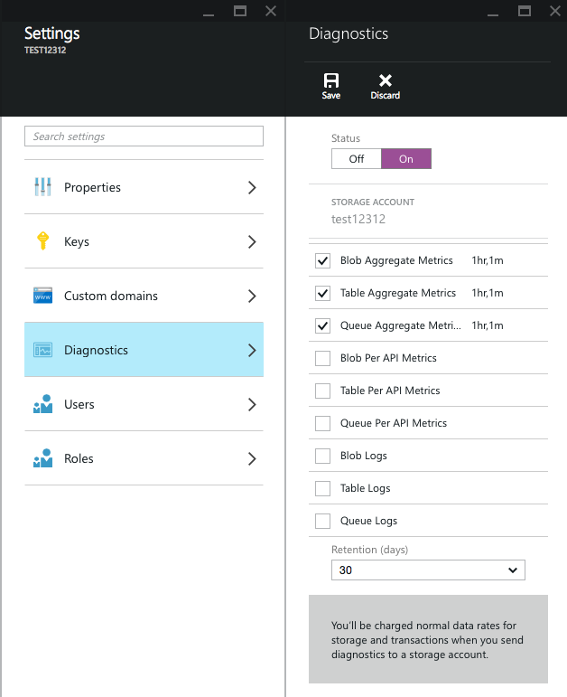

<properties
    pageTitle="Überwachung aktivieren und Diagnose in Microsoft Azure | Microsoft Azure "
    description="Informationen Sie zum Einrichten der Diagnose für Ressourcen in Azure."
    authors="rboucher"
    manager="carolz"
    editor=""
    services="monitoring-and-diagnostics"
    documentationCenter="monitoring-and-diagnostics"/>

<tags
    ms.service="monitoring-and-diagnostics"
    ms.workload="na"
    ms.tgt_pltfrm="na"
    ms.devlang="na"
    ms.topic="article"
    ms.date="09/08/2015"
    ms.author="robb"/>

# Aktivieren Sie die Überwachung und Diagnose

Im [Portal Azure](https://portal.azure.com)können Sie umfangreichen, häufige, Überwachung und Diagnosedaten zu Ihren Ressourcen konfigurieren. Sie können auch die [REST-API](https://msdn.microsoft.com/library/azure/dn931932.aspx) oder [.NET SDK](https://www.nuget.org/packages/Microsoft.Azure.Insights/) Diagnose programmgesteuert konfigurieren verwenden.

Diagnose, Überwachung und Metrisch Daten in Azure werden in ein Speicherkonto Ihrer Wahl gespeichert. So können Sie jeden gewünschten Tools die Daten aus einem Speicher-Explorer zu Power BI zu Drittanbieter-Tools lesen verwenden.

## Wenn Sie eine Ressource erstellen

Die meisten Dienste ermöglichen Ihnen Diagnose aktivieren, wenn Sie erstmals im [Portal Azure](https://portal.azure.com)erstellen.

1. Wechseln Sie auf **neu** , und wählen Sie die Ressource, die, der Sie interessiert sind.

2. Wählen Sie **Optional Konfiguration**.
    

3. Wählen Sie **Diagnose**aus, und **Klicken Sie auf**. Sie benötigen, um das Konto Speicher auszuwählen, die Diagnose zum gespeichert werden soll. Sie erhalten in Rechnung gestellt normalen Daten Sätzen für die Speicherung und Transaktionen beim Diagnose mit einem Speicherkonto senden.

4. Klicken Sie auf **OK** , und erstellen Sie die Ressource zu.

## Ändern der Einstellungen für eine vorhandene Ressource

Wenn Sie bereits eine Ressource erstellt haben und Sie die Diagnose (Wenn Sie die Ebene Datensammlung, beispielsweise ändern) ändern möchten, können Sie dieses Recht im Portal Azure ausführen.

1. Wechseln Sie zu der Ressource, und klicken Sie auf den Befehl **Einstellungen** .

2. Wählen Sie die **Diagnose**aus.

3. Das **Diagnose** -Blade verfügt über alle möglichen Diagnose und Überwachung aufgelisteten Daten für diese Ressource. Für einige Ressourcen können Sie auch **eine Aufbewahrungsrichtlinie für die Daten aus Ihrem Speicherkonto bereinigen lassen** auswählen.
    

4. Nachdem Sie Ihre Einstellungen ausgewählt haben, klicken Sie auf den Befehl **Speichern** . Es kann etwas dauern, während für die Überwachung von Daten, um angezeigt, wenn Sie zum ersten Mal aktivieren.

### Kategorien Datensammlung für virtuellen Computern
Für virtuelle Computer werden alle Kennzahlen und Protokolle in einer Minute Abständen, aufgezeichnet, sodass Sie immer über die neuesten Informationen zu Ihrem Computer verfügen können.

- **Grundlegende Kennzahlen** : Gesundheit Kennzahlen zu Ihrem virtuellen Computern wie Prozessor und Arbeitsspeicher
- **Netzwerk und Web Kennzahlen** : Kennzahlen zu Ihren Netzwerk-Verbindungen und Webdienste
- **.NET Kennzahlen** : Kennzahlen zu den .NET und ASP.NET Applications ausführen auf Ihrem Computer
- **SQL-Kennzahlen** : Wenn Sie Microsoft SQL-Dienst, deren Performance-Werte ausführen
- **Windows-Anwendung Ereignisprotokollen** : Windows-Ereignisse, die an den Kanal Anwendung gesendet werden
- **Windows-Ereignisprotokollen System** : Windows-Ereignisse, die an den Systemkanal gesendet werden. Dies umfasst auch alle Ereignisse von [Microsoft-Modul](http://go.microsoft.com/fwlink/?LinkID=404171&clcid=0x409).
- **Windows-Ereignisprotokollen Sicherheit** : Windows-Ereignisse, die an den Sicherheitskanal gesendet werden
- **Diagnose Infrastrukturprotokolle** : zur Websitesammlung Infrastruktur Diagnose Protokollierung
- **IIS-Protokolle** : Protokolle zu dem IIS-Server

Beachten Sie, dass bestimmte Versionen von Linux werden zurzeit nicht unterstützt, und die Gast-Agent auf dem virtuellen Computer installiert sein muss.

## Nächste Schritte

* [Empfangen-Benachrichtigung](insights-receive-alert-notifications.md) bei jedem Betrieb eintreten oder Kennzahlen cross einen Schwellenwert.
* [Kriterien für Monitor Service](insights-how-to-customize-monitoring.md) , um sicherzustellen, dass Ihr Dienst reagiert und verfügbar ist.
* [Anzahl der Instanzen automatisch skalieren](insights-how-to-scale.md) , um sicherzustellen, dass den Dienst Maßstab auf der Basis bei Bedarf.
* [Überwachen der Leistung von Anwendung](../application-insights/app-insights-azure-web-apps.md) , wenn Sie genau wie in der Cloud Code ausführt, verstehen möchten.
* [Anzeigen von Ereignissen und Überwachungsprotokolle](insights-debugging-with-events.md) erfahren Sie alles, die in Ihrem Dienst passiert ist.
* [Dienststatus nachverfolgen](insights-service-health.md) , um herauszufinden, wann Azure Leistung Verschlechterung oder einen bestimmten Dienst Interruptions aufgetreten ist.
