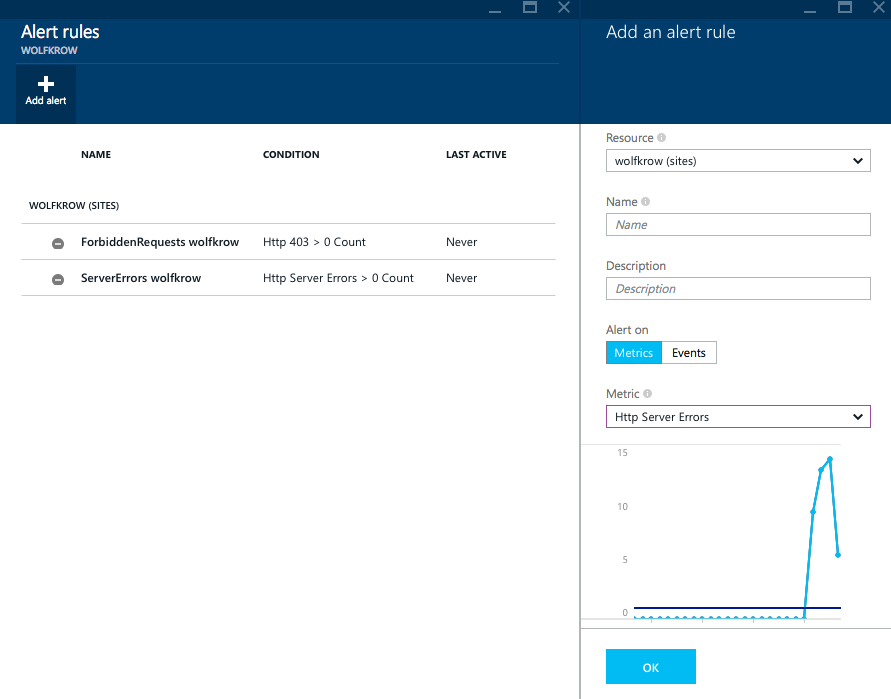
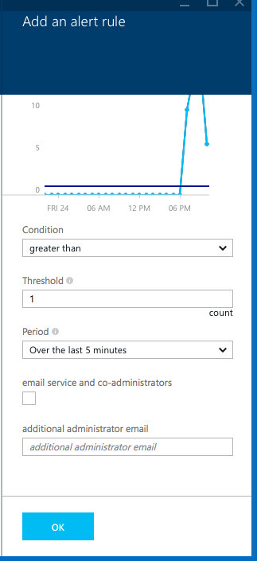
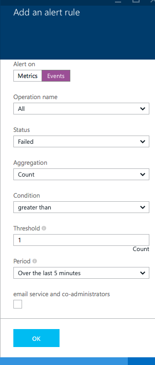
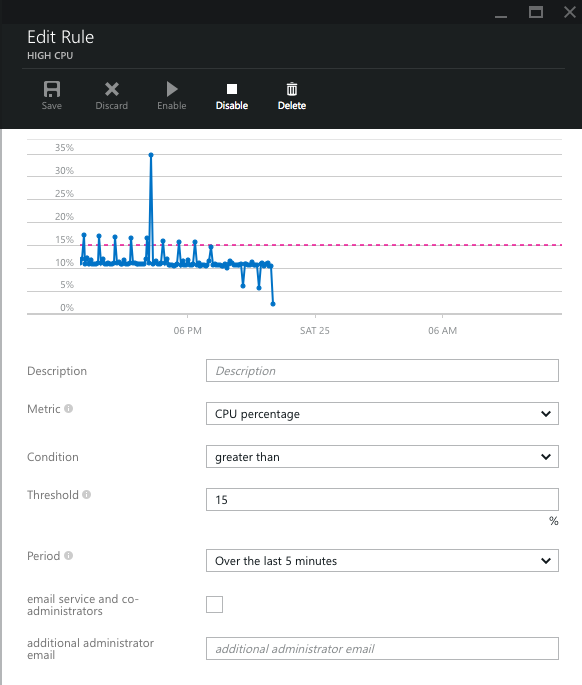

<properties
    pageTitle="Benachrichtigung für Azure Services erhalten | Microsoft Azure"
    description="Benachrichtigt werden, wenn Warnungsregeln Bedingung erfüllt sind."
    authors="rboucher"
    manager="carolz"
    editor=""
    services="monitoring-and-diagnostics"
    documentationCenter="monitoring-and-diagnostics"/>

<tags
    ms.service="monitoring-and-diagnostics"
    ms.workload="na"
    ms.tgt_pltfrm="na"
    ms.devlang="na"
    ms.topic="article"
    ms.date="09/08/2015"
    ms.author="robb"/>

# Lassen Sie sich benachrichtigen

Sie können eine Benachrichtigung basierend auf Überwachung Kennzahlen zur oder Ereignisse auf Ihre Azure-Dienste erhalten.

Warnungsregeln auf einen metrischen Wert ein Wenn der Wert einer angegebenen Metrik einen Schwellenwert zugewiesen, schneidet die Regel aktiv, und kann eine Benachrichtigung gesendet. Warnungsregeln auf Ereignisse kann eine Regel eine Benachrichtigung sendet, auf *jedes* Ereignis oder, nur, wenn eine bestimmte Anzahl von Ereignissen erfolgen.

Wenn Sie eine Regel erstellen, können Sie auswählen, Optionen zum Senden einer e-Mail-Benachrichtigung, die Dienstadministrator und Co-Administratoren oder an einen anderen Administrator, den Sie angeben können. Wird die Regel aktiv, und wenn eine Benachrichtigung Bedingung gelöst ist, wird eine e-Mail-Benachrichtigung gesendet.

Sie können die [REST-API](https://msdn.microsoft.com/library/azure/dn931945.aspx) oder [.NET SDK](https://www.nuget.org/packages/Microsoft.Azure.Insights/) konfigurieren und erhalten Informationen zu Warnungsregeln programmgesteuert verwenden.

## Erstellen einer Regel

1. Klicken Sie im [Portal](https://portal.azure.com/)auf **Durchsuchen**, und klicken Sie dann eine Ressource, die Sie für die Überwachung interessiert.

2. Klicken Sie auf die Kachel **Warnungsregeln** in der Lens **Vorgänge** .

3. Klicken Sie auf den Befehl **Benachrichtigung hinzufügen** .

    

4. Sie können der Benachrichtigung Regel einen Namen, und wählen Sie eine Beschreibung, die in der e-Mail-Benachrichtigung angezeigt wird.

5. Wenn Sie **Kennzahlen** auswählen, werden Sie Bedingung und Schwellenwert Wert für die Metrik auswählen. Dies ist der Zeitraum, für den Monitor und der Zeichnungsfläche benachrichtigen Aktivität Azure verwendet.

    

6. Sie können auch **Ereignisse**auswählen und erhalten eine Benachrichtigung, wenn eine bestimmte Ereignis stattfindet.

    

7. Schließlich können Sie zum Senden von e-Mail-Benachrichtigung verantwortlich Administratoren auswählen.

Nachdem Sie auf **Speichern**klicken, werden in wenigen Minuten Sie informiert werden, wenn die Metrik ausgewählt haben den Schwellenwert überschreitet.

## Verwalten von Benachrichtigen von Regeln

Nachdem Sie eine Regel erstellt haben, können Sie eine Vorschau Ihrer Benachrichtigung anzeigen Schwellenwert verglichen die Metrik aus den vorherigen Tag.

Sie können natürlich bearbeiten diese Regel, und **Aktivieren** oder **Deaktivieren** von es beenden Empfang von Benachrichtigungen zu erhalten, wenn Sie vorübergehend möchten.

## Nächste Schritte

* [Konfigurieren von Webhooks auf die Benachrichtigungen](insights-webhooks-alerts.md) zu Routing Benachrichtigungen zu verschiedenen Kanäle
* [Kriterien für Monitor Service](insights-how-to-customize-monitoring.md) , um sicherzustellen, dass Ihr Dienst reagiert und verfügbar ist.
* [Aktivieren die Überwachung und Diagnose](insights-how-to-use-diagnostics.md) zum Erfassen von detaillierter häufig auftretenden Kennzahlen auf Ihrem Dienst aus.
* [Verfügbarkeit von Monitor und Reaktionszeiten einer beliebigen Webseite](../application-insights/app-insights-monitor-web-app-availability.md) mit Anwendung Einblicken, damit Sie Ihre Seite herauszufinden, ob können ist nach unten.
* [Überwachen der Leistung von Anwendung](../application-insights/app-insights-azure-web-apps.md) , wenn Sie genau wie in der Cloud Code ausführt, verstehen möchten.
* [Anzeigen von Ereignissen und Überwachungsprotokolle](insights-debugging-with-events.md) erfahren Sie alles, die in Ihrem Dienst passiert ist.
* [Dienststatus nachverfolgen](insights-service-health.md) , um herauszufinden, wann Azure Leistung Verschlechterung oder einen bestimmten Dienst Interruptions aufgetreten ist.
