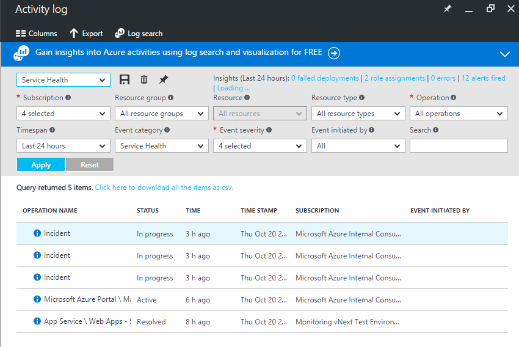

<properties
    pageTitle="Nachverfolgen von Azure Dienststatus mit Azure Monitor Aktivitätsprotokolle | Microsoft Azure"
    description="Informieren Sie sich beim Azure Leistung Verschlechterung oder einen bestimmten Dienst Interruptions aufgetreten ist. "
    authors="rboucher"
    manager="carolz"
    editor=""
    services="monitoring-and-diagnostics"
    documentationCenter="monitoring-and-diagnostics"/>

<tags
    ms.service="monitoring-and-diagnostics"
    ms.workload="na"
    ms.tgt_pltfrm="na"
    ms.devlang="na"
    ms.topic="article"
    ms.date="10/20/2016"
    ms.author="robb"/>

# Nachverfolgen von Azure Dienststatus mit Azure Monitor Aktivitätsprotokolle

Azure publicizes jedes Mal, wenn eine Unterbrechung oder Leistung dienstbeeinträchtigung vorhanden ist. Sie können diese Ereignisse im Azure-Portal durchsuchen, und können Sie auch die [REST-API](https://msdn.microsoft.com/library/azure/dn931927.aspx) oder [.NET SDK](https://www.nuget.org/packages/Microsoft.Azure.Insights/) sämtlicher Ereignisse programmgesteuert Zugriff auf.

## Durchsuchen Sie die Protokolle der Dienst Gesundheit für Ihr Abonnement

1. Melden Sie sich bei der [Azure-Portal](https://portal.azure.com/).

2. Klicken Sie auf **Start** sollte eine Kachel aufgerufen **Dienststatus**angezeigt werden. Klicken Sie darauf.

    

3. Wird eine Liste aller Bereiche in Azure. Klicken Sie auf eine beliebige Region, um die Aktivität Log-Abfrage anzuzeigen, die Service-Fälle anzeigt, die die Abonnements in den letzten 24 Stunden beeinträchtigt werden.

    

4. Sie können die Details für einen einzelnen Vorfall anzeigen, indem Sie auf das Ereignis in der Tabelle.

5. Ändern der **Timespan** um ein längerer Zeitrahmen anzuzeigen.

## Nächste Schritte

* [Verfügbarkeit von Monitor und Reaktionszeiten einer beliebigen Webseite](../application-insights/app-insights-monitor-web-app-availability.md) mit Anwendung Einblicken, damit Sie Ihre Seite herauszufinden, ob können ist nach unten.
