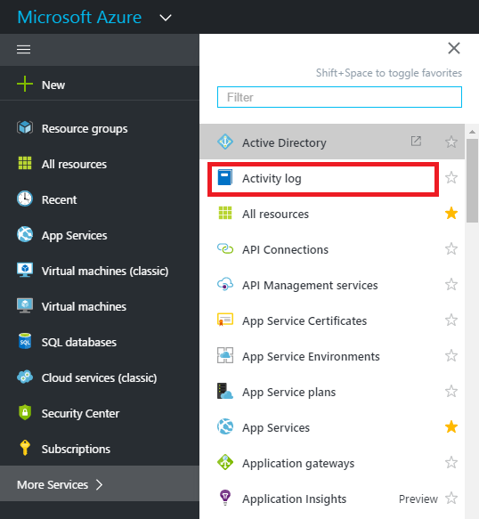
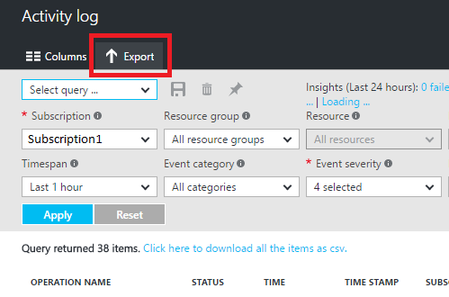
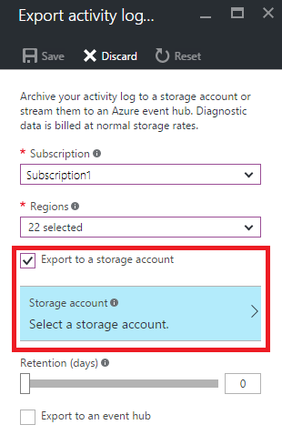

<properties
    pageTitle="Das Aktivitätsprotokoll Azure archivieren | Microsoft Azure"
    description="Informationen Sie zum Archivieren von Azure Aktivität im Protokoll langfristig in einem Speicherkonto."
    authors="johnkemnetz"
    manager="rboucher"
    editor=""
    services="monitoring-and-diagnostics"
    documentationCenter="monitoring-and-diagnostics"/>

<tags
    ms.service="monitoring-and-diagnostics"
    ms.workload="na"
    ms.tgt_pltfrm="na"
    ms.devlang="na"
    ms.topic="article"
    ms.date="08/23/2016"
    ms.author="johnkem"/>

# <a name="archive-the-azure-activity-log"></a>Das Aktivitätsprotokoll Azure archivieren
In diesem Artikel zeigen wir die Verwendung des Azure-Portals PowerShell-Cmdlets oder Plattformen CLI archivieren Ihrer [**Azure Aktivität Log**](monitoring-overview-activity-logs.md) in einem Speicherkonto. Diese Option ist sinnvoll, wenn Sie Ihre Aktivitätsprotokoll mehr als 90 Tage (mit Vollzugriff auf die Aufbewahrungsrichtlinie) für Audit, statische Analyse oder Sicherung beibehalten möchten. Wenn Sie nur Ihre Ereignisse 90 Tage lang beibehalten werden müssen, oder weniger Sie müssen nicht mit einem Speicherkonto Archivierung einrichten, da Aktivität Log in der Azure-Plattform 90 Tage lang aufbewahrt wird ohne Archivierung aktivieren.

## <a name="prerequisites"></a>Erforderliche Komponenten
Bevor Sie beginnen, müssen Sie [ein Speicherkonto erstellen](../storage/storage-create-storage-account.md#create-a-storage-account) , dem Sie Ihre Aktivitätsprotokoll archivieren können. Es wird dringend empfohlen, dass Sie kein vorhandenes Speicherkonto, das andere, die nicht Überwachung darin gespeicherte Daten verwenden, damit Sie besser steuern, den Zugriff auf Daten für die Überwachung können enthält. Wenn Sie auch Diagnoseprotokolle und Kennzahlen mit einem Speicherkonto archivieren, kann es sinnvoll, die mit diesem Konto Speicherplatz für Ihre Protokolldatei sowie alle Überwachung Daten an einer zentralen Stelle beibehalten durchführen. Das Speicherung von Ihnen verwendete Konto muss eine allgemeine Speicher-Konto nicht in einem Blob-Speicher-Konto.

## <a name="log-profile"></a>Log-Profil
Um die Aktivität Log verwenden eine der folgenden Methoden zu archivieren, legen Sie das **Protokoll-Profil** für ein Abonnement aus. Das Protokoll Profil definiert den Typ von Ereignissen, die gespeichert oder gestreamt werden und die Ausgaben – Speicher Konto und/oder Ereignis Hub. Darüber hinaus definiert die Aufbewahrungsrichtlinie (Anzahl der Tage beibehalten) für Ereignisse in einem Speicherkonto gespeichert. Wenn die Aufbewahrungsrichtlinie auf NULL festgelegt ist, werden Ereignisse endlos gespeichert. Andernfalls, kann dies auf einen beliebigen Wert zwischen 1 und 2.147.483.647 festgelegt werden. [Können Sie weitere Informationen zu Log hier Profile](monitoring-overview-activity-logs.md#export-the-activity-log-with-log-profiles).

## <a name="archive-the-activity-log-using-the-portal"></a>Verwenden des Portals Aktivitätsprotokoll archivieren
1. Klicken Sie im Portal auf den Link **Aktivität Log** in der linken Navigationsleiste. Wenn Sie einen Link für die Protokolldatei angezeigt werden, klicken Sie zuerst auf den Link **Weitere Dienste** .

    
2. Am oberen Rand der Blade klicken Sie auf **Exportieren**.

    
3. Klicken Sie in das Blade, das angezeigt wird, aktivieren Sie das Kontrollkästchen für die **mit einem Speicherkonto exportieren** , und wählen Sie ein Speicherkonto.

    
4. Verwenden den Schieberegler oder das Textfeld, Definieren einer Anzahl von Tagen für die Aktivität protokollieren von Ereignissen in Ihr Speicherkonto abgelegt werden soll. Wenn Sie es vorziehen, dass Ihre Daten beibehalten im Speicherkonto endlos, legen Sie diese Zahl 0 (null).
5. Klicken Sie auf **Speichern**.

## <a name="archive-the-activity-log-via-powershell"></a>Archivieren der Aktivität Log über PowerShell
```
Add-AzureRmLogProfile -Name my_log_profile -StorageAccountId /subscriptions/s1/resourceGroups/myrg1/providers/Microsoft.Storage/storageAccounts/my_storage -Locations global,westus,eastus -RetentionInDays 180 -Categories Write,Delete,Action
```

| Eigenschaft         | Erforderlich | Beschreibung                                                                                                                                                                                                                                                                                       |
|------------------|----------|---------------------------------------------------------------------------------------------------------------------------------------------------------------------------------------------------------------------------------------------------------------------------------------------------|
| StorageAccountId | Nein       | Ressourcen-ID des Kontos Speicher auf die Aktivitätsprotokolle gespeichert werden soll.                                                                                                                                                                                                                        |
| Speicherorte        | Ja      | Durch Trennzeichen getrennte Liste der Gebiete, die für die Aktivität Log Ereignisse erfasst werden soll. Sie können eine Liste aller Regionen [finden Sie auf dieser Seite](https://azure.microsoft.com/en-us/regions) oder mithilfe [Der Azure Management REST-API](https://msdn.microsoft.com/library/azure/gg441293.aspx)anzeigen. |
| RetentionInDays  | Ja      | Anzahl der Tage zwischen 1 und 2.147.483.647, welche Ereignisse beibehalten werden soll. Der Wert 0 (null) speichert die Protokolle endlos (für immer).                                                                                                                                                                                             |
| Kategorien       | Ja      | Durch Trennzeichen getrennte Liste der Ereigniskategorien, die erfasst werden. Mögliche Werte sind, schreiben, löschen und Aktion.                                                                                                                                                                                 |
## <a name="archive-the-activity-log-via-cli"></a>Archivieren der Aktivität Log über CLI
```
azure insights logprofile add --name my_log_profile --storageId /subscriptions/s1/resourceGroups/insights-integration/providers/Microsoft.Storage/storageAccounts/my_storage --locations global,westus,eastus,northeurope --retentionInDays 180 –categories Write,Delete,Action
```

| Eigenschaft        | Erforderlich | Beschreibung                                                                                                                                                                                                                                                                                       |
|-----------------|----------|---------------------------------------------------------------------------------------------------------------------------------------------------------------------------------------------------------------------------------------------------------------------------------------------------|
| Namen            | Ja      | Der Name Ihres Profils Protokoll.                                                                                                                                                                                                                                                                         |
| storageId       | Nein       | Ressourcen-ID des Kontos Speicher auf die Aktivitätsprotokolle gespeichert werden soll.                                                                                                                                                                                                                        |
| Speicherorte       | Ja      | Durch Trennzeichen getrennte Liste der Gebiete, die für die Aktivität Log Ereignisse erfasst werden soll. Sie können eine Liste aller Regionen [finden Sie auf dieser Seite](https://azure.microsoft.com/en-us/regions) oder mithilfe [Der Azure Management REST-API](https://msdn.microsoft.com/library/azure/gg441293.aspx)anzeigen. |
| retentionInDays | Ja      | Anzahl der Tage zwischen 1 und 2.147.483.647, welche Ereignisse beibehalten werden soll. Speichern eines Werts von 0 (null) die Protokolle endlos (für immer).                                                                                                                                                                                             |
| Kategorien      | Ja      | Durch Trennzeichen getrennte Liste der Ereigniskategorien, die erfasst werden. Mögliche Werte sind, schreiben, löschen und Aktion.                                                                                                                                                                                 |

## <a name="storage-schema-of-the-activity-log"></a>Speicherschema, der das Protokoll Aktivität
Nachdem Sie Archivierung eingerichtet haben, wird ein Containers Speicher im Speicherkonto erstellt, sobald ein Protokoll Aktivität Ereignis eintritt. Führen Sie die Blobs innerhalb des Containers das gleiche Format über die Aktivität Log und Diagnoseprotokolle. Die Struktur der folgenden Blobs lautet:

> Einsichten-Betrieb-Protokolle/Name = Standard/ResourceId = / ABONNEMENTS / {Abonnement-ID} / y = {numerische vierstellige} / m = {zweistellige numerischen Monat} / d = {zweistellige numerischen Tag} / h = {zweistellige 24-Stunden-Format hour}/m=00/PT1H.json

Zum Beispiel möglicherweise ein Blob-Namen:

> Insights-Operational-Logs/Name=default/ResourceID=/SUBSCRIPTIONS/s1id1234-5679-0123-4567-890123456789/y=2016/m=08/d=22/h=18/m=00/PT1H.JSON

Jede PT1H.json Blob enthält einen JSON-Blob von Ereignissen, die innerhalb einer Stunde in der Blob-URL angegebenen aufgetreten sind (z. B. h = 12). Während der präsentieren Stunde sind die Datei PT1H.json Ereignisse angefügt, sobald sie auftreten. Der Wert für die Minuten (m = 00) ist immer 00, da die Aktivität protokollieren von Ereignissen in einzelne Blobs pro Stunde aufgeteilt werden.

In der Datei PT1H.json wird jedes Ereignis "Datensätze" Matrix folgenden Format gespeichert:

```
{
    "records": [
        {
            "time": "2015-01-21T22:14:26.9792776Z",
            "resourceId": "/subscriptions/s1/resourceGroups/MSSupportGroup/providers/microsoft.support/supporttickets/115012112305841",
            "operationName": "microsoft.support/supporttickets/write",
            "category": "Write",
            "resultType": "Success",
            "resultSignature": "Succeeded.Created",
            "durationMs": 2826,
            "callerIpAddress": "111.111.111.11",
            "correlationId": "c776f9f4-36e5-4e0e-809b-c9b3c3fb62a8",
            "identity": {
                "authorization": {
                    "scope": "/subscriptions/s1/resourceGroups/MSSupportGroup/providers/microsoft.support/supporttickets/115012112305841",
                    "action": "microsoft.support/supporttickets/write",
                    "evidence": {
                        "role": "Subscription Admin"
                    }
                },
                "claims": {
                    "aud": "https://management.core.windows.net/",
                    "iss": "https://sts.windows.net/72f988bf-86f1-41af-91ab-2d7cd011db47/",
                    "iat": "1421876371",
                    "nbf": "1421876371",
                    "exp": "1421880271",
                    "ver": "1.0",
                    "http://schemas.microsoft.com/identity/claims/tenantid": "1e8d8218-c5e7-4578-9acc-9abbd5d23315 ",
                    "http://schemas.microsoft.com/claims/authnmethodsreferences": "pwd",
                    "http://schemas.microsoft.com/identity/claims/objectidentifier": "2468adf0-8211-44e3-95xq-85137af64708",
                    "http://schemas.xmlsoap.org/ws/2005/05/identity/claims/upn": "admin@contoso.com",
                    "puid": "20030000801A118C",
                    "http://schemas.xmlsoap.org/ws/2005/05/identity/claims/nameidentifier": "9vckmEGF7zDKk1YzIY8k0t1_EAPaXoeHyPRn6f413zM",
                    "http://schemas.xmlsoap.org/ws/2005/05/identity/claims/givenname": "John",
                    "http://schemas.xmlsoap.org/ws/2005/05/identity/claims/surname": "Smith",
                    "name": "John Smith",
                    "groups": "cacfe77c-e058-4712-83qw-f9b08849fd60,7f71d11d-4c41-4b23-99d2-d32ce7aa621c,31522864-0578-4ea0-9gdc-e66cc564d18c",
                    "http://schemas.xmlsoap.org/ws/2005/05/identity/claims/name": " admin@contoso.com",
                    "appid": "c44b4083-3bq0-49c1-b47d-974e53cbdf3c",
                    "appidacr": "2",
                    "http://schemas.microsoft.com/identity/claims/scope": "user_impersonation",
                    "http://schemas.microsoft.com/claims/authnclassreference": "1"
                }
            },
            "level": "Information",
            "location": "global",
            "properties": {
                "statusCode": "Created",
                "serviceRequestId": "50d5cddb-8ca0-47ad-9b80-6cde2207f97c"
            }
        }
    ]
}
```


| Name des Elements    | Beschreibung                                                                                                    |
|-----------------|----------------------------------------------------------------------------------------------------------------|
| Zeit            | Zeitstempel, wenn das Ereignis vom Azure-Dienst Verarbeitung der Anforderung entspricht das Ereignis erstellt wurde.    |
| resourceId      | Ressourcen-ID des betroffenen Ressource.                                                                          |
| operationName   | Name des Vorgangs.                                                                                         |
| Kategorie        | Kategorie der Aktion, z. b. Schreiben, lesen, Aktion.                                                               |
| ResultType-Wert      | Der Datentyp des Ergebnisses, z. b. Erfolgreich, fehlgeschlagen, starten                                                            |
| resultSignature | Abhängig von der Ressourcenart.                                                                                  |
| durationMs      | Dauer des Vorgangs in Millisekunden                                                                      |
| callerIpAddress | IP-Adresse des Benutzers, der den Vorgang, eine UPN-Anspruch oder SPN anfordern, die auf Grundlage der Verfügbarkeit ausgeführt hat.         |
| correlationId   | In der Regel eine GUID im Zeichenfolgenformat. Die gleiche Uber Aktion gehören Ereignisse, die eine CorrelationId freigeben.         |
| Identität        | Beschreibung der Autorisierung und Ansprüche JSON-Blob.                                                             |
| Autorisierung   | BLOB RBAC Eigenschaften des Ereignisses. Normalerweise enthält die Eigenschaften "Aktion", "Rolle" und "Bereich" aus.            |
| Ebene           | Ebene des Ereignisses. Die folgenden Werte: "Kritisch", "Zurück", "Warnung", "Information" und "Ausführlich" |
| Speicherort        | Region, in dem die Position aufgetreten ist (oder globaler).                                                             |
| Eigenschaften      | Festlegen von `<Key, Value>` Paare (d. h. Wörterbuch), beschreibt die Details des Ereignisses.                             |

> [AZURE.NOTE] Die Eigenschaften und die Verwendung dieser Eigenschaften variieren je nach der Ressource.

## <a name="next-steps"></a>Nächste Schritte
- [Herunterladen von Blobs für die Analyse](../storage/storage-dotnet-how-to-use-blobs.md#download-blobs)
- [Übertragen der Aktivität Log an Ereignis Hubs](monitoring-stream-activity-logs-event-hubs.md)
- [Erfahren Sie mehr über das Protokoll Aktivität](monitoring-overview-activity-logs.md)
