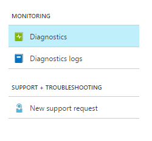
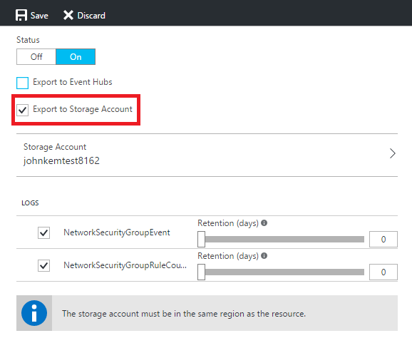

<properties
    pageTitle="Archivieren von Azure Diagnoseprotokolle | Microsoft Azure"
    description="Erfahren Sie, wie Ihre Azure Diagnoseprotokolle für langfristig in einem Speicherkonto zu archivieren."
    authors="johnkemnetz"
    manager="rboucher"
    editor=""
    services="monitoring-and-diagnostics"
    documentationCenter="monitoring-and-diagnostics"/>

<tags
    ms.service="monitoring-and-diagnostics"
    ms.workload="na"
    ms.tgt_pltfrm="na"
    ms.devlang="na"
    ms.topic="article"
    ms.date="08/26/2016"
    ms.author="johnkem"/>

# <a name="archive-azure-diagnostic-logs"></a>Archivieren von Azure Diagnoseprotokolle
In diesem Artikel zeigen wir die Verwendung des Azure-Portals PowerShell-Cmdlets, CLI oder REST-API um zu archivieren Ihrer [Azure Diagnoseprotokolle](monitoring-overview-of-diagnostic-logs.md) in einem Speicherkonto. Diese Option ist sinnvoll, wenn Sie Ihre Diagnoseprotokolle mit einer optionalen Aufbewahrungsrichtlinie für Audit, statische Analyse oder Sicherung beibehalten möchten.

## <a name="prerequisites"></a>Erforderliche Komponenten
Bevor Sie beginnen, müssen Sie [ein Speicherkonto erstellen](../storage/storage-create-storage-account.md#create-a-storage-account) , dem Sie Ihre Diagnoseprotokolle archivieren können. Es wird dringend empfohlen, dass Sie kein vorhandenes Speicherkonto, das andere, die nicht Überwachung darin gespeicherte Daten verwenden, damit Sie besser steuern, den Zugriff auf Daten für die Überwachung können enthält. Wenn Sie Ihre Aktivitäten protokollieren und diagnostic Kennzahlen mit einem Speicherkonto archiviert werden, kann es sinnvoll, die mit diesem Konto Speicherplatz für Ihre Diagnoseprotokolle sowie alle Überwachung Daten an einer zentralen Stelle beibehalten durchführen. Das Speicherung von Ihnen verwendete Konto muss eine allgemeine Speicher-Konto nicht in einem Blob-Speicher-Konto.

## <a name="diagnostic-settings"></a>Diagnoseeinstellungen
Um Ihre Diagnoseprotokolle verwenden eine der folgenden Methoden zu archivieren, legen Sie einer **Diagnoseprotokollen Einstellung** für eine bestimmte Ressource an. Einer Diagnoseprotokollen Einstellung für eine Ressource die Kategorien der definiert wurden, die gespeichert oder gestreamt werden und die Ausgaben protokolliert – Speicher Konto und/oder Ereignis Hub. Darüber hinaus definiert die Aufbewahrungsrichtlinie (Anzahl der Tage beibehalten) für Ereignisse jeder Log Kategorie in einem Speicherkonto gespeichert. Wenn eine Aufbewahrungsrichtlinie auf NULL festgelegt ist, werden Ereignisse für diese Kategorie Log (die besteht darin, die besagen, endlos), endlos gespeichert. Eine Aufbewahrungsrichtlinie kann eine beliebige Anzahl von Tagen zwischen 1 und 2.147.483.647 andernfalls sein. [Können Sie weitere Informationen zu diagnoseeinstellungen hier](monitoring-overview-of-diagnostic-logs.md#diagnostic-settings).

## <a name="archive-diagnostic-logs-using-the-portal"></a>Archivieren von Diagnoseprotokollen Verwenden des Portals

1. Klicken Sie im Portal in das Blade Ressourcen für die Ressource aus, an der Sie aktivieren Archivierung von Diagnoseprotokollen möchten.
2. Wählen Sie im Abschnitt **Überwachung** der Ressource im Einstellungsmenü **Diagnose**.

    
3. Aktivieren Sie das Kontrollkästchen für **Speicher-Konto exportieren**, und wählen Sie dann ein Speicherkonto. Legen Sie gegebenenfalls eine Anzahl von Tagen beibehalten diese Protokolle mithilfe der **Aufbewahrung (Tage)** Schieberegler. Ein Aufbewahrung von 0 (null) Tagen speichert die Protokolle endlos.

    
4. Klicken Sie auf **Speichern**.

Diagnoseprotokolle werden dem Konto Speicher archiviert, sobald neue Ereignisdaten generiert werden.

## <a name="archive-diagnostic-logs-via-the-powershell-cmdlets"></a>Archivieren von Diagnoseprotokollen über den PowerShell-Cmdlets

```
Set-AzureRmDiagnosticSetting -ResourceId /subscriptions/s1id1234-5679-0123-4567-890123456789/resourceGroups/testresourcegroup/providers/Microsoft.Network/networkSecurityGroups/testnsg -StorageAccountId /subscriptions/s1id1234-5679-0123-4567-890123456789/resourceGroups/myrg1/providers/Microsoft.Storage/storageAccounts/my_storage -Categories networksecuritygroupevent,networksecuritygrouprulecounter -Enabled $true -RetentionEnabled $true -RetentionInDays 90
```

| Eigenschaft         | Erforderlich | Beschreibung                                                                                           |
|------------------|----------|-------------------------------------------------------------------------------------------------------|
| ResourceId       | Ja      | Ressourcen-ID der Ressource, an der Sie eine Diagnoseprotokollen Einstellung festlegen möchten.                            |
| StorageAccountId | Nein       | Ressourcen-ID des Kontos Speicher auf die Diagnoseprotokolle gespeichert werden soll.                          |
| Kategorien       | Nein       | Durch Trennzeichen getrennte Liste von Kategorien protokollieren aktivieren.                                                     |
| Aktiviert          | Ja      | Boolescher Wert, der angibt, ob die Diagnose aktiviert oder deaktiviert werden, klicken Sie auf diese Ressource sind.                  |
| RetentionEnabled | Nein       | Boolescher Wert, der angibt, wenn eine Aufbewahrungsrichtlinie auf diese Ressource aktiviert sind.                            |
| RetentionInDays  | Nein       | Anzahl der Tage, für die Ereignisse zwischen 1 und 2.147.483.647 beibehalten werden soll. Der Wert 0 (null) speichert die Protokolle endlos. |

## <a name="archive-the-activity-log-via-the-cross-platform-cli"></a>Archivieren Sie das Aktivitätsprotokoll über die Plattformen CLI

```
azure insights diagnostic set --resourceId /subscriptions/s1id1234-5679-0123-4567-890123456789/resourceGroups/testresourcegroup/providers/Microsoft.Network/networkSecurityGroups/testnsg --storageId /subscriptions/s1id1234-5679-0123-4567-890123456789/resourceGroups/myrg1/providers/Microsoft.Storage/storageAccounts/my_storage –categories networksecuritygroupevent,networksecuritygrouprulecounter --enabled true
```

| Eigenschaft         | Erforderlich | Beschreibung                                                                                           |
|------------------|----------|-------------------------------------------------------------------------------------------------------|
| resourceId       | Ja      | Ressourcen-ID der Ressource, an der Sie eine Diagnoseprotokollen Einstellung festlegen möchten.                            |
| storageId        | Nein       | Ressourcen-ID des Kontos Speicher auf die Diagnoseprotokolle gespeichert werden soll.                          |
| Kategorien       | Nein       | Durch Trennzeichen getrennte Liste von Kategorien protokollieren aktivieren.                                                     |
| aktiviert          | Ja      | Boolescher Wert, der angibt, ob die Diagnose aktiviert oder deaktiviert werden, klicken Sie auf diese Ressource sind.                  |

## <a name="archive-diagnostic-logs-via-the-rest-api"></a>Archivieren von Diagnoseprotokollen über die REST-API
Sie Informationen wie Einrichten einer Diagnoseprotokollen Einstellung mithilfe der Azure Monitor REST-API [finden Sie in diesem Dokument](https://msdn.microsoft.com/library/azure/dn931931.aspx) .

## <a name="schema-of-diagnostic-logs-in-the-storage-account"></a>Schema der Diagnoseprotokolle im Speicherkonto
Nachdem Sie Archivierung eingerichtet haben, wird im Speicherkonto ein Containers Speicher erstellt, sobald ein Ereignisses in einem der Kategorien Log auftritt, die Sie aktiviert haben. Führen Sie die Blobs innerhalb des Containers das gleiche Format über Diagnoseprotokolle und der Aktivität Log. Die Struktur der folgenden Blobs lautet:

> Einsichten - Protokolle-{Log Kategorienamen} / ResourceId = / ABONNEMENTS / {Abonnement-ID} /RESOURCEGROUPS/ {Ressourcenname Gruppe} /PROVIDERS/ {Ressourcenname Anbieter} / {Ressource type} / {Ressourcenname} / y = {numerische vierstellige} / m = {zweistellige numerischen Monat} / d = {zweistellige numerischen Tag} / h = {zweistellige 24-Stunden-Format hour}/m=00/PT1H.json

Oder mehr einfach,

> Einsichten - Protokolle-{Log Kategorienamen} / ResourceId = / {Ressource Id} / y = {numerische vierstellige} / m = {zweistellige numerischen Monat} / d = {zweistellige numerischen Tag} / h = {zweistellige 24-Stunden-Format hour}/m=00/PT1H.json

Zum Beispiel möglicherweise ein Blob-Namen:

> insights-logs-networksecuritygrouprulecounter/resourceId=/SUBSCRIPTIONS/s1id1234-5679-0123-4567-890123456789/RESOURCEGROUPS/TESTRESOURCEGROUP/PROVIDERS/MICROSOFT.NETWORK/NETWORKSECURITYGROUP/TESTNSG/y=2016/m=08/d=22/h=18/m=00/PT1H.json

Jede PT1H.json Blob enthält einen JSON-Blob von Ereignissen, die innerhalb einer Stunde in der Blob-URL angegebenen aufgetreten sind (z. B. h = 12). Während der präsentieren Stunde sind die Datei PT1H.json Ereignisse angefügt, sobald sie auftreten. Der Wert für die Minuten (m = 00) ist immer 00, da Diagnoseprotokoll Ereignisse in einzelne Blobs pro Stunde aufgeteilt werden.

In der Datei PT1H.json wird jedes Ereignis "Datensätze" Matrix folgenden Format gespeichert:

```
{
    "records": [
        {
            "time": "2016-07-01T00:00:37.2040000Z",
            "systemId": "46cdbb41-cb9c-4f3d-a5b4-1d458d827ff1",
            "category": "NetworkSecurityGroupRuleCounter",
            "resourceId": "/SUBSCRIPTIONS/s1id1234-5679-0123-4567-890123456789/RESOURCEGROUPS/TESTRESOURCEGROUP/PROVIDERS/MICROSOFT.NETWORK/NETWORKSECURITYGROUPS/TESTNSG",
            "operationName": "NetworkSecurityGroupCounters",
            "properties": {
                "vnetResourceGuid": "{12345678-9012-3456-7890-123456789012}",
                "subnetPrefix": "10.3.0.0/24",
                "macAddress": "000123456789",
                "ruleName": "/subscriptions/ s1id1234-5679-0123-4567-890123456789/resourceGroups/testresourcegroup/providers/Microsoft.Network/networkSecurityGroups/testnsg/securityRules/default-allow-rdp",
                "direction": "In",
                "type": "allow",
                "matchedConnections": 1988
            }
        }
    ]
}
```

| Name des Elements  | Beschreibung                                                                                                 |
|---------------|-------------------------------------------------------------------------------------------------------------|
| Zeit          | Zeitstempel, wenn das Ereignis vom Azure-Dienst Verarbeitung der Anforderung entspricht das Ereignis erstellt wurde. |
| resourceId    | Ressourcen-ID des betroffenen Ressource.                                                                       |
| operationName | Name des Vorgangs.                                                                                      |
| Kategorie      | Log-Kategorie des Ereignisses.                                                                                  |
| Eigenschaften    | Festlegen von `<Key, Value>` Paare (d. h. Wörterbuch), beschreibt die Details des Ereignisses.                            |

> [AZURE.NOTE] Die Eigenschaften und die Verwendung dieser Eigenschaften variieren je nach der Ressource.

## <a name="next-steps"></a>Nächste Schritte
- [Herunterladen von Blobs für die Analyse](../storage/storage-dotnet-how-to-use-blobs.md#download-blobs)
- [Stream Diagnoseprotokolle an Ereignis Hubs](monitoring-stream-diagnostic-logs-to-event-hubs.md)
- [Weitere Informationen zum Diagnoseprotokolle](monitoring-overview-of-diagnostic-logs.md)
