<properties
    pageTitle="Erste Schritte mit Azure Monitor | Microsoft Azure"
    description="Erste Schritte mit Azure Monitor Einblick der Vorgang Ressourcen und eine Aktion aus Daten entfernt."
    authors="johnkemnetz"
    manager="rboucher"
    editor=""
    services="monitoring-and-diagnostics"
    documentationCenter="monitoring-and-diagnostics"/>

<tags
    ms.service="monitoring-and-diagnostics"
    ms.workload="na"
    ms.tgt_pltfrm="na"
    ms.devlang="na"
    ms.topic="article"
    ms.date="10/19/2016"
    ms.author="johnkem"/>

# Erste Schritte mit Azure Monitor

Azure Monitor ist der Platform-Dienst, der eine einzelne Quelle für die Überwachung Azure Ressourcen bietet. Mit Azure Monitor können Sie darstellen, Abfragen, weiterleiten, archivieren und agieren Kennzahlen und Protokolle aus Azure Ressourcen stammen. Sie können mit diesen Daten mit den Monitor Portal Blade, [Monitor PowerShell-Cmdlets](./insights-powershell-samples.md), [Plattformen CLI](insights-cli-samples.md)oder [Azure Monitor REST APIs](https://msdn.microsoft.com/library/dn931943.aspx)arbeiten. In diesem Artikel durchgehen wir nur einige der wichtigsten Komponenten von Azure Monitor, mit dem Portal für Demo ein.

1. Klicken Sie im Portal auf **Weitere Dienste** navigieren Sie, und suchen Sie die Option **Überwachen** . Klicken Sie auf das Sternchensymbol, um diese Option zu Ihrer Favoritenliste hinzufügen, sodass es immer in der linken Navigationsleiste einfach zugänglich ist.

    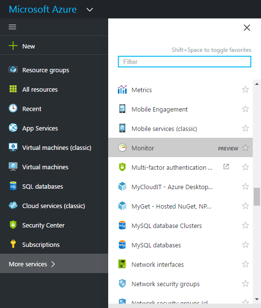

2. Klicken Sie auf die Option **Monitor** , um das Blade **Monitor** zu öffnen. Diese Blade vereint alle Ihre Überwachung Einstellungen und Daten in einer konsolidierten Ansicht. Es wird zuerst zum Abschnitt **Aktivität Log** geöffnet.

    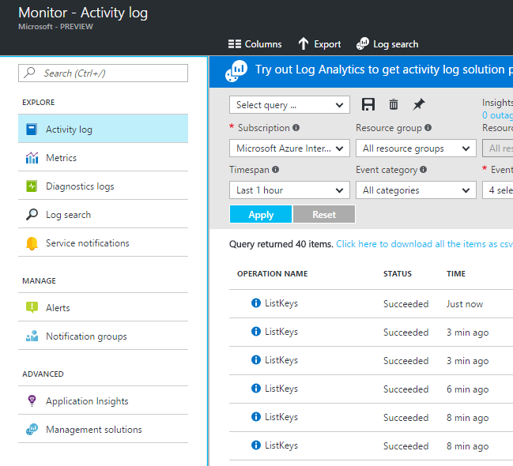

    > [AZURE.WARNING] Die oben angezeigten **Dienst Benachrichtigungen** und **Benachrichtigungsgruppen** -Optionen werden nur auf, die angezeigt werden, die die Private Vorschau dieser Features beigetreten sind.

    Azure Monitor hat drei grundlegende Kategorien von Daten für die Überwachung: die **Aktivität Log**, **Kennzahlen**und **Diagnoseprotokolle**.

3. Klicken Sie auf **Aktivitäten aufzeichnen** , um sicherzustellen, dass der Aktivität Log Abschnitt angezeigt wird.

    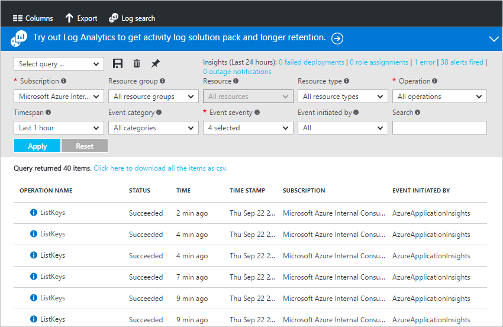

    Der [**Aktivität Log**](./monitoring-overview-activity-logs.md) werden alle Vorgänge für Ressourcen Ihres Abonnements ausgeführt. Mit der Log Aktivität Sie können festlegen, die "Was, wer, und wann ' für alle erstellen, aktualisieren oder Löschen von Ressourcen in Ihr Abonnement. Das Protokoll Aktivität erfahren Sie beispielsweise, wenn eine Web app angehalten wurde und wer unterbrochen haben. Aktivität protokollieren von Ereignissen werden gespeichert in der Plattform und 90 Tage lang Abfragen zur Verfügung.
   
    Sie können erstellen und Speichern von Abfragen zur allgemeinen Filter und dann die wichtigsten Abfragen zu einem Portal Dashboard zu fixieren, damit Sie immer wissen, wenn Ereignisse, die Ihren Kriterien entsprechen aufgetreten sind.

4. Filtern Sie die Ansicht zu einer bestimmten Ressourcengruppe in der letzten Woche, und klicken Sie auf die Schaltfläche **Speichern** .

    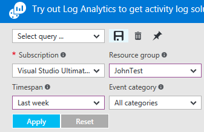

5. Klicken Sie nun auf die Schaltfläche zum **Anheften** .

    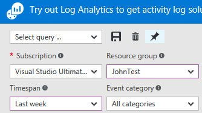

    Die meisten Ansichten in dieser Anleitung erfahren können einem Dashboard angeheftet sein. Auf diese Weise können Sie eine einzelne Informationsquelle für Betrieb Daten auf Ihrer Dienste zu erstellen. 

6. Kehren Sie zu Ihr Dashboard zurück. Sie können nun sehen, dass es sich bei der Abfrage (und die Anzahl der Ergebnisse) in Ihr Dashboard angezeigt werden. Dies ist sinnvoll, wenn Sie möchten schnell Aktionen höchst-Profil anzuzeigen, die zuletzt in Ihrem Abonnement z.B. aufgetreten sind. eine neue Rolle zugewiesen wurde, oder ein virtuellen Computers wurde gelöscht.

    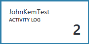

7. Die Kachel **Monitor** wieder ein, und klicken Sie im Abschnitt **Kennzahlen** auf. Sie müssen zuerst eine Ressource durch Filtern und auswählen, verwenden am oberen Rand der Blade Dropdownoptionen auswählen.

    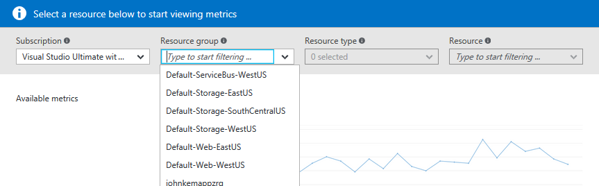

    Alle Azure Ressourcen ausgeben [**Kennzahlen**](./monitoring-overview-metrics.md). Diese Ansicht vereint alle Kriterien in einem Bereich von Glas, Sie einfach sehen, wie Ihre Ressourcen durchführen.

8. Nachdem Sie eine Ressource ausgewählt haben, werden alle Verfügbare Kriterien auf der linken Seite des Blades angezeigt. Sie können Diagramm mehrere Kennzahlen gleichzeitig, indem Sie Kennzahlen auswählen und ändern den Graph-Typ und Zeitbereich. Sie können auch alle metrische Benachrichtigungen festlegen für diese Ressource anzeigen.

    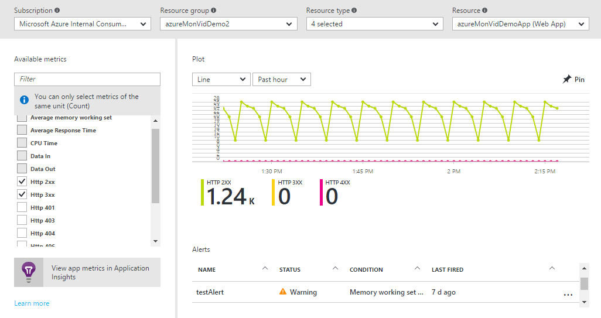

    > [AZURE.NOTE] Einige Metrik sind nur verfügbar, indem [Anwendung Einsichten](../application-insights/app-insights-overview.md) und/oder Windows oder Linux Azure-Diagnose auf Ihre Ressourcen aktivieren.

9. Wenn Sie mit einem Diagramm zufrieden sind, können Sie die Schaltfläche zum **Anheften** , um zum Dashboard zu fixieren.

10. Kehren Sie zu dem **Monitor** Blade zurück, und klicken Sie auf **Diagnoseprotokolle**.

    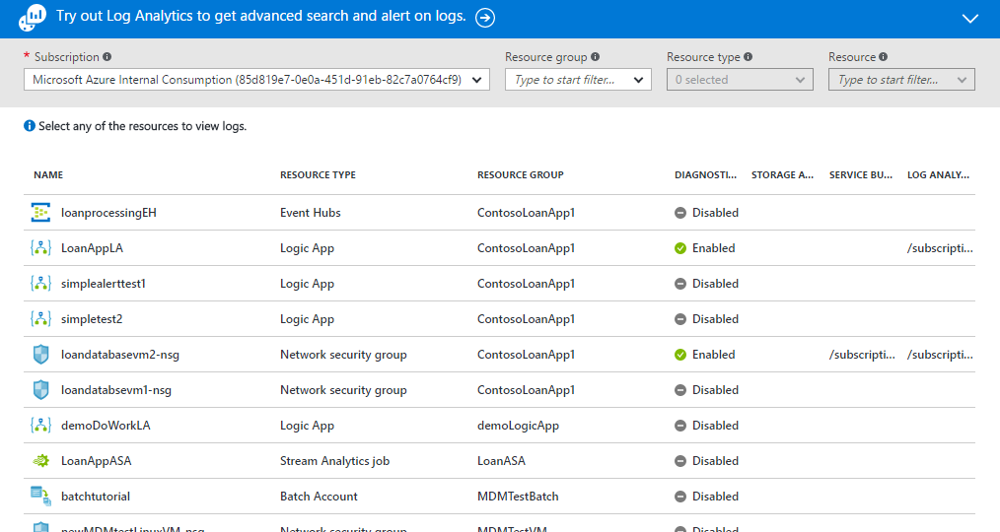

    [**Diagnoseprotokolle**](monitoring-overview-of-diagnostic-logs.md) sind Protokolle ausgegeben *durch* eine Ressource, die über den Vorgang, der Ressource, die bestimmte Daten enthalten. Beispielsweise sind Netzwerk Sicherheit Gruppe Regel Indikatoren und Logik App Workflow Protokolle beider Arten von Diagnoseprotokollen. Diese Protokolle können in einem Speicherkonto gespeichert, an ein Ereignis Verteiler gestreamt und/oder [Log Analytics](../log-analytics/log-analytics-overview.md)gesendet werden. Log Analytics handelt es sich um Microsoft Betrieb Intelligence Produkt für erweiterte Suche und Alarme.
   
    Sie können im Portal anzeigen und Filtern Sie eine Liste aller Ressourcen in Ihr Abonnement, um festzustellen, ob sie Diagnoseprotokolle aktiviert haben.

11. Klicken Sie auf eine Ressource in den Diagnoseprotokollen Blade. Wenn Diagnoseprotokolle in einem Konto Storage gespeichert sind, wird eine Liste der stündlich Protokolle angezeigt, die Sie direkt herunterladen können.

    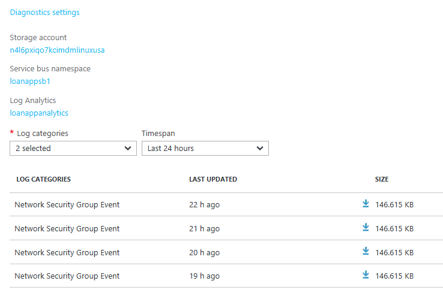

    Sie können auch **Diagnoseeinstellungen**, wodurch Sie einrichten oder Ändern der Einstellungen für Archivierung mit einem Speicherkonto, streaming an Ereignis Hubs oder in einen Arbeitsbereich Log Analytics senden klicken.

    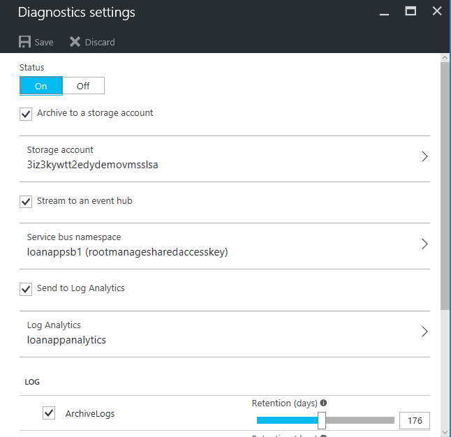

    Wenn Sie Diagnoseprotokolle auf Log Analytics eingerichtet haben, können Sie dann im Abschnitt **Protokoll suchen** des Portals suchen.

12. Navigieren Sie zum Abschnitt **Benachrichtigungen** des Blades überwachen.

    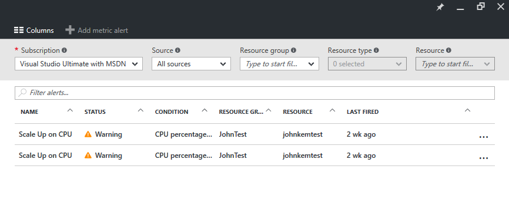

    Hier können Sie alle [**Benachrichtigungen**](./monitoring-overview-alerts.md) auf Azure Ressourcen verwalten. Dies umfasst Benachrichtigungen auf Kennzahlen, Aktivität protokollieren Ereignisse (in privaten Preview), Anwendung Einsichten Webtests (Speicherorte) und Anwendung Einsichten proaktive Diagnose. Benachrichtigungen können eine e-Mail-Nachricht gesendet werden oder HTTP POST an eine URL Webhook auslösen.
   
13. Klicken Sie auf **metrischen Benachrichtigung hinzufügen** , um eine Benachrichtigung zu erstellen.

    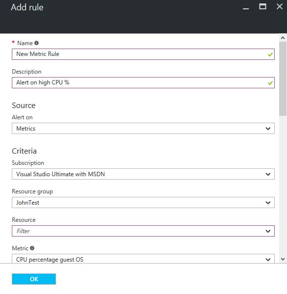

    Sie können dann eine Benachrichtigung an Ihr Dashboard in seinem Zustand auf einfache Weise zu einem beliebigen Zeitpunkt feststellen anheften.

14. Im Abschnitt Monitor enthält auch Links zu [Anwendung Einsichten](../application-insights/app-insights-overview.md) Applikationen und [Log Analytics](../log-analytics/log-analytics-overview.md) Management-Lösungen. Diese anderen Microsoft-Produkten haben feste Einbindung von Azure überwachen.

15. Wenn Sie die Anwendung Einblicken oder Log Analytics nicht verwenden, sind wahrscheinlich Azure Monitor eine Zusammenarbeit mit Ihrer aktuellen Überwachung, Protokollierung und Warnfunktion Produkte verfügt. Finden Sie unter unseren [Partner-Seite](./monitoring-partners.md) für eine vollständige Liste und Anleitungen integriert werden soll.

Indem Sie wie folgt vor, und fixieren alle entsprechende Achsen in einem Dashboard, können Sie Ihrer Anwendung und Infrastruktur wie diese eine umfassende Ansichten erstellen:

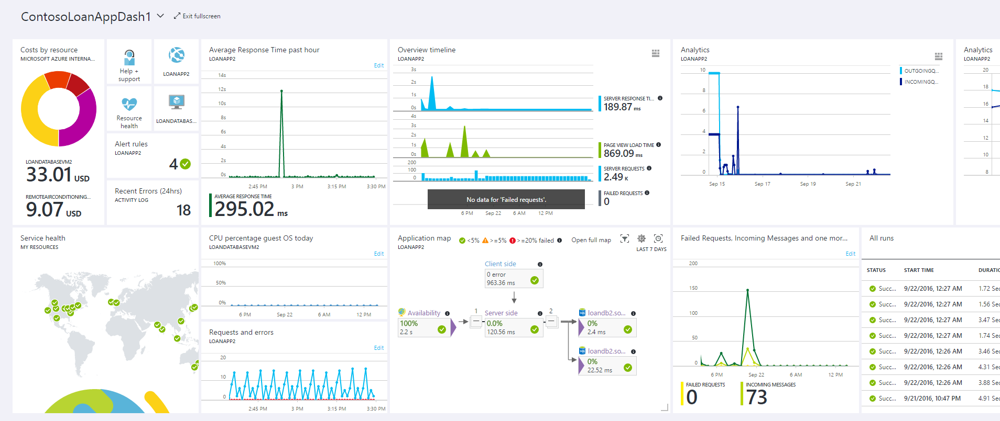

## Nächste Schritte
- Lesen Sie die [Azure Monitor im Überblick](./monitoring-overview.md)
