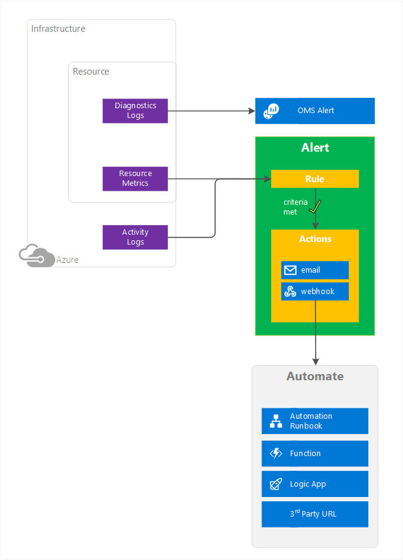

<properties
    pageTitle="Übersicht über Benachrichtigungen in Microsoft Azure | Microsoft Azure"
    description="Benachrichtigungen aktivieren Sie Azure Ressource Kennzahlen, Ereignisse oder Protokolle überwachen und benachrichtigt werden, wenn eine von Ihnen angegebenen Bedingung erfüllt ist."
    authors="rboucher"
    manager="carolz"
    editor=""
    services="monitoring-and-diagnostics"
    documentationCenter="monitoring-and-diagnostics"/>

<tags
    ms.service="monitoring-and-diagnostics"
    ms.workload="na"
    ms.tgt_pltfrm="na"
    ms.devlang="na"
    ms.topic="article"
    ms.date="09/24/2016"
    ms.author="robb"/>

# Warnungen im Microsoft Azure im Überblick

Dieser Artikel beschreibt, welche Benachrichtigungen, werden deren Vorteile, und verwenden Sie diese Schritte.  

## Was sind Benachrichtigungen?
Benachrichtigungen sind eine Methode Überwachung Azure Ressource Kennzahlen, Ereignisse, oder Protokolle und dann bei einer Bedingung erfüllt ist angegebenen benachrichtigt.

Sie können basierte auf Benachrichtigungen erhalten:

- **Metrische Werte**: Diese Warnung ausgelöst, wenn der Wert einer angegebenen Metrik einen Schwellenwert überschreitet, die Sie in eine beliebige Richtung zuweisen. D. h., löst beide Wenn zuerst die Bedingung erfüllt ist, und klicken Sie dann später an, die Bedingung ist nicht mehr erfüllt.
- **Aktivität protokollieren von Ereignissen**: jedes Ereignis oder nur, wenn eine bestimmte Anzahl von Ereignissen auftreten, kann diese Warnung auslösen.

## Benachrichtigungen in verschiedenen Azure-Diensten

Benachrichtigungen stehen in verschiedenen Diensten, einschließlich:

- **Anwendung Einsichten**: ermöglicht web testen und Metrisch Benachrichtigungen. Finden Sie unter [Festlegen von Benachrichtigungen in Anwendung Einsichten](../application-insights/app-insights-alerts.md) und [Monitor Verfügbarkeit und Reaktionszeiten sämtlicher Websites](../application-insights/app-insights-monitor-web-app-availability.md).
- **Log Analytics (Operations Management Suite)**: ermöglicht das routing von Diagnoseprotokollen zu Log Analytics. Vorgänge Management Suite ermöglicht Metrisch, das Protokoll und andere Arten benachrichtigen. Weitere Informationen finden Sie unter [Warnungen im Log Analytics](../log-analytics/log-analytics-alerts.md).  
- **Azure Monitor**: Benachrichtigungen Grundlage metrischen Werte und Aktivität protokollieren von Ereignissen ermöglicht. Azure Monitor enthält die [Azure Monitor REST-API](https://msdn.microsoft.com/library/dn931943.aspx).  Weitere Informationen finden Sie unter [Verwenden der Azure-Portal, PowerShell oder der Benutzeroberfläche Line Benachrichtigungen zu erstellen](insights-alerts-portal.md).

## Benachrichtigen Aktionen
Sie können eine Benachrichtigung, um Folgendes konfigurieren:

- Senden Sie die e-Mail-Benachrichtigungen Dienstadministrator, Co-Administratoren oder weiteren e-Mail-Adressen, die Sie angeben.
- Rufen Sie eine Webhook, womit Sie zusätzliche Automatisierung Aktionen starten kann.

 

## Nächste Schritte

Erhalten von Informationen zu Warnungsregeln und konfigurieren sie mithilfe von:

- [Azure-portal](insights-alerts-portal.md)
- [PowerShell](insights-alerts-powershell.md)
- [Line Interface (CLI)](insights-alerts-command-line-interface.md)
- [Azure Monitor REST-API](https://msdn.microsoft.com/library/azure/dn931945.aspx)
