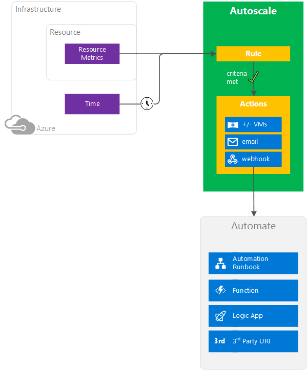
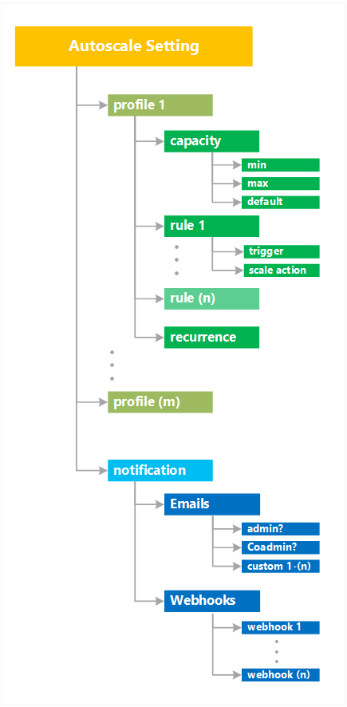

<properties
    pageTitle="Übersicht über automatisch skalieren in Microsoft Azure-virtuellen Computern, Cloud Services und Web Apps | Microsoft Azure"
    description="Übersicht über die in Microsoft Azure skalieren. Gilt für virtuelle Computer, Cloud Services und Web Apps."
    authors="rboucher"
    manager="carolz"
    editor=""
    services="monitoring-and-diagnostics"
    documentationCenter="monitoring-and-diagnostics"/>

<tags
    ms.service="monitoring-and-diagnostics"
    ms.workload="na"
    ms.tgt_pltfrm="na"
    ms.devlang="na"
    ms.topic="article"
    ms.date="09/06/2016"
    ms.author="robb"/>

# Übersicht über automatisch skalieren in Microsoft Azure-virtuellen Computern, Cloud Services und Web Apps

Dieser Artikel beschreibt, welche Microsoft Azure automatisch skalieren, wird deren Vorteile, und verwenden diese Schritte.  

Azure Monitor automatisch skalieren gilt nur für [Virtuellen Computern skalieren Sets](https://azure.microsoft.com/services/virtual-machine-scale-sets/), [Cloud Services](https://azure.microsoft.com/services/cloud-services/)und [App-Verwaltungsdienst - Web Apps](https://azure.microsoft.com/services/app-service/web/).

>[AZURE.NOTE] Azure besitzt zwei Methoden zum Skalieren. Eine ältere Version von automatisch skalieren gilt virtuellen Computern (Verfügbarkeit Sets) aus. Dieses Feature nur eingeschränkt unterstützt, und wir empfehlen virtuellen Computer Maßstab Gruppen für schneller und die Zuverlässigkeit automatisch skalieren Support migrieren. In diesem Artikel ist ein Link zum Verwenden von älteren Technologie enthalten.  

## Was ist automatisch skalieren?

Automatisch skalieren können Sie die richtige Menge an Ressourcen, die ausgeführt werden, um die Auslastung der Anwendung verarbeitet haben. Sie können Sie Ressourcen zum Behandeln Erhöhung laden und Entfernen von Ressourcen, die Kontotypen darstellen, werden auch sparen Geld hinzufügen im Leerlauf. Sie geben eine Mindest- und Höchstwerte Anzahl der Instanzen ausführen und hinzufügen oder Entfernen von virtuellen Computern automatisch basierend auf einer Reihe von Regeln. Probleme einer minimalen sicher ist wird Ihrer Anwendung immer noch unter keine laden ausgeführt. Probleme maximal beschränkt Ihrer Gesamtkosten möglichen stündlich. Sie skalieren automatisch zwischen diesen zwei weit von Regeln, die Sie erstellen.

 

Wenn Regel Bedingungen erfüllt sind, wird eine oder mehrere automatisch skalieren Aktionen ausgelöst. Sie können hinzufügen und Entfernen von virtuellen Computern oder andere Aktionen auszuführen. Das folgende Diagramm des Konzepts zeigt dieses Verfahren.  

 

## Erläuterung der Prozess automatisch skalieren
Das folgende Verfahren beziehen sich auf die Teile des vorherigen Diagramms.   

### Ressource Kennzahlen
Ressourcen ausgeben Kennzahlen, die später von Regeln verarbeitet werden. Kennzahlen im Zusammenhang mit unterschiedlichen Methoden.
Virtueller Computer Maßstab Sätze verwendet werden Daten aus Azure Diagnose-Agents aus, während die werden für Web apps und Cloud Services direkt von der Azure-Infrastruktur stammt. Einige häufig verwendeten Statistiken umfassen CPU-Auslastung, arbeitsspeicherauslastung, Thread zählt, Warteschlangenlänge und die Datenträgerverwendung. Eine Liste der welche werden Daten, die Sie verwenden können, finden Sie unter [Allgemeine Kennzahlen automatisch skalieren](insights-autoscale-common-metrics.md).

### Zeit
Zeitplan-basierte Regeln basieren auf UTC. Sie müssen Ihre Zeitzone beim Einrichten Ihrer Regeln ordnungsgemäß festlegen.  

### Regeln
Das Diagramm zeigt nur eine Regel für automatisch skalieren, jedoch können Sie viele davon haben. Sie können komplexe überlappende Regeln, die für Ihre Situation nach Bedarf erstellen.  Regeltypen einbeziehen  

 - **Metrik-basierten** – beispielsweise Aktion beim CPU-Auslastung über 50 % liegt.
 - **Zeitbasierte** – beispielsweise Auslösen eines Webhook jeder 8 Uhr am Samstag in einer bestimmten Zeitzone.

Metrik-basierte Regeln Anwendung Auslastung messen und hinzufügen oder Entfernen von virtuellen Computern basierend auf diesen laden. Zeitplan-basierte Regeln können Sie skaliert werden, wenn Sie finden Sie unter Zeitmuster in Ihrem laden und möchten, bevor eine mögliche laden erhöhen skalieren oder verkleinern auftritt.  

### Aktionen und Automatisierung

Regeln können eine oder mehrere Arten von Aktionen auslösen.

- **Skalieren** – Maßstab virtuellen Computern oder verkleinern
- **E-Mail** - Senden einer e-Mail an Administratoren Abonnement, co-Administratoren und/oder weiteren e-Mail-Adresse, die Sie angeben
- **Automatisieren über Webhooks** - Anruf Webhooks, die mehrere komplexe Aktionen innerhalb oder außerhalb der Azure auslösen können. Innerhalb Azure können Sie eine Azure Automatisierung Runbooks, Azure-Funktion oder Azure Logik App starten. Beispiel für 3rd Party URL außerhalb Azure gehören Dienste wie Pufferzeit und Twilio.

## Automatisch skalieren-Einstellungen
Automatisch skalieren verwenden Sie die folgenden Terminologie und Struktur.

- Eine **automatisch skalieren-Einstellung** wird von der automatisch skalieren-Engine feststellen, ob Sie nach oben oder unten skalieren gelesen. Sie enthält eine Profile, Informationen zu der Ressource, und klicken Sie auf Einstellungen für Benachrichtigungen.
    - Ein **Profil automatisch skalieren** ist eine Kombination aus einer Kapazität, eine Reihe von Regeln für die Trigger und Maßstab Aktionen für das Profil und einer Serie festlegen. Sie können mehrere Profile verfügen, die Sie anderen überlappende Anforderungen erledigen können.
        - Eine **Kapazität Einstellung** gibt an, das Minimum, Maximum und Standardwerte für die Anzahl der Instanzen. [geeignete Ort, um Abb. 1 verwenden]
        - Eine **Regel** enthält einen Trigger – eines Triggers metrischen oder einer Uhrzeit Trigger – und eine Skala Aktion, die angibt, ob automatisch skalieren skaliert werden sollen, nach oben oder unten, wenn diese Regel erfüllt ist.
        - Eine **Serie** gibt an, wann automatisch skalieren dieses Profil in Kraft setzen. Sie können verschiedene automatisch skalieren Profile für unterschiedliche Zeiträume Tag oder die Tage der Woche, beispielsweise haben.
- Eine **Einstellung für Benachrichtigungen** definiert, welche Benachrichtigungen Eintreten ein Ereignisses automatisch skalieren basierend auf die Kriterien eines der automatisch skalieren-Einstellung Profile erfüllen durchgeführt werden soll. Automatisch skalieren kann eine oder mehrere e-Mail-Adressen zu benachrichtigen, oder stellen Sie Anrufe an eine oder mehrere Webhooks.

Die vollständige Liste der konfigurierbare Felder und Beschreibungen steht in der [Automatisch skalieren REST-API](https://msdn.microsoft.com/library/dn931928.aspx).

Codebeispielen finden Sie unter

* [Erweiterte automatisch skalieren Konfiguration Ressourcenmanager Vorlagen für virtuellen Computer Maßstab Mengen verwenden](insights-advanced-autoscale-virtual-machine-scale-sets.md)  
* [Automatisch skalieren REST-API](https://msdn.microsoft.com/library/dn931953.aspx)

## Horizontale im Vergleich mit einer vertikalen Skalierung

Automatisch skalieren erhöht Ressourcen nur Skalen horizontal, die eine Steigerung (",") oder zu verringern ("in") die Anzahl der Instanzen virtueller Computer an.  Horizontal skalieren, also flexibler in einen Cloud-Situation wie potenziell Tausende von virtuellen Computern laden verarbeitet ausgeführt werden können. Vertikale Skalierung unterscheidet. Er behält die gleiche Anzahl von virtuellen Computern, sondern macht den virtuellen Computer, ("von") mehr oder weniger ("nach unten") leistungsfähige. Power wird in Arbeitsspeicher, CPU-Geschwindigkeit, Festplattenspeicher gemessen.  Vertikale Skalierung verfügt über weitere Einschränkungen aus. Es ist die Verfügbarkeit von größeren Hardware, die kann variieren je nach Region und schnell Treffer und Obergrenze abhängig. Vertikale Skalierung erfordert in der Regel auch einen virtuellen Computer beenden und starten. Weitere Informationen finden Sie unter [Skalieren vertikal Azure-virtuellen Computern mit Azure Automatisierung](../virtual-machines/virtual-machines-linux-vertical-scaling-automation.md).

## Methoden von access
Sie können automatisch skalieren über einrichten

- [Azure-portal](insights-how-to-scale.md)
- [PowerShell](insights-powershell-samples.md#create-and-manage-autoscale-settings)
- [Plattform-Befehlszeilenschnittstelle)](insights-cli-samples.md#autoscale )
- [Azure Monitor REST-API](https://msdn.microsoft.com/library/azure/dn931953.aspx )

## Unterstützte Dienste für automatisch skalieren

| Dienst                              | Schema und Dokumente                                       |
|--------------------------------------|-----------------------------------------------------|
| Web Apps                             | [Anpassungsbereich für Web Apps](insights-how-to-scale.md)              |
| Cloud-Dienste                       | [Automatisch skalieren Cloud-Dienst](../cloud-services/cloud-services-how-to-scale.md) |
| Virtuellen Computern: Klassisch           | [Anpassungsbereich für klassische virtuellen Computern Verfügbarkeit Datensätze](https://blogs.msdn.microsoft.com/kaevans/2015/02/20/autoscaling-azurevirtual-machines/) |
| Virtuellen Computern: Windows-Skala Sets| [Virtueller Computer Maßstab Skalierung legt in Windows](../virtual-machine-scale-sets/virtual-machine-scale-sets-windows-autoscale.md)  |
| Virtuellen Computern: Linux Maßstab legt fest.  | [Virtueller Computer Maßstab Skalierung Ausdruckssätzen in Linux](../virtual-machine-scale-sets/virtual-machine-scale-sets-linux-autoscale.md) |
| Virtuellen Computern: Beispiel für Windows   | [Erweiterte automatisch skalieren Konfiguration Ressourcenmanager Vorlagen für virtuellen Computer Maßstab Mengen verwenden](insights-advanced-autoscale-virtual-machine-scale-sets.md) |

## Nächste Schritte

Weitere Informationen zum Skalieren verwenden die Autoscale Walkthroughs weiter oben aufgeführten oder finden Sie in den folgenden Ressourcen:

- [Azure Monitor automatisch skalieren allgemeine Kennzahlen](insights-autoscale-common-metrics.md)
- [Bewährte Methoden für Azure Monitor automatisch skalieren](insights-autoscale-best-practices.md)
- [Verwenden Sie zum Senden von e-Mail- und Webhook-Benachrichtigung automatisch skalieren Aktionen](insights-autoscale-to-webhook-email.md)
- [Automatisch skalieren REST-API](https://msdn.microsoft.com/library/dn931953.aspx)
- [Problembehandlung virtuellen Computern skalieren Datensätze automatisch skalieren](../virtual-machine-scale-sets/virtual-machine-scale-sets-troubleshoot.md)
