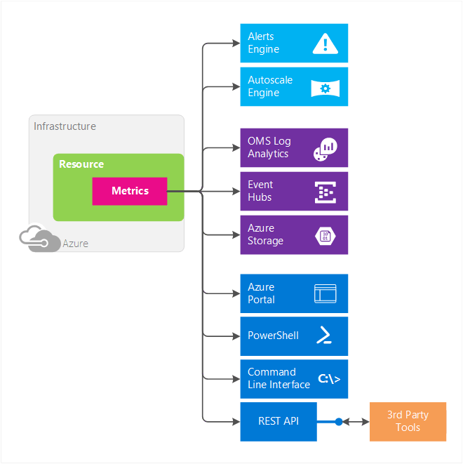
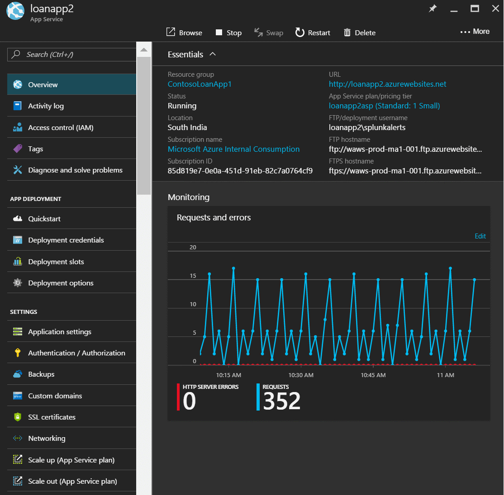
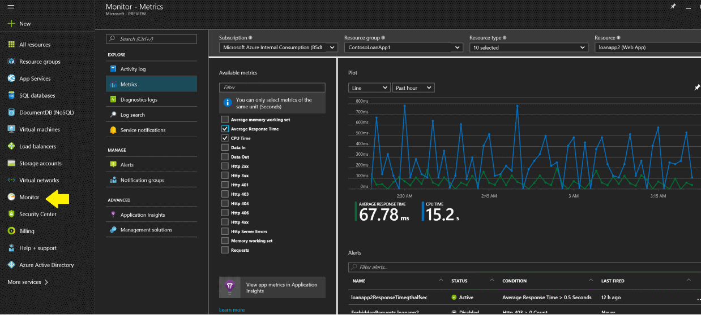
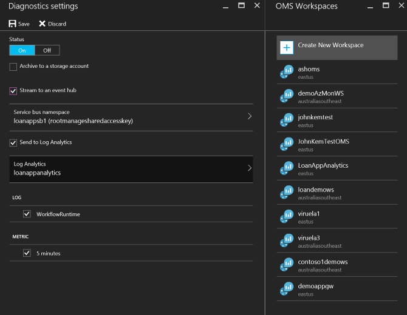
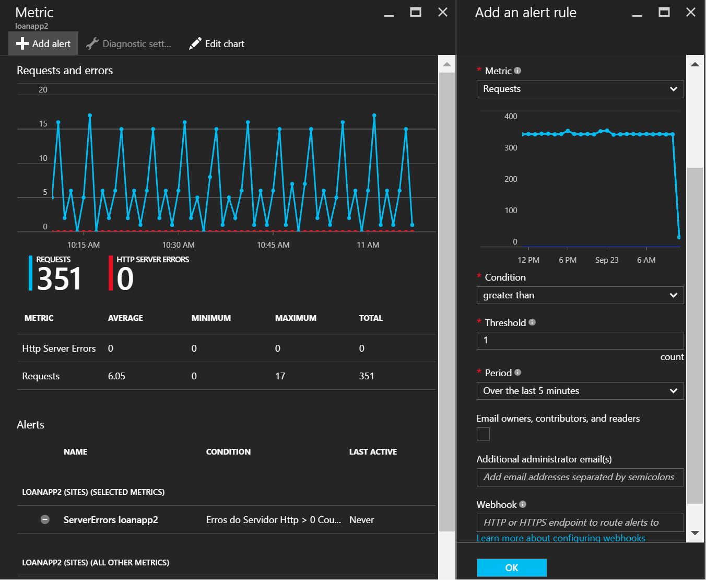
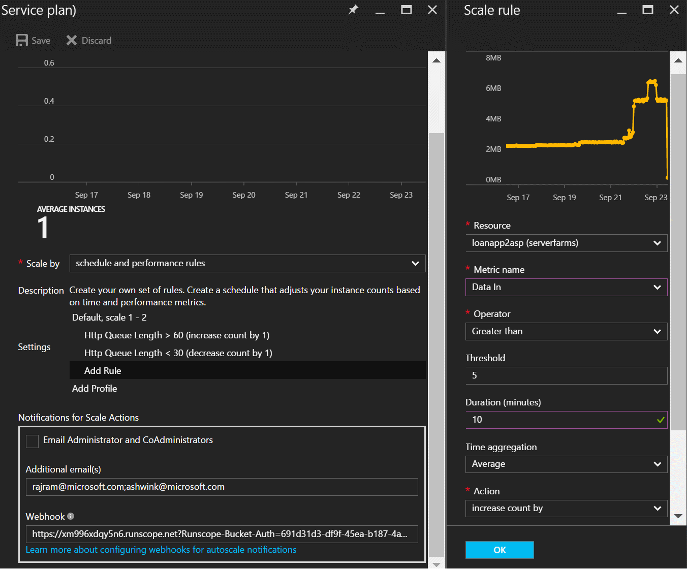

<properties
    pageTitle="Übersicht über die Kriterien in Microsoft Azure | Microsoft Azure"
    description="Kennzahlen und deren Verwendung im Microsoft Azure im Überblick"
    authors="kamathashwin"
    manager="carolz"
    editor=""
    services="monitoring-and-diagnostics"
    documentationCenter="monitoring-and-diagnostics"/>

<tags
    ms.service="monitoring-and-diagnostics"
    ms.workload="na"
    ms.tgt_pltfrm="na"
    ms.devlang="na"
    ms.topic="article"
    ms.date="09/26/2016"
    ms.author="ashwink"/>

# Übersicht über die Kriterien in Microsoft Azure 

Dieser Artikel beschreibt, was in Microsoft Azure Metrik sind ihre Vorteile, und verwenden diese Schritte.  

## Was sind Kriterien?

Azure Monitor können Sie nutzen werden, um Einblick in die Leistung und Integritätsstatus Ihrer Auslastung auf Azure zu erhalten. Die wichtigsten Azure werden Daten sind der Metrik (auch als "Datenquellen" bezeichnet), die am häufigsten Azure Ressourcen ausgegeben. Azure Monitor bietet mehrere Möglichkeiten zum Konfigurieren und nutzen die folgenden Kriterien für die Überwachung und Problembehandlung.

## Was können Sie mit Kennzahlen?

Kennzahlen sind eine wertvolle Quelle an werden und ermöglichen es Ihnen die folgenden Aktionen ausführen:

- **Nachverfolgen der Leistung** der Ressource (z. B. virtueller Computer, Website oder Logik App), deren Kennzahlen in einem Portal Diagramm zeichnen und das Diagramm zu einem Dashboard anheften.
- **Erhalten einer Benachrichtigung eines Problems** die Leistung der Ressource beeinträchtigen, wenn eine Metrik einen bestimmten Schwellenwert überschreitet.
- **Konfigurieren automatisierte Aktionen**, wie etwa automatische Skalierung eine Ressource oder eine Runbooks ausgelöst, wenn eine Metrik einen bestimmten Schwellenwert überschreitet.
- **Erweiterte Analytics ausführen** oder Berichte zur Leistung oder Einsatz Trends von Ihrer Ressourcen.
- **Archivieren** der Leistung oder Gesundheit Verlauf der Ihre Ressourcen **für Compliance/Überwachung** Zwecke.

##  Metrische Merkmale
Kennzahlen weisen die folgenden Merkmale auf:

- Alle Kriterien haben **1 Minute Häufigkeit**. Sie erhalten einen metrischen Wert pro Minute aus der Ressource, damit Sie sich in der Nähe in Echtzeit Einblick in den Status und die Integrität des der Ressource.
- Kennzahlen sind **verfügbar - von-vordefinierten ohne zu nutzen, benötigen** oder Einrichten von weiteren Diagnose.
- Sie können **30 Tage des Verlaufs** für jede Metrik zugreifen. Sie können schnell die zuletzt verwendete und monatlichen Trends in die Leistung oder Integritätsstatus Ihrer Ressource anzeigen.

Sie können:

- Leicht ermitteln, Access, und **alle Kriterien anzeigen** , über das Azure-Portal, wenn Sie wählen Sie eine Ressource aus, und diese in einem Diagramm darstellen. 
- Konfigurieren einer metrischen **Benachrichtigen Regel, die eine Benachrichtigung sendet, oder führt automatisierte Aktion,** an, wenn die Metrik den Schwellenwert überschreitet, die, den Sie festgelegt haben. Automatisch skalieren handelt es sich um eine spezielle automatisierte Aktion, die es ermöglicht, zu skalieren, der Ressource entsprechen die eingehenden Anfragen oder Laden auf Ihrer Website oder Ressourcen zu berechnen. Sie können eine Regel Einstellung automatisch skalieren Out ' in Skalieren konfigurieren, basierend auf einer Metrik einen Grenzwert überschreiten.
- **Archivieren** Kennzahlen für mehr oder für die Berichterstattung offline verwenden können. Sie können weiterleiten metrischen BLOB-Speicher, wenn Sie für die Ressource ein diagnoseeinstellungen konfigurieren.
- **Stream** Kennzahlen an einen Ereignis-Hub, und aktivieren Sie dann diese Azure Stream Analytics oder benutzerdefinierte apps für nahezu in Echtzeit Analyse weiterleiten. Sie können dazu die diagnoseeinstellungen.
- **Routing** alle Kriterien zum OMS Log Analytics zum Entsperren instant Analytics, Suche und benutzerdefinierte warnen vor Kennzahlen Daten aus Ihrem Ressourcen.
- Die Metrik über neue Azure Monitor REST APIs **verbrauchen** .
- **Abfrage** Kennzahlen mithilfe der PowerShell-Cmdlets oder Plattformen REST-API.

 

## Access Kennzahlen über-portal
Hier ist eine schnelle Exemplarische Vorgehensweise zum Erstellen einer metrischen Diagramm über Azure-portal

### Anzeigen von Kennzahlen nach dem Erstellen einer Ressource
1. Öffnen Azure-portal
2. Erstellen einer neuen App-Verwaltungsdienst - Website an.
3. Nachdem Sie eine Website erstellt haben, wechseln Sie zu der Blade Übersicht der Website.
4. Sie können neue Kennzahlen als Kachel 'Überwachung' anzeigen. Sie können die Kachel bearbeiten und mehr Kennzahlen auswählen

     

### Zugriff auf alle Kriterien in einem einzigen Ort
1. Öffnen Sie das Azure-portal 
2. Navigieren Sie zu der neuen Monitor Registerkarte, und wählen Sie die Option Kennzahlen darunter 
3. Sie können Ihr Abonnement, Ressourcengruppe und den Namen der Ressource aus der Dropdownliste auswählen. 
4. Sie können nun die Liste der verfügbaren Kennzahlen anzeigen. 
5. Wählen Sie die Metrik, die Sie interessiert sind, und zeichnen Sie es. 
6. Sie können es auf dem Dashboard anheften, indem Sie auf die Pin in der oberen rechten Ecke.

  

>[AZURE.NOTE] Sie können Host Ebene Metrik von virtuellen Computern (Azure Ressourcenmanager basierend) und virtueller Computer Maßstab Datensätze ohne diagnostic richten Sie zugreifen. Diese neuen Host Ebene Kennzahlen sind für Windows und Linux Instanzen verfügbar. Diese Kennzahlen dürfen nicht mit der Ebenen Gast-OS Kennzahlen verwechselt werden, die Sie beim Einschalten Azure-Diagnose auf Ihrem virtuellen Computern oder VMSS Zugriff haben. Weitere Informationen zum Konfigurieren der Azure-Diagnose finden Sie unter [Was ist Microsoft Azure-Diagnose](../azure-diagnostics.md).

## Access Kennzahlen über REST-API
Azure Kennzahlen können über Azure Monitor APIs zugegriffen werden. Es gibt zwei APIs, mit denen Sie ermitteln und Kennzahlen zugreifen. Verwenden der: 

- [Azure Monitor Metrisch Definitionen REST-API](https://msdn.microsoft.com/library/mt743621.aspx) zum Zugreifen auf der Liste der Kennzahlen für einen Service verfügbar.
- [Azure Monitor Kennzahlen REST-API](https://msdn.microsoft.com/library/mt743622.aspx) Zugriff auf die tatsächliche Kennzahlen Daten

>[AZURE.NOTE] Dieser Artikel behandelt die Kennzahlen über die [neue API für Kennzahlen](https://msdn.microsoft.com/library/dn931930.aspx) für Azure Ressourcen. Die API-Version für die neuen metrischen Definitionen API ist 2016-03-01 und die Version für Kennzahlen API 2016-09-01. Mit der 2014-04-01-api-Version können die legacy metrischen Definitionen und Kennzahlen zugegriffen werden.

Eine ausführlichere Anleitung für die Verwendung der Azure Monitor REST-APIs finden Sie unter [Azure Monitor REST-API Exemplarische Vorgehensweise](monitoring-rest-api-walkthrough.md).

## Optionen für Kennzahlen exportieren
Sie können an die Diagnose Protokolle Blade unter der Registerkarte Monitor wechseln und die exportieren Optionen für Kennzahlen anzeigen. Sie können Kennzahlen (und Diagnoseprotokolle) BLOB-Speicher, Ereignis Hubs oder OMS Log Analytics weitergeleitet werden für Fallstudien zuvor in diesem Artikel genannten auswählen. 

    

Sie können dies über Ressourcenmanager Vorlagen, [PowerShell](insights-powershell-samples.md), [CLI](insights-cli-samples.md) oder [REST APIs](https://msdn.microsoft.com/library/dn931943.aspx)konfigurieren. 

## Für Kennzahlen Maßnahmen ergreifen
Sie können die Benachrichtigungen erhalten oder Ausführung von automatischen Aktionen auf metrischen Daten. Sie können Warnungsregeln oder automatisch skalieren Einstellungen vergeblich konfigurieren.

### Warnungsregeln
Sie können auf Kennzahlen Warnungsregeln konfigurieren. Diese Warnungsregeln können prüfen, ob es sich bei eine Metrik hat einen bestimmten Schwellenwert überschritten und benachrichtigt Sie per e-Mail oder Auslösen eines Webhook, die zum Ausführen benutzerdefinierten Skripts verwendet werden kann. Die Webhook können Sie auch 3rd Produktintegration konfigurieren.

 

### Automatisch skalieren
Einige Azure Ressourcen unterstützt mehrere Instanzen heraus oder in Ihrer Auslastung verarbeitet skalieren. Automatisch skalieren gilt für App-Dienste (Web apps), virtuellen Computern skalieren Datensätze (VMSS) und klassischen Cloud Services. Sie können konfigurieren, dass automatisch skalieren Regeln heraus oder in skalieren, wenn eine bestimmte Metrik beeinträchtigen Ihrer Arbeitsbelastung einen Schwellenwert überschreitet, die, den Sie angeben. Weitere Informationen finden Sie unter [Übersicht über automatische Skalierung](monitoring-overview-autoscale.md).

 

## Unterstützte Services und Kriterien
Azure Monitor handelt es sich um eine neue Metrik Infrastruktur. Er bietet Unterstützung für die folgenden Dienste Azure Azure-Portal und die neue Version der Monitor Azure-API:

- Virtuellen Computern (Azure Ressourcenmanager basierend)
- Virtueller Computer Maßstab Datensätze
- Stapelverarbeitung
- Ereignis Hub namespace 
- Dienstbus Namespace (nur Premium SKU)
- SQL (Version 12)
- Flexible SQL Ressourcenpool
- Websites
- Webserver-Farmen
- Logik Apps
- IoT Hubs
- Redis Cache
- Netzwerke: Die Anwendungsgateways
- Suchen

Sie können Anzeigen einer eine ausführliche Liste alle unterstützten Dienste und deren Kriterien bei [Azure Monitor Kennzahlen - unterstützte Kennzahlen pro Ressourcenart](monitoring-supported-metrics.md). 

## Nächste Schritte

Finden Sie unter den Links in diesem Artikel. Darüber hinaus erfahren:  

- Informationen zum [gemeinsamen Kriterien für die automatische Skalierung](insights-autoscale-common-metrics.md)
- zum [Erstellen von Warnungsregeln](insights-alerts-portal.md)

