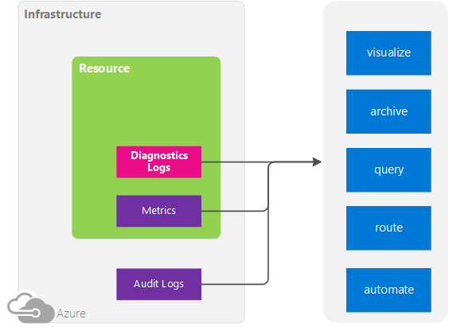
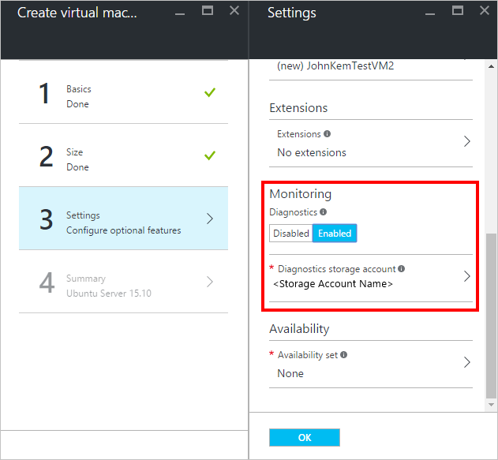
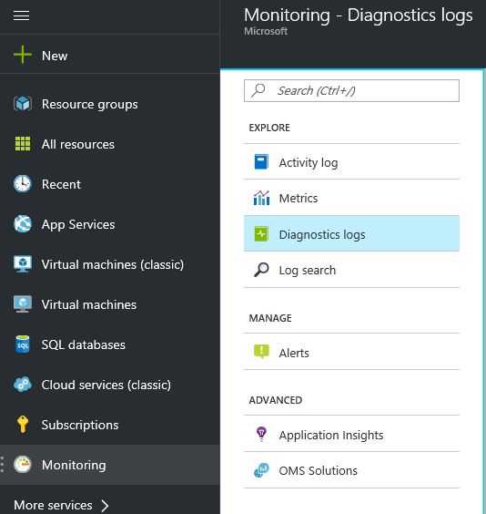
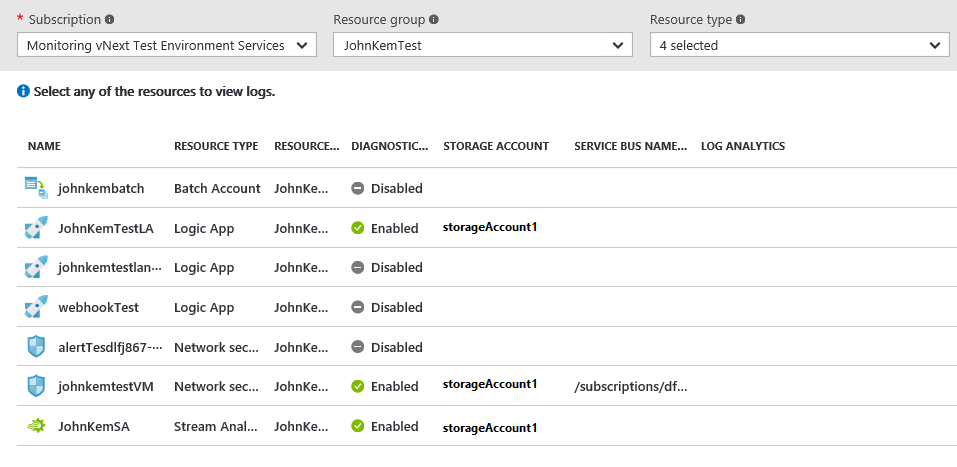
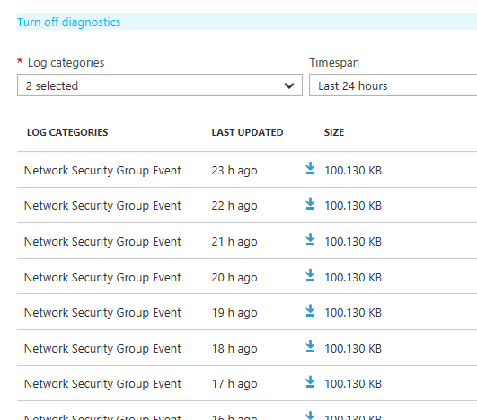

<properties
    pageTitle="Übersicht über Azure Diagnoseprotokolle | Microsoft Azure"
    description="Erfahren Sie, was Diagnoseprotokolle Azure sind und wie Sie diese Ereignisse innerhalb einer Ressource Azure schwer verwenden können."
    authors="johnkemnetz"
    manager="rboucher"
    editor=""
    services="monitoring-and-diagnostics"
    documentationCenter="monitoring-and-diagnostics"/>

<tags
    ms.service="monitoring-and-diagnostics"
    ms.workload="na"
    ms.tgt_pltfrm="na"
    ms.devlang="na"
    ms.topic="article"
    ms.date="10/12/2016"
    ms.author="johnkem; magoedte"/>

# Übersicht über Azure Diagnoseprotokolle
**Diagnoseprotokolle Azure** sind Protokolle ausgegeben, die eine Ressource, die leistungsfähigen, häufig verwendeten Daten über den Vorgang dieser Ressource bereitstellen. Der Inhalt dieser Protokolle hängt vom Ressourcentyp ab (beispielsweise Windows-Ereignisprotokollen System eine Kategorie von Diagnoseprotokoll für virtuellen Computern und Blob, Tabelle, und Warteschlange Protokolle sind Kategorien Diagnoseprotokolle für Speicherkonten) und unterscheiden sich von der [Aktivität Log (ehemals Überwachungsprotokoll oder Betrieb Log)](monitoring-overview-activity-logs.md), die einen Einblick in die Vorgänge bereitstellt, die in den Ressourcen im Rahmen Ihres Abonnements ausgeführt wurden. Nicht für alle Ressourcen zu den neuen Typ von Diagnoseprotokollen hier beschriebenen unterstützen. Die Liste der unterstützten Dienste unten zeigt an, welche Ressourcentypen die neuen Diagnoseprotokolle unterstützen.

## Mögliche Aktionen mit Diagnoseprotokolle
Hier einige der Dinge, die mit einer Diagnoseprotokollen möglich:

- Speichern Sie diese mit einem **Konto Speicher** für ü oder manuelle Prüfung aus. Sie können die Aufbewahrungszeit (in Tagen) mit den **Diagnoseeinstellungen**angeben.
- [Übertragen Sie diese **Ereignis Hubs** ](monitoring-stream-diagnostic-logs-to-event-hubs.md) , für die Erfassung von einem Drittanbieter-Dienst oder benutzerdefinierten Analytics-Lösung, wie z. B. PowerBI.
- Mit [OMS Log Analytics](../log-analytics/log-analytics-azure-storage-json.md) zu analysieren

## Diagnoseeinstellungen
Diagnoseprotokolle für nicht berechnen Ressourcen werden mithilfe von Diagnoseeinstellungen konfiguriert. **Diagnoseeinstellungen** für ein Steuerelement Ressourcen:

- Wo Diagnoseprotokolle (Speicher-Konto, Ereignis Hubs und/oder OMS Log Analytics) gesendet werden.
- Welche Kategorien protokollieren gesendet werden.
- Wie lange jede Kategorie Log in einem Speicher-Konto – ein Aufbewahrung von 0 (null) Tagen aufbewahrt werden sollten bedeutet, dass Protokolle für immer beibehalten werden. Andernfalls kann diesen Wert zwischen 1 und 2147483647 liegen. Wenn Aufbewahrungsrichtlinien festgelegt sind, aber Speichern von Protokollen in einem Speicher-Konto ist deaktiviert (beispielsweise nur Ereignis Hubs oder OMS Optionen ausgewählt werden), die Aufbewahrungsrichtlinien wirken sich nicht.

Diese Einstellungen werden einfach über das Diagnose Blade für eine Ressource im Azure-Portal, über Befehle Azure PowerShell und CLI oder über die [Azure Monitor REST-API](https://msdn.microsoft.com/library/azure/dn931943.aspx)konfiguriert.

> [AZURE.WARNING] Diagnoseprotokolle und Kennzahlen für berechnen Ressourcen (z. B. virtuellen Computern oder Dienst Fabric) verwenden [separate dafür, Konfiguration und Auswahl der Ausgänge](../azure-diagnostics.md)an.

## Aktivieren der Sammlung von Diagnoseprotokollen
Sammlung von Diagnoseprotokolle kann als Teil der Erstellung einer Ressource oder eine Ressource über die Ressource vorher in das Portal erstellt wird aktiviert sein. Sie können auch Diagnoseprotokolle an einer beliebigen Stelle Azure PowerShell oder CLI-Befehle verwenden, oder verwenden die Azure Monitor REST-API aktivieren.

> [AZURE.TIP] Diese Anweisungen möglicherweise nicht direkt an jeder Ressource anwenden. Finden Sie unter den Schema Links am Ende dieser Seite, um eine spezielle Schritte bekannt sein, die für bestimmte Ressourcentypen gelten.

[In diesem Artikel zeigt, wie Sie eine Ressourcenvorlage Diagnoseeinstellungen beim Erstellen einer Ressource zu aktivieren](./monitoring-enable-diagnostic-logs-using-template.md)

### Aktivieren von Diagnoseprotokollen im Portal
Sie können Diagnoseprotokolle Azure-Portal aktivieren, wenn Sie Ressourcentypen berechnen erstellen, indem Sie die Erweiterung für Windows oder Linux Azure-Diagnose:

1.  Wechseln Sie auf **neu** , und wählen Sie die Ressource, die, der Sie interessiert sind.
2.  Nach dem Konfigurieren der Einstellungen für grundlegenden und Auswählen des Blades **Einstellungen** unter **Überwachung**, eine Größe, wählen Sie **aktiviert** , und wählen Sie ein Speicherkonto, in dem Sie den Diagnoseprotokollen speichern möchten. Sie unterliegen normalen Daten Sätzen für die Speicherung und Transaktionen, wenn Sie mit einem Speicherkonto Diagnose senden.

    
3.  Klicken Sie auf **OK** , und erstellen Sie die Ressource zu.

Für Ressourcen nicht berechnen können Sie Diagnoseprotokolle Azure-Portal aktivieren, nachdem eine Ressource erstellt wurde, indem Sie folgende Schritte ausführen:

1.  Wechseln Sie zu dem Blade für die Ressource aus, und öffnen Sie das Blade **Diagnose** .
2.  **Klicken Sie auf** , und wählen Sie ein Konto Speicher und/oder Hub Ereignis aus.

    
3.  Wählen Sie unter **Protokolle**welche **Kategorien protokollieren** , die Sie erfassen oder übertragen möchten.
4.  Klicken Sie auf **Speichern**.

### Aktivieren von Diagnoseprotokollen über PowerShell
Klicken Sie zum Aktivieren von Diagnoseprotokollen über den Azure-PowerShell-Cmdlets verwenden Sie die folgenden Befehle aus.

Um die Speicherung Diagnoseprotokolle in einem Speicher-Konto aktivieren möchten, verwenden Sie diesen Befehl aus:

    Set-AzureRmDiagnosticSetting -ResourceId [your resource id] -StorageAccountId [your storage account id] -Enabled $true

Die Speicher-Konto-ID wird die Ressourcen-Id für das Speicherkonto, das Sie die Protokolle senden möchten.

Klicken Sie zum Aktivieren von Diagnoseprotokollen an ein Ereignis Verteiler streaming verwenden Sie diesen Befehl aus:

    Set-AzureRmDiagnosticSetting -ResourceId [your resource id] -ServiceBusRuleId [your service bus rule id] -Enabled $true

Der Dienst Bus Regel-ID ist eine Zeichenfolge mit diesem Format: `{service bus resource ID}/authorizationrules/{key name}`.

Zum Aktivieren des Sendens von Diagnoseprotokollen zu einem Arbeitsbereich Log Analytics, verwenden Sie diesen Befehl aus:

    Set-AzureRmDiagnosticSetting -ResourceId [your resource id] -WorkspaceId [log analytics workspace id] -Enabled $true

> [AZURE.NOTE] Der Parameter WorkspaceId ist nicht verfügbar in der Oktober-Version. Es wird in der November-Version verfügbar.

Ihre Log Analytics-Arbeitsbereich-ID Azure-Portal erhalten.

Sie können diese Parameter zum Aktivieren mehrerer Ausgabeoptionen kombinieren.

### Aktivieren von Diagnoseprotokollen über CLI
Klicken Sie zum Aktivieren von Diagnoseprotokollen über die CLI Azure verwenden Sie die folgenden Befehle:

Um die Speicherung Diagnoseprotokolle in einem Speicher-Konto aktivieren möchten, verwenden Sie diesen Befehl aus:

    azure insights diagnostic set --resourceId <resourceId> --storageId <storageAccountId> --enabled true

Die Speicher-Konto-ID wird die Ressourcen-Id für das Speicherkonto, das Sie die Protokolle senden möchten.

Klicken Sie zum Aktivieren von Diagnoseprotokollen an ein Ereignis Verteiler streaming verwenden Sie diesen Befehl aus:

    azure insights diagnostic set --resourceId <resourceId> --serviceBusRuleId <serviceBusRuleId> --enabled true

Der Dienst Bus Regel-ID ist eine Zeichenfolge mit diesem Format: `{service bus resource ID}/authorizationrules/{key name}`.

Zum Aktivieren des Sendens von Diagnoseprotokollen zu einem Arbeitsbereich Log Analytics, verwenden Sie diesen Befehl aus:

    azure insights diagnostic set --resourceId <resourceId> --workspaceId <workspaceId> --enabled true

> [AZURE.NOTE] Der Parameter WorkspaceId ist nicht verfügbar in der Oktober-Version. Es wird in der November-Version verfügbar.

Ihre Log Analytics-Arbeitsbereich-ID Azure-Portal erhalten.

Sie können diese Parameter zum Aktivieren mehrerer Ausgabeoptionen kombinieren.

### Aktivieren von Diagnoseprotokollen über REST-API
Ändern der Diagnoseeinstellungen mithilfe der Azure Monitor REST-API finden Sie [Dieses Dokument](https://msdn.microsoft.com/library/azure/dn931931.aspx).

## Verwalten von Diagnoseeinstellungen im Portal

Um sicherzustellen, dass alle Ihre Ressourcen ordnungsgemäß mit diagnoseeinstellungen eingerichtet sind, können Sie navigieren Sie zur **Überwachung** vorher in das Portal und öffnen Sie das Blade **Diagnoseprotokolle** .

Möglicherweise müssen Sie auf "Weitere Dienste" klicken, um die Überwachung Blade finden.

In diesem Blade können Sie anzeigen und Filtern alle Ressourcen, die Diagnoseprotokolle, um festzustellen, ob sie haben Diagnose aktiviert und welche Speicher Firma, Ereignis Hub und/oder Log Analytics Arbeitsbereich werden diese Protokolle in parallelen unterstützen.

Indem Sie auf eine Ressource wird alle Protokolle angezeigt, die im Speicherkonto gespeichert wurden, und bieten Ihnen die Möglichkeit, deaktivieren oder Ändern von Einstellungen für die Diagnose. Klicken Sie auf das Downloadsymbol zum Herunterladen Protokolle für einen bestimmten Zeitraum.

> [AZURE.NOTE] Diagnoseprotokolle werden nur angezeigt, die in dieser Ansicht werden und zum Download verfügbar sein, wenn Sie diagnoseeinstellungen sie zum Speichern auf ein Speicherkonto konfiguriert haben.

Klicken auf den Link für **Diagnoseeinstellungen** wird das Blade Diagnoseeinstellungen geöffnet, in dem Sie aktivieren, deaktivieren oder Ändern Ihrer diagnoseeinstellungen für die ausgewählte Ressource.

## Unterstützte Services und Schema Diagnoseprotokolle
Das Schema für Diagnoseprotokolle abhängig von der Kategorie Ressource, und melden Sie sich ab. Nachstehend sind die unterstützten Dienste und deren Schema aus.

| Dienst                       | Schema und Dokumente                                                                                                   |
|-------------------------------|-----------------------------------------------------------------------------------------------------------------|
|    Lastenausgleich Software     |    [Log Analytics für Azure Lastenausgleich (Preview)](../load-balancer/load-balancer-monitor-log.md)             |
|    Netzwerk-Sicherheitsgruppen    |    [Log Analytics für Netzwerk-Sicherheitsgruppen (NSGs)](../virtual-network/virtual-network-nsg-manage-log.md)     |
|    Anwendungsgateways       |    [Diagnoseprotokolle für Application Gateway](../application-gateway/application-gateway-diagnostics.md)     |
|    Key Tresor                  |    [Azure Key Tresor Protokollierung](../key-vault/key-vault-logging.md)                                                 |
|    Azure suchen               |    [Aktivieren und Verwenden von Suchen den Datenverkehr Analytics](../search/search-traffic-analytics.md)                         |
|    Lake Datenspeicher            |    [Zugreifen auf Diagnoseprotokolle für Azure Lake Datenspeicher](../data-lake-store/data-lake-store-diagnostic-logs.md) |
|    Daten Lake Analytics        |    [Zugreifen auf Diagnoseprotokolle für Azure Daten dem Analytics](../data-lake-analytics/data-lake-analytics-diagnostic-logs.md) |
|    Logik Apps                 |    Kein Schema zur Verfügung.                                                                                         |
|    Azure Stapel                |    [Azure Stapel diagnoseprotokollierung](../batch/batch-diagnostics.md)                                              |
|    Azure Automatisierung           |    [Log Analytics für Azure Automatisierung](../automation/automation-manage-send-joblogs-log-analytics.md)          |
|    Ereignis-Hub                  |    Kein Schema zur Verfügung.                                                                                         |
|    Dienstbus                |    Kein Schema zur Verfügung.                                                                                         |
|    Stream Analytics           |    Kein Schema zur Verfügung.                                                                                         |

## Unterstützte Kategorien pro Ressourcenart protokollieren

|Ressourcenart|Kategorie|Anzeigename der Kategorie|
|---|---|---|
|Microsoft.Automation/automationAccounts|JobLogs|Position von Protokollen|
|Microsoft.Automation/automationAccounts|JobStreams|Position Streams|
|Microsoft.Batch/batchAccounts|ServiceLog|Dienstprotokolle|
|Microsoft.DataLakeAnalytics/accounts|Audit|Überwachungsprotokolle|
|Microsoft.DataLakeAnalytics/accounts|Besprechungsanfragen|Anfordern von Protokollen|
|Microsoft.DataLakeStore/accounts|Audit|Überwachungsprotokolle|
|Microsoft.DataLakeStore/accounts|Besprechungsanfragen|Anfordern von Protokollen|
|Microsoft.EventHub/namespaces|ArchiveLogs|Archivieren von Protokollen|
|Microsoft.EventHub/namespaces|OperationalLogs|Betrieb von Protokollen|
|Microsoft.KeyVault/vaults|AuditEvent.|Überwachungsprotokolle|
|Microsoft.Logic/workflows|WorkflowRuntime|Diagnose Laufzeit Workflowereignisse|
|Microsoft.Network/networksecuritygroups|NetworkSecurityGroupEvent|Netzwerk-Sicherheitsgruppe Ereignis|
|Microsoft.Network/networksecuritygroups|NetworkSecurityGroupRuleCounter|Netzwerk-Sicherheitsgruppe Regel Zähler|
|Microsoft.Network/networksecuritygroups|NetworkSecurityGroupFlowEvent|Netzwerk-Sicherheitsgruppe Regel Fluss Ereignis|
|Microsoft.Network/loadBalancers|LoadBalancerAlertEvent|Laden Sie Lastenausgleich benachrichtigen Ereignisse|
|Microsoft.Network/loadBalancers|LoadBalancerProbeHealthStatus|Laden Sie Lastenausgleich Prüfpunkt Integritätsstatus|
|Microsoft.Network/applicationGateways|ApplicationGatewayAccessLog|Protokoll der Anwendung Gateway-Zugriff|
|Microsoft.Network/applicationGateways|ApplicationGatewayPerformanceLog|Application Gateway Performance Log|
|Microsoft.Network/applicationGateways|ApplicationGatewayFirewallLog|Anwendung Gateway-Firewall-Protokoll|
|Microsoft.Search/searchServices|OperationLogs|Vorgang Protokolle|
|Microsoft.ServerManagement/nodes|RequestLogs|Anfordern von Protokollen|
|Microsoft.ServiceBus/namespaces|OperationalLogs|Betrieb von Protokollen|
|Microsoft.StreamAnalytics/streamingjobs|Ausführung|Ausführung|
|Microsoft.StreamAnalytics/streamingjobs|Authoring|Authoring|

## Nächste Schritte
- [Stream Diagnoseprotokolle an **Ereignis Hubs**](monitoring-stream-diagnostic-logs-to-event-hubs.md)
- [Ändern Sie mithilfe der Azure Monitor REST-API Diagnoseeinstellungen](https://msdn.microsoft.com/library/azure/dn931931.aspx)
- [Analysieren Sie die Protokolle mit OMS Log Analytics](../log-analytics/log-analytics-azure-storage-json.md)
