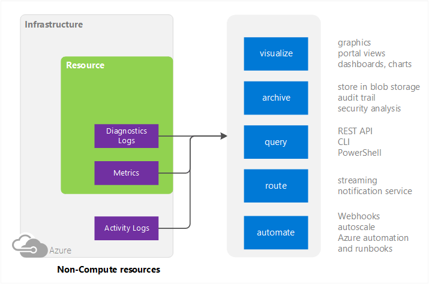
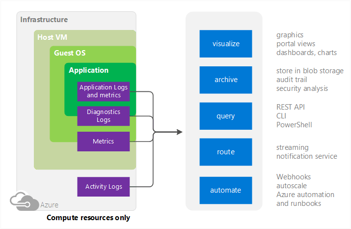

<properties
    pageTitle="Übersicht über die Überwachung in Microsoft Azure | Microsoft Azure"
    description="Obersten Ebene Übersicht über die Überwachung und Diagnose in Microsoft Azure einschließlich Benachrichtigungen, Webhooks, automatisch skalieren und vieles mehr."
    authors="rboucher"
    manager="carolz"
    editor=""
    services="monitoring-and-diagnostics"
    documentationCenter="monitoring-and-diagnostics"/>

<tags
    ms.service="monitoring-and-diagnostics"l
    ms.workload="na"
    ms.tgt_pltfrm="na"
    ms.devlang="na"
    ms.topic="article"
    ms.date="10/11/2016"
    ms.author="robb"/>

# Übersicht über die Überwachung in Microsoft Azure

Dieser Artikel enthält eine konzeptionelle Übersicht Azure Ressourcen überwachen. Es stellt Verweise auf Informationen auf bestimmte Arten von Ressourcen an.  Weitere allgemeine Informationen zum Überwachen Ihrer Anwendung aus Sicht nicht Azure finden Sie [Hinweise zur Überwachung und Diagnose](../best-practices-monitoring.md).

Cloudanwendungen sind komplex mit vielen verschieben teilen. Überwachung bietet Daten, um sicherzustellen, dass die Anwendung von bleibt und Ausführung in einem ordnungsgemäßen Zustand. Darüber hinaus werden Sie potenzielle Probleme Nichtzustellbarkeit oder ältere Schriftarten behandeln. Darüber hinaus können Sie Überwachung Daten verwenden, um Tiefe Einblicke zu Ihrer Anwendung zu erhalten. Dieses Wissen kann Ihnen dabei helfen, die Leistung der Anwendung oder Wartung zu verbessern, oder Automatisieren von Aktionen, die andernfalls manuellen Eingriff erforderlich wäre.

Das folgende Diagramm zeigt eine konzeptionelle Ansicht von Azure Überwachung, einschließlich den Typ der Protokolle, die Sie erfassen können und was Sie mit diesen Daten tun können.   

Abbildung 1: Konzeptionelle Modell für die Überwachung und Diagnose für Ressourcen nicht berechnen

 

Abbildung 2: Konzeptionelle Modell für die Überwachung und Diagnose für Ressourcen berechnen

## Quellen für die Überwachung
### Von Aktivitätsprotokollen
Sie können die Aktivität Log (zuvor Betrieb oder Überwachungsprotokolle genannt) Informationen über Ihre Ressourcen gesehen von Azure-Infrastruktur suchen. Das Protokoll enthält Informationen, wie oft beim Ressourcen erstellt oder gelöscht werden.  

### Host virtueller Computer
**Nur berechnen**

Einige Ressourcen wie Cloud Services, virtuellen Computern, berechnen und Dienst Fabric haben eines dedizierten Host virtuellen Computers Interaktion mit. Den Host virtuellen Computer entspricht dem Stammordner virtueller Computer im Modell Hypervisor Hyper-V. In diesem Fall können Sie Kennzahlen nur des Host virtuellen Computers sowie die Gast-BS sammeln.  

Für andere Azure Dienste ist es nicht unbedingt eine 1:1-Zuordnung zwischen der Ressource und einen bestimmten Host virtuellen, damit Host virtueller Computer Kennzahlen nicht verfügbar sind.

### Ressourcen - Metrik und Diagnose von Protokollen
Fähigen Kennzahlen variieren je nach Ressourcentyp. Beispielsweise virtuellen Computern Statistiken auf dem Datenträger EA und Prozent CPU enthält. Aber diese Stats sind nicht existent für eine Warteschlange Dienstbus, die stattdessen Kennzahlen wie Warteschlange Größe und Nachricht Durchsatz bereitstellt.

Für Ressourcen berechnen erhalten Sie Kennzahlen auf den Gast-BS und Diagnose Modulen wie Azure-Diagnose. Azure Diagnose hilft sammeln und Weiterleiten sammeln diagnostische Daten an anderen Speicherorten, einschließlich Azure-Speicher.

Eine Liste der aktuell fähigen Kennzahlen steht am [Metrik unterstützt](monitoring-supported-metrics.md).

### Anwendung - Diagnose Protokolle, Anwendungsprotokolle und Kennzahlen
**Nur berechnen**

Über das Betriebssystem Gast im Modell berechnen ausgeführt werden können. Diese ausgeben eigene Satz von Protokollen und Kriterien aus.

Kennzahlen Typen

- -Datenquellen
- Von Anwendungsprotokollen
- Windows-Ereignisprotokollen
- .NET Quelle
- IIS-Protokolle
- Manifest Grundlage ETW
- Speichert abstürzen
- Fehlerprotokolle für Kunden

## Verwendungsmöglichkeiten für die Überwachung von Daten

### Visualisieren
Visualisieren von überwachen Daten in Grafiken und Diagrammen hilft Ihnen dabei, Trends weit schneller als durch die Daten selbst suchen  

Einige Visualisierung Methoden umfassen:

- Verwenden des Azure-Portals
- Weiterleitung von Daten zu Azure Anwendung Einsichten
- Weiterleitung von Daten an Microsoft PowerBI
- Die Daten in einer Drittanbieter-Visualisierungstool verwenden live streaming weiterleiten oder indem Sie das Tool aus einem Archiv in Azure-Speicher lesen

### Archiv
Überwachen von Daten in der Regel geschrieben Azure-Speicher und dort abgelegt, bis Sie es löschen.

Ein paar Verfahren, wie diese Daten verwenden:

- Nach dem Schreiben, haben Sie andere Tools innerhalb oder außerhalb von Azure Lesen und zu verarbeiten.
- Sie laden Sie die Daten lokal für eine lokale Archivierung oder Ändern Ihrer Aufbewahrungsrichtlinie in der Cloud Speichern von Daten für längere Zeit.  
- Verlassen die Daten in Azure-Speicher endlos, obwohl Sie bezahlen Azure-Speicher basierend auf der Datenmenge, die Sie beibehalten müssen.
-

### Abfrage
Azure Monitor REST API Kreuz Plattform Line Interface (CLI) Befehle, PowerShell-Cmdlets oder .NET SDK können Sie Zugriff auf die Daten in das System oder Azure-Speicher

Beispiele für:

-  Abrufen von Daten für eine benutzerdefinierte Überwachung Anwendung, die Sie geschrieben haben
-  Erstellen von benutzerdefinierten Abfragen, und senden die Daten in einer Drittanbieter-Anwendung.

### Weiterleiten
Sie können die Überwachung Daten an andere Positionen in Echtzeit übertragen.

Beispiele für:

- Senden Sie Anwendung Einsichten damit die Visualisierungstools dort verwendet werden können.
- Senden Sie an Ereignis Hubs, damit Sie Drittanbieter-Tools in Echtzeit kompliziertere weiterleiten können.

### Automatisieren
Überwachung Daten auf Trigger Ereignisse können oder sogar ganze Prozesse gehören:

- Verwenden von Daten zu skalieren berechnen Instanzen nach oben oder unten basierend auf der Anwendung laden.
- Senden von e-Mails, wenn eine Metrik einen vordefinierten Schwellenwert überschreitet.
- Rufen Sie eine Web-URL (Webhook), um eine Aktion in einem Azure-System ausführen
- Starten einer Runbooks in Azure Automatisierung eine Vielzahl von Aufgaben ausführen

## Methoden zum Verwenden
Im Allgemeinen können Sie Daten Verlauf, routing und Abruf mithilfe einer der folgenden Methoden bearbeiten. Nicht alle Methoden stehen für alle Aktionen oder Datentypen.

- [Azure-portal](https://portal.azure.com)
- [PowerShell](insights-powershell-samples.md)  
- [Plattform-Befehlszeilenschnittstelle)](insights-cli-samples.md)
- [REST-API](https://msdn.microsoft.com/library/dn931943.aspx)
- [.NET SDK](https://msdn.microsoft.com/library/dn802153.aspx)

## Überwachen des Azure-Angebote
Azure verfügt über Angebote, die für Ihre Dienstleistungen aus softwareunabhängige Infrastruktur für die Anwendung werden die Überwachung verfügbar. Die beste Strategie für die Überwachung kombiniert mit allen drei umfassende und detaillierte Einblick in die Integrität Ihrer Dienste.

- [Azure Monitor](http://aka.ms/azmondocs) – Angebote Visualisierung, Abfrage, routing, warnen, automatisch skalieren und Automatisierung auf Daten aus der Azure-Infrastruktur (Aktivität Log) und jede einzelne Azure Ressource (Diagnoseprotokolle). Dieser Artikel ist Teil der Dokumentation Azure überwachen. Der Name der Azure Monitor wurde September 25 am Ignite 2016 veröffentlicht.  Der Name des vorherigen war "Azure Einsichten."  
- [Anwendung Einsichten](https://azure.microsoft.com/documentation/services/application-insights/) – bietet Rich-Erkennung und Diagnose Probleme auf der Anwendungsebene von Ihrem Dienst gut integrierte auf Daten aus Azure Überwachung an. Es ist die standardmäßige Diagnose Plattform für App-Dienst Web Apps.  Sie können Daten aus anderen Diensten zu leiten.  
- [Log Analytics](https://azure.microsoft.com/documentation/services/log-analytics/) Teil [Vorgänge Management Suite](https://www.microsoft.com/cloud-platform/operations-management-suite) – bietet eine umfassende IT Management-Lösung für lokale und Drittanbieter-Cloud-basierte Infrastruktur (z. B. AWS) sowie Azure Ressourcen.  Daten aus Azure Monitor können direkt an Log Analytics weitergeleitet werden, damit Metrik und Protokolle für Ihre gesamte Umgebung an einem Ort angezeigt werden.     

## Nächste Schritte
Weitere Informationen

- [In einem Video aus Ignite 2016 Azure Monitor](https://myignite.microsoft.com/videos/4977)
- [Erste Schritte mit Azure Monitor](monitoring-get-started.md)
- [Azure-Diagnose](../azure-diagnostics.md) , wenn Sie versuchen, Probleme in der Cloud-Dienst, virtuellen Computern oder Fabric Service-Anwendung diagnostizieren.
- [Anwendung Einsichten](https://azure.microsoft.com/documentation/services/application-insights/) Wenn Sie auf Diagnose Probleme in Ihrer App Dienst Web app versuchen.
- [Problembehandlung bei Azure-Speicher](../storage/storage-e2e-troubleshooting.md) Speicher Blobs, Tabellen oder Warteschlangen verwenden.
- [Log Analytics](https://azure.microsoft.com/documentation/services/log-analytics/) und die [Vorgänge Management Suite](https://www.microsoft.com/cloud-platform/operations-management-suite)
