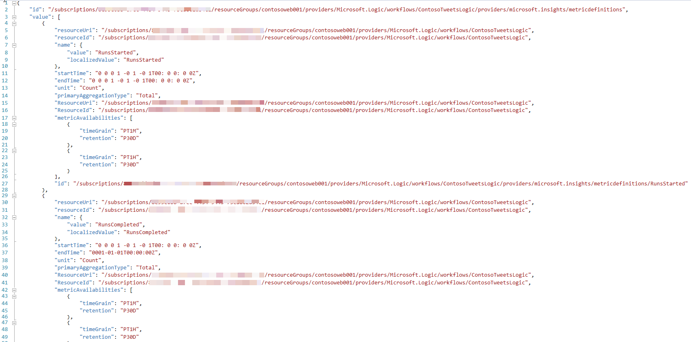
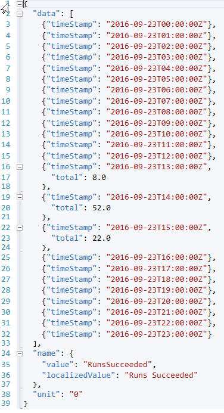
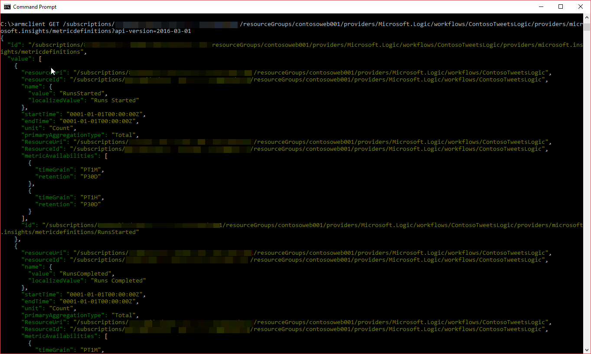
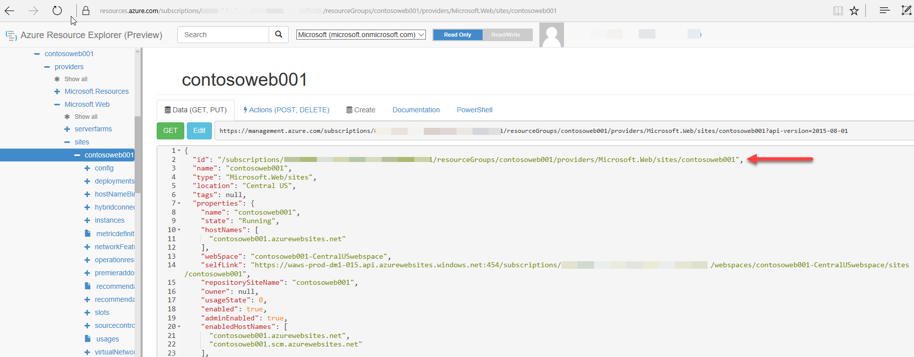
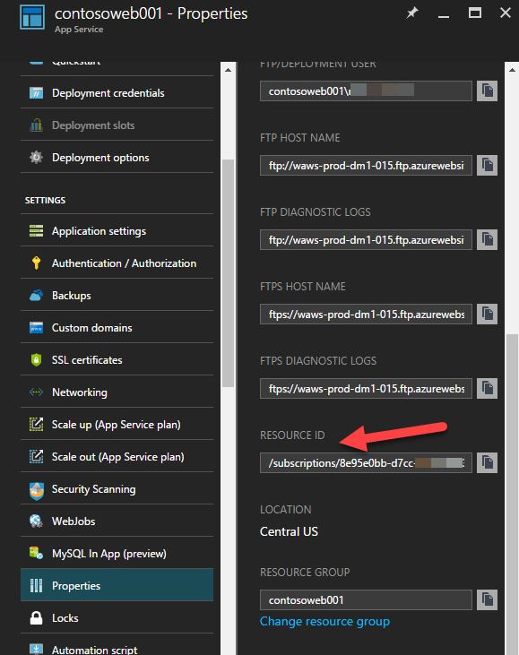

<properties
    pageTitle="REST-API Exemplarische Vorgehensweise Überwachung Azure | Microsoft Azure"
    description="Informationen zum Authentifizieren Anfragen an und Azure Überwachung REST-API verwenden."
    authors="mcollier, rboucher"
    manager="carolz"
    editor=""
    services="monitoring-and-diagnostics"
    documentationCenter="monitoring-and-diagnostics"/>

<tags
    ms.service="monitoring-and-diagnostics"
    ms.workload="na"
    ms.tgt_pltfrm="na"
    ms.devlang="na"
    ms.topic="article"
    ms.date="09/27/2016"
    ms.author="mcollier"/>

# <a name="azure-monitoring-rest-api-walkthrough"></a>Azure Überwachung REST-API Exemplarische Vorgehensweise
In diesem Artikel werden die zum Durchführen der Authentifizierung, sodass der Code [Microsoft Azure Monitor REST-API-Referenz](https://msdn.microsoft.com/library/azure/dn931943.aspx)verwenden kann.         

Die Azure Monitor-API ermöglicht es, um die verfügbaren Standardwerte metrischen Definitionen (den Typ des Metrisch z. B. CPU-Zeit, Besprechungsanfragen usw.), Genauigkeit und metrischen Werte programmgesteuert abzurufen. Nachdem abgerufen werden, können die Daten in einem separaten Datenspeicher wie SQL Azure-Datenbank, DocumentDB oder Lake der Azure-Daten gespeichert werden. Von dort aus kann zusätzliche Analyse durchgeführt werden, je nach Bedarf.

Neben dem Arbeiten mit verschiedenen metrischen Datenpunkte, wie in diesem Artikel wird veranschaulicht, ermöglicht die Monitor-API Liste Warnungsregeln, die Aktivitätsprotokolle anzeigen und vieles mehr. Eine vollständige Liste der verfügbaren Operationen finden Sie unter [Microsoft Azure Monitor REST-API-Referenz](https://msdn.microsoft.com/library/azure/dn931943.aspx).

## <a name="authenticating-azure-monitor-requests"></a>Authentifizieren Azure Monitor Besprechungsanfragen

Dieser erste Schritt besteht die Anforderung authentifiziert.

Alle Vorgänge, die in der Azure Monitor-API ausgeführt verwenden Azure Ressourcenmanager Authentifizierungsmodell. Daher müssen alle Anfragen mit Azure Active Directory (Azure AD) authentifiziert werden. Eine Möglichkeit, mit die Clientanwendung authentifiziert ist eine Azure AD-Dienst Tilgungsanteile erstellen und das (JWT) Authentifizierungstoken abrufen. Das folgende Beispielskript veranschaulicht das Erstellen eines Azure AD-Diensts über PowerShell Hauptbenutzer. Finden Sie für eine ausführliche exemplarische Vorgehensweise in der Dokumentation zur [Verwendung von Azure PowerShell zum Erstellen eines Diensts Hauptbenutzer Zugriff auf Ressourcen](../resource-group-authenticate-service-principal.md#authenticate-service-principal-with-password—powershell). Es ist es möglich, [ein Dienst Prinzip über das Azure-Portal zu erstellen](../resource-group-create-service-principal-portal.md).

```PowerShell
$subscriptionId = "{azure-subscription-id}"
$resourceGroupName = "{resource-group-name}"
$location = "centralus"

# Authenticate to a specific Azure subscription.
Login-AzureRmAccount -SubscriptionId $subscriptionId

# Password for the service principal
$pwd = "{service-principal-password}"

# Create a new Azure AD application
$azureAdApplication = New-AzureRmADApplication `
                        -DisplayName "My Azure Monitor" `
                        -HomePage "https://localhost/azure-monitor" `
                        -IdentifierUris "https://localhost/azure-monitor" `
                        -Password $pwd

# Create a new service principal associated with the designated application
New-AzureRmADServicePrincipal -ApplicationId $azureAdApplication.ApplicationId

# Assign Reader role to the newly created service principal
New-AzureRmRoleAssignment -RoleDefinitionName Reader `
                          -ServicePrincipalName $azureAdApplication.ApplicationId.Guid

```

Die Azure Monitor-API abgefragt werden soll, sollte die Clientanwendung die zuvor erstellten Dienst Tilgungsanteile zur Authentifizierung verwenden. Im folgende Beispiel PowerShell-Skript zeigt eine Möglichkeit, mit der [Active Directory-Authentifizierung-Bibliothek](../active-directory/active-directory-authentication-libraries.md) (ADAL), damit die Authentifizierung JWT token können. Das JWT Token wird als Teil einer HTTP-Autorisierung Parameter in Anforderungen an die Azure Monitor REST-API übergeben.

```PowerShell
$azureAdApplication = Get-AzureRmADApplication -IdentifierUri "https://localhost/azure-monitor"

$subscription = Get-AzureRmSubscription -SubscriptionId $subscriptionId

$clientId = $azureAdApplication.ApplicationId.Guid
$tenantId = $subscription.TenantId
$authUrl = "https://login.windows.net/${tenantId}"

$AuthContext = [Microsoft.IdentityModel.Clients.ActiveDirectory.AuthenticationContext]$authUrl
$cred = New-Object -TypeName Microsoft.IdentityModel.Clients.ActiveDirectory.ClientCredential -ArgumentList ($clientId, $pwd)
 
$result = $AuthContext.AcquireToken("https://management.core.windows.net/", $cred)

# Build an array of HTTP header values 
$authHeader = @{
'Content-Type'='application/json'
'Accept'='application/json'
'Authorization'=$result.CreateAuthorizationHeader()
}
```

Sobald der Authentifizierung Setup Schritt abgeschlossen ist, können Abfragen gegen die Azure Monitor REST-API ausgeführt werden. Es gibt zwei nützliche Abfragen aus:

1. Liste der metrischen Definitionen für eine Ressource

2. Die metrischen Werte abrufen


## <a name="retrieve-metric-definitions"></a>Abrufen von metrischen Definitionen
>[AZURE.NOTE] Verwenden Sie zum Abrufen von metrischer Definitionen mithilfe der Azure Monitor REST-API "2016-03-01" als die API-Version ein.

```PowerShell
$apiVersion = "2016-03-01"
$request = "https://management.azure.com/subscriptions/${subscriptionId}/resourceGroups/${resourceGroupName}/providers/${resourceProviderNamespace}/${resourceType}/${resourceName}/providers/microsoft.insights/metricDefinitions?api-version=${apiVersion}"

Invoke-RestMethod -Uri $request `
                  -Headers $authHeader `
                  -Method Get `
                  -Verbose
```
Für eine App Azure Logik würde die metrischen Definitionen ähnlich wie den folgenden Screenshot angezeigt:



Weitere Informationen finden Sie in der [Liste der metrischen Definitionen für eine Ressource in Azure Monitor REST-API](https://msdn.microsoft.com/library/azure/mt743621.aspx) Dokumentation.

## <a name="retrieve-metric-values"></a>Abrufen von metrischen Werten
Sobald die verfügbaren metrischen Definitionen bekannt sind, ist es dann zum Abrufen der zugehörigen metrischen Werte möglich. Verwenden Sie die Metrik des Namens 'Wert' (nicht die ' LocalizedValue') für alle Filterung Anfragen (z. B. 'CpuTime' und 'Anfordert' metrischen Datenpunkte abrufen). Wenn keine Filter angegeben sind, wird die standardmäßige Metrik zurückgegeben.

>[AZURE.NOTE] Verwenden Sie zum Abrufen metrischen Werte mithilfe der Azure Monitor REST-API "2016-06-01" als die API-Version ein.

**Methode**: Abrufen

**URI anfordern**: https://management.azure.com/subscriptions/_{Abonnement-Id}_/resourceGroups/_{Ressource-Gruppennamen}_/providers/_{Ressource-Anbieter-Namespace}_/_{Ressourcenart}_/_{Ressourcenname}_/providers/microsoft.insights/metrics?$filter=_{Filter}_& api-Version =_{ApiVersion}_

Zum Abrufen des angegebenen Zeitraums und eine Uhrzeit Getreidearten von 1 Stunde metrischen Datenpunkte RunsSucceeded würde die Anfrage beispielsweise wie folgt aussehen:

```PowerShell
$apiVersion = "2016-06-01"
$filter = "(name.value eq 'RunsSucceeded') and aggregationType eq 'Total' and startTime eq 2016-09-23 and endTime eq 2016-09-24 and timeGrain eq duration'PT1H'"
$request = "https://management.azure.com/subscriptions/${subscriptionId}/resourceGroups/${resourceGroupName}/providers/${resourceProviderNamespace}/${resourceType}/${resourceName}/providers/microsoft.insights/metrics?`$filter=${filter}&api-version=${apiVersion}"
(Invoke-RestMethod -Uri $request `
                   -Headers $authHeader `
                   -Method Get `
                   -Verbose).Value | ConvertTo-Json
```

Das Ergebnis sollte ähnlich wie im folgenden Screenshot Beispiel angezeigt:



Zum Abrufen von mehreren Punkten von Daten oder Aggregation fügen Sie die metrischen Definitionsnamen und Aggregationstypen zu den Filter hinzu, wie im folgenden Beispiel gezeigt:

```PowerShell
$apiVersion = "2016-06-01"
$filter = "(name.value eq 'ActionsCompleted' or name.value eq 'RunsSucceeded') and (aggregationType eq 'Total' or aggregationType eq 'Average') and startTime eq 2016-09-23T13:30:00Z and endTime eq 2016-09-23T14:30:00Z and timeGrain eq duration'PT1M'"
$request = "https://management.azure.com/subscriptions/${subscriptionId}/resourceGroups/${resourceGroupName}/providers/${resourceProviderNamespace}/${resourceType}/${resourceName}/providers/microsoft.insights/metrics?`$filter=${filter}&api-version=${apiVersion}"
(Invoke-RestMethod -Uri $request `
                   -Headers $authHeader `
                   -Method Get `
                   -Verbose).Value | ConvertTo-Json
```

### <a name="use-armclient"></a>Verwenden von ARMClient
Eine Alternative zum mithilfe der PowerShell (siehe oben) wird [ARMClient](https://github.com/projectkudu/ARMClient) auf Ihrem Windows-Computer verwenden. ARMClient übernimmt automatisch den Azure AD-Authentifizierung (und das sich daraus ergebende JWT Token). Die folgenden Schritte beschreiben die Verwendung der ARMClient zum Abrufen von metrischen Daten:

1. Installieren Sie [Chocolatey](https://chocolatey.org/) und [ARMClient](https://github.com/projectkudu/ARMClient).

2. Geben Sie ein terminal-Fenster _armclient.exe Login_. So fordert Sie sich anmelden bei Azure.

3. Typ _Armclient GET [your_resource_id]/providers/microsoft.insights/metricdefinitions?api-version=2016-03-01_

4. Typ _Armclient GET [your_resource_id]/providers/microsoft.insights/metrics?api-version=2016-06-01_





## <a name="retrieve-the-resource-id"></a>Die Ressourcen-ID abrufen
Verwenden die REST-API kann sehr helfen um zu verstehen, die verfügbaren metrischen Definitionen, Genauigkeit und verknüpften Werten. Diese Informationen sind hilfreich, bei Verwendung der [Azure Management-Bibliothek](https://msdn.microsoft.com/library/azure/mt417623.aspx).

Für den vorherigen Code ist die Ressource-ID verwenden den vollständigen Pfad zu der gewünschten Azure Ressource. Angenommen, um anhand einer Azure Web App eine Abfrage, wäre die Ressourcen-ID:

*/Subscriptions/{Subscription-ID}/resourceGroups/{Resource-Group-Name}/Providers/Microsoft.Web/Sites/{Site-Name}/*

Die folgende Liste enthält einige Beispiele für Ressourcen-ID-Formate für die verschiedenen Azure Ressourcen:

* **IoT Hub** - /subscriptions/_{Abonnement-Id}_/resourceGroups/_{Ressource-Gruppennamen}_/providers/Microsoft.Devices/IotHubs/_{Iot-Hub-Name}_

* **Flexible SQL-Pool** - /subscriptions/_{Abonnement-Id}_/resourceGroups/_{Ressource-Gruppennamen}_/providers/Microsoft.Sql/servers/_{Ressourcenpool-Db}_/elasticpools/_{Sql-Pool-Name}_

* **SQL-Datenbank (v12)** – /subscriptions/_{Abonnement-Id}_/resourceGroups/_{Ressource-Gruppennamen}_/providers/Microsoft.Sql/servers/_{Servername}_/databases/_{Datenbankname}_

* **Dienstbus** - /subscriptions/_{Abonnement-Id}_/resourceGroups/_{Ressource-Gruppennamen}_/providers/Microsoft.ServiceBus/_{Namespace}_/_{Servicebus-Name}_

* **Virtueller Computer Maßstab Sätze** - /subscriptions/_{Abonnement-Id}_/resourceGroups/_{Ressource-Gruppennamen}_/providers/Microsoft.Compute/virtualMachineScaleSets/_{- Name des virtuellen Computers}_

* **Virtuelle Computer** - /subscriptions/_{Abonnement-Id}_/resourceGroups/_{Ressource-Gruppennamen}_/providers/Microsoft.Compute/virtualMachines/_{- Name des virtuellen Computers}_

* **Ereignis Hubs** - /subscriptions/_{Abonnement-Id}_/resourceGroups/_{Ressource-Gruppennamen}_/providers/Microsoft.EventHub/namespaces/_{Eventhub-Namespace}_


Es gibt alternative Ansätze zum Abrufen von Ressourcen-ID, einschließlich der Verwendung von Azure Ressource Explorer anzeigen die gewünschte Ressource aus, der Azure-Portal und über PowerShell oder der Azure CLI aus.

### <a name="azure-resource-explorer"></a>Azure-Explorers
Um die Ressourcen-ID für eine gewünschte Ressource zu finden, besteht darin hilfreich, verwenden das Tool [Azure-Explorers](https://resources.azure.com) . Navigieren Sie zu der gewünschten Ressource und sehen Sie sich die ID, wie in den folgenden Screenshot dargestellt:



### <a name="azure-portal"></a>Azure-portal
Die Ressourcen-ID kann auch vom Azure-Portal abgerufen werden. Dazu, navigieren Sie zu der gewünschten Ressource, und wählen Sie dann auf Eigenschaften. Die Ressourcen-ID wird in das Blade Eigenschaften angezeigt, wie im folgenden Screenshot dargestellt:



### <a name="azure-powershell"></a>Azure PowerShell
Die Ressourcen-ID kann auch Azure-PowerShell-Cmdlets verwenden abgerufen werden. Angenommen, um die Ressourcen-ID für eine Azure Web App erhalten, führen Sie das Cmdlet Get-AzureRmWebApp, wie in den folgenden Screenshot:


### <a name="azure-cli"></a>Azure CLI
Rufen Sie die Ressourcen-ID, mit der CLI Azure Ausführen des Befehls 'Azure Webapp anzeigen' angeben der ' – Json' option, wie im folgenden Screenshot gezeigt:


## <a name="retrieve-activity-log-data"></a>Abrufen von Daten über die Aktivität Log
Zusätzlich zur Arbeit mit verknüpften Werten und metrischen Definitionen ist es auch möglich, weitere interessante Einblicke im Zusammenhang mit Azure Ressourcen abrufen. Als Beispiel ist es möglich, [Aktivität Log](https://msdn.microsoft.com/library/azure/dn931934.aspx) Abfragen von Daten. Das folgende Beispiel veranschaulicht die REST-API für Azure Monitor für die Datenabfrage Aktivität Log in einem bestimmten Datumsbereich für ein Abonnement Azure verwenden:

```PowerShell
$apiVersion = "2014-04-01"
$filter = "eventTimestamp ge '2016-09-23' and eventTimestamp le '2016-09-24'and eventChannels eq 'Admin, Operation'"
$request = "https://management.azure.com/subscriptions/${subscriptionId}/providers/microsoft.insights/eventtypes/management/values?api-version=${apiVersion}&`$filter=${filter}"
(Invoke-RestMethod -Uri $request `
                   -Headers $authHeader `
                   -Method Get `
                   -Verbose).Value | ConvertTo-Json
```

## <a name="next-steps"></a>Nächste Schritte
* Lesen Sie den [Überblick über die Überwachung](monitoring-overview.md).
* Anzeigen der [unterstützte Kennzahlen mit Azure überwachen](monitoring-supported-metrics.md).
* Überprüfen Sie den [Microsoft Azure Monitor REST-API-Referenz](https://msdn.microsoft.com/library/azure/dn931943.aspx).
* Überprüfen Sie die [Bibliothek Azure Management](https://msdn.microsoft.com/library/azure/mt417623.aspx).
