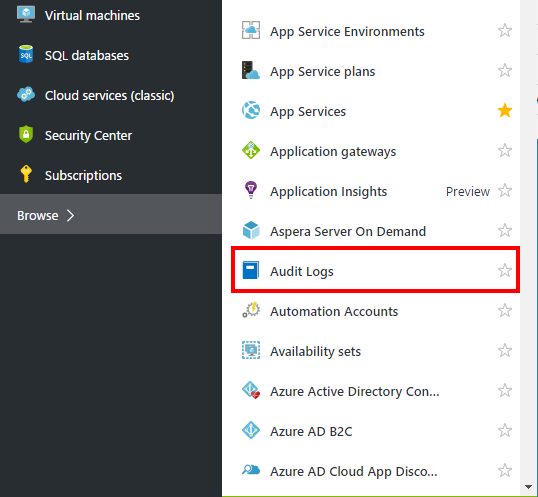
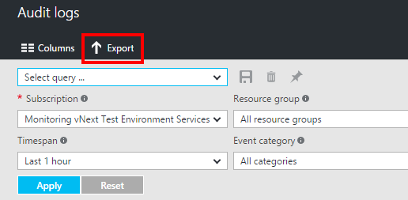
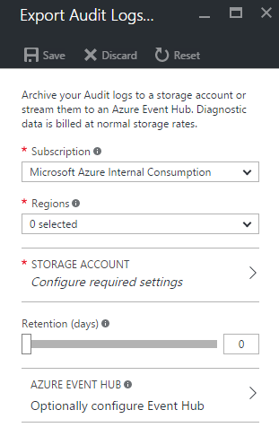

<properties
    pageTitle="Übertragen Sie das Aktivitätsprotokoll Azure zu Ereignis Hubs | Microsoft Azure"
    description="Erfahren Sie, wie das Protokoll Azure Aktivität Ereignis Hubs streamen."
    authors="johnkemnetz"
    manager="rboucher"
    editor=""
    services="monitoring-and-diagnostics"
    documentationCenter="monitoring-and-diagnostics"/>

<tags
    ms.service="monitoring-and-diagnostics"
    ms.workload="na"
    ms.tgt_pltfrm="na"
    ms.devlang="na"
    ms.topic="article"
    ms.date="10/03/2016"
    ms.author="johnkem"/>

# <a name="stream-the-azure-activity-log-to-event-hubs"></a>Übertragen Sie das Aktivitätsprotokoll Azure zu Ereignis Hubs
Der [**Azure Aktivität Log**](./monitoring-overview-activity-logs.md) können nahezu in Echtzeit an einer beliebigen Anwendung verwenden die integrierte Option "Exportieren" im Portal, oder indem Sie die Dienst Bus Regel-Id in einem Log-Profil über das Azure PowerShell-Cmdlets oder Azure CLI gestreamt werden.

## <a name="what-you-can-do-with-the-activity-log-and-event-hubs"></a>Mögliche Aktionen mit dem Aufzeichnen und Ereignis Hubs
Hier sind ein paar Möglichkeiten, die Sie eventuell das streaming Videofunktionen für die Protokolldatei verwenden:

- **Stream auf Drittanbieter - Protokollierung und werden Systeme** – werden im Laufe der Zeit Ereignis Hubs streaming erst das Verfahren leiten Sie Ihre Aktivitäten Log in Drittanbieter-SIEMs und dann wieder anmelden Analytics Lösungen.
- **Erstellen eines benutzerdefinierten werden und die Protokollierung Plattform** – Wenn Sie bereits über eine benutzerdefinierte werden Plattform verfügen oder nur nachdenkt werden, erstellen eine, hochgradig skalierbare Veröffentlichen-Abonnieren Art des Ereignisses Hubs ermöglicht es Ihnen, die Aktivität Log flexibel Aufnahme. [Finden Sie unter der Dan Rosanova bei der Verwendung von Ereignis Hubs in eine globale Skalierung werden Plattform hier.](https://azure.microsoft.com/documentation/videos/build-2015-designing-and-sizing-a-global-scale-telemetry-platform-on-azure-event-Hubs/)

## <a name="enable-streaming-of-the-activity-log"></a>Aktivieren Sie von der Aktivität Log streaming
Sie können das streaming von der Aktivität Log programmgesteuert oder über das Portal aktivieren. In beiden Fällen wählen Sie eine Service Bus Namespace und einer freigegebenen Zugriffsrichtlinie für diesen Namespace und ein Ereignis Hub wird in diesem Namespace erstellt, wenn das erste neue Aktivität Log-Ereignis eintritt. Wenn Sie nicht über eine Service Bus Namespace verfügen, müssen Sie zuerst eine erstellen. Wenn Sie die Aktivität protokollieren von Ereignissen zu diesem Dienst Bus Namespace zuvor gestreamt haben, wird das Ereignis Hub, die zuvor erstellt wurde wiederverwendet. Die freigegebenen Zugriffsrichtlinie definiert die Berechtigungen, die das streaming Verfahren hat. Heute, erfordert das streaming an ein Ereignis Hubs Berechtigungen **Verwalten**, **Lesen**und **Senden** aus. Sie können erstellen oder Ändern von Service Bus Namespace freigegeben-Richtlinien im klassischen-Portal unter der Registerkarte "Konfigurieren" für Ihre Service Bus Namespace. Um die Aktivität Log Log Profil zum Einschließen streaming zu aktualisieren, muss der Benutzer der Änderung Berechtigung der ListKey auf den entsprechenden Dienst Bus Autorisierungsregel.

### <a name="via-azure-portal"></a>Über Azure-portal 
1. Navigieren Sie zu der **Aktivität Log** Blade über das Menü auf der linken Seite des Portals.

    
2. Klicken Sie auf die Schaltfläche " **Exportieren** " am oberen Rand der Blade.

    
3. In das Blade, das angezeigt wird, können Sie die Regionen auswählen, für die Sie gerne würden Stream Ereignisse und der Dienst Bus Namespace in der Sie ein Ereignis Hub für diese Ereignisse streaming erstellt werden sollen.

    
4. Klicken Sie auf **Speichern** , um diese Einstellungen zu speichern. Die Einstellungen werden sofort zu Ihrem Abonnement übernommen.


### <a name="via-powershell-cmdlets"></a>Über PowerShell-Cmdlets
Wenn ein Protokoll Profil bereits vorhanden ist, müssen Sie zuerst das Profil zu entfernen.

1. Verwenden Sie `Get-AzureRmLogProfile` um festzustellen, ob ein Protokoll Profil vorhanden ist
2. Wenn dies der Fall ist, verwenden Sie `Remove-AzureRmLogProfile` zu entfernen.
3. Verwenden Sie `Set-AzureRmLogProfile` zum Erstellen eines Profils:

```
Add-AzureRmLogProfile -Name my_log_profile -StorageAccountId /subscriptions/s1/resourceGroups/myrg1/providers/Microsoft.Storage/storageAccounts/my_storage -serviceBusRuleId /subscriptions/s1/resourceGroups/Default-ServiceBus-EastUS/providers/Microsoft.ServiceBus/namespaces/mytestSB/authorizationrules/RootManageSharedAccessKey -Locations global,westus,eastus -RetentionInDays 90 -Categories Write,Delete,Action
```

Der Dienst Bus Regel-ID ist eine Zeichenfolge mit diesem Format: {service Bus Ressourcen-ID} /authorizationrules/ {Key Name}, beispielsweise 

### <a name="via-azure-cli"></a>Über die Azure CLI
Wenn ein Protokoll Profil bereits vorhanden ist, müssen Sie zuerst das Profil zu entfernen.

1. Verwenden Sie `azure insights logprofile list` um festzustellen, ob ein Protokoll Profil vorhanden ist
2. Wenn dies der Fall ist, verwenden Sie `azure insights logprofile delete` zu entfernen.
3. Verwenden Sie `azure insights logprofile add` zum Erstellen eines Profils:

```
azure insights logprofile add --name my_log_profile --storageId /subscriptions/s1/resourceGroups/insights-integration/providers/Microsoft.Storage/storageAccounts/my_storage --serviceBusRuleId /subscriptions/s1/resourceGroups/Default-ServiceBus-EastUS/providers/Microsoft.ServiceBus/namespaces/mytestSB/authorizationrules/RootManageSharedAccessKey --locations global,westus,eastus,northeurope --retentionInDays 90 –categories Write,Delete,Action
```

Der Dienst Bus Regel-ID ist eine Zeichenfolge mit diesem Format: `{service bus resource ID}/authorizationrules/{key name}`.
 
## <a name="how-do-i-consume-the-log-data-from-event-hubs"></a>Wie nutzen ich die Daten Log Ereignis Hubs?
[Das Schema für die Protokolldatei ist hier verfügbar](./monitoring-overview-activity-logs.md). Jedes Ereignis wird in einem Array von JSON-Blobs genannte "Datensätze".

## <a name="next-steps"></a>Nächste Schritte
- [Archivieren der Aktivität Log mit einem Speicherkonto](./monitoring-archive-activity-log.md)
- [Lesen Sie den Überblick über die Azure Aktivität Log](./monitoring-overview-activity-logs.md)
- [Einrichten einer Benachrichtigung, die auf der Grundlage einer Aktivität Log Ereignisses](./insights-auditlog-to-webhook-email.md)
