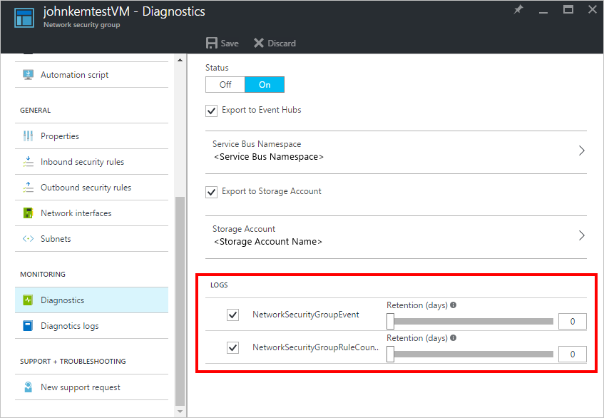
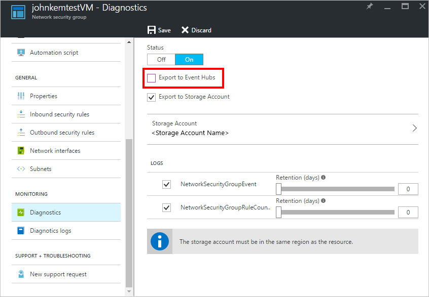

<properties
    pageTitle="Streamen Azure Diagnoseprotokolle an Ereignis Hubs | Microsoft Azure"
    description="Informationen Sie zum Azure Diagnoseprotokolle an Ereignis Hubs übertragen."
    authors="johnkemnetz"
    manager="rboucher"
    editor=""
    services="monitoring-and-diagnostics"
    documentationCenter="monitoring-and-diagnostics"/>

<tags
    ms.service="monitoring-and-diagnostics"
    ms.workload="na"
    ms.tgt_pltfrm="na"
    ms.devlang="na"
    ms.topic="article"
    ms.date="08/08/2016"
    ms.author="johnkem"/>

# <a name="stream-azure-diagnostic-logs-to-event-hubs"></a>Streamen Azure Diagnoseprotokolle an Hubs Ereignis.

**[Azure Diagnoseprotokolle](monitoring-overview-of-diagnostic-logs.md)** können nahezu in Echtzeit auf jede andere Anwendung, die integrierte "Exportieren auf Ereignis Hubs" Option im Portal oder durch das Aktivieren der Service Bus Regel-Id in einer Diagnoseprotokollen Einstellung über das Azure PowerShell-Cmdlets oder Azure CLI gestreamt werden.

## <a name="what-you-can-do-with-diagnostics-logs-and-event-hubs"></a>Mögliche Aktionen mit Diagnose Protokolle und Ereignis Hubs
Hier sind ein paar Möglichkeiten, die Sie eventuell das streaming Videofunktionen für Diagnoseprotokolle verwenden:

- **Stream Protokolle 3rd Party Protokollierung und Systeme werden** – werden im Laufe der Zeit Ereignis Hubs streaming erst das Verfahren leiten Sie Ihre Diagnoseprotokolle in Drittanbieter SIEMs und dann wieder anmelden Analytics Lösungen.

- **Dienststatus durch streamen "langsamste Pfad" Daten PowerBI Ansicht** – Ereignis Hubs verwenden, Stream Analytics und PowerBI, können Sie einfach Ihrer von Diagnosedaten in Echtzeit Einsichten in der Nähe für Ihren Azure bereitgestellt transformieren. [In diesem Artikel Dokumentation bietet eine gute Übersicht, wie ein Ereignis Hubs einrichten, Daten zu verarbeiten mit Stream Analytics, PowerBI als Ausgabe verwenden](../stream-analytics/stream-analytics-power-bi-dashboard.md). Hier ist ein paar Tipps für das erste mit Diagnoseprotokolle einrichten:
    - In den untergeordneten Servern Ereignis für eine Kategorie von Diagnoseprotokollen wird automatisch erstellt, wenn Sie das Kontrollkästchen im Portal oder über PowerShell, aktivieren, damit Sie den untergeordneten Ereignis Servern im Dienstbus Namespace mit dem Namen auswählen, die mit "Einsichten-" beginnt möchten
    - So sieht eine Beispiel Stream Analytics Abfrage, die Sie verwenden können, um einfach alle Log Analysieren der Daten in einer Tabelle PowerBI aus:

```
SELECT
records.ArrayValue.[Properties you want to track]
INTO
[OutputSourceName – the PowerBI source]
FROM
[InputSourceName] AS e
CROSS APPLY GetArrayElements(e.records) AS records
```

- **Erstellen eines benutzerdefinierten werden und die Protokollierung Plattform** – Wenn Sie bereits über eine benutzerdefinierte werden Plattform verfügen oder nur nachdenkt werden, erstellen eine, hochgradig skalierbare Veröffentlichen-Abonnieren Art des Ereignisses Hubs ermöglicht es Ihnen, flexible Diagnoseprotokolle Aufnahme. [Finden Sie unter Dan Rosanovas Leitfadens bei der Verwendung von Ereignis Hubs in eine globale Skalierung werden Plattform hier](https://azure.microsoft.com/documentation/videos/build-2015-designing-and-sizing-a-global-scale-telemetry-platform-on-azure-event-Hubs/).

## <a name="enable-streaming-of-diagnostic-logs"></a>Aktivieren von Diagnoseprotokollen streaming
Sie können programmgesteuert, über im Portal von Diagnoseprotokollen streaming oder mithilfe der [Azure Monitor REST-API](https://msdn.microsoft.com/library/azure/dn931943.aspx)aktivieren. In beiden Fällen wählen Sie aus einem Dienst Bus Namespace und den Namespace für jedes Log-Kategorie, die Sie aktivieren ein Ereignis Hubs erstellt wird. Einer Diagnoseprotokollen **Log Kategorie** ist eine Art Log, die eine Ressource erfassen kann. Sie können auswählen, welche Kategorien protokollieren Sie für eine bestimmte Ressource im Azure-Portal unter der Diagnose Blade sammeln möchten.



> [AZURE.WARNING] Aktivieren und streaming Diagnoseprotokolle aus berechnen Ressourcen (z. B. virtuellen Computern oder Dienst Fabric) [erfordert eine andere Gruppe von Schritten](../event-hubs/event-hubs-streaming-azure-diags-data.md).

### <a name="via-powershell-cmdlets"></a>Über PowerShell-Cmdlets
Um über die [Azure PowerShell-Cmdlets](insights-powershell-samples.md)streaming aktivieren möchten, können Sie die `Set-AzureRmDiagnosticSetting` Cmdlet mit den folgenden Parametern:

```
Set-AzureRmDiagnosticSetting -ResourceId [your resource Id] -ServiceBusRuleId [your service bus rule id] -Enabled $true
```

Der Dienst Bus Regel-ID ist eine Zeichenfolge mit diesem Format: `{service bus resource ID}/authorizationrules/{key name}`, z. B. `/subscriptions/{subscription ID}/resourceGroups/Default-ServiceBus-WestUS/providers/Microsoft.ServiceBus/namespaces/{service bus namespace}/authorizationrules/RootManageSharedAccessKey`.


### <a name="via-azure-cli"></a>Über die Azure CLI
Wenn Sie über die [Azure CLI](insights-cli-samples.md)streaming aktivieren möchten, können Sie die `insights diagnostic set` -Befehl wie folgt:

```
azure insights diagnostic set --resourceId <resourceId> --serviceBusRuleId <serviceBusRuleId> --enabled true
```

Verwenden Sie das gleiche Format für Service Bus Regel-ID ein, wie für das PowerShell-Cmdlet erläutert.

###<a name="via-azure-portal"></a>Über Azure-Portal
Klicken Sie zum Aktivieren über das Azure-Portal streaming navigieren Sie zu der Diagnose einer Ressource, und wählen Sie 'Exportieren an Ereignis Verteiler'.



Um ihn zu konfigurieren, wählen Sie eine vorhandene Service Bus Namespace aus. Der Namespace ausgewählt werden, bei denen den Ereignis untergeordneten Servern erstellt (sofern dies Ihrer ersten Mal streaming von Diagnoseprotokollen ist) oder auf gestreamt (Wenn bereits vorhanden sind Ressourcen, die die Kategorie Log zu diesem Namespace streaming sind), und die Richtlinie definiert die Berechtigungen, die das streaming Verfahren hat. Heute, erfordert das streaming an ein Ereignis Hubs Berechtigungen verwalten, lesen und senden aus. Sie können erstellen oder Ändern von Service Bus Namespace freigegeben-Richtlinien im klassischen-Portal unter der Registerkarte "Konfigurieren" für Ihre Service Bus Namespace. Um eine der folgenden Diagnoseeinstellungen zu aktualisieren, muss der Client die Berechtigung ListKey der Dienst Bus Autorisierung Regel sein.

##<a name="how-do-i-consume-the-log-data-from-event-hubs"></a>Wie nutzen ich die Daten Log Ereignis Hubs?
So sieht die Ausgabe Beispieldaten aus den untergeordneten Ereignis Servern aus:

```
{
    "records": [
        {
            "time": "2016-07-15T18:00:22.6235064Z",
            "workflowId": "/SUBSCRIPTIONS/DF602C9C-7AA0-407D-A6FB-EB20C8BD1192/RESOURCEGROUPS/JOHNKEMTEST/PROVIDERS/MICROSOFT.LOGIC/WORKFLOWS/JOHNKEMTESTLA",
            "resourceId": "/SUBSCRIPTIONS/DF602C9C-7AA0-407D-A6FB-EB20C8BD1192/RESOURCEGROUPS/JOHNKEMTEST/PROVIDERS/MICROSOFT.LOGIC/WORKFLOWS/JOHNKEMTESTLA/RUNS/08587330013509921957/ACTIONS/SEND_EMAIL",
            "category": "WorkflowRuntime",
            "level": "Error",
            "operationName": "Microsoft.Logic/workflows/workflowActionCompleted",
            "properties": {
                "$schema": "2016-04-01-preview",
                "startTime": "2016-07-15T17:58:55.048482Z",
                "endTime": "2016-07-15T18:00:22.4109204Z",
                "status": "Failed",
                "code": "BadGateway",
                "resource": {
                    "subscriptionId": "df602c9c-7aa0-407d-a6fb-eb20c8bd1192",
                    "resourceGroupName": "JohnKemTest",
                    "workflowId": "243aac67fe904cf195d4a28297803785",
                    "workflowName": "JohnKemTestLA",
                    "runId": "08587330013509921957",
                    "location": "westus",
                    "actionName": "Send_email"
                },
                "correlation": {
                    "actionTrackingId": "29a9862f-969b-4c70-90c4-dfbdc814e413",
                    "clientTrackingId": "08587330013509921958"
                }
            }
        },
        {
            "time": "2016-07-15T18:01:15.7532989Z",
            "workflowId": "/SUBSCRIPTIONS/DF602C9C-7AA0-407D-A6FB-EB20C8BD1192/RESOURCEGROUPS/JOHNKEMTEST/PROVIDERS/MICROSOFT.LOGIC/WORKFLOWS/JOHNKEMTESTLA",
            "resourceId": "/SUBSCRIPTIONS/DF602C9C-7AA0-407D-A6FB-EB20C8BD1192/RESOURCEGROUPS/JOHNKEMTEST/PROVIDERS/MICROSOFT.LOGIC/WORKFLOWS/JOHNKEMTESTLA/RUNS/08587330012106702630/ACTIONS/SEND_EMAIL",
            "category": "WorkflowRuntime",
            "level": "Information",
            "operationName": "Microsoft.Logic/workflows/workflowActionStarted",
            "properties": {
                "$schema": "2016-04-01-preview",
                "startTime": "2016-07-15T18:01:15.5828115Z",
                "status": "Running",
                "resource": {
                    "subscriptionId": "df602c9c-7aa0-407d-a6fb-eb20c8bd1192",
                    "resourceGroupName": "JohnKemTest",
                    "workflowId": "243aac67fe904cf195d4a28297803785",
                    "workflowName": "JohnKemTestLA",
                    "runId": "08587330012106702630",
                    "location": "westus",
                    "actionName": "Send_email"
                },
                "correlation": {
                    "actionTrackingId": "042fb72c-7bd4-439e-89eb-3cf4409d429e",
                    "clientTrackingId": "08587330012106702632"
                }
            }
        }
    ]
}
```

| Elementnamen | Beschreibung                                            |
|--------------|--------------------------------------------------------|
|Datensätze       | Ein Array von alle Log Ereignisse in dieser Code.            |
|Zeit          | Die Uhrzeit des Ereignisses.                      |
|Kategorie      | Log-Kategorie für das Ereignis.                           |
|resourceId    | Ressourcen-ID der Ressource, die das Ereignis generiert. |
|operationName | Name des Vorgangs.                                 |
|Ebene         | Optional. Gibt die Ereignisebene an.               |
|Eigenschaften    | Eigenschaften des Ereignisses.                               |


Sie können eine Liste aller Ressourcenanbieter, die an Ereignis Verteiler streaming unterstützen anzeigen [können](monitoring-overview-of-diagnostic-logs.md).

##<a name="next-steps"></a>Nächste Schritte
- [Weitere Informationen zum Azure Diagnoseprotokolle](monitoring-overview-of-diagnostic-logs.md)
- [Erste Schritte mit Ereignis Hubs](../event-hubs/event-hubs-csharp-ephcs-getstarted.md)
