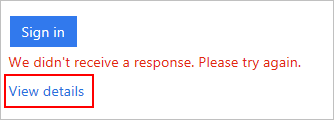

<properties
    pageTitle="Microsoft-Authentifizierung app häufig gestellte Fragen"
    description="Enthält eine Liste von häufig gestellte Fragen und Antworten, die im Zusammenhang mit der Microsoft-Authentication-app und Azure kombinierte Authentifizierung."
    services="multi-factor-authentication"
    documentationCenter=""
    authors="kgremban"
    manager="femila"
    editor="pblachar, librown"/>

<tags
    ms.service="multi-factor-authentication"
    ms.workload="identity"
    ms.tgt_pltfrm="na"
    ms.devlang="na"
    ms.topic="article"
    ms.date="10/13/2016"
    ms.author="kgremban"/>

# Microsoft Authenticator Anwendung häufig gestellte Fragen

Die app Microsoft Authenticator ersetzt die app Azure-Authentifizierung, und ist die empfohlene app aus, wenn Sie die kombinierte Authentifizierung Azure verwenden. Diese app ist für Windows Phone, Android und iOS verfügbar.

## Häufig gestellte Fragen

- **Wo befindet sich der Azure-Authentifizierung, mehrstufige Authentifizierung und Microsoft-Konto apps?**

    Die app Microsoft Authenticator ersetzt miteinander dieser apps. Azure Authentifizierung auf Microsoft Authenticator aktualisiert. Wenn Sie die kombinierte Authentifizierung oder apps für Microsoft-Konto verwenden, installieren Sie Microsoft Authenticator, und fügen Sie Ihre Konten erneut hinzu. Vergewissern Sie sich zu Ihren Konten bei der neuen app vor dem Löschen der alten hinzugefügt haben.

- **Ich verwende bereits die Anwendung Microsoft Authenticator für Überprüfung Codes. Wie kann ich zu einem Klick Pushbenachrichtigungen wechseln?**  

    Genehmigen einer Anmeldung über der Pushbenachrichtigung steht nur für Microsoft-Konten, nicht für Drittanbieter-Konten wie Google oder Facebook. Für geschäftlichen oder schulnotizbücher Microsoft-Konten können Ihrer Organisation durch diese Option zu deaktivieren.

    Wenn Sie ein Microsoft-Konto für Ihre persönlichen Konto verwenden und Pushbenachrichtigungen zu wechseln möchten, müssen Sie Ihr Konto wieder hinzufügen. Das Gerät mit Ihrem Konto erneut zu registrieren, und Einrichten von Pushbenachrichtigungen.  

    Wenn Ihr Konto nicht in zwei Schritten Überprüfung aktiviert verfügt, finden Sie unter [über die Überprüfung in zwei Schritten](https://support.microsoft.com/help/12408/microsoft-account-about-two-step-verification) zu entscheiden, ob es für Sie richtig ist.  

- **Wann kann ich ein-Klick-Pushbenachrichtigungen auf einem iPhone oder iPad verwenden?**  

    Dieses Feature ist in Beta bis zum Ende des August, wenn es für die Microsoft-Konten gestreut verfügbar wird. Wenn Sie unsere Beta-Programm teilnehmen möchten, Senden einer e-Mail an msauthenticator@microsoft.com. Der Vorname, Nachname und Apple-ID in Ihre Nachricht einschließen.  

- **Funktionieren nur einem Klick Pushbenachrichtigungen für nicht-Microsoft-Konten?**  

    Nein, arbeiten Sie Pushbenachrichtigungen nur mit Microsoft-Konten und Azure-Active Directory-Konten. Wenn Ihre Arbeit oder Schule Azure AD-Konten verwendet, können sie dieses Feature deaktivieren.  

- **Kann ich mein Gerät aus einer Sicherung wiederhergestellt, und mein Kontocodes sind fehlende oder funktioniert nicht. Was ist passiert?**  

    Aus Sicherheitsgründen Wiederherstellen nicht wir Konten aus app Sicherungskopien. Wenn Sie die iOS-app aus einer Sicherung wiederherstellen, Ihre Konten werden weiterhin angezeigt, aber nicht zum Empfangen Anmeldung Überprüfungen oder generieren Sicherheitscodes verarbeitet. Nachdem Sie die app wiederherstellen, löschen Sie Ihre Konten, und fügen Sie sie erneut.

- **Ich habe ein neues Gerät. Wie kann ich meine alten Gerät daraus die app Microsoft Authenticator und in den neuen verschieben?**

    Hinzufügen der Microsoft Authenticator-app auf ein neues Gerät entfernt nicht automatisch sie von einem beliebigen anderen Geräten aus. Zum Verwalten der Geräte für Ihr Konto konfiguriert sind, finden Sie auf der gleichen Website, die Sie verwenden, um zwei Überprüfung verwalten, und wählen Sie zum Entfernen der alten apps aus.

    Für persönliche Microsoft-Konten ist diese Website der Seite [Konto Sicherheit](https://account.microsoft.com/security) . Für geschäftlichen oder schulnotizbücher Microsoft-Konten möglicherweise diese Website [MyApps](https://myapps.microsoft.com) oder eines benutzerdefinierten Portals, das Ihrer Organisation eingerichtet wurde.

## Wenden Sie sich an uns

Wenn Sie hier Ihre Frage beantwortet wurde nicht, einen Kommentar am unteren Rand der Seite. Oder [an den Support](https://support.microsoft.com/contactus) , und wir für Ihr Problem Antworten erhalten, sobald wir können.

Wenn Sie den Support kontaktieren, schließen Sie es so viele die folgenden Informationen, wie Sie können:

- **Benutzer-ID** – was die e-Mail-Adresse ist, der Sie sich in wollten?
- **Allgemeine Beschreibung des Fehlers** – Meinten welche genauen Fehlermeldung angezeigt?  Wenn es keine Fehlermeldung angezeigt wurde, beschreiben Sie das unerwartete Verhalten im Detail bemerkt.
- **Seite** – welche Seite haben Sie bisher auf, wenn Sie den Fehler gesehen haben (auch den URL)?
- **Fehlercode** - Fehlercode, die Sie empfangen werden.
- **SessionId** - die Id für eine bestimmte Sitzung, die Sie empfangen werden.
- **Korrelations-ID** – welchen Anteil der Korrelations-Id-Code generiert, wenn der Benutzer den Fehler gesehen haben.
- **Zeitstempel** – welchen Anteil präzise Datum und Uhrzeit, die Sie gesehen des Fehlers haben (einschließlich die Zeitzone)?

Viele dieser Informationen kann auf der Anmeldeseite gefunden werden. Wählen Sie bei der Überprüfung Ihrer Anmeldung Zeitpunkt nicht **Anzeigen**.

Diese Informationen einschließlich hilft uns so schnell wie möglich Lösung Ihres Problems.

## Verwandte Themen

- [Azure kombinierte Authentifizierung häufig gestellte Fragen](multi-factor-authentication-faq.md)  
- [Über die zwei Überprüfung](https://support.microsoft.com/help/12408/microsoft-account-about-two-step-verification) für Microsoft-Konten
- [Haben Sie Probleme mit zwei Überprüfung?](multi-factor-authentication-end-user-troubleshoot.md)
