<properties
    pageTitle="Was sind die App Kennwörtern in Azure MFA?"
    description="Auf dieser Seite helfen Benutzern, die zu verstehen, was app Kennwörter sind und was sie mit dienen zu Azure MFA betrachten."
    services="multi-factor-authentication"
    documentationCenter=""
    authors="kgremban"
    manager="femila"
    editor="curtland"/>

<tags
    ms.service="multi-factor-authentication"
    ms.workload="identity"
    ms.tgt_pltfrm="na"
    ms.devlang="na"
    ms.topic="article"
    ms.date="08/04/2016"
    ms.author="kgremban"/>

# Was sind die App Kennwörtern in Azure kombinierte Authentifizierung?

Mehrstufige Authentifizierung unterstützt bestimmte ohne Browser-apps, wie etwa die Apple systemeigene e-Mail-Client, der Exchange ActiveSync, verwendet derzeit nicht. Mehrstufige Authentifizierung, die pro Benutzer aktiviert ist. Dies bedeutet, wenn ein Benutzer für die kombinierte Authentifizierung aktiviert wurde und sie versuchen, ohne Browser apps zu verwenden, sie nicht möglich sind. Eine app Kennwort kann diese Option, um das auftreten.

>[AZURE.NOTE] Modernes Authentifizierung für die Office 2013-Clients
>
> Office 2013-Clients (einschließlich Outlook) Protokolle für neue Authentifizierung unterstützt jetzt und zur Unterstützung von kombinierte Authentifizierung aktiviert werden können.  Dies bedeutet, dass nach der Aktivierung app Kennwörter nicht für die Verwendung mit Office 2013-Clients erforderlich sind.  Weitere Informationen finden Sie unter [Office 2013 moderne Authentifizierung public Preview-Version angekündigt](https://blogs.office.com/2015/03/23/office-2013-modern-authentication-public-preview-announced/).

## So verwenden Sie die app Kennwörter

Es folgen einige Schritte, die zum Verwenden der app Kennwörter vergessen Sie nicht.

- Das eigentliche Kennwort wird automatisch generiert und nicht durch den Benutzer bereitgestellt wird. Dies liegt daran, dass das automatisch generierte Kennwort ist für einen Angreifer Raten schwieriger und sicherer.
- Es gibt zurzeit maximal 40 Kennwörter pro Benutzer. Wenn Sie versuchen, eine zu erstellen, nachdem Sie den Wert erreicht haben, werden Sie aufgefordert, eine vorhandene Kennwörter app zum Erstellen ein neues Kontos löschen.
- Es wird empfohlen, dass die app Kennwörter pro Gerät und pro Anwendung nicht erstellt werden. Beispielsweise können Sie eine app Kennwort für Ihr Notebook erstellen und dieses Kennwort verwenden, app für alle Anwendungen auf diese Laptops.
- Eine app Kennwort werden beim ersten angegeben werden, Sie sich anmelden.  Wenn Sie zusätzliche Emoticons benötigen, können Sie diese erstellen.

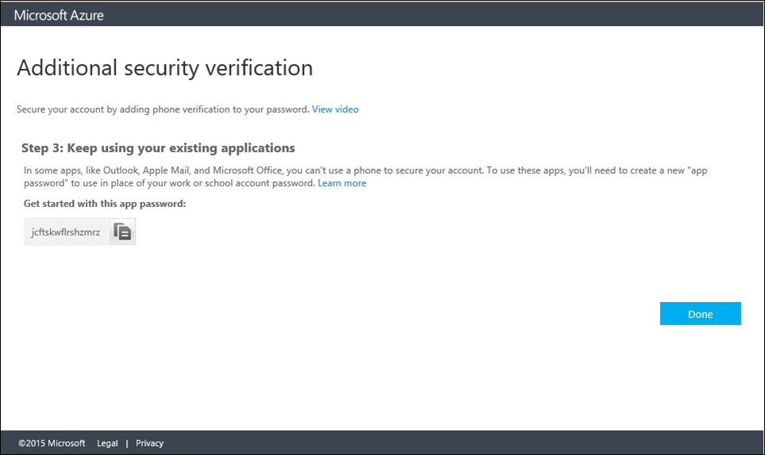

Nachdem Sie eine app Kennwort verfügen, verwenden Sie dieses anstelle der Originalkennwort mit dieser apps nicht Browser.  So beispielsweise, wenn Sie die kombinierte Authentifizierung und der Apple systemeigene e-Mail-Client auf Ihrem Telefon verwenden.  Verwenden Sie das Kennwort für die app, sodass weiterhin arbeiten und kombinierte Authentifizierung umgehen kann.

## Erstellen und Löschen von app-Kennwörter
Während der ersten Anmeldung erhalten Sie ein Kennwort für die app, die Sie verwenden können.  Darüber hinaus können Sie auch erstellen, und löschen die app Kennwörter höher.  Wie Sie dies tun, hängt davon ab, wie Sie kombinierte Authentifizierung verwenden.  Wählen Sie aus den meisten gilt für Sie.

Verwendung der kombinierte authentiation|Beschreibung
:------------- | :------------- |
[Kann ich verwenden mit Office 365](#creating-and-deleting-app-passwords-with-office-365)|  Dies bedeutet, dass Sie bei app Kennwörter über Office 365-Portal erstellen möchten.
[Ich weiß es nicht](#creating-and-deleting-app-passwords-with-myapps-portal)|Dies bedeutet, dass Sie app Kennwörter über [https://myapps.microsoft.com](https://myapps.microsoft.com) erstellen sollten
[Kann ich verwenden mit Microsoft Azure](#create-app-passwords-in-the-azure-portal)| Dies bedeutet, dass Sie wahrscheinlich app Kennwörter über das Azure-Portal zu erstellen.

## Erstellen und Löschen von app Kennwörter mit Office 365

Wenn Sie kombinierte Authentifizierung mit Office 365, die Sie erstellen und app Kennwörter über Office 365-Portal löschen möchten verwenden.

### App Erstellen von Kennwörtern in Office 365-portal
--------------------------------------------------------------------------------

1. Melden Sie sich bei [Office 365-Portal](https://login.microsoftonline.com/)an.
2. Klicken Sie in der oberen rechten Ecke wählen Sie das Widget aus, und wählen Sie Office 365-Einstellungen.
3. Klicken Sie auf Überprüfung zusätzliche Sicherheit.
4. Klicken Sie auf der rechten Seite, auf die Verknüpfung, die besagt, **Meine Rufnummern für die Sicherheit Konto aktualisieren.** 
 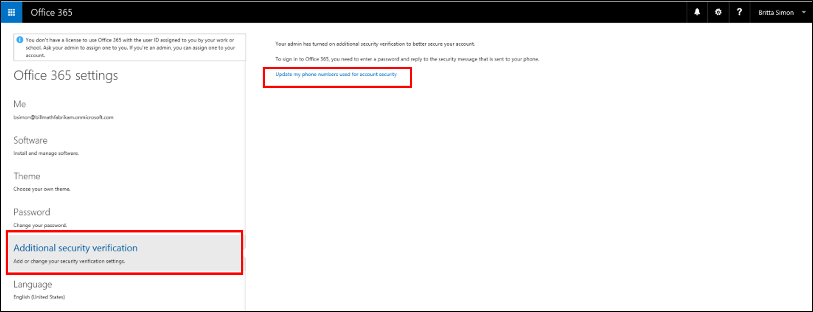
5. Dadurch gelangen Sie zur der Seite, mit der Sie Ihre Einstellungen ändern können.
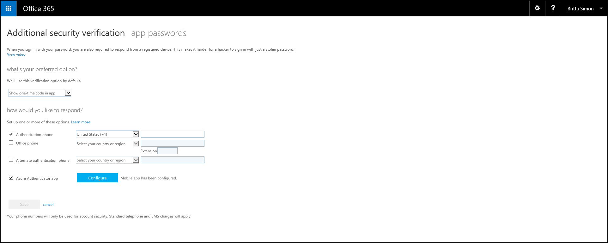
6. Klicken Sie auf oben neben zusätzliche Sicherheit Überprüfung, klicken Sie auf **app Kennwörter.**
7. Klicken Sie auf **Erstellen**.
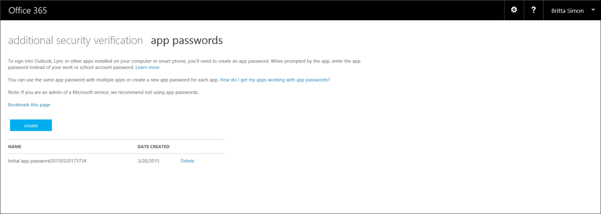
8. Geben Sie einen Namen für die app-Kennwort ein, und klicken Sie auf **Weiter**.
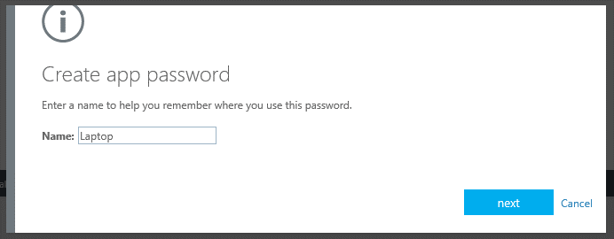
9. Kopieren Sie das Kennwort für die app in die Zwischenablage zu, und fügen Sie ihn in der app.
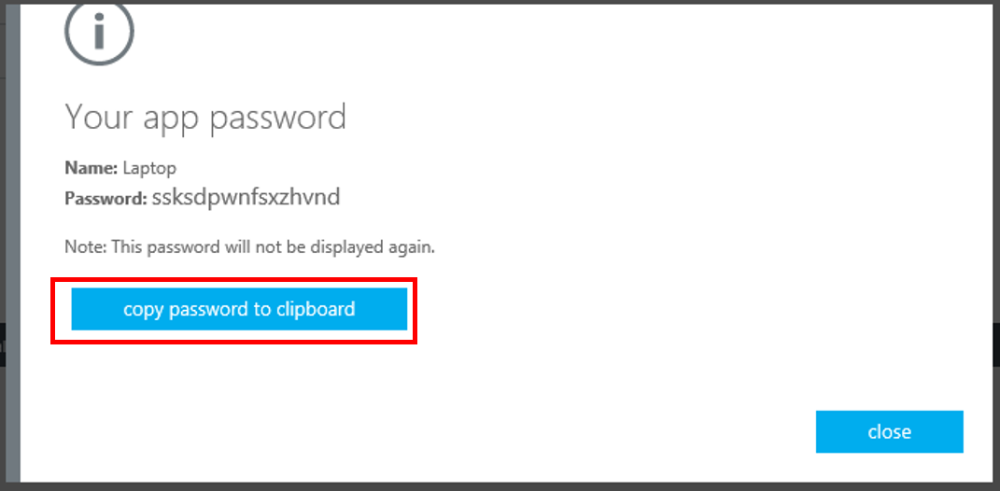

### So löschen Sie die app Kennwörter mit Office 365-portal
--------------------------------------------------------------------------------

1. Melden Sie sich bei [Office 365-Portal](https://login.microsoftonline.com/)an.
2. Klicken Sie in der oberen rechten Ecke wählen Sie das Widget aus, und wählen Sie Office 365-Einstellungen.
3. Klicken Sie auf Überprüfung zusätzliche Sicherheit.
4. Klicken Sie auf der rechten Seite, auf die Verknüpfung, die besagt, **Meine Rufnummern für die Sicherheit Konto aktualisieren.** 
 
5. Dadurch gelangen Sie zur der Seite, mit der Sie Ihre Einstellungen ändern können.

6. Klicken Sie auf oben neben zusätzliche Sicherheit Überprüfung, klicken Sie auf **app Kennwörter.**
7. Klicken Sie neben der app Ihr Kennwort ein, die, das Sie löschen möchten, klicken Sie auf **Löschen**.
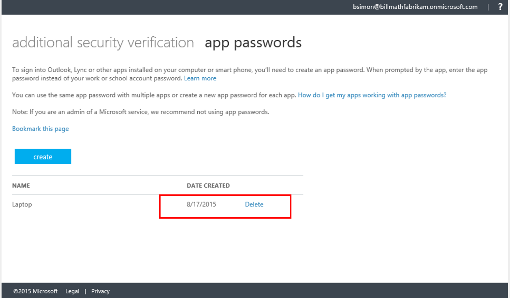
8. Bestätigen Sie den Vorgang, indem Sie auf **Ja**.
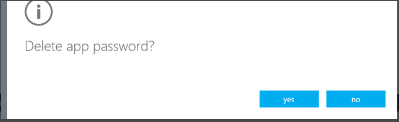
9. Nachdem Sie das Kennwort für die app gelöscht wird können Sie **Schließen**klicken.
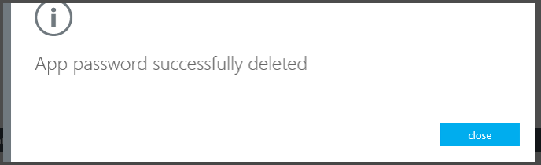

## Erstellen und Löschen von app Kennwörter mit Myapps Portal.
Wenn Sie nicht sicher sind, wie Sie die kombinierte Authentifizierung verwenden, können dann immer erstellen und app Kennwörter über das Portal Myapps löschen.

### So erstellen Sie eine app Kennwort verwenden des Portals Myapps

1. Anmelden Sie bei [https://myapps.microsoft.com](https://myapps.microsoft.com)
2. Wählen Sie im Kopfbereich Profil aus.
3. Wählen Sie zusätzliche Sicherheit Überprüfung aus.
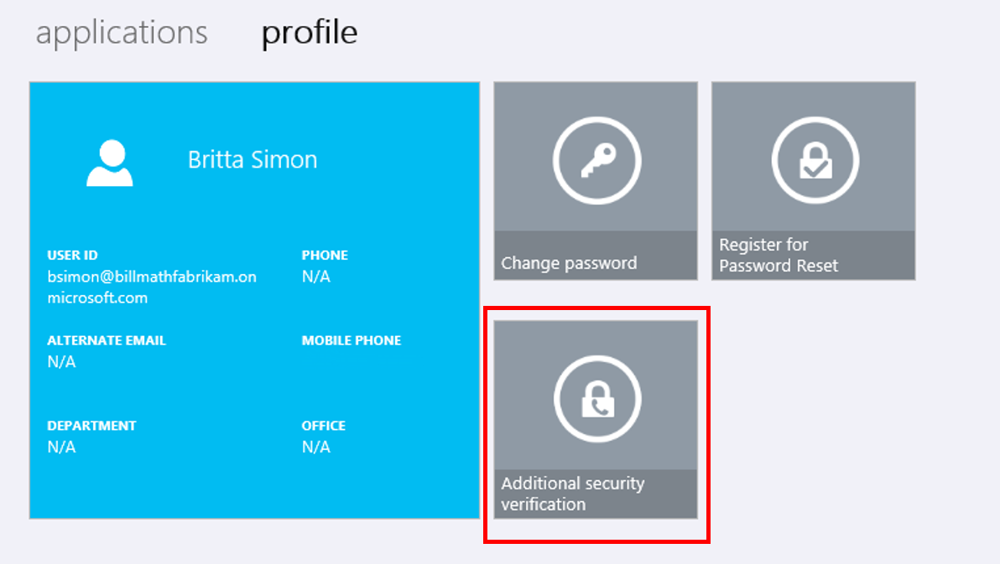
4. Dadurch gelangen Sie zur der Seite, mit der Sie Ihre Einstellungen ändern können.

5. Klicken Sie auf oben neben zusätzliche Sicherheit Überprüfung, klicken Sie auf **app Kennwörter.**
6. Klicken Sie auf **Erstellen**.
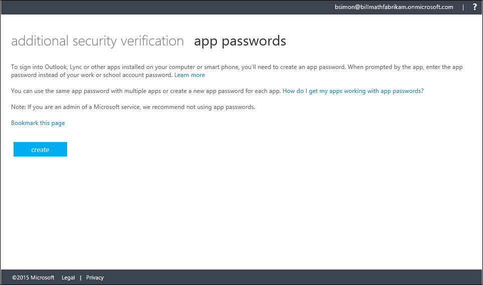
7. Geben Sie einen Namen für die app-Kennwort ein, und klicken Sie auf **Weiter**.

8. Kopieren Sie das Kennwort für die app in die Zwischenablage zu, und fügen Sie ihn in der app.

### So löschen Sie eine app Kennwort verwenden des Portals Myapps

1. Anmelden Sie bei [https://myapps.microsoft.com](https://myapps.microsoft.com)
2. Wählen Sie im Kopfbereich Profil aus.
3. Wählen Sie zusätzliche Sicherheit Überprüfung aus.

4. Dadurch gelangen Sie zur der Seite, mit der Sie Ihre Einstellungen ändern können.

5. Klicken Sie auf oben neben zusätzliche Sicherheit Überprüfung, klicken Sie auf **app Kennwörter.**
6. Klicken Sie neben der app Ihr Kennwort ein, die, das Sie löschen möchten, klicken Sie auf **Löschen**.

7. Bestätigen Sie den Vorgang, indem Sie auf **Ja**.

8. Nachdem Sie das Kennwort für die app gelöscht wird können Sie **Schließen**klicken.

## Erstellen von app Kennwörter Azure-Portal

Wenn Sie eine kombinierte Authentifizierung mit Azure app Kennwörter über das Azure Portal erstellen möchten verwenden.

### Zum Erstellen von app Kennwörter Azure-Portal

1. Anmelden Sie bei der Azure-Verwaltungsportal.
2. Klicken Sie oben mit der rechten Maustaste auf Ihren Benutzernamen ein, und wählen Sie zusätzliche Sicherheit Überprüfung.
3. Wählen Sie auf der Seite Proofup am oberen app Kennwörter
4. Klicken Sie auf **Erstellen**.
5. Geben Sie einen Namen für die app-Kennwort ein, und klicken Sie auf **Weiter**
6. Kopieren Sie das Kennwort für die app in die Zwischenablage zu, und fügen Sie ihn in der app.

### So löschen Sie die app Kennwörter Azure-Portal

1. Anmelden Sie bei der Azure-Verwaltungsportal.
2. Klicken Sie oben mit der rechten Maustaste auf Ihren Benutzernamen ein, und wählen Sie zusätzliche Sicherheit Überprüfung.
3. Klicken Sie auf oben neben zusätzliche Sicherheit Überprüfung, klicken Sie auf **app Kennwörter.**
4. Klicken Sie neben der app Ihr Kennwort ein, die, das Sie löschen möchten, klicken Sie auf **Löschen**.
5. Bestätigen Sie den Vorgang, indem Sie auf **Ja**.
6. Nachdem Sie das Kennwort für die app gelöscht wird können Sie **Schließen**klicken.

