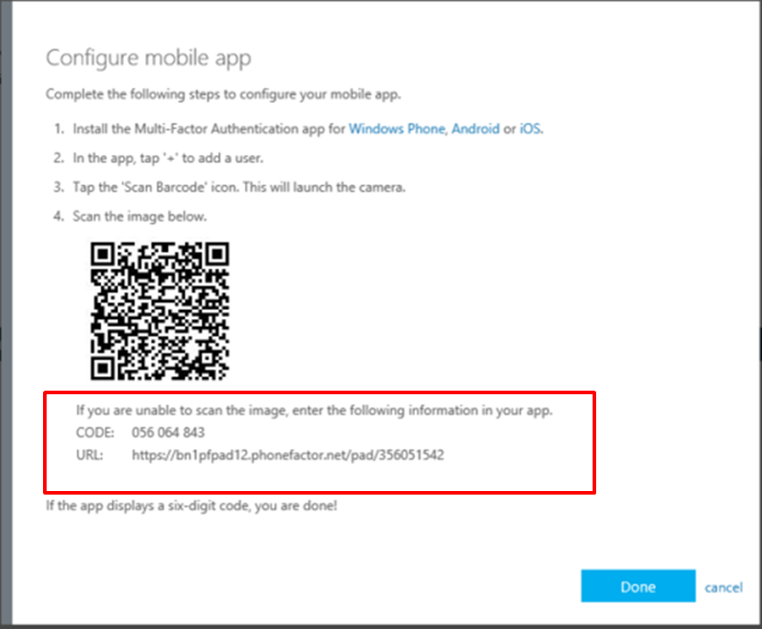

<properties
    pageTitle="Einrichten von zwei Überprüfung für mein Konto geschäftlichen oder schulnotizbücher"
    description="Wenn Ihr Unternehmen Azure kombinierte Authentifizierung konfiguriert hat, werden Sie aufgefordert zum Registrieren für zwei Überprüfung. Erfahren Sie, wie Sie sie einrichten. "
    services="multi-factor-authentication"
    keywords="Verwendung von Azure Directory, active Directory in der Cloud, active Directory-Lernprogramm"
    documentationCenter=""
    authors="kgremban"
    manager="femila"
    editor="pblachar"/>

<tags
    ms.service="multi-factor-authentication"
    ms.workload="identity"
    ms.tgt_pltfrm="na"
    ms.devlang="na"
    ms.topic="article"
    ms.date="10/10/2016"
    ms.author="kgremban"/>

# Einrichten von meinem Konto in zwei Schritten Überprüfung

Zwei Überprüfung ist eine zusätzliche Sicherheit Schritt, der hilft, Ihr Konto zu schützen, indem Sie es schwieriger für andere Personen zu verschaffen. Wenn Sie in diesem Artikel lesen möchten, rufen Sie wahrscheinlich eine e-Mail-Nachricht aus Ihrer geschäftlichen oder schulnotizbücher Administrator zu kombinierte Authentifizierung ab. Oder vielleicht versucht, melden Sie sich an, und haben Sie eine Nachricht mit der Frage, zusätzliche Sicherheit Überprüfung einrichten. Ist dies der Fall, **Sie nicht anmelden können, bis Sie die automatische Registrierung abgeschlossen haben**.

In diesem Artikel können Sie Ihre **Arbeit oder Schule Konto**einrichten. Wenn Sie zwei Überprüfung für eigene, persönliche Microsoft-Konto aktivieren möchten, finden Sie unter [Überprüfung in zwei Schritten](https://support.microsoft.com/help/12408/microsoft-account-about-two-step-verification).

## Bestimmen Sie, wie mehrstufige Authentifizierung verwendet werden

Zwei Überprüfung funktioniert, wenn Sie mit der Sie für zwei Teile der Kennzeichnung bei der Anmeldung. Zuerst bitten wir für Ihren Benutzernamen und Ihr Kennwort wie gewohnt. Klicken Sie dann bestätigen wir Kontakt, einem Mobiltelefon, die wir wissen Sie, und Sie gehört, dass es sich bei der Anmeldung Versuch seriösen wurde.  

Um den Installationsvorgang anzufangen, versuchen Sie es bei Ihrem Konto anmelden können, wie Sie in der Regel. Wenn Sie Ihren Administrator, Ihr Konto zur Überprüfung in zwei Schritten konfiguriert hat, werden Sie aufgefordert, die automatische Registrierung zu beginnen. Starten Sie diesen Prozess, indem Sie auf **jetzt einrichten.**

Die erste Frage in der Registrierung ist, wie Sie uns mit Ihnen Kontakt aufnehmen möchten. Schauen Sie sich die Optionen in der Tabelle, und verwenden Sie die Links, um die Einrichtungsschritte für jede Methode aufzurufen.

| Wenden Sie sich an Methode | Beschreibung |
| --- | --- |
[Mobile-app](#use-a-mobile-app-as-the-contact-method) | - **Lassen Sie sich für die Überprüfung.** Diese Option legt eine Benachrichtigung zur Authentifizierung-app auf Ihrem Smartphone oder Tablet-PC. Anzeigen der Benachrichtigung, und wenn es seriösen ist, wählen Sie in der app **authentifizieren** . Ihre Arbeit oder Schule erfordern, dass Sie eine PIN eingeben, bevor Sie authentifizieren. - **Verwenden Sie die Überprüfungscode ein.** In diesem Modus generiert die Authentifizierung app einen Überprüfungscode, der alle 30 Sekunden aktualisiert. Geben Sie den aktuellsten Überprüfungscode die Benutzeroberfläche anmelden. Die app Microsoft Authenticator steht für [Windows Phone](http://go.microsoft.com/fwlink/?Linkid=825071), [Android](http://go.microsoft.com/fwlink/?Linkid=825072)und [IOS](http://go.microsoft.com/fwlink/?Linkid=825073). |
[Anruf auf dem Mobiltelefon oder text](#use-your-mobile-phone-as-the-contact-method) | - **Anruf** platziert eine automatisierte VoIP-Anruf an die Rufnummer, die Sie zur Verfügung stellen. Annehmen Sie den Anruf, und drücken Sie # in dem Tastenfeld Telefon zum Authentifizieren. - **Textnachricht** endet, enthält einen Überprüfungscode Textnachricht. Antworten Sie auf die Textnachricht, oder geben Sie den Überprüfungscode in die Benutzeroberfläche Anmeldung bereitgestellt, nach der entsprechenden Aufforderung im Text. |  
[Office-Anruf](#use-your-office-phone-as-the-contact-method) | Stellen eine automatisierte VoIP-Anruf an die Rufnummer, die Sie zur Verfügung stellen. Den Anruf annehmen und # in dem Tastenfeld Telefon zum Authentifizieren klickt. |

## Verwenden einer mobilen app als Kontakt Methode

Verwenden diese Methode erfordert, dass Sie eine app Authentifizierung auf Ihrem Mobiltelefon oder Tablet-PC installieren. Die Schritte in diesem Artikel basieren auf der Microsoft-Authenticator-app für [Windows Phone](http://go.microsoft.com/fwlink/?Linkid=825071), [Android](http://go.microsoft.com/fwlink/?Linkid=825072)und [IOS](http://go.microsoft.com/fwlink/?Linkid=825073)verfügbar ist.

1. Wählen Sie **Mobile-app** aus der Dropdownliste aus.
2. Wählen Sie **Benachrichtigungen für die Überprüfung** oder **die Überprüfungscode verwenden**, und wählen Sie dann **Einrichten**.

    

3. Klicken Sie auf Ihrem Mobiltelefon oder Tablet, öffnen Sie die app, und wählen Sie **+** ein Konto hinzuzufügen. (Wählen Sie auf Android-Geräten, die die drei Punkten, und klicken Sie dann **Konto hinzufügen**).
4. Geben Sie an, dass Sie ein Konto geschäftlichen oder schulnotizbücher hinzufügen möchten. Der QR Code Scanner auf Ihrem Smartphone wird geöffnet. Wenn die Kamera nicht ordnungsgemäß funktioniert, können Sie auswählen, der Firmeninformationen manuell eingeben. Weitere Informationen finden Sie unter [Hinzufügen eines Kontos manuell](#add-an-account-manually).  
5. Scannen Sie das Bild der QR-Code, das mit dem Bildschirm zum Konfigurieren der mobilen app dargestellt.  Wählen Sie auf **Fertig** , um das QR-Code zu schließen.  

    

6. Wenn die Aktivierung abgeschlossen ist, auf dem Telefon, und wählen **Kontakt mich**.  Dieser Schritt sendet entweder eine Benachrichtigung oder einen Überprüfungscode auf Ihr Telefon an. Wählen Sie auf **Überprüfen**.  
7. Wenn Ihr Unternehmen eine PIN für die Anmeldung Überprüfung Genehmigung erforderlich ist, geben Sie es ein.

    

8. Wählen Sie nach Abschluss der PIN-Eintrag **Schließen**. An diesem Punkt sollte Ihre Überprüfung erfolgreich verlaufen.
9. Es empfiehlt sich, dass Sie Ihre Mobiltelefonnummer eingeben, für den Fall, dass Sie Zugriff auf Ihre mobile-app verlieren. Geben Sie Ihr Land aus der Dropdown-Liste aus, und geben Sie Ihre Mobiltelefonnummer in das Feld neben dem Landesnamen. Wählen Sie **Weiter**aus.
10. An diesem Punkt werden Sie aufgefordert, um app Kennwörter für ohne Browser-apps wie Outlook 2010 oder älter oder der systemeigenen-e-Mail-app auf Apple-Geräten einzurichten. Dies liegt daran einige apps in zwei Schritten Überprüfung nicht unterstützen. Wenn Sie diese apps nicht verwenden, klicken Sie auf **Fertig** , und überspringen Sie die restlichen Schritte.
11. Wenn Sie diese apps verwenden, kopieren Sie das Kennwort für die app bereitgestellt, und fügen sie Ihrer Anwendung anstelle von regulären Ihr Kennwort ein. Sie können für mehrere apps app dasselbe Kennwort verwenden. Weitere Informationen [Hilfe bei der app Kennwörter].
12. Klicken Sie auf **Fertig**.

### Manuelles Hinzufügen eines Kontos
Gehen Sie folgendermaßen vor, wenn Sie ein Konto bei der mobilen app manuell hinzufügen anstelle von QR Reader möchten.

1. Wählen Sie die Schaltfläche **Konto manuell eingeben** .  
2. Geben Sie den Code und die URL, die auf derselben Seite bereitgestellt werden, die Sie den Barcode anzeigt. Diese Informationen geht in den Feldern **sowie die **URL** ** der mobile-App.

    

3. Wenn die Aktivierung abgeschlossen ist, wählen Sie **Kontakt mich**aus. Dieser Schritt sendet entweder eine Benachrichtigung oder einen Überprüfungscode auf Ihr Telefon an. Wählen Sie auf **Überprüfen**.

## Verwenden von Ihrem Mobiltelefon als Kontakt Methode

1. Wählen Sie **Authentifizierung Telefon** aus der Dropdownliste aus.  

      

2. Wählen Sie Ihr Land aus der Dropdownliste aus, und geben Sie Ihre Mobiltelefonnummer ein.
3. Wählen Sie die Methode, die Sie mit Ihrem Mobiltelefon - Text oder einen Anruf verwenden möchten.
4. Wählen Sie **Kontakt mich** zur Überprüfung Ihrer Telefonnummer. Je nach den Modus, die, den Sie ausgewählt haben, werden Sie einen Textplatzhalter senden oder rufen Sie. Folgen Sie den Anweisungen auf dem Bildschirm bereitgestellt, und wählen Sie dann **Überprüfen**.
5. An diesem Punkt werden Sie aufgefordert, um app Kennwörter für ohne Browser-apps wie Outlook 2010 oder älter oder der systemeigenen-e-Mail-app auf Apple-Geräten einzurichten. Dies liegt daran einige apps in zwei Schritten Überprüfung nicht unterstützen. Wenn Sie diese apps nicht verwenden, klicken Sie auf **Fertig** , und überspringen Sie die restlichen Schritte.
6. Wenn Sie diese apps verwenden, kopieren Sie das Kennwort für die app bereitgestellt, und fügen sie Ihrer Anwendung anstelle von regulären Ihr Kennwort ein. Sie können für mehrere apps app dasselbe Kennwort verwenden. Weitere Informationen [Hilfe bei der app Kennwörter].
7. Klicken Sie auf **Fertig**.

## Verwenden von Ihrem Telefon im Büro als Kontakt Methode

1. Wählen Sie die **Rufnummer** aus der Dropdown-Liste  

      

2. Feld Rufnummer wird mit Ihren Unternehmenskontaktinformationen automatisch ausgefüllt. Wenn die Zahl falsch oder nicht vorhanden ist, bitten Sie Ihren Administrator um Änderungen vorzunehmen.
4. Wählen Sie **Kontakt mich** zur Überprüfung Ihrer Telefonnummer und wir werden Ihre Nummer anrufen. Folgen Sie den Anweisungen auf dem Bildschirm bereitgestellt, und wählen Sie dann **Überprüfen**.
5. An diesem Punkt werden Sie aufgefordert, um app Kennwörter für ohne Browser-apps wie Outlook 2010 oder älter oder der systemeigenen-e-Mail-app auf Apple-Geräten einzurichten. Dies liegt daran einige apps in zwei Schritten Überprüfung nicht unterstützen. Wenn Sie diese apps nicht verwenden, klicken Sie auf **Fertig** , und überspringen Sie die restlichen Schritte.
6. Wenn Sie diese apps verwenden, kopieren Sie das Kennwort für die app bereitgestellt, und fügen sie Ihrer Anwendung anstelle von regulären Ihr Kennwort ein. Sie können für mehrere apps app dasselbe Kennwort verwenden. Weitere Informationen finden Sie unter [Was App Kennwörter sind](multi-factor-authentication-end-user-app-passwords.md).
7. Klicken Sie auf **Fertig**.

## Nächste Schritte

- Ändern der bevorzugten Optionen und [verwalten die Einstellungen für zwei Überprüfung](multi-factor-authentication-end-user-manage-settings.md)
- Einrichten von [app Kennwörter](multi-factor-authentication-end-user-app-passwords.md) für systemeigene Gerät apps, die in zwei Schritten Überprüfung nicht unterstützen.
- Schauen Sie sich die [app Microsoft-Authentifizierung](multi-factor-authentication-microsoft-authenticator.md) für die schnelle und sichere Authentifizierung, auch wenn Sie die Zelle Dienst besitzen.
