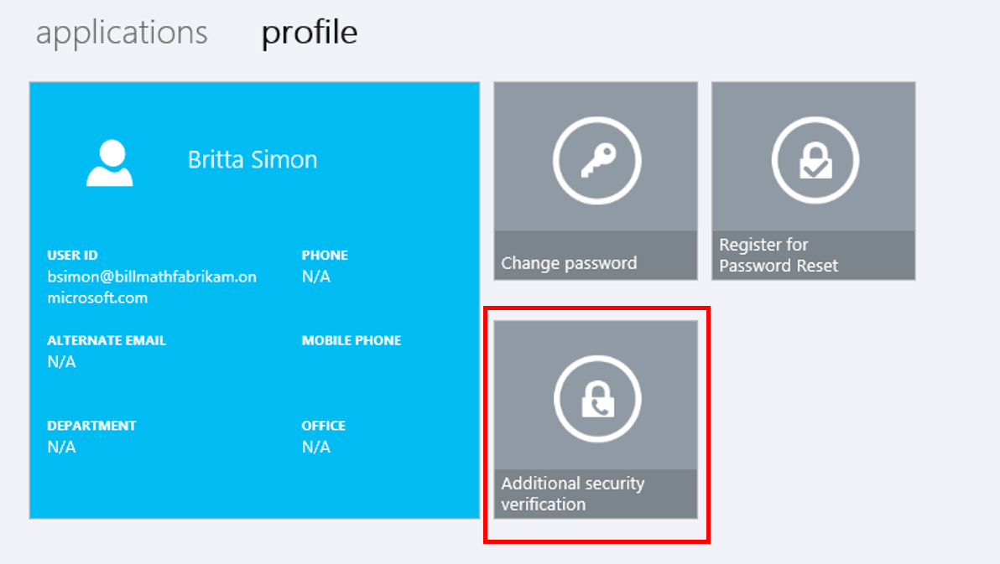

<properties
    pageTitle="Verwalten die Einstellungen für die Überprüfung in zwei Schritten | Microsoft Azure"
    description="Verwalten Sie, wie Sie Azure mehrstufige Authentifizierung, einschließlich Ihrer Kontaktinformationen ändern oder Konfigurieren von Ihren Geräten verwenden."
    services="multi-factor-authentication"
    keywords = "kombinierte Authentifizierungsclient, Authentifizierungsproblem Korrelations-ID"
    documentationCenter=""
    authors="kgremban"
    manager="femila"
    editor="yossib"/>

<tags
    ms.service="multi-factor-authentication"
    ms.workload="identity"
    ms.tgt_pltfrm="na"
    ms.devlang="na"
    ms.topic="article"
    ms.date="10/10/2016"
    ms.author="kgremban"/>

# Verwalten der Einstellungen für zwei Überprüfung

In diesem Artikel finden Sie Antworten auf Fragen zum Aktualisieren der Einstellungen für zwei Überprüfung oder kombinierte Authentifizierung. Wenn Sie Probleme bei der Anmeldung bei Ihrem Konto haben, finden Sie unter [haben Sie Probleme mit zwei Überprüfung](multi-factor-authentication-end-user-troubleshoot.md) Hilfe zur Problembehandlung.

## Wo befinden sich die Einstellungsseite?
Abhängig davon, wie Ihr Unternehmen Azure kombinierte Authentifizierung eingerichtet gibt es ein paar Orte, wo Sie Ihre Einstellungen wie Ihre Telefonnummer ändern können.

Wenn Ihr IT-Administrator, eine bestimmte URL oder Schritte zum Verwalten von zwei Überprüfung gesendet hat, führen Sie diese Schritte aus. Andernfalls sollte die folgenden Anweisungen für alle anderen Benutzer verwendet werden. Wenn Sie wie folgt vor, aber nicht dieselben Optionen angezeigt, also der Arbeit oder Schule eigene Portal angepasst. Bitten Sie Ihren Administrator für den Link auf das Portal Azure kombinierte Authentifizierung.

1. Melden Sie sich bei [https://myapps.microsoft.com](https://myapps.microsoft.com)  
2. Wählen Sie im Kopfbereich **Profil**aus.  
3. Wählen Sie **zusätzliche Sicherheit Überprüfung**aus.  

    

4. Zusätzliche Sicherheit Bestätigungsseite lädt mit Ihren Einstellungen.

    

## Ich möchte meine Telefonnummer ändern, oder fügen Sie eine sekundäre Nummer

Es ist wichtig, eine Telefonnummer sekundäre Authentifizierung konfigurieren.  Da Ihre primäre Telefonnummer und der mobilen app wahrscheinlich am gleichen Telefon sind, ist die sekundäre Telefonnummer die einzige Möglichkeit, die Sie imstande sein sollen, um wieder in Ihr Konto zu gelangen, wenn Ihr Telefon verloren gegangen sind oder gestohlen wird.

> [AZURE.NOTE]
> Wenn Sie nicht Zugriff auf Ihre primäre Telefonnummer haben und benötigen Sie Hilfe Ihr Konto aufrufen, finden Sie unter unseren Hilfethemen in [haben Sie Probleme mit zwei Überprüfung](multi-factor-authentication-end-user-troubleshoot.md).

**So ändern Sie Ihre primäre Telefonnummer ein.**  

1. Klicken Sie auf der Seite Überprüfung zusätzliche Sicherheit wählen Sie das Textfeld mit Ihrer aktuellen Telefonnummer aus, und bearbeiten Sie sie mit Ihrem neuen Telefonnummer.  
2. Wählen Sie **Speichern**aus.  
3. Ist dies die Nummer, die Sie für Ihre bevorzugten Überprüfung Option verwenden, müssen Sie die neue Nummer zu überprüfen, bevor Sie sie speichern können.  

**So fügen Sie eine sekundäre Telefonnummer hinzu:**  

1. Klicken Sie auf der Seite Überprüfung zusätzliche Sicherheit aktivieren Sie das Kontrollkästchen neben **alternative Authentifizierung Telefon.**  
2. Geben Sie Ihre sekundäre Rufnummer in das Textfeld ein.  
3. Wählen Sie **Speichern** und die Änderungen fertig sind.  

## Wie lässt sich Microsoft Authenticator aus dem alten Gerät Aufräumen und in einer neuen verschieben?
Wenn Sie die app auf Ihrem Gerät deinstallieren oder das Gerät zurücksetzen, wird sie nicht die Aktivierung Back-End entfernt. Verwenden Sie die Schritte in [auf ein neues Gerät verschieben](multi-factor-authentication-microsoft-authenticator.md#how-to-move-to-the-new-microsoft-authenticator-app).

## Nächste Schritte
- Tipps zur Problembehandlung und helfen auf [haben Sie Probleme mit zwei Überprüfung](multi-factor-authentication-end-user-troubleshoot.md)
- Einrichten von [app Kennwörter](multi-factor-authentication-end-user-app-passwords.md) für alle apps, die in zwei Schritten Überprüfung nicht unterstützen.
