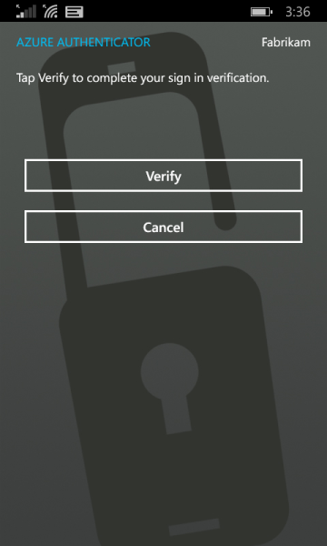
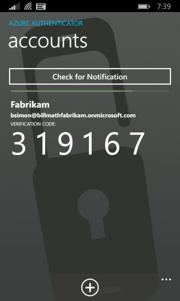

<properties
    pageTitle="Azure MFA Anmeldefenster Erfahrung mit Azure kombinierte Authentifizierung"
    description="Auf dieser Seite wird Sie Anleitungen auf, wo Sie die verschiedenen Anmeldefenster Methoden mit Azure MFA verfügbare Funktionen finden Sie unter bereitstellen."
    keywords="Benutzerauthentifizierung, Anmeldeverhalten, Anmeldung mit Mobiltelefon mit Rufnummer anmelden"
    services="multi-factor-authentication"
    documentationCenter=""
    authors="kgremban"
    manager="femila"
    editor="curtland"/>

<tags
    ms.service="multi-factor-authentication"
    ms.workload="identity"
    ms.tgt_pltfrm="na"
    ms.devlang="na"
    ms.topic="article"
    ms.date="08/22/2016"
    ms.author="kgremban"/>

# Geben Sie im Erfahrung mit Azure kombinierte Authentifizierung
> [AZURE.NOTE]  Der folgende Dokumentation auf dieser Seite wird eine typische Anmeldeverhalten.  Hilfe bei der Anmeldung finden Sie unter [haben Sie Probleme mit Azure kombinierte Authentifizierung](multi-factor-authentication-end-user-manage-settings.md)

## Was wird der Anmeldevorgang sein?
Je nachdem wie anmelden und mehrstufige Authentifizierung verwenden werden Ihre Erfahrungen variieren.  In diesem Abschnitt werden wir Informationen bereitstellen, auf was Sie erwartet bei der Anmeldung.  Wählen Sie das Schema, das am besten beschreibt vorgehen:

Was machst du?|Beschreibung
:------------- | :------------- |
[Anmelden mit Mobil- oder Office-Telefon](#signing-in-with-mobile-or-office-phone) | Dies ist, was Sie über Ihr Telefon mobil oder Office Anmeldung verhindern erwarten können.
[Melden Sie sich mit der Microsoft-Authenticator-app mit einer Benachrichtigung](#signing-in-with-the-microsoft-authenticator-app-using-notification) | Dies ist, was Sie erwarten können mit Microsoft Authenticator app mit Benachrichtigungen.
[Melden Sie sich mit der Überprüfungscode mit Microsoft Authenticator-app](#signing-in-with-the-microsoft-authenticator-app-using-verification-code)|Dies ist, was Sie erwarten können mithilfe der Microsoft Authenticator Thapp mit einem Überprüfungscode.
[Melden Sie sich mit einer alternativen Methode](#signing-in-with-an-alternate-method)|Dies wird gezeigt, was Sie erwartet, wenn Sie eine andere Methode verwenden möchten.

## Anmelden mit Mobil- oder Office-Telefon

Die folgende Informationen werden zur Darstellung von kombinierte Authentifizierung mit Ihrem Smartphone Mobil oder Office mit beschrieben.

### Anmelden mit einem Anruf an Ihr Mobiltelefon oder office

- Melden Sie sich an eine Anwendung oder den Dienst, wie Office 365 mit Ihren Benutzernamen und Ihr Kennwort ein.
- Microsoft ruft Sie auf.

- Telefonanruf ein, und drücken Sie die #-Taste.

- Sie sollten jetzt angemeldet sein.</li>

## Melden Sie sich mit der Microsoft-Authenticator-app mit einer Benachrichtigung

Die folgende Informationen beschreiben Sie zur Darstellung von kombinierte Authentifizierung mit der Microsoft-Authenticator-app verwenden, wenn Sie eine Benachrichtigung gesendet werden.

### Für die Anmeldung an einer Benachrichtigung gesendet Microsoft Authenticator-app

- Melden Sie sich an eine Anwendung oder den Dienst, wie Office 365 mit Ihren Benutzernamen und Ihr Kennwort ein.
- Microsoft wird eine Benachrichtigung gesendet.

- Telefonanruf ein, und drücken Sie die Taste überprüfen.  Wenn Ihr Unternehmen eine PIN erfordert werden Sie hier aufgefordert werden.

- Sie sollten jetzt angemeldet sein.

## Melden Sie sich mit der Überprüfungscode mit Microsoft Authenticator-app

Die folgende Informationen beschreiben Sie zur Darstellung von kombinierte Authentifizierung mit der Microsoft-Authenticator-app verwenden, wenn Sie es mit einem Überprüfungscode verwenden.

### Anmelden mit einer Überprüfungscode mit der Microsoft-Authenticator-app

- Melden Sie sich an eine Anwendung oder den Dienst, wie Office 365 mit Ihren Benutzernamen und Ihr Kennwort ein.
- Microsoft fordert Sie für eine Überprüfungscode.

- Öffnen Sie die app Microsoft Authenticator auf Ihrem Smartphone aus, und geben Sie den Code in das Feld, in dem Sie Anmeldung sind.

- Sie sollten jetzt angemeldet sein.

## Melden Sie sich mit einer alternativen Methode

Im folgende Abschnitt wird gezeigt, wie Sie sich mit an eine andere Methode, wenn die bevorzugte Methode möglicherweise nicht verfügbar.

### Anmelden mit einer alternativen Methode

- Melden Sie sich an eine Anwendung oder den Dienst, wie Office 365 mit Ihren Benutzernamen und Ihr Kennwort ein.
- Wählen Sie eine andere Überprüfung Option verwenden.  Sie können mit der anderen Optionen eine der Auswahlmöglichkeiten vorhanden sein. Die Zahl wird wird auf der Grundlage wie viele Setup haben.

- Wählen Sie eine andere Methode aus, und melden Sie sich an.
