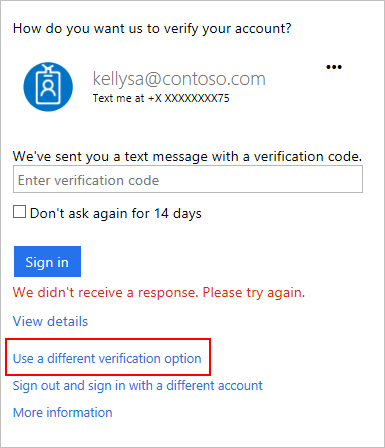

<properties
    pageTitle="Behandeln von Problemen mit zwei Überprüfung | Microsoft Azure"
    description="Dieses Dokument wird Benutzer finden Informationen zu Vorgehensweise, wenn sie ein Problem mit Azure kombinierte Authentifizierung auftreten."
    services="multi-factor-authentication"
    keywords = "kombinierte Authentifizierungsclient, Authentifizierungsproblem Korrelations-ID"
    documentationCenter=""
    authors="kgremban"
    manager="femila"
    editor="yossib"/>

<tags
    ms.service="multi-factor-authentication"
    ms.workload="identity"
    ms.tgt_pltfrm="na"
    ms.devlang="na"
    ms.topic="article"
    ms.date="10/10/2016"
    ms.author="kgremban"/>

# Haben Sie Probleme mit zwei Überprüfung

In diesem Artikel werden einige Probleme, die mit zwei Überprüfung auftreten können. Wenn das Problem Ihnen hier nicht enthalten ist, geben Sie im Kommentarbereich detailliertes Feedback, damit wir verbessern können.

## Kann ich mein Telefon verloren gegangen sind oder es gestohlen wurde

Es gibt zwei Möglichkeiten, um wieder zu Ihrem Konto gelangen. Die erste besteht darin, melden Sie sich mit Ihrer Telefonnummer alternative Authentifizierung, wenn Sie eine eingerichtet haben. Das zweite besteht darin, bitten Sie Ihren Administrator, um Ihre Einstellungen zu deaktivieren.

Wenn Ihr Telefon verloren gehen oder gestohlen wurde, empfehlen wir auch, dass Sie den Administrator Ihrer app Kennwörter zurücksetzen und löschen eine Erinnerung Geräte an. Wenn Ihr Administrator hierzu sicher ist, verweisen sie auf diesen Artikel: [Verwalten von Benutzern und Geräten](multi-factor-authentication-manage-users-and-devices.md#delete-users-existing-app-passwords).

### Verwenden Sie eine andere Telefonnummer

Wenn Sie mehrere Überprüfung Möglichkeiten, eine sekundäre Telefonnummer oder eine Authentifizierung app auf einem anderen Gerät, einschließlich eingerichtet haben, können Sie eine der folgenden Anmelden verwenden.

Um sich anzumelden, über die andere Telefonnummer, gehen Sie folgendermaßen vor:

1. Melden Sie sich wie gewohnt ein.
2. Wenn Sie aufgefordert werden, um Ihr Konto zu überprüfen, wählen Sie **andere Überprüfung Option verwenden**.

    

3. Wählen Sie die Telefonnummer, der Sie Zugriff haben.

    

4. Nachdem Sie Ihre Rufnummer Authentifizierung ändern wieder in Ihr Konto, [Verwalten Sie Ihre Einstellungen](multi-factor-authentication-end-user-manage-settings.md) sind.

>[AZURE.IMPORTANT]
>Es ist wichtig, eine Telefonnummer sekundäre Authentifizierung konfigurieren. Wenn Ihre primäre Telefonnummer und mobile-app auf dem gleichen Telefon, müssen Sie eine dritte option, wenn Ihr Telefon verloren gegangen sind oder gestohlen wird.

### Deaktivieren Sie Ihre Einstellungen

Wenn Sie eine Telefonnummer sekundäre Authentifizierung nicht konfiguriert haben, müssen Sie Ihren Administrator um Hilfe bitten. Lassen sie Ihre Einstellungen zu deaktivieren, sodass Sie das nächste Mal sich angemeldet werden zum [Einrichten Ihres Kontos](multi-factor-authentication-end-user-first-time.md) erneut aufgefordert werden.

## Ich erhalte einen Textplatzhalter nicht, oder rufen Sie auf meinem Smartphone

Es gibt verschiedene Gründe, warum Sie versuchen können anzumelden, aber nicht erhalten, den Text oder den Anruf, an. Wenn Sie erfolgreich Texte oder Telefonanrufe an Ihre Telefonnummer in der Vergangenheit erhalten haben, ist dies wahrscheinlich ein Problem mit den Phone-Anbieter nicht auf Ihr Konto. Stellen Sie sicher, dass gute Zelle Signal, und eine Textnachricht stellen Sie sicher, dass Ihr Plan für Mobiltelefone und Dienst Textnachrichten unterstützt, wenn Sie versuchen, erhalten.

Wenn Sie eine Text-oder Anruf mehrere Minuten gewartet haben, ist die schnellste Möglichkeit, um Ihr Konto zu verschaffen, eine andere Option zu testen.

1. Wählen Sie **Option unterschiedliche Überprüfung verwenden** auf der Seite, die auf Ihre Überprüfung wartet.

    

2. Wählen Sie im Telefon Zahl oder Übermittlung, die Sie verwenden möchten.

    Wenn Sie mehrere Überprüfung Codes erhalten haben, funktioniert nur das neueste Element.

Wenn Sie eine andere Methode konfiguriert haben, wenden Sie sich an Ihren Administrator, und bitten Sie ihn, deaktivieren Sie Ihre Einstellungen. Sie melden Sie sich das nächste Mal werden Sie [kombinierte Authentifizierung](multi-factor-authentication-end-user-first-time.md) einrichten erneut aufgefordert werden.

Wenn Sie häufig aufgrund von Problemen mit fehlerhaften Zelle Signal verzögert haben, wird empfohlen, dass Sie die [Microsoft-Authentifizierung app](multi-factor-authentication-microsoft-authenticator.md) auf Ihrem Smartphone zu verwenden. Die app zufällige Sicherheitscodes, melden Sie sich mit dem, generieren kann, und diese Codes nicht eine beliebige Zelle Signal oder Internet-Verbindung erforderlich.

## App Kennwörter funktionieren nicht

Vergewissern Sie sich, dass Sie das app-Kennwort richtig eingegeben haben.  Wenn es immer noch nicht funktioniert versuchen Sie Anmelden bei und [Erstellen Sie ein neues Kennwort für die app](multi-factor-authentication-end-user-app-passwords.md)aus.  Wenn dies nicht funktioniert, wenden Sie sich an den Administrator und lassen Sie sie können [Ihre vorhandene Kennwörter für die app löschen](multi-factor-authentication-manage-users-and-devices.md#delete-users-existing-app-passwords) und dann einen neuen erstellen.

## Ich habe eine Antwort auf Mein Problem nicht finden.

Wenn Sie, Problembehandlungsschritten versucht haben aber Probleme noch ausgeführt werden, wenden Sie sich an den Administrator oder die Person, die kombinierte Authentifizierung für Sie einrichten. Sie sollten Ihnen helfen.

Ferner können Sie eine Frage im [Azure AD-Foren](https://social.msdn.microsoft.com/forums/azure/home?forum=WindowsAzureAD) oder [an den Support](https://support.microsoft.com/contactus) Posten, und wir werden für Ihr Problem reagieren, sobald wir können.

Wenn Sie Support wenden, fügen Sie die folgenden Informationen ein:

- **Benutzer-ID** – was die e-Mail-Adresse ist, der Sie sich in wollten?
- **Allgemeine Beschreibung des Fehlers** – Meinten welche genauen Fehlermeldung angezeigt?  Wenn es keine Fehlermeldung angezeigt wurde, beschreiben Sie das unerwartete Verhalten im Detail bemerkt.
- **Seite** – welche Seite haben Sie bisher auf, wenn Sie den Fehler gesehen haben (auch den URL)?
- **Fehlercode** - Fehlercode, die Sie empfangen werden.
- **SessionId** - die Id für eine bestimmte Sitzung, die Sie empfangen werden.
- **Korrelations-ID** – welchen Anteil der Korrelations-Id-Code generiert, wenn der Benutzer den Fehler gesehen haben.
- **Zeitstempel** – welchen Anteil präzise Datum und Uhrzeit, die Sie gesehen des Fehlers haben (einschließlich die Zeitzone)?

Viele dieser Informationen kann auf der Anmeldeseite gefunden werden. Wählen Sie bei der Überprüfung Ihrer Anmeldung Zeitpunkt nicht **Anzeigen**.

Diese Informationen einschließlich hilft uns so schnell wie möglich Lösung Ihres Problems.

## Verwandte Themen
- [Verwalten der Einstellungen für zwei Überprüfung](multi-factor-authentication-end-user-manage-settings.md)  
- [Microsoft Authenticator Anwendung häufig gestellte Fragen](multi-factor-authentication-app-faq.md)
