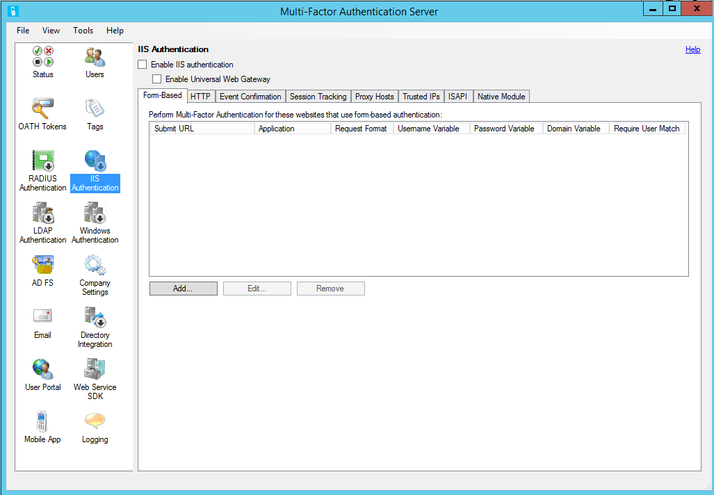
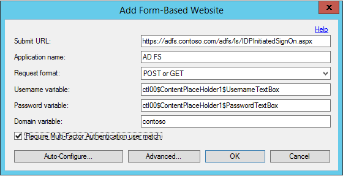
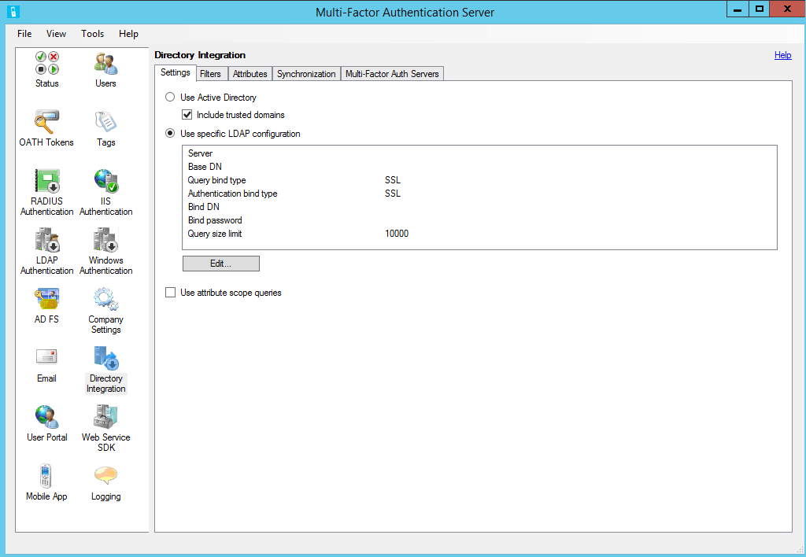
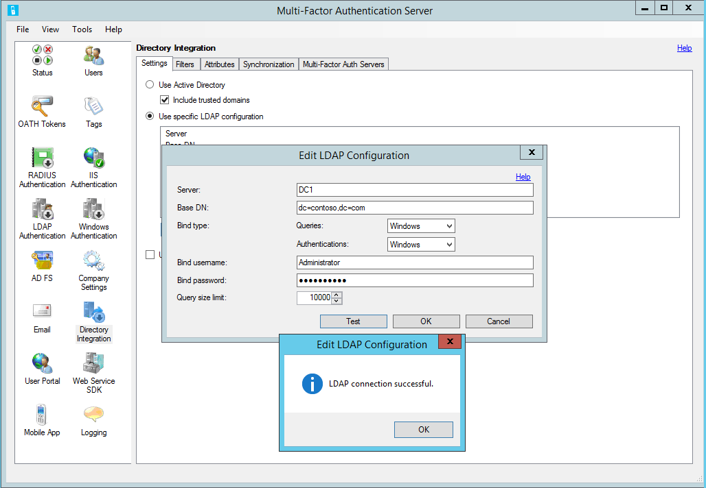
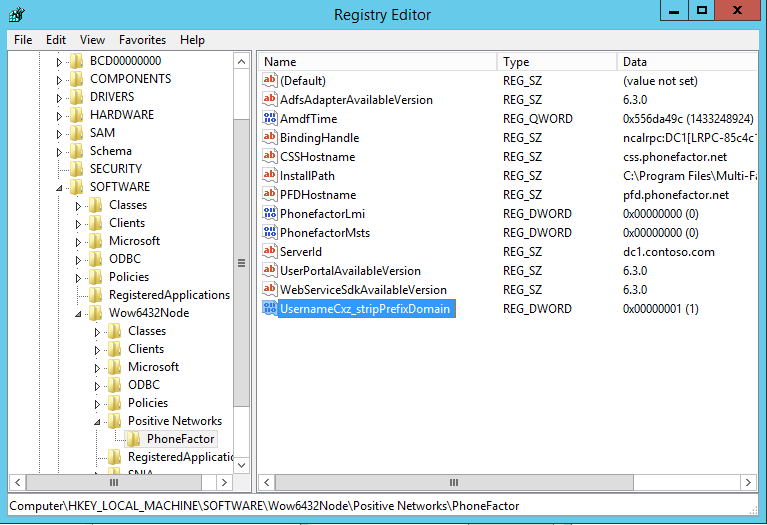
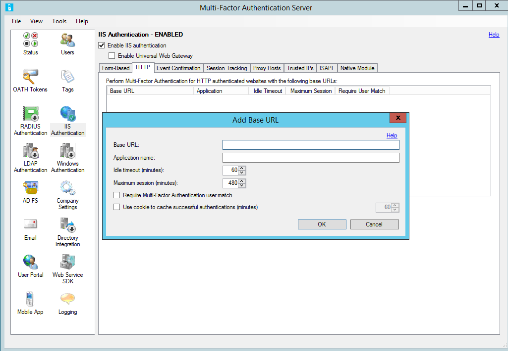
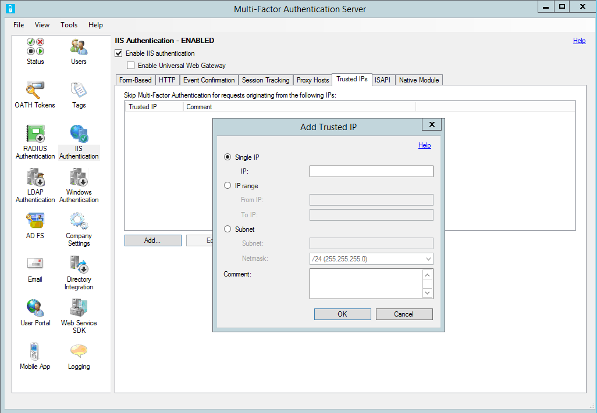

<properties
    pageTitle="Verwenden von Azure MFA Server mit AD FS 2.0 | Microsoft Azure"
    description="Dies ist die Seite, die beschreibt, wie Sie erste Schritte mit Azure MFA und AD FS 2.0 mehrstufige Azure-Authentifizierung."
    services="multi-factor-authentication"
    documentationCenter=""
    authors="kgremban"
    manager="femila"
    editor="yossib"/>

<tags
    ms.service="multi-factor-authentication"
    ms.workload="identity"
    ms.tgt_pltfrm="na"
    ms.devlang="na"
    ms.topic="get-started-article"
    ms.date="10/14/2016"
    ms.author="kgremban"/>

# Sichern von Cloud und lokale Ressourcen mithilfe von Azure mehrstufige Authentifizierungsserver mit AD FS 2.0

In diesem Artikel ist für Organisationen, die sind Verbund mit Azure Active Directory und Sichern von Ressourcen, die lokal sind möchten oder in der Cloud. Schützen Sie Ihrer Ressourcen mithilfe von Azure mehrstufige Authentifizierungsserver und konfigurieren, dass er mit dem AD FS entwickelt, sodass die Überprüfung in zwei Schritten für hohen Wert Ihrer Endpunkte ausgelöst wird.

Dieser Dokumentation wird beschrieben, mit dem Azure mehrstufige Authentifizierungsserver mit AD FS 2.0.  Erhalten Sie weitere Informationen zum [Sichern von Cloud und lokale Ressourcen mit Azure mehrstufige Authentifizierungsserver mit Windows Server 2012 R2 AD FS](multi-factor-authentication-get-started-adfs-w2k12.md).

## Secure AD FS 2.0 mit einem proxy
Um AD FS 2.0 mit einem Proxy zu sichern, installieren Sie die Server Azure mehrstufige Authentifizierung auf dem Proxyserver ADFS und konfigurieren Sie des Servers.

### Konfigurieren der IIS-Authentifizierung

1. Innerhalb der Azure mehrstufige Authentifizierungsserver klicken Sie auf das Symbol **IIS-Authentifizierung** im linken Menü.
2. Klicken Sie auf der Registerkarte **Formularbasierten** .
3. Klicken Sie auf die **hinzufügen...** Schaltfläche.

4. Automatisches Erkennen der Benutzername, Kennwort und Domänenvariablen, geben Sie die Anmelde-URL (wie https://sso.contoso.com/adfs/ls) in das Dialogfeld Auto-Configure Form-Based-Website, und klicken Sie auf OK.
5. Aktivieren Sie das Kontrollkästchen **erfordern Azure kombinierte Authentifizierung Benutzer übereinstimmen** , wenn alle Benutzer wurden oder in den Server und unterliegen in zwei Schritten Überprüfung importiert werden. Wenn eine signifikante Anzahl Benutzer noch nicht in den Server importiert wurden und/oder von zwei Überprüfung ausgenommen werden, lassen Sie das Kontrollkästchen deaktiviert. Weitere Informationen zu diesem Feature finden Sie unter der Hilfedatei.
6. Wenn die Seitenvariablen automatisch erkannt werden können, klicken Sie auf der **Angeben manuell...** Schaltfläche im Dialogfeld Auto-Configure Form-Based-Website.
7. Klicken Sie im Dialogfeld Website Add Form-Based Geben Sie die URL auf der Anmeldeseite ADFS in das Feld URL senden (wie https://sso.contoso.com/adfs/ls), und geben Sie einen Anwendung ein (optional). Der Name der Anwendung wird in Azure kombinierte Authentifizierung Berichte und möglicherweise innerhalb SMS oder Mobile-App-Authentifizierungsnachrichten angezeigt werden. Finden Sie in der Hilfedatei für Weitere Informationen auf die URL senden.
8. Legen Sie das Format der Anforderung zum "Bereitstellen oder abrufen".
9. Geben Sie den Benutzernamen (ctl00$ ContentPlaceHolder1$ UsernameTextBox) und Variablen Kennwort (ctl00$ ContentPlaceHolder1$ PasswordTextBox). Wenn ein Textfeld Domäne Ihre formularbasierte Anmeldeseite angezeigt wird, geben Sie die Domäne-Variable ein. Möglicherweise müssen navigieren Sie zu der Anmeldeseite in einem Webbrowser, mit der rechten Maustaste auf die Seite, und wählen Sie **Datenursprung anzeigen** verfügen, um die Namen der den Eingabefeldern innerhalb der Anmeldeseite finden zu können.
10. Aktivieren Sie das Kontrollkästchen **erfordern Azure kombinierte Authentifizierung Benutzer übereinstimmen** , wenn alle Benutzer wurden oder in den Server und unterliegen in zwei Schritten Überprüfung importiert werden. Wenn eine signifikante Anzahl Benutzer noch nicht in den Server importiert wurden und/oder von zwei Überprüfung ausgenommen werden, lassen Sie das Kontrollkästchen deaktiviert.

11. Klicken Sie auf die **Erweiterte...** Schaltfläche, um erweiterte Einstellungen zu überprüfen. Sie können die Möglichkeit, wählen Sie eine benutzerdefinierte DOS-Page-Datei, einschließlich Zwischenspeichern erfolgreiche Authentifizierung auf die Website verwenden Cookies und wie der primären Anmeldeinformationen auswählen zu konfigurieren.
12. Da der Proxyserver ADFS keine der Domäne hinzugefügt werden erwarten ist, können Sie LDAP Verbindung zu Ihren Domänencontroller für Benutzer importieren und Pre-Authentifizierung verwenden. Klicken Sie im Dialogfeld Advanced Form-Based-Website klicken Sie auf der Registerkarte **Primären Authentifizierung** , und wählen Sie **LDAP-Bindung** für die Vorabversion Authentifizierung Authentifizierungstyp.
13. Wenn Sie fertig sind, klicken Sie auf die Schaltfläche **OK** , um das Dialogfeld Add Form-Based Website zurückzukehren. Finden Sie in der Hilfedatei für Weitere Informationen auf erweiterten Einstellungen.
14. Klicken Sie auf die Schaltfläche **OK** , um das Dialogfeld zu schließen.
15. Nachdem Sie die URL und Seite Variablen erkannt oder eingegeben haben, zeigt die Websitedaten im Bereich formularbasierte.
16. Klicken Sie auf der Registerkarte **Systemeigenen Modul** , und wählen Sie aus dem Server, der Website, die der ADFS-Proxy unter (wie "Standardwebsite") ausgeführt wird oder die ADFS Proxy-Anwendung (wie "ls" unter "Adfs") auf die gewünschte Ebene IIS-Plug-in aktivieren.
17. Klicken Sie auf das **Aktivieren der IIS-Authentifizierung** am oberen Rand des Bildschirms.
18. IIS-Authentifizierung ist jetzt aktiviert.

### Verzeichnisintegration konfigurieren

Sie IIS-Authentifizierung aktiviert, aber zum Durchführen der Vorabversion zu Ihrer Active Directory (AD) über LDAP-Authentifizierung müssen Sie die LDAP-Verbindung mit dem Domänencontroller konfigurieren.

1. Klicken Sie auf das Symbol **Verzeichnisintegration** .
2. Wählen Sie auf der Registerkarte Einstellungen das Optionsfeld **verwenden bestimmte LDAP-Konfiguration** aus.

3. Klicken Sie auf die **Bearbeiten...** Schaltfläche.
4. Füllen Sie die Felder mit den Informationen für die Verbindung mit dem AD Domain Controller erforderlich, klicken Sie im Dialogfeld LDAP-Konfiguration bearbeiten. In der folgenden Tabelle sind Beschreibungen der Felder enthalten. Diese Informationen sind auch in der Hilfedatei Azure mehrstufige Authentifizierungsserver enthalten.
5. Testen Sie die LDAP-Verbindung durch Klicken auf die Schaltfläche **Testen** .

6. Wenn die LDAP-Testverbindung erfolgreich war, klicken Sie auf die Schaltfläche **OK** .

### Konfigurieren von Einstellungen für Unternehmen

1. Als Nächstes klicken Sie auf das Symbol **Unternehmen Einstellungen** , und wählen Sie die Registerkarte **Mit einer Auflösung von Benutzernamen** .
2. Wählen Sie das Optionsfeld **LDAP verwenden eindeutiger Bezeichnerattribut für übereinstimmende Benutzernamen** ein.
3. Wenn der Benutzer seinen Benutzernamen im Format "domaene\benutzername" eingeben, muss der Server in der Lage, um die Domäne Deaktivieren der Benutzername zu entfernen, wenn es sich um die LDAP-Abfrage erstellt sein. Die kann über einen Registrierungseintrag erfolgen.
4. Öffnen Sie den Registrierungs-Editor, und wechseln Sie zu HKEY_LOCAL_MACHINE/SOFTWARE/Wow6432Node/positiv Netzwerke/PhoneFactor auf einem 64-Bit-Server. Wenn auf einem 32-Bit-Server, nehmen Sie "Wow6432Node" nicht auf dem Pfad ein. Erstellen Sie einen DWORD-Registrierungsschlüssel "UsernameCxz_stripPrefixDomain" aufgerufen, und legen Sie den Wert 1. Azure kombinierte Authentifizierung ist jetzt den ADFS Proxy schützen.

Stellen Sie sicher, dass Benutzer aus Active Directory in den Server importiert wurden. Finden Sie im [Abschnitt vertrauenswürdige IP -Adressen](#trusted-ips) , wenn Sie möchten weißen internen IP-Adressen, sodass die Überprüfung in zwei Schritten beim Anmelden auf die Website aus diesen Speicherorten nicht erforderlich ist.

## AD FS 2.0 direkte ohne einen proxy

Sie können AD FS sichern, wenn der AD FS-Proxy nicht verwendet wird. Der Server Azure mehrstufige Authentifizierung auf dem ADFS-Server Server installieren Sie und konfigurieren Sie den pro die folgenden Schritte aus:

1. Innerhalb der Azure mehrstufige Authentifizierungsserver klicken Sie auf das Symbol **IIS-Authentifizierung** im linken Menü.
2. Klicken Sie auf der Registerkarte **HTTP** .
3. Klicken Sie auf die **hinzufügen...** Schaltfläche.
4. Geben Sie die URL in das Dialogfeld hinzufügen Basis-URL für die ADFS-Website, in dem HTTP-Authentifizierung (wie https://sso.domain.com/adfs/ls/auth/integrated) in das Feld Basis-URL ausgeführt wird. Geben Sie dann einen Anwendungsnamen (optional) ein. Der Name der Anwendung wird in Azure kombinierte Authentifizierung Berichte und möglicherweise innerhalb SMS oder Mobile-App-Authentifizierungsnachrichten angezeigt werden.
5. Falls gewünscht, im Leerlauf Timeout und Maximum anpassen Sitzung Zeiten.
6. Aktivieren Sie das Kontrollkästchen **erfordern Azure kombinierte Authentifizierung Benutzer übereinstimmen** , wenn alle Benutzer wurden oder in den Server und unterliegen in zwei Schritten Überprüfung importiert werden. Wenn eine signifikante Anzahl Benutzer noch nicht in den Server importiert wurden und/oder von zwei Überprüfung ausgenommen werden, lassen Sie das Kontrollkästchen deaktiviert. Weitere Informationen zu diesem Feature finden Sie unter der Hilfedatei.
7. Aktivieren Sie das Cache Cookie aus, falls gewünscht.

8. Klicken Sie auf die Schaltfläche **OK** .
9. Klicken Sie auf der Registerkarte **Systemeigenen Modul** , und wählen Sie den Server, der Website (wie "Standardwebsite") oder die ADFS-Anwendung (wie "ls" unter "Adfs") auf die gewünschte Ebene IIS-Plug-in aktivieren.
10. Klicken Sie auf das **Aktivieren der IIS-Authentifizierung** am oberen Rand des Bildschirms. Azure kombinierte Authentifizierung ist jetzt ADFS schützen.

Stellen Sie sicher, dass Benutzer aus Active Directory in den Server importiert wurden. Wenn Sie möchten weißen internen IP-Adressen, sodass die Überprüfung in zwei Schritten beim Anmelden auf die Website aus diesen Speicherorten nicht erforderlich ist, finden Sie unter Abschnitt vertrauenswürdige IP-Adressen.

## Vertrauenswürdigen IP-Adressen
Vertrauenswürdigen IP-Adressen Benutzern Azure kombinierte Authentifizierung für Website-Anfragen von bestimmten IP-Adressen oder Subnetze umgehen. Beispielsweise können Sie möchten ausgenommenen Benutzer aus zwei Überprüfung bei der Anmeldung aus dem Office. Zu diesem Zweck würden Sie im Office-Subnetz als Eintrag Vertrauenswürdige IP-Adressen angeben.

### Konfigurieren von vertrauenswürdigen IP-Adressen

1. Klicken Sie im Abschnitt IIS-Authentifizierung auf der Registerkarte **Vertrauenswürdige IP -Adressen** .
1. Klicken Sie auf die **hinzufügen...** Schaltfläche.
1. Wenn das Dialogfeld Vertrauenswürdige IP-Adressen hinzufügen angezeigt wird, wählen Sie eine **Einzelne IP-Adresse**, **IP-Bereich**oder **Subnetz** Optionsfelder aus.
1. Geben Sie die IP-Adresse, der IP-Adressen oder Subnetz gehören, die weißen Liste hinzugefügt werden soll. Wenn Sie ein Subnetz eingegeben haben, wählen Sie die geeignete Netzmaske, und klicken Sie auf die Schaltfläche **OK** . Die vertrauenswürdige IP-Adresse hat jetzt hinzugefügt wurde.

