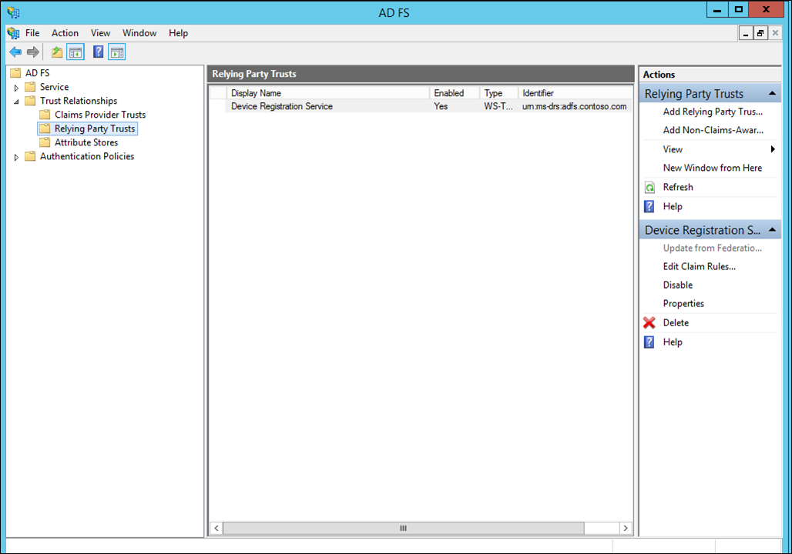
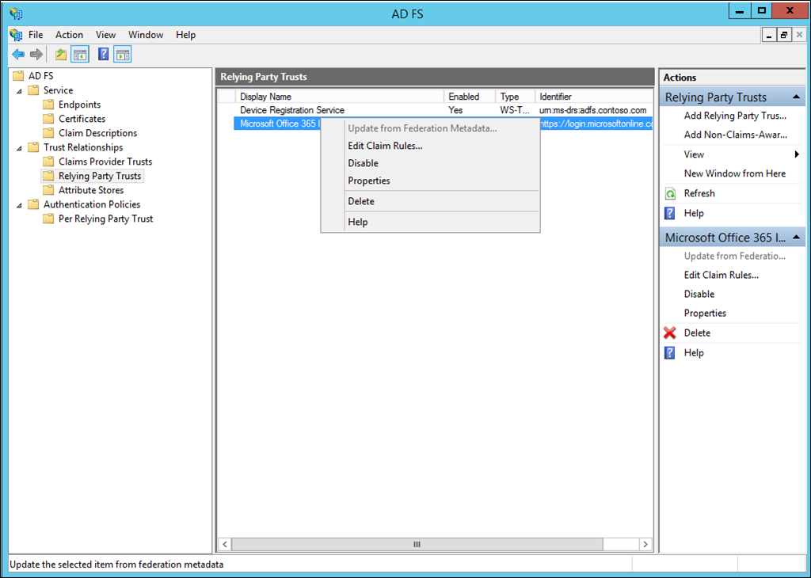
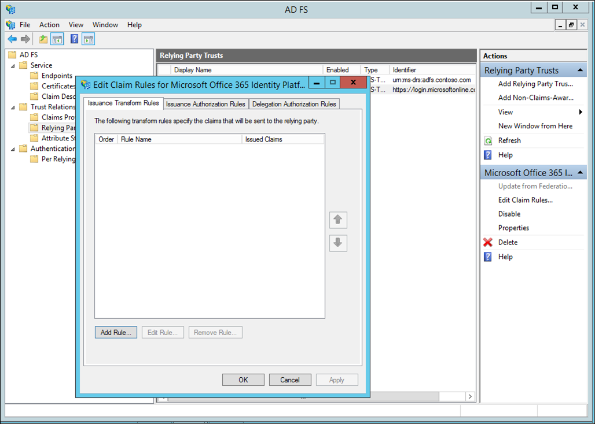
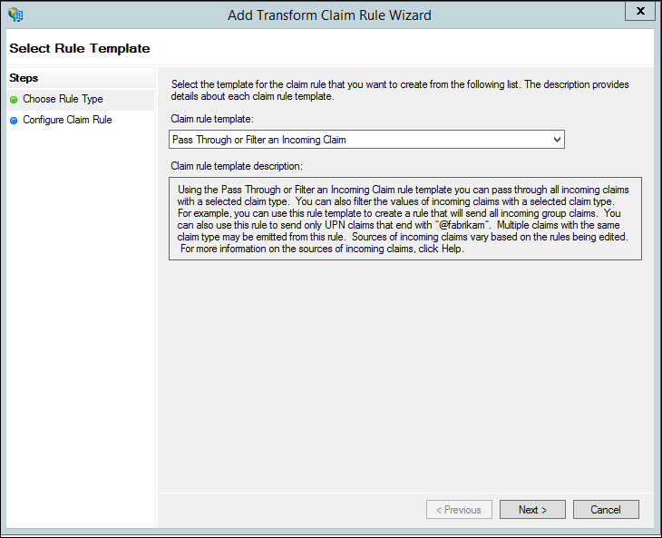
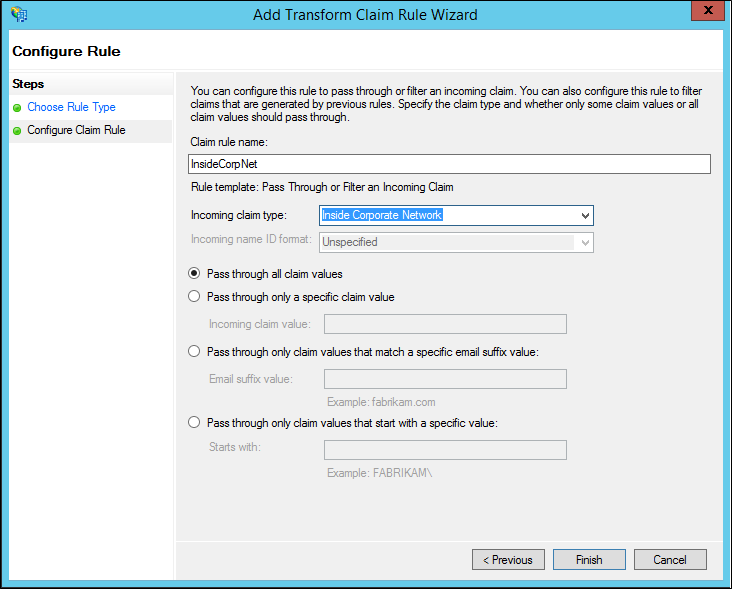
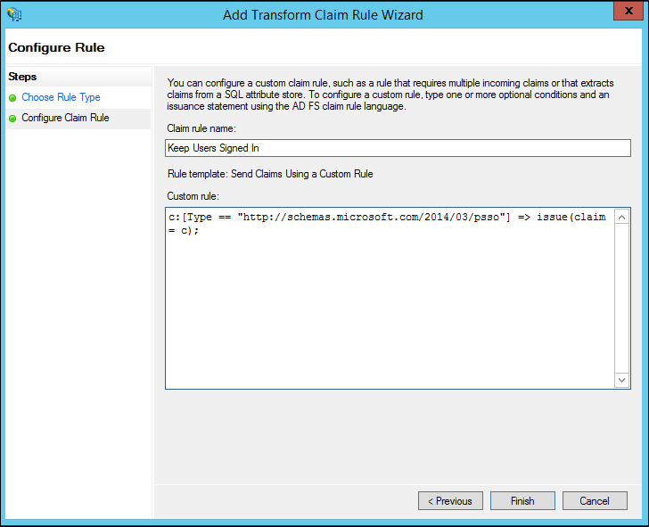
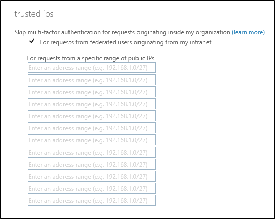

<properties
    pageTitle="Sichern von Cloudressourcen mit Azure MFA und AD FS"
    description="Dies ist die Seite, die beschreibt, wie Sie erste Schritte mit Azure MFA und AD FS in der Cloud mehrstufige Azure-Authentifizierung."
    services="multi-factor-authentication"
    documentationCenter=""
    authors="kgremban"
    manager="femila"
    editor="yossib"/>

<tags
    ms.service="multi-factor-authentication"
    ms.workload="identity"
    ms.tgt_pltfrm="na"
    ms.devlang="na"
    ms.topic="get-started-article"
    ms.date="10/14/2016"
    ms.author="kgremban"/>

# <a name="securing-cloud-resources-with-azure-multi-factor-authentication-and-ad-fs"></a>Sichern von Cloudressourcen mit Azure kombinierte Authentifizierung und AD FS

Wenn Ihre Organisation mit Azure Active Directory verbunden ist, verwenden Sie Azure kombinierte Authentifizierung oder Active Directory Federation Services Sichern von Ressourcen, die von Azure AD zugegriffen werden. Gehen Sie folgendermaßen vor, um Azure Active Directory-Ressourcen mit Azure kombinierte Authentifizierung oder Active Directory Federation Services zu sichern.

## <a name="secure-azure-ad-resources-using-ad-fs"></a>Sichern von AD FS mit Azure AD-Ressourcen

Um Ihre Cloud-Ressourcen zu sichern, zuerst für Benutzer ein Konto aktivieren und dann eine Regel Ansprüche einrichten. Gehen Sie folgendermaßen vor, um die Schritte durchzuführen:

1. Verwenden Sie die Schritte in [zu umgehen kombinierte Authentifizierung für Benutzer](active-directory/multi-factor-authentication-get-started-cloud.md#turn-on-multi-factor-authentication-for-users) , um ein Konto zu aktivieren.
2. Starten Sie die AD FS-Verwaltungskonsole.

3. Navigieren Sie zu **Verlassen vertrauen** und mit der rechten Maustaste auf die verlassen Partner vertrauen. Wählen Sie **Bearbeiten anfordern Regeln...**
4. Klicken Sie auf **Regel... hinzufügen**
5. Wählen Sie **Senden mithilfe einer benutzerdefinierten Regel Ansprüche** aus den Dropdown-Pfeil und klicken Sie auf **Weiter**.
6. Geben Sie einen Namen für die Regel anfordern.
7. Klicken Sie unter Benutzerdefiniert Regel: Fügen Sie den folgenden Text hinzu:

    ```
    => issue(Type = "http://schemas.microsoft.com/claims/authnmethodsreferences", Value = "http://schemas.microsoft.com/claims/multipleauthn");
    ```

    Entsprechende anfordern:

    ```
    <saml:Attribute AttributeName="authnmethodsreferences" AttributeNamespace="http://schemas.microsoft.com/claims">
    <saml:AttributeValue>http://schemas.microsoft.com/claims/multipleauthn</saml:AttributeValue>
    </saml:Attribute>
    ```

8. Klicken Sie auf **OK** und dann **Fertig stellen**. Schließen Sie die AD FS-Verwaltungskonsole.

Benutzer können dann durchführen, melden Sie sich mithilfe der lokalen Methode (z. B. Smartcard).

## <a name="trusted-ips-for-federated-users"></a>Vertrauenswürdigen IP-Adressen für Benutzer im Verbund
Vertrauenswürdigen IP-Adressen können Administratoren Straße in zwei Schritten Überprüfung, für bestimmte IP-Adressen oder für Benutzer im Verbund, die Anfragen von innerhalb ihrer eigenen Intranet aufweisen. In den folgenden Abschnitten wird beschrieben, wie mit Benutzer im Verbund und Straße in zwei Schritten Überprüfung Azure mehrstufige Authentifizierung vertrauenswürdige IP-Adressen konfigurieren, wenn eine Anforderung in einem Intranet Benutzer im Verbund stammt. Dies ist durch Konfigurieren von AD FS zum Verwenden einer Pass-Through- oder Filtern einer eingehenden anfordern-Vorlage mit dem Typ des innerhalb Unternehmensnetzwerk anfordern.

In diesem Beispiel wird die Office 365 für unsere verlassen vertrauen.

### <a name="configure-the-ad-fs-claims-rules"></a>Konfigurieren Sie die AD FS-Ansprüche-Regeln

Wir müssen als erstes besteht darin, die AD FS-Ansprüchen konfigurieren. Wir werden zwei Ansprüche Regeln, Platzhalter für das anfordern innerhalb Unternehmensnetzwerk und Übersichtlichkeit unsere angemeldet Benutzer eine weitere zu erstellen.

1. AD FS-Verwaltung zu öffnen.
2. Wählen Sie auf der linken Seite **Verlassen vertrauen**.
3. Mit der rechten Maustaste auf **Microsoft Office 365-Identitätsplattform** , und wählen Sie **Bearbeiten der Regeln anfordern...** 
 
4. Klicken Sie auf Regeln für transformieren Emission, auf **Regel hinzufügen.** 
 
5. Klicken Sie auf den transformieren anfordern Regel-Assistenten **Pass Through oder Filtern einer eingehenden Anspruch** wählen Sie aus der Dropdownliste, und klicken Sie auf **Weiter**.

6. Geben Sie in das Feld neben Regelname Anfordern der Regel einen Namen. Beispiel: InsideCorpNet.
7. Aus den Dropdown-Pfeil neben eingehende beanspruchen Typ, und wählen **In Firmennetzwerk**.

8. Klicken Sie auf **Fertig stellen**.
9. Klicken Sie auf Regeln für transformieren Emission klicken Sie auf **Regel hinzufügen**.
10. Klicken Sie auf den transformieren anfordern Regel-Assistenten wählen Sie **Senden Ansprüche mithilfe einer benutzerdefinierten Regel** aus der Dropdownliste aus, und klicken Sie auf **Weiter**.
11. Im Feld unter Regelname anfordern: Geben Sie *behalten Benutzer angemeldet*.
12. Geben Sie im Feld benutzerdefinierte Regel:

        c:[Type == "http://schemas.microsoft.com/2014/03/psso"]
            => issue(claim = c);

13. Klicken Sie auf **Fertig stellen**.
14. Klicken Sie auf **Übernehmen**.
15. Klicken Sie auf **Ok**.
16. AD FS-Verwaltung zu schließen.


### <a name="configure-azure-multi-factor-authentication-trusted-ips-with-federated-users"></a>Konfigurieren von Azure mehrstufige Authentifizierung vertrauenswürdige IP-Adressen für Partnerverbundkontakte Benutzer
Jetzt, da die Ansprüche angeordnet sind, können wir vertrauenswürdigen IP-Adressen konfigurieren.

1. Melden Sie sich zum [Azure klassischen Portal](https://manage.windowsazure.com)aus.
2. Klicken Sie auf der linken Seite auf **Active Directory**.
3. Wählen Sie unter Verzeichnis Verzeichnis vertrauenswürdigen IP-Adressen eingerichtet werden soll.
4. Klicken Sie auf das Verzeichnis ausgewählt haben, klicken Sie auf **Konfigurieren**.
5. Klicken Sie im Abschnitt kombinierte Authentifizierung auf **diensteinstellungen verwalten**.
6. Wählen Sie auf der Seite Diensteinstellungen unter vertrauenswürdigen IP-Adressen, **multi-factor-Authentifizierung für Anfragen partnerverbundkontakte Benutzer auf Meine Intranet überspringen.** 
 
7. Klicken Sie auf **Speichern**.
8. Nachdem die Updates angewendet wurden, klicken Sie auf **Schließen**.


Das war's schon! An diesem Punkt sollte partnerverbundkontakte Office 365-Benutzer nur müssen MFA verwenden, wenn ein Anspruch von außerhalb Ihres Unternehmens Intranet stammt.
