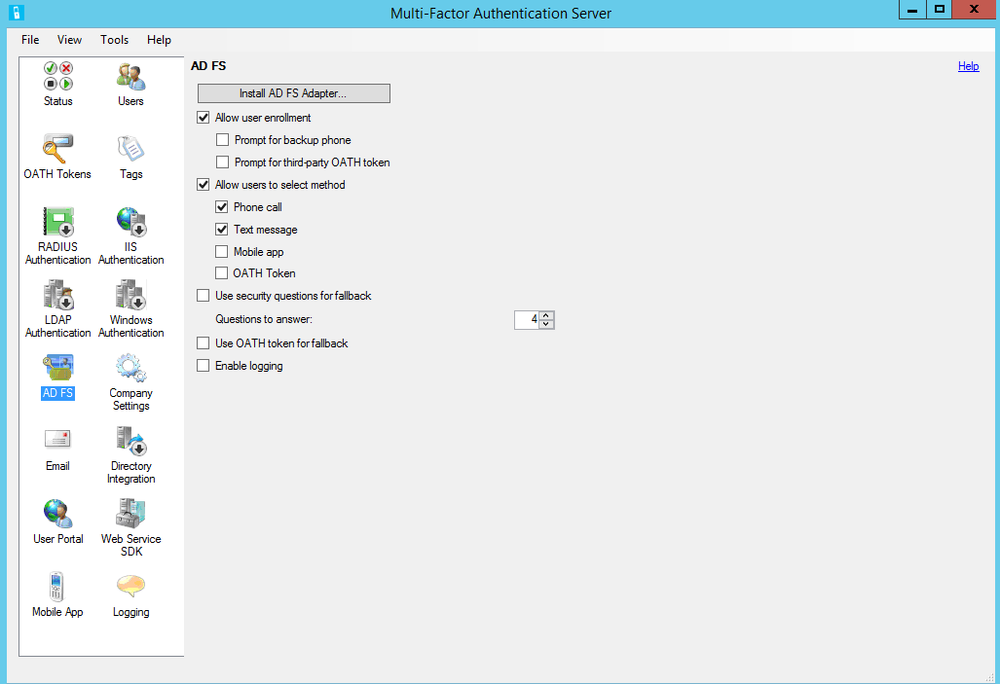
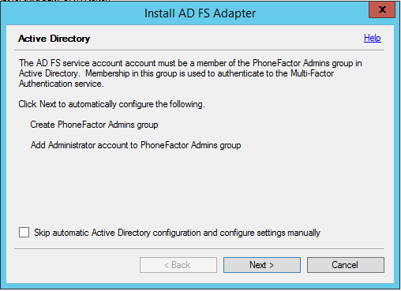
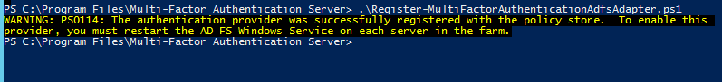
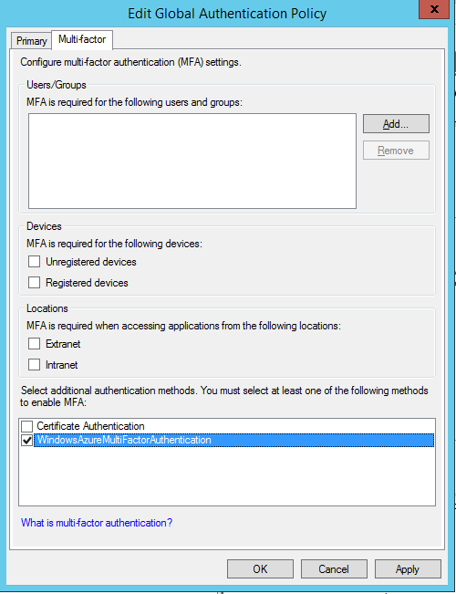

<properties
    pageTitle="MFA-Server mit Windows Server 2012 R2 AD FS | Microsoft Azure"
    description="Dieser Artikel beschreibt, wie Sie erste Schritte mit Azure kombinierte Authentifizierung und AD FS in Windows Server 2012 R2."
    services="multi-factor-authentication"
    documentationCenter=""
    authors="kgremban"
    manager="femila"
    editor="yossib"/>

<tags
    ms.service="multi-factor-authentication"
    ms.workload="identity"
    ms.tgt_pltfrm="na"
    ms.devlang="na"
    ms.topic="get-started-article"
    ms.date="10/14/2016"
    ms.author="kgremban"/>

# Secure Cloud und lokalen AD FS in Windows Server 2012 R2 Azure mehrstufige Authentifizierungsserver mit Ressourcen

Wenn Sie Active Directory Federation Services (AD FS) verwenden und sicheren Cloud oder lokale Ressourcen möchten, können Sie Azure mehrstufige Authentifizierungsserver für die Arbeit mit AD FS konfigurieren. Diese Konfiguration löst in zwei Schritten Überprüfung für wertvolle Endpunkte.

In diesem Artikel erläutern wir Azure mehrstufige Authentifizierungsserver mit AD FS in Windows Server 2012 R2 verwenden. Weitere Informationen finden Sie Informationen zum [sicheren Cloud und lokale Ressourcen mithilfe von Azure mehrstufige Authentifizierungsserver mit AD FS 2.0](multi-factor-authentication-get-started-adfs-adfs2.md).

## Sichern von Windows Server 2012 R2 AD FS mit Azure kombinierte Authentifizierungsserver

Wenn Sie Azure mehrstufige Authentifizierungsserver installiert haben, haben Sie die folgenden Optionen aus:

- Installieren Sie auf dem gleichen Server wie AD FS Azure mehrstufige Authentifizierungsserver lokal
- Installieren Sie die Netzwerkadapter Azure kombinierte Authentifizierung lokal auf dem ADFS-Server und dann installieren mehrstufige Authentifizierungsserver auf einem anderen computer

Bevor Sie beginnen, beachten Sie die folgenden Informationen:

- Sie sind nicht erforderlich, auf dem AD FS-Server Azure mehrstufige Authentifizierungsserver zu installieren. Sie jedoch müssen die kombinierte Authentifizierung Netzwerkadapter für AD FS auf einem Windows Server 2012 R2 installieren, auf dem AD FS ausgeführt wird. Sie können den Server auf einem anderen Computer installieren, wenn es eine unterstützte Version ist und der AD FS-Netzwerkadapter separat auf dem AD FS-Verbund-Server installieren. Finden Sie unter den folgenden Verfahren erfahren, wie die Netzwerkadapter separat installieren.

- Wenn die Netzwerkadapter MFA Server AD FS entwickelt wurde, wurde man davon ausgehen, dass AD FS den Namen, der sich zu verlassen Partei an den Netzwerkadapter weiterleiten konnte. Klicken Sie dann konnte der sich verlassen Parteinamen als Anwendungsname für eine verwendet werden. Jedoch dies ergebende nicht zu der Fall sein. Wenn Ihre Organisation Textnachricht oder mobile-app Überprüfung Methoden verwendet wird, enthalten die Zeichenfolgen in Unternehmen Einstellungen definiert einen Platzhalter, <$*Application_name*$>. Dieser Platzhalter wird nicht automatisch ersetzt, wenn Sie die AD FS-Netzwerkadapter verwenden. Es empfiehlt sich, dass Sie den Platzhalter aus die entsprechenden Zeichenfolgen entfernen, wenn Sie AD FS sichern.

- Das Konto, mit dem anmelden, müssen Benutzerrechte zum Erstellen von Sicherheitsgruppen in Ihrer Active Directory-Dienst.

- Der Assistent zum Installieren von kombinierte Authentifizierung AD FS Netzwerkadapter erstellt eine Sicherheitsgruppe PhoneFactor Admins in der Active Directory-Instanz bezeichnet. Anschließend werden AD FS Dienstkonto von Ihrem Dienst Föderation zu dieser Gruppe hinzugefügt. Es empfiehlt sich, dass Sie auf Ihrem Domänencontroller überprüfen, ob die Gruppe PhoneFactor Admins tatsächlich um erstellt und, dass die AD FS--Konto Service Mitglied dieser Gruppe werden. Bei Bedarf manuell fügen Sie des AD FS-Dienstkontos der Gruppe PhoneFactor Admins auf Ihrem Domänencontroller hinzu.

- Informationen zum Installieren der Web Service SDK mit dem Benutzerportal, erfahren Sie mehr über [Bereitstellen von Benutzerportal für Azure mehrstufige Authentifizierungsserver.](multi-factor-authentication-get-started-portal.md)

### Installieren Sie Azure mehrstufige Authentifizierungsserver lokal auf dem AD FS-server

1. Herunterladen und Installieren von Azure mehrstufige Authentifizierungsserver auf dem ADFS-Server. Lesen Sie Informationen zur Installation über die [ersten Schritte mit Azure mehrstufige Authentifizierung-Server](multi-factor-authentication-get-started-server.md).
2. Klicken Sie auf das Symbol **AD FS** in der Azure mehrstufige Authentifizierungsserver-Verwaltungskonsole und wählen Sie dann die Optionen **Zulassen Benutzer Registrierung** und **Benutzern erlauben, Methode auszuwählen**.
3. Wählen Sie gegebenenfalls weiteren Optionen aus, die Sie für Ihre Organisation festlegen möchten.
4. Klicken Sie auf **AD FS Netzwerkadapter installieren**.

5. Wenn das Active Directory-Fenster angezeigt wird, bedeutet, dass zwei Dinge. Ihr Computer ist mit einer Domäne hinzugefügt, und die Active Directory-Konfiguration für Sichern der Kommunikation zwischen der AD FS-Grafikkarte und der kombinierte Authentifizierungsdienst ist nicht vollständig. Klicken Sie auf **Weiter** , um zu automatisch Ausführen dieser Konfiguration, oder wählen Sie die **Überspringen Sie automatische Konfiguration von Active Directory und Konfigurieren von Einstellungen manuell** Kontrollkästchen, und klicken Sie dann auf **Weiter**.
6. Wenn die lokale Gruppe Windows angezeigt wird, bedeutet, dass zwei Dinge. Ihr Computer ist nicht mit einer Domäne verbunden, und die lokale Gruppenkonfiguration für Sichern der Kommunikation zwischen der AD FS-Grafikkarte und der kombinierte Authentifizierungsdienst ist nicht vollständig. Klicken Sie auf **Weiter** , um zu automatisch Ausführen dieser Konfiguration, oder wählen Sie die **Automatische Konfiguration für lokale Gruppe überspringen und Konfigurieren von Einstellungen manuell** Kontrollkästchen, und klicken Sie dann auf **Weiter**.
7. Klicken Sie im Installation-Assistenten auf **Weiter**. Azure mehrstufige Authentifizierungsserver erstellt die Gruppe PhoneFactor Admins und der Gruppe PhoneFactor Admins des AD FS-Dienstkontos hinzugefügt.

8. Klicken Sie auf der Seite **Installer starten** klicken Sie auf **Weiter**.
9. Klicken Sie im kombinierte Authentifizierung AD FS Netzwerkadapter Installationsprogramm angezeigt wird auf **Weiter**.
10. Klicken Sie auf **Schließen** , wenn die Installation abgeschlossen ist.
11. Wenn der Netzwerkadapter installiert wurde, müssen Sie es mit dem AD FS registrieren. Öffnen Sie Windows PowerShell und führen Sie den folgenden Befehl aus: 
    `C:\Program Files\Multi-Factor Authentication Server\Register-MultiFactorAuthenticationAdfsAdapter.ps1`
   

12. Wenn Ihre neu registrierte Netzwerkadapter verwenden möchten, bearbeiten Sie die Authentifizierungsrichtlinie globale in AD FS. Wechseln Sie in der AD FS-Verwaltungskonsole auf den Knoten **Authentifizierungsrichtlinien** . Klicken Sie im Abschnitt **Kombinierte Authentifizierung** auf den Link **Bearbeiten** neben der **Globalen Einstellungen** im Abschnitt. **Globale Authentifizierungsrichtlinie bearbeiten** im Fenster Wählen Sie als zusätzliche Authentifizierungsmethode **Kombinierte Authentifizierung** aus, und klicken Sie dann auf **OK**. Der Netzwerkadapter wird als WindowsAzureMultiFactorAuthentication registriert. Starten Sie den AD FS-Dienst für die Registrierung wirksam wird.

Mehrstufige Authentifizierungsserver ist zu diesem Zeitpunkt so eingerichtet ein zusätzliche Authentifizierungsanbieter mit AD FS verwendet werden.

## Installieren einer eigenständigen Instanz der AD FS-Netzwerkadapter mithilfe der Web Service SDK
1. Installieren Sie die Web Service SDK auf dem Server, der kombinierte Authentifizierungsserver ausgeführt wird.
2. Kopieren Sie die folgenden Dateien aus der \Program Files\Multi-Faktor-Authentifizierungsserver-Verzeichnis auf dem Server, auf dem Sie die AD FS-Netzwerkadapter installieren möchten:
  - MultiFactorAuthenticationAdfsAdapterSetup64.msi
  - Register-MultiFactorAuthenticationAdfsAdapter.ps1
  - Aufheben der Registrierung MultiFactorAuthenticationAdfsAdapter.ps1
  - MultiFactorAuthenticationAdfsAdapter.config
3. Führen Sie die Datei MultiFactorAuthenticationAdfsAdapterSetup64.msi Installation.
4. Klicken Sie im kombinierte Authentifizierung AD FS Netzwerkadapter Installationsprogramm angezeigt wird auf **Weiter** , wenn Sie die Installation zu starten.
5. Klicken Sie auf **Schließen** , wenn die Installation abgeschlossen ist.

## Bearbeiten Sie die Datei MultiFactorAuthenticationAdfsAdapter.config

Wie folgt vor, um die Datei MultiFactorAuthenticationAdfsAdapter.config zu bearbeiten:

1. Legen Sie den Knoten **UseWebServiceSdk** auf **true**.  
2. Legen Sie den Wert für **WebServiceSdkUrl** auf die URL des mehrstufige Authentifizierung Web Service SDK. Beispiel: *https://contoso.com/&lt;Certificatename&gt;/MultiFactorAuthWebServicesSdk/PfWsSdk.asmx*, wobei Certificatename den Namen des Zertifikats ist.  
3. Bearbeiten Sie das Skript Register-MultiFactorAuthenticationAdfsAdapter.ps1 durch Hinzufügen von *- ConfigurationFilePath &lt;Pfad&gt; * an das Ende der `Register-AdfsAuthenticationProvider` Befehl, Stelle, an der * &lt;Pfad&gt; * der vollständige Pfad zu der Datei MultiFactorAuthenticationAdfsAdapter.config ist.

### Konfigurieren der Web Service SDK mit einen Benutzernamen und ein Kennwort

Es gibt zwei Optionen zum Konfigurieren der Web Service SDK aus. Die erste ist mit einem Benutzernamen und Ihr Kennwort ein, das zweite mit einem Clientzertifikat. Führen Sie diese Schritte aus, für die erste Option aus, oder fahren Sie für die zweite.  

1. Legen Sie den Wert für **WebServiceSdkUsername** mit einer Firma, die ein Mitglied der Sicherheitsgruppe PhoneFactor Admins ist. Verwenden der &lt;Domäne&gt;& #92; &lt;Benutzername&gt; Format.  
2. Legen Sie den Wert für **WebServiceSdkPassword** auf das entsprechende Kennwort ein.

### Konfigurieren der Web Service SDK mit einem Clientzertifikat

Wenn Sie keinen Benutzernamen und ein Kennwort verwenden möchten, folgendermaßen Sie vor, um die Web Service SDK mit einem Clientzertifikat zu konfigurieren.

1. Rufen Sie ein Clientzertifikat von einer Zertifizierungsstelle für den Server, der im Web Service SDK ausgeführt wird. Erfahren Sie, wie Sie [Client-Zertifikate erhalten](https://technet.microsoft.com/library/cc770328.aspx).  
2. Importieren Sie das Client-Zertifikat in den lokalen Computer persönlichen Zertifikats Store auf dem Server, der im Web Service SDK ausgeführt wird. Stellen Sie sicher, dass das Zertifikat der öffentlichen Zertifizierungsstelle Trusted Root Certificates Zertifikat Store ist.  
3. Exportieren Sie die öffentliche und private Schlüssel des Clientzertifikats in eine PFX-Datei.  
4. Exportieren Sie öffentlichen Schlüssel im Base64-Format in eine CER-Datei.  
5. Im Server-Manager, stellen Sie sicher, dass das Webserver (IIS) \Web Server\Security\IIS Clientzertifikatzuordnung-Authentifizierung Feature installiert ist. Wenn es nicht installiert ist, wählen Sie **Hinzufügen von Rollen und Features** dieses Feature hinzuzufügen.  
6. Doppelklicken Sie im IIS-Manager auf **Konfigurations-Editor** auf der Website, die das Web Service SDK virtuelle Verzeichnis enthält. Es ist wichtig, dazu Ebene der Website und nicht auf der Ebene virtuelle Verzeichnis.  
7. Wechseln Sie zum Abschnitt **system.webServer/security/authentication/iisClientCertificateMappingAuthentication** .  
8. Legen Sie auf **true**aktiviert.  
9. Legen Sie OneToOneCertificateMappingsEnabled auf **true**.  
10. Klicken Sie auf die Schaltfläche **...** neben OneToOneMappings, und klicken Sie dann auf den Link **Hinzufügen** .  
11. Öffnen Sie die Base64 CER-Datei, die Sie zuvor exportiert. Entfernen von *---beginnen Zertifikat (...)*, *---Beenden Zertifikat (...)*und alle Zeilenumbrüche. Kopieren Sie die resultierende Zeichenfolge an.  
12. Festlegen Zertifikat, das im vorherigen Schritt kopierten Zeichenfolge.  
13. Legen Sie auf **true**aktiviert.  
14. Festlegen des Benutzernamens mit einer Firma, die ein Mitglied der Sicherheitsgruppe PhoneFactor Admins ist. Verwenden der &lt;Domäne&gt;& #92; &lt;Benutzername&gt; Format.  
15. Legen Sie das Kennwort in das entsprechende Kennwort ein, und klicken Sie dann schließen Sie Konfigurations-Editor.  
16. Klicken Sie auf den Link **anwenden** .  
17. Doppelklicken Sie im Web Service SDK virtuellen Verzeichnis auf **Authentifizierung**.  
18. Stellen Sie sicher, dass ASP.NET-Identitätswechsel und Standardauthentifizierung **aktiviert**festgelegt sind und alle anderen Elemente auf **deaktiviert**festgelegt sind.  
19. Doppelklicken Sie auf das virtuelle Verzeichnis Web Service SDK **SSL-Einstellungen**.  
20. Legen Sie Client-Zertifikate zu **akzeptieren**, und klicken Sie dann auf **Übernehmen**.  
21. Kopieren Sie die PFX-Datei, die Sie zuvor auf dem Server exportiert, die dem AD FS-Netzwerkadapter ausgeführt wird.  
22. Importieren Sie die PFX-Datei auf dem lokalen Computer persönlichen Zertifikats Store.  
23. Mit der rechten Maustaste, und wählen Sie **Privatschlüssel verwalten**, und gewähren Sie Lesezugriff auf das Konto, das Sie verwendet, um mit dem AD FS-Dienst anmelden.  
24. Öffnen Sie das Client-Zertifikat, und kopieren Sie den Fingerabdruck über die Registerkarte **Details** .  
25. Legen Sie in der Datei MultiFactorAuthenticationAdfsAdapter.config **WebServiceSdkCertificateThumbprint** auf die Zeichenfolge, die im vorherigen Schritt kopiert haben.  

Schließlich, um den Netzwerkadapter zu registrieren, müssen die \Program Files\Multi-Faktor Authentifizierung Server\Register-MultiFactorAuthenticationAdfsAdapter.ps1 Skript in PowerShell. Der Netzwerkadapter wird als WindowsAzureMultiFactorAuthentication registriert. Starten Sie den AD FS-Dienst für die Registrierung wirksam wird.

## Verwandte Themen

Hilfe zur Problembehandlung finden Sie unter der [Azure mehrstufige Authentifizierung häufig gestellte Fragen](multi-factor-authentication-faq.md)
