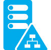

<properties
    pageTitle="Azure MFA und AD FS | Microsoft Azure"
    description="Dies ist die Seite, die beschreibt, wie Sie erste Schritte mit Azure MFA und AD FS mehrstufige Azure-Authentifizierung."
    services="multi-factor-authentication"
    documentationCenter=""
    authors="kgremban"
    manager="femila"
    editor="yossib"/>

<tags
    ms.service="multi-factor-authentication"
    ms.workload="identity"
    ms.tgt_pltfrm="na"
    ms.devlang="na" ms.topic="get-started-article"
    ms.date="10/17/2016"
    ms.author="kgremban"/>

# Erste Schritte mit Azure kombinierte Authentifizierung und Active Directory Federation Services

Wenn Sie Ihrer Organisation auf Ihrem lokalen Active Directory mit Azure Active Directory mithilfe von AD FS Partnersuche hat, gibt es zwei Optionen für die Verwendung von Azure kombinierte Authentifizierung.

- Cloudressourcen Azure kombinierte Authentifizierung oder Active Directory Federation Services mit Secure
- Sichere mit Azure mehrstufige Authentifizierungsserver Cloud und lokale Ressourcen

Die folgende Tabelle enthält eine Übersicht über die Überprüfung Oberfläche zwischen Sichern von Ressourcen mit Azure kombinierte Authentifizierung und AD FS

|Überprüfung Eindruck – durchsuchen-basierten Apps|Überprüfung Eindruck – nicht-Browser-basierten Apps
:------------- | :------------- | :------------- |
Sichern von Azure kombinierte Authentifizierung mit Azure AD-Ressourcen |<li>Im erste Überprüfungsschritt erfolgt lokalen AD FS verwenden.</li> <li>Im zweite Schritt wird eine telefonische Methode ganzer Zahlen Cloud-Authentifizierung verwendet.</li>|Endbenutzer können app Kennwörter verwenden, um sich anzumelden.
Sichern von Active Directory Federation Services mit Azure AD-Ressourcen |<li>Im erste Überprüfungsschritt erfolgt lokalen AD FS verwenden.</li><li>Im zweite Schritt ist ausgeführte lokalen durch den Anspruch berücksichtigt.</li>|Endbenutzer können app Kennwörter verwenden, um sich anzumelden.

Vorsichtsmaßnahmen mit app Kennwörter für Benutzer im Verbund:

- App-Kennwörter werden mit der Cloud-Authentifizierung, damit diese Föderation umgehen überprüft. Föderation wird nur aktiv verwendet werden, wenn eine app Kennwort einrichten.
- Lokalen Client Access Control Settings werden app Kennwörter nicht berücksichtigt.
- Sie verlieren die lokale Authentifizierung-Protokollierung Videofunktionen für app-Kennwörter.
- Deaktivieren und Löschen von Konto kann für Verzeichnis synchronisieren, deaktivieren und Löschen von app Kennwörter in der Cloud Identität verzögern bis zu drei Stunden dauern.

## Nächste Schritte

Informationen zum Einrichten von entweder Azure kombinierte Authentifizierung oder Azure mehrstufige Authentifizierungsserver mit AD FS finden Sie in den folgenden Artikeln:

- [Sichern von mit Azure kombinierte Authentifizierung und AD FS Cloudressourcen](multi-factor-authentication-get-started-adfs-cloud.md)
- [Sichere mit Azure mehrstufige Authentifizierungsserver mit Windows Server 2012 R2 AD FS Cloud und lokale Ressourcen](multi-factor-authentication-get-started-adfs-w2k12.md)
- [Sichern von Cloud und lokale Ressourcen mithilfe von Azure mehrstufige Authentifizierungsserver mit AD FS 2.0](multi-factor-authentication-get-started-adfs-adfs2.md)
