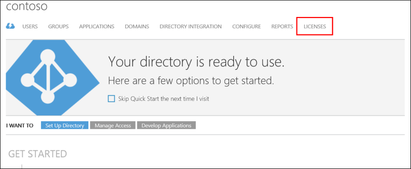
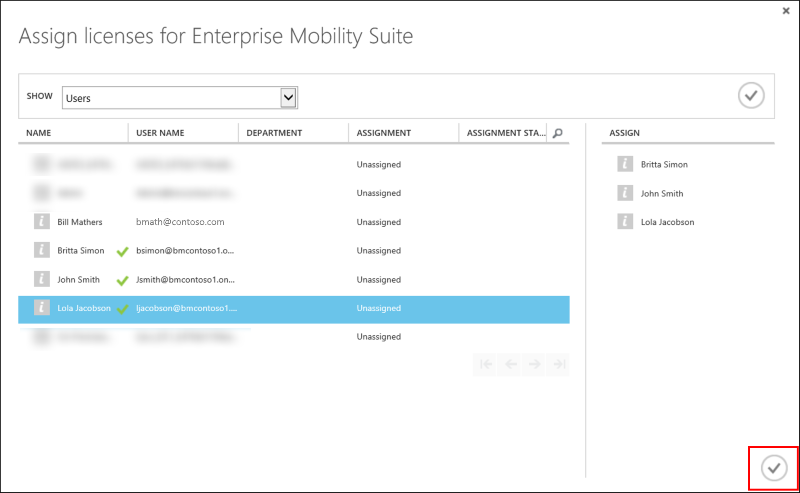
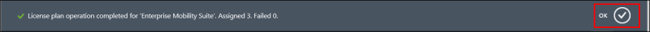

<properties
    pageTitle="Zuweisen von Lizenzen für Azure MFA | Microsoft Azure"
    description="Informationen Sie zum Zuweisen von Benutzerlizenzen für Microsoft Azure kombinierte Authentifizierung."
    services="multi-factor-authentication"
    documentationCenter=""
    authors="kgremban"
    manager="femila"
    editor="yossib"/>

<tags
    ms.service="multi-factor-authentication"
    ms.workload="identity"
    ms.tgt_pltfrm="na"
    ms.devlang="na"
    ms.topic="get-started-article"
    ms.date="10/17/2016"
    ms.author="kgremban"/>

# Zuweisen einer Lizenz Azure MFA, Azure AD Premium oder Enterprise Mobilität für Benutzer

Wenn Sie Azure MFA, Azure AD Premium oder Enterprise Mobilität Suite Lizenzen erworben haben, müssen Sie keinen kombinierte Authentifizierung Anbieter zu erstellen. Sobald Sie Ihre Benutzer die Lizenzen zugewiesen haben, können Sie beginnen, aktivieren sie für MFA.

## Eine Lizenz zuweisen

1. Melden Sie sich bei der [Azure klassischen Portal](https://manage.windowsazure.com) als Administrator.
2. Wählen Sie auf der linken Seite aus **Active Directory**.
3. Doppelklicken Sie auf das Verzeichnis, das die Benutzer enthält, die Sie aktivieren möchten, klicken Sie auf der Seite Active Directory.
4. Wählen Sie am oberen Rand der Seite Verzeichnis **Lizenzen**aus.

5. Wählen Sie auf der Seite Lizenzen **Azure mehrstufige Authentifizierung**, **Active Directory-Premium**oder **Enterprise Mobilität Suite**aus.  Wenn Sie nur eine haben, sollten sie automatisch aktiviert.
6. Klicken Sie am unteren Rand der Seite auf **zuweisen**.

6. Klicken Sie in das Feld, das angezeigt wird neben den Benutzern oder Gruppen, denen Sie zu Lizenzen zuweisen möchten.  Sie sollten finden Sie unter einem grünen Häkchen angezeigt.
7. Klicken Sie auf das Häkchen-Symbol, um die Änderungen zu speichern.

8. Finden Sie unter einer Meldung darüber informiert, wie viele fehlgeschlagen ist und wie viele Lizenzen zugewiesen wurden.  Klicken Sie auf **Ok**.

