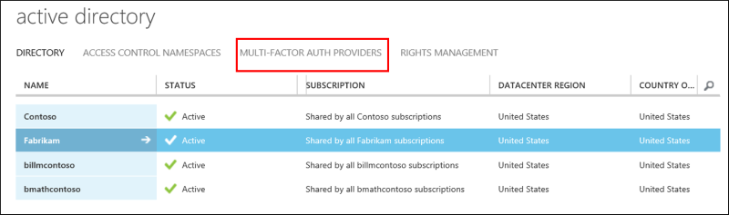
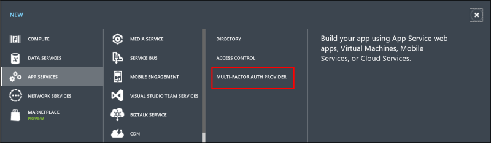
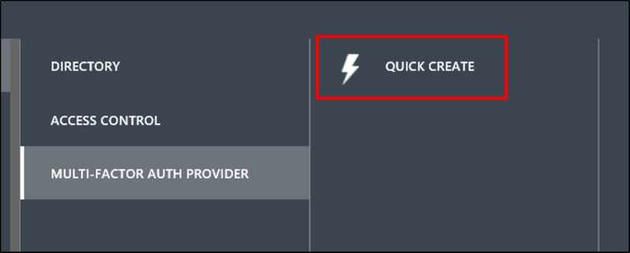
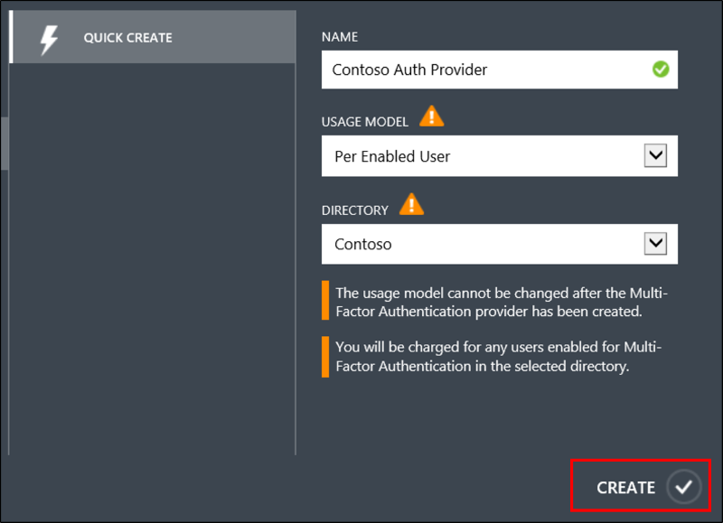
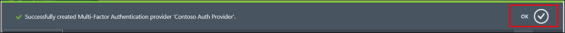

<properties
    pageTitle="Erste Schritte Azure mehrstufige Authentifizierung Anbieter | Microsoft Azure"
    description="Informationen Sie zum Erstellen eines Azure-Dienstanbieters mehrstufige Authentifizierung."
    services="multi-factor-authentication"
    documentationCenter=""
    authors="kgremban"
    manager="femila"
    editor="yossib"/>

<tags
    ms.service="multi-factor-authentication"
    ms.workload="identity"
    ms.tgt_pltfrm="na"
    ms.devlang="na"
    ms.topic="get-started-article"
    ms.date="10/14/2016"
    ms.author="kgremban"/>

# Erste Schritte mit einer Azure mehrstufige Authentifizierung-Anbieter
Zwei Überprüfung ist standardmäßig für globale Administratoren Berechtigung Azure Active Directory und Office 365-Benutzer verfügbar. Jedoch, wenn Sie [Erweiterte Features](multi-factor-authentication-whats-next.md) nutzen möchten sollten Sie die Vollversion von Azure mehrstufige Authentifizierung (MFA) erwerben.

> [AZURE.NOTE]  Ein Azure mehrstufige Authentifizierung Anbieter wird verwendet, um die von der Vollversion von Azure MFA bereitgestellten Features nutzen. Es ist für Benutzer, die **keinen Lizenzen über Azure MFA, Azure AD Premium, oder EMS**.  Azure MFA, Azure AD Premium und EMS einschließen die Vollversion von Azure MFA standardmäßig.  Wenn Sie Lizenzen besitzen, benötigen Sie kein Azure mehrstufige Authentifizierung Anbieter.

Ein Azure mehrstufige Authentifizierung Anbieter muss das SDK herunterladen.

> [AZURE.IMPORTANT]  Erstellen Sie eine Azure mehrstufige Authentifizierung Anbieter zum Herunterladen des SDKS auch wenn Azure MFA, AAD Premium oder EMS Lizenzen ist.  Wenn Sie eine Azure mehrstufige Authentifizierung-Anbieter für diesen Zweck erstellen und bereits Lizenzen, achten Sie darauf, dass Sie den Anbieter mit dem Modell **Pro aktivierten Benutzer** zu erstellen. Klicken Sie dann verknüpfen Sie den Anbieter, mit dem Verzeichnis, das die Lizenzen Azure MFA, Azure AD Premium oder EMS enthält.  Dadurch wird sichergestellt, dass Sie nur Abrechnung werden, wenn Sie weitere eindeutige Benutzer mit dem SDK als die Anzahl der Lizenzen an, die Sie der Besitzer verfügen.

## So erstellen Sie eine kombinierte autorisierende Provider

Verwenden Sie die folgenden Schritte aus, um eine Azure mehrstufige Authentifizierung Anbieter zu erstellen.

1. Melden Sie sich bei der [Azure klassischen Portal](https://manage.windowsazure.com) als Administrator.
2. Wählen Sie auf der linken Seite aus **Active Directory**.
3. Wählen Sie auf der Seite Active Directory am oberen **Mehrstufige Authentifizierungsanbieter**.

4. Klicken Sie unten auf **neu**.

5. Wählen Sie unter App Dienste **Mehrstufige Authentifizierung aus**

6. Wählen Sie **schnell zu erstellen**.

5. Füllen Sie die folgenden Felder aus, und wählen Sie **Erstellen**aus.
    1. **Name** – den Namen des Anbieters mehrstufige Authentifizierung.
    2. **Verwendungsmodell** – gibt an, ob Sie können einzelne Benutzer aktivieren oder pro Überprüfung bezahlen möchten. Wählen Sie eine der beiden Optionen aus:
        - Pro Authentifizierung – übliche Verfahren, die pro Authentifizierung Gebühren. In der Regel verwendet für Szenarien, die in einer Anwendung Consumer zugänglichen Azure mehrstufige Authentifizierung zu verwenden.
        - Pro aktiviert Benutzer – aktiviert übliche Verfahren, die Gebühren pro Benutzer. In der Regel verwendet für Mitarbeiterzugriff auf Anwendungen wie Office 365. Wählen Sie diese Option, wenn Sie einige Benutzer haben, die bereits für Azure MFA lizenziert sind.
    2. **Verzeichnis** – der Azure-Active Directory-Mandanten, die die kombinierte Authentifizierungsanbieter zugeordnet ist. Beachten Sie die folgenden Aktionen aus:
        - Ein Azure AD-Verzeichnis so erstellen Sie eine kombinierte autorisierende Provider benötigen nicht. Lassen Sie das Feld leer, wenn Sie nur beabsichtigen, das Azure mehrstufige Authentifizierungsserver oder SDK verwenden.
        - Die kombinierte Authentifizierung Anbieter muss ein Azure AD-Verzeichnis zu nutzen der erweiterten Funktionen zugeordnet werden.
        - Azure AD verbinden, AAD synchronisieren oder DirSync sind nur eine Vorbedingung, wenn Sie Ihrem lokalen Active Directory-Umgebung mit einem Azure AD-Verzeichnis synchronisieren.  Wenn Sie nur ein Verzeichnis Azure AD-, die nicht synchronisiert wird verwenden, ist dies nicht erforderlich.

5. Nachdem Sie klicken Sie auf erstellen, wird die kombinierte Authentifizierungsanbieter erstellt und Sie sollte eine Meldung angezeigt: **Mehrstufige Authentifizierungsanbieter wurde erfolgreich erstellt**. Klicken Sie auf **Ok**.

