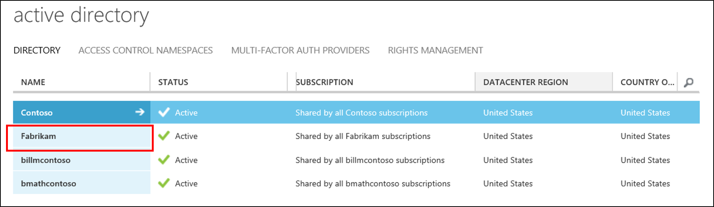
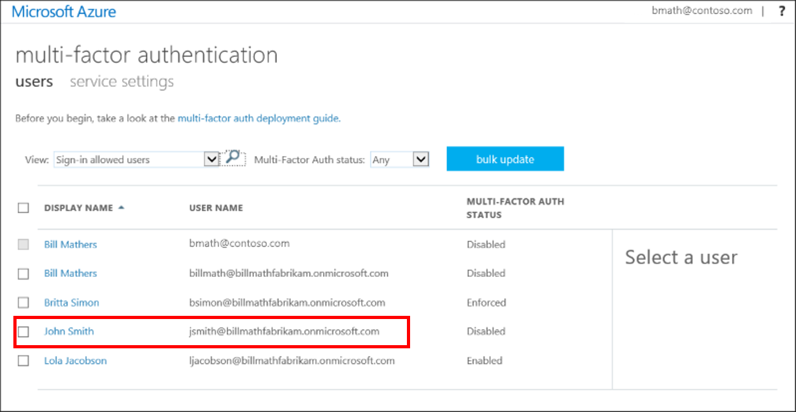

<properties
    pageTitle="Erste Schritte mit der Cloud Azure MFA | Microsoft Azure"
    description="Dies ist der Microsoft Azure mehrstufige Authentifizierung-Seite, die beschreibt, wie Sie den ersten Schritten mit Azure MFA in der Cloud."
    services="multi-factor-authentication"
    documentationCenter=""
    authors="kgremban"
    manager="femila"
    editor="yossib"/>

<tags
    ms.service="multi-factor-authentication"
    ms.workload="identity"
    ms.tgt_pltfrm="na"
    ms.devlang="na"
    ms.topic="get-started-article"
    ms.date="10/17/2016"
    ms.author="kgremban"/>

# Erste Schritte mit Azure kombinierte Authentifizierung in der cloud
In diesem Artikel durchläuft Schritte mit Azure kombinierte Authentifizierung in der Cloud.

> [AZURE.NOTE]  Die folgende Dokumentation enthält Informationen zum Verwenden des **Klassischen Azure-Portal**Benutzer aktivieren. Wenn Sie Informationen zum Einrichten von Azure kombinierte Authentifizierung für Office 365-Benutzer gefunden werden, finden Sie unter [kombinierte Authentifizierung für Office 365 einrichten.](https://support.office.com/article/Set-up-multi-factor-authentication-for-Office-365-users-8f0454b2-f51a-4d9c-bcde-2c48e41621c6?ui=en-US&rs=en-US&ad=US)

## Erforderliche Komponenten
Die folgenden Komponenten sind erforderlich, bevor Sie Azure kombinierte Authentifizierung für Ihre Benutzer aktivieren können.

1. [Registrieren für ein Azure-Abonnement](https://azure.microsoft.com/pricing/free-trial/) – Wenn Sie noch nicht über ein Azure-Abonnement verfügen, müssen Sie Anmeldung für eine. Wenn Sie nur den Ausgangspunkt und Azure MFA verwenden, können Sie ein Testabonnement
2. [Erstellen einer mehrstufige Authentifizierung Anbieter](multi-factor-authentication-get-started-auth-provider.md) und weisen sie zu Ihrem Verzeichnis oder [Zuweisen von Lizenzen für Benutzer](multi-factor-authentication-get-started-assign-licenses.md)

> [AZURE.NOTE]  Lizenzen sind für Benutzer mit Azure MFA, Azure AD Premium oder Enterprise Mobilität Suite (EMS) verfügbar.  MFA ist in Azure AD Premium und die EMS enthalten. Wenn Sie über genügend Lizenzen verfügen, müssen Sie nicht zum Erstellen eines Anbieters für die Authentifizierung.

## Aktivieren Sie in zwei Schritten Überprüfung für Benutzer
Um zu beginnen, die zwei Start Überprüfung für einen Benutzer erfordern, ändern Sie den Status des Benutzers aus deaktiviert aktiviert.  Weitere Informationen zu Benutzer Staaten finden Sie unter [Benutzer Staaten in Azure kombinierte Authentifizierung](multi-factor-authentication-get-started-user-states.md)

Gehen Sie folgendermaßen vor, um MFA für Ihre Benutzer zu aktivieren.

### So aktivieren Sie kombinierte Authentifizierung

1.  Melden Sie sich bei der [Azure klassischen Portal](https://manage.windowsazure.com) als Administrator.
2.  Klicken Sie auf der linken Seite auf **Active Directory**.
3.  Wählen Sie das Verzeichnis für den Benutzer, die, den Sie aktivieren möchten, klicken Sie unter Verzeichnis.

4.  Klicken Sie oben auf **Benutzer**.
5.  Klicken Sie am unteren Rand der Seite auf **Mehrstufige Authentifizierung verwalten**. Eine neue Browserregisterkarte wird geöffnet.

6.  Suchen Sie den Benutzer, den Sie zur Überprüfung in zwei Schritten aktivieren möchten. Möglicherweise müssen zum Ändern der Anzeige oben. Stellen Sie sicher, dass der Status lautet **deaktiviert.** 
 
7.  Platzieren Sie eine **Aktivieren Sie** in das Feld neben dem jeweiligen Namen ein.
7.  Klicken Sie auf der rechten Seite auf **Aktivieren**.

8.  Klicken Sie auf die **kombinierte Authentifizierung aktivieren**.

9.  Beachten Sie, dass den Status des Benutzers aus **deaktiviert** **aktiviert**geändert hat.

Nachdem Sie Ihre Benutzer aktiviert haben, sollten Sie diese per e-Mail benachrichtigen. Sie versuchen, melden Sie sich das nächste Mal werden sie aufgefordert, deren Konto für zwei Überprüfung zu registrieren. Nachdem sie in zwei Schritten Überprüfung verwenden, müssen sie auch app Kennwörter zur Vermeidung von nicht-Browser apps gesperrt einrichten.

## Mithilfe von PowerShell automatisieren einschalten in zwei Schritten Überprüfung

Um den [Status](multi-factor-authentication-whats-next.md) mithilfe der [Azure AD-PowerShell](../powershell-install-configure.md)ändern, können Sie Folgendes verwenden.  Sie können ändern `$st.State` gleich eine der folgenden Zustände:

- Aktiviert
- Erzwungen
- Deaktiviert  

> [AZURE.IMPORTANT]  Wir abhalten gegen Benutzer direkt aus dem Deaktivieren Status in den Zustand erzwungen verschieben. Apps nicht browserbasierten werden gestoppt arbeiten, da der Benutzer nicht nicht mehr angezeigt, bis MFA Registrierung und eine [app Kennwort](multi-factor-authentication-whats-next.md#app-passwords)abgerufen. Wenn Sie nicht-Browser-basierten apps haben und app Kennwörter verlangen, wird empfohlen, um von einem Zustand deaktiviert auf aktiviert gelangen. Dies ermöglicht Benutzern registriert und ihre app Kennwörter zu erhalten. Anschließend können Sie diese auf erzwungen verschieben.

Mithilfe der PowerShell wäre eine Option zum zulassen, dass Benutzer Massen. Derzeit gibt es keine Funktion zum Massen von aktivieren Azure-Portal und müssen Sie jeden Benutzer einzeln auswählen. Dies kann ganz eines Vorgangs sein, wenn Sie viele Benutzer haben. Durch Erstellen einer PowerShell Skripts mithilfe der folgenden, Sie können eine Liste der Benutzer durchlaufen und dort aktivieren.

        $st = New-Object -TypeName Microsoft.Online.Administration.StrongAuthenticationRequirement
        $st.RelyingParty = "\*"
        $st.State = “Enabled”
        $sta = @($st)
        Set-MsolUser -UserPrincipalName bsimon@contoso.com -StrongAuthenticationRequirements $sta

Hier ist ein Beispiel:

    $users = "bsimon@contoso.com","jsmith@contoso.com","ljacobson@contoso.com"
    foreach ($user in $users)
    {
        $st = New-Object -TypeName Microsoft.Online.Administration.StrongAuthenticationRequirement
        $st.RelyingParty = "\*"
        $st.State = “Enabled”
        $sta = @($st)
        Set-MsolUser -UserPrincipalName $user -StrongAuthenticationRequirements $sta
    }

Weitere Informationen finden Sie unter [Benutzer Staaten in Azure kombinierte Authentifizierung](multi-factor-authentication-get-started-user-states.md)

## Nächste Schritte
Jetzt, da Sie Azure kombinierte Authentifizierung in der Cloud eingerichtet haben, können Sie konfigurieren und Einrichten der Bereitstellung. Weitere Informationen hierzu finden Sie unter [Konfigurieren von Azure kombinierte Authentifizierung](multi-factor-authentication-whats-next.md) .
