<properties 
    pageTitle="Bereitstellen von im Benutzerportal für den Server Azure mehrstufige Authentifizierung"
    description="Dies ist die Seite, die beschreibt, wie Sie erste Schritte mit Azure MFA und im Benutzerportal mehrstufige Azure-Authentifizierung."
    services="multi-factor-authentication"
    documentationCenter=""
    authors="kgremban"
    manager="femila"
    editor="curtand"/>

<tags
    ms.service="multi-factor-authentication"
    ms.workload="identity"
    ms.tgt_pltfrm="na"
    ms.devlang="na"
    ms.topic="get-started-article"
    ms.date="08/15/2016"
    ms.author="kgremban"/>

# Bereitstellen von im Benutzerportal für den Server Azure mehrstufige Authentifizierung

Im Portal Benutzer kann den Administrator installieren und Konfigurieren der Azure mehrstufige Authentifizierung User Portal. Die Benutzer-Portal ist eine IIS-Website, die Benutzer in Azure kombinierte Authentifizierung registrieren und ihre Konten verwalten können. Ein Benutzer kann die Rufnummer ändern, ändern ihre PIN oder umgehen Azure kombinierte Authentifizierung während ihrer nächsten melden Sie sich auf.

Benutzer werden melden Sie sich mit ihren normalen Benutzernamen und Ihr Kennwort Benutzer-Portal und wird entweder einen Anruf Azure kombinierte Authentifizierung oder beantworten Fragen zur Sicherheit, um deren Authentifizierung abzuschließen. Wenn Benutzer Registrierung zulässig ist, wird ein Benutzer ihre Telefonnummer und PIN beim ersten konfigurieren, die im Portal Benutzer anmelden.

User Portal Administrators möglicherweise eingerichtet und über die Berechtigung zum Hinzufügen neuer Benutzer, und aktualisieren vorhandene Benutzer erteilt werden.

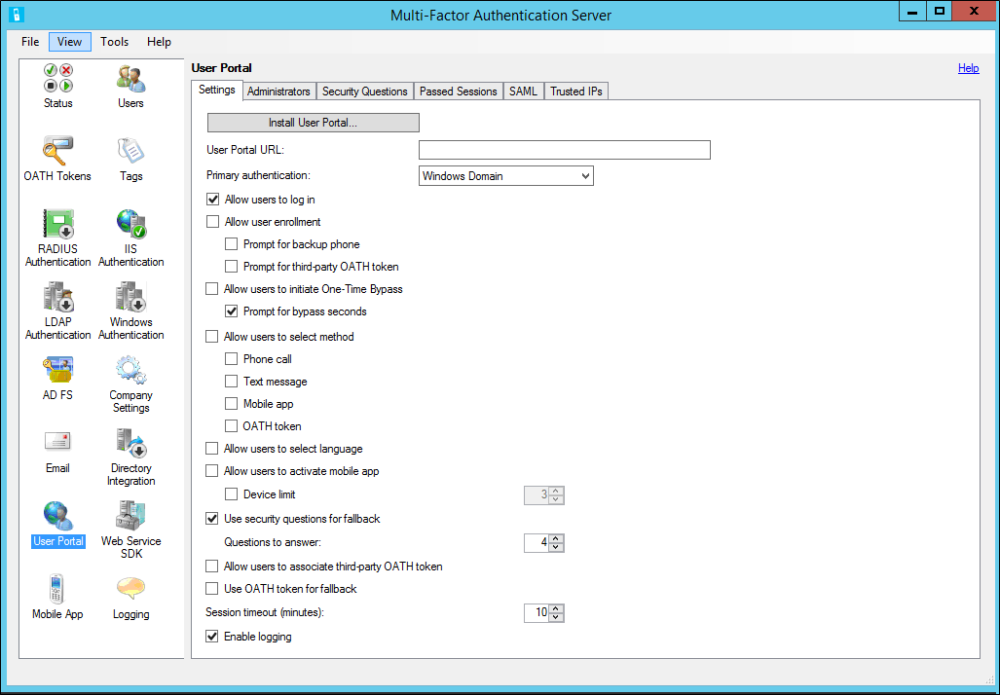

## Bereitstellen von im Benutzerportal auf dem gleichen Server wie der Azure mehrstufige Authentifizierungsserver

Die folgenden erforderlichen Komponenten sind für die Installation von im Portal Benutzer auf dem gleichen Server wie der Server Azure mehrstufige Authentifizierung erforderlich:

- IIS muss installiert werden, einschließlich asp.net und IIS 6 Metatag Basis Kompatibilität (IIS 7 oder höher)
- Angemeldete Benutzer müssen Administratorrechte für den Computer und Domäne, falls zutreffend.  Dies ist, da das Konto mit Berechtigungen zum Erstellen von Active Directory-Sicherheitsgruppen benötigt.

### Im Benutzerportal für den Azure mehrstufige Authentifizierungsserver bereitstellen.

1. Innerhalb der Azure mehrstufige Authentifizierungsserver: Klicken Sie auf User Portal-Symbol im linken Menü, klicken Sie auf die Schaltfläche User Portal installieren.
1. Klicken Sie auf Weiter.
1. Klicken Sie auf Weiter.
1. Wenn der Computer zu einer Domäne hinzugefügt wird, und die Active Directory-Konfiguration zum Sichern der Kommunikation zwischen der Benutzer-Portal und dem Dienst Azure kombinierte Authentifizierung nicht vollständig ist, wird der Active Directory-Schritt angezeigt. Klicken Sie auf die Schaltfläche Weiter, um diese Konfiguration automatisch abzuschließen.
1. Klicken Sie auf Weiter.
1. Klicken Sie auf Weiter.
1. Klicken Sie auf Schließen.
1. Öffnen Sie einen Webbrowser von einem beliebigen Computer, und navigieren Sie zu der URL, auf dem Portal Benutzer installiert wurde (z. B. https://www.publicwebsite.com/MultiFactorAuth). Stellen Sie sicher, dass keine Warnungen Zertifikat oder ein Fehler angezeigt werden.

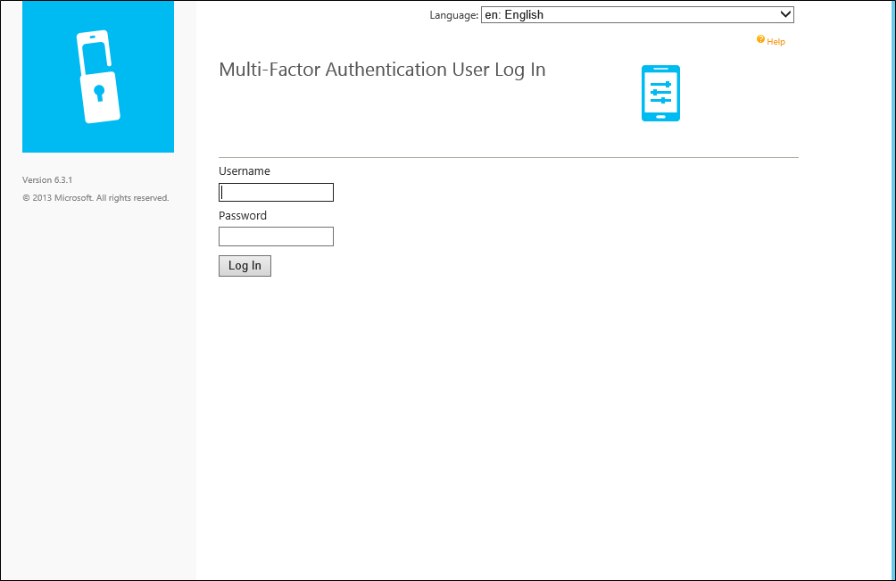

## Bereitstellen von der Azure kombinierte Authentifizierung Server User Portal auf einem anderen Server

Akzeptieren, um die Azure mehrstufige Authentifizierung-App verwenden zu können, sind die folgenden erforderlich, damit die app mit User Portal erfolgreich kommunizieren kann:

Bitte finden Sie unter Hardware und Software für Hardware und Software erfüllt:

- Sie müssen eine Version von 6.0 oder höher des Servers Azure mehrstufige Authentifizierung.
- User Portal muss installiert sein, mit Microsoft® Internet Information Services (IIS) auf einem internetfähigen Webserver 6.x, IIS 7.x oder höher.
- Bei Verwendung von IIS 6.x, vergewissern Sie sich ASP.NET v2.0.50727 installiert, registriert und setzen auf zulässig.
- Rolle Services erforderlich, bei Verwendung von IIS 7.x oder höher enthalten, ASP.NET und IIS 6 Metabasiskompatibilität.
- User Portal sollte mit ein SSL-Zertifikat gesichert werden.
- Azure mehrstufige Authentifizierung Web Service SDK muss installiert sein, in IIS 6.x, IIS 7.x oder höher auf dem Server, die auf dem Azure mehrstufige Authentifizierungsserver installiert ist.
- Azure mehrstufige Authentifizierung Web Service SDK muss mit einem Zertifikat SSL geschützt werden.
- User Portal muss eine Verbindung über SSL zu Azure mehrstufige Authentifizierung Web Service SDK herstellen.
- User Portal muss authentifiziert zu Azure mehrstufige Authentifizierung Web Service SDK mit den Anmeldeinformationen eines Dienstkontos, deren Mitglied einer Sicherheitsgruppe namens "PhoneFactor Administratoren" ist. Dieses Dienstkontos und Gruppe vorhanden in Active Directory, wenn der Server Azure mehrstufige Authentifizierung auf einem Server Domänenverbund ausgeführt wird. Dieses Dienstkontos und Gruppe vorhanden lokal auf dem Azure mehrstufige Authentifizierungsserver, wenn es nicht zu einer Domäne gehört.

Installieren des Benutzers-Portals auf einem anderen Server als dem Azure mehrstufige Authentifizierungsserver erfordert die folgenden drei Schritte:

1. Installieren des Webdiensts SDK
2. Installieren Sie das Benutzerportal
3. Konfigurieren der Portalseite User Settings auf dem Server Azure kombinierte Authentifizierung

### Installieren des Webdiensts SDK

Wenn Azure mehrstufige Authentifizierung Web Service SDK auf dem Azure mehrstufige Authentifizierung-Server noch nicht installiert ist, wechseln Sie zu diesem Server, und öffnen Sie den Azure mehrstufige Authentifizierungsserver. Klicken Sie auf das Symbol Web Service SDK, klicken Sie auf Installieren Web Service SDK... Schaltfläche, und folgen Sie den Anweisungen präsentiert. Der Web Service SDK muss mit einem Zertifikat SSL geschützt werden. Ein selbst signiertes Zertifikat ist für diesen Zweck kein Problem, aber es wurde in den "vertrauenswürdigen" Serverzertifikat des Kontos auf dem Webserver User Portal lokalen Computer importiert werden sollen, damit sie dieses Zertifikat als vertrauenswürdig einstuft, wenn die SSL-Verbindung initiieren.

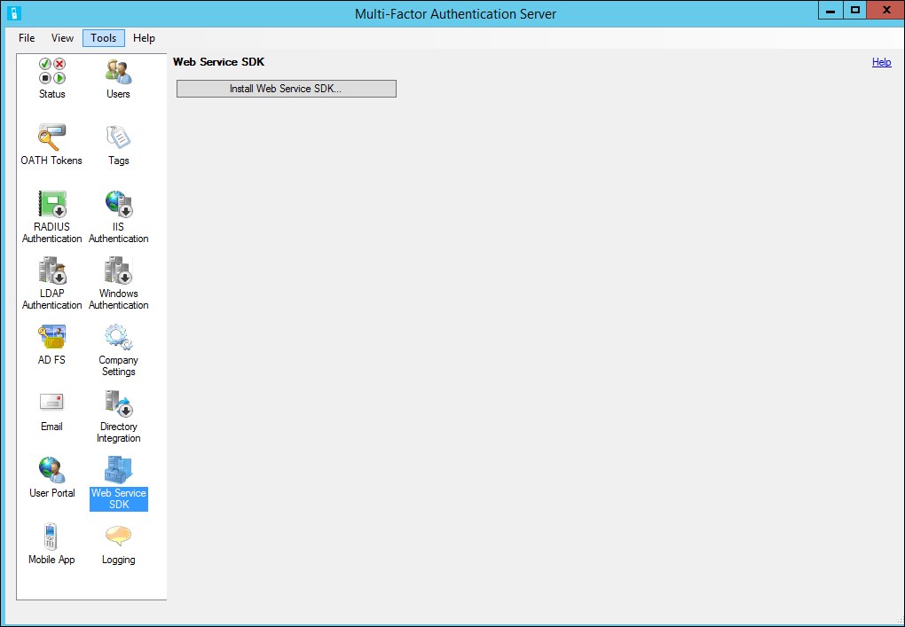

### Installieren Sie das Benutzerportal

Achten Sie vor der Neuinstallation im Portals Benutzer auf einem separaten Server ein, auf der folgenden Aktionen aus:

- Es empfiehlt sich in einem Webbrowser auf das Internet zugängliche Webserver öffnen, und navigieren Sie zu der URL des Web Service SDK, die in der Datei web.config eingegeben wurde. Wenn Sie der Browser erfolgreich an den Webdienst aufrufen kann, sollten sie Sie zur Eingabe von Anmeldeinformationen. Geben Sie den Benutzernamen und das Kennwort, das in der Datei web.config eingegeben wurden, genau wie in der Datei angezeigt. Stellen Sie sicher, dass keine Warnungen Zertifikat oder ein Fehler angezeigt werden.
- Wenn ein reverse Proxy oder Firewall vor dem Webserver User Portal sitzt und SSL Verschiebung ausführen, können Sie Standardinstanzennamen User Portal bearbeiten und hinzufügen die folgende-Taste, um die <appSettings> Abschnitt, damit die Benutzerportal http statt Https verwenden können. <add key="SSL_REQUIRED" value="false"/>

#### So installieren Sie das Benutzerportal

1. Öffnen Sie Windows Explorer auf dem Server Azure mehrstufige Authentifizierungsserver, und navigieren Sie zu dem Ordner, in dem die Azure mehrstufige Authentifizierungsserver installiert ist (z.B. c:\Programme Files\Multi zweifaktorielle Varianzanalyse Authentifizierungsserver). Wählen Sie die 32-Bit- oder 64-Bit-Version der MultiFactorAuthenticationUserPortalSetup Installationsdatei je nach dem Server, der auf User Portal installiert werden. Kopieren Sie die Installationsdatei auf dem Server Internet zugänglichen aus.
2. Klicken Sie auf das Internet zugängliche Webserver muss die Setupdatei mit Administratorrechten ausgeführt werden. Die einfachste Möglichkeit hierzu ist, öffnen Sie ein Eingabeaufforderungsfenster als Administrator aus, und navigieren Sie zu dem Speicherort, in dem die Installationsdatei kopiert wurde.
3. Führen Sie die Datei MultiFactorAuthenticationUserPortalSetup64 installieren, ändern Sie die Website und virtuelles Verzeichnis Namen bei Bedarf.
4. Nach dem Beenden der Installation des Portals Benutzer, navigieren Sie zu C:\inetpub\wwwroot\MultiFactorAuth (oder das entsprechende Verzeichnis basierend auf den Namen des virtuellen Verzeichnisses), und bearbeiten Sie die Datei web.config.
5. Suchen Sie den Schlüssel USE_WEB_SERVICE_SDK, und ändern Sie den Wert von False auf True. Suchen Sie nach der WEB_SERVICE_SDK_AUTHENTICATION_USERNAME und WEB_SERVICE_SDK_AUTHENTICATION_PASSWORD-Taste, und legen Sie die Werte in der Benutzername und das Kennwort für das Dienstkonto, deren Mitglied der Sicherheit PhoneFactor Admins ist (siehe Abschnitt Anforderungen) gruppieren. Achten Sie darauf, um zwischen den Anführungszeichen am Ende der Zeile, geben Sie den Benutzernamen und das Kennwort (Wert = "" / >). Es wird empfohlen, einen qualifizierten Benutzernamen (z. B. domaene\benutzername oder Computer\Benutzername) verwenden
6. Suchen Sie die Einstellung Pfup_pfwssdk_PfWsSdk, und ändern Sie den Wert von "Http://localhost:4898/PfWsSdk.asmx" die URL des Web Service SDK, die auf dem Azure mehrstufige Authentifizierungsserver (z. B. https://computer1.domain.local/MultiFactorAuthWebServiceSdk/PfWsSdk.asmx) ausgeführt wird. Da SSL für diese Verbindung verwendet wird, müssen Sie die Web Service SDK nach Servername und nicht IP-Adresse verweisen, da das SSL-Zertifikat wurde für den Servernamen ausgestellt wird und die URL verwendet, muss der Name des Zertifikats übereinstimmen. Wenn Sie der Servernamen nicht in eine IP-Adresse aus dem Internet zugänglichen Server behoben wird, fügen Sie einen Eintrag zur Hosts-Datei auf dem Server, den Namen des Servers Azure mehrstufige Authentifizierung seiner IP-Adresse zuzuordnen. Speichern Sie die Datei web.config nach Änderungen vorgenommen wurden.
7. Wenn die Website, dass Benutzer-Portal unter (z. B. Standardwebsite) installiert wurde bereits wurde nicht mit einem öffentlich signiertes Zertifikat eine, installieren Sie das Zertifikat auf dem Server, wenn Sie nicht bereits installiert, IIS-Manager zu öffnen und das Zertifikat der Website binden.
8. Öffnen Sie einen Webbrowser von einem beliebigen Computer, und navigieren Sie zu der URL, auf dem Portal Benutzer installiert wurde (z. B. https://www.publicwebsite.com/MultiFactorAuth). Stellen Sie sicher, dass keine Warnungen Zertifikat oder ein Fehler angezeigt werden.

## Konfigurieren der Portalseite benutzereinstellungen in dem Azure mehrstufige Authentifizierungsserver
Nachdem Sie nun das Portal installiert ist, müssen Sie den Azure mehrstufige Authentifizierungsserver für die Arbeit mit dem Portal konfigurieren.

Azure kombinierte Authentifizierung Server bietet mehrere Optionen für die Benutzerportal an.  Die folgende Tabelle enthält eine Liste der folgenden Optionen und eine Erklärung der wofür sie verwendet werden.

Portal Benutzereinstellungen|Beschreibung|
:------------- | :------------- |
Benutzer-Portal-URL| Ermöglicht Ihnen, geben Sie die URL der Stelle, an der das Portal gehostet wird.
Primäre Authentifizierung| Geben Sie die Art der Authentifizierung beim Anmelden bei im Portals verwenden können.  Windows, Radius oder LDAP-Authentifizierung.
Melden Sie sich Benutzer dürfen Bereiche|Ermöglicht Benutzern, geben Sie einen Benutzernamen und Kennwort auf der Anmeldeseite für das Portal Benutzer.  Wenn diese Option nicht ausgewählt ist, werden die Kontrollkästchen abgeblendet.
Ermöglichen die Registrierung für Benutzer|Diese Berechtigung ermöglicht Benutzer anmelden, indem sie zu einem Setupbildschirm, der sie für Weitere Informationen, wie z. B. Telefonnummer auffordert Übertragungsdienst kombinierte Authentifizierung.  Auffordern Sie, für die Sicherungsdatei Telefon Benutzer eine sekundäre Telefonnummer angeben kann.  Drittanbieter-verwendendes Angehörigen Token ermöglicht Benutzern ein 3rd Party Angehörigen Token angeben.
Benutzerberechtigungen Sie zum umgehen einmalig initiieren| Dies ermöglicht Benutzern eine einmalige umgehen einleiten.  Wenn ein Benutzer Datensätze, die diese von es dauert das nächste Mal Einfluss auf meldet den Benutzer ein.  Auffordern zur Umgehung der Sekunden ermöglicht dem Benutzer eines Felds, damit sie die Standardeinstellung 300 Sekunden ändern können.  Andernfalls ist der einmaligen umgangen nur gut für 300 Sekunden.
Erlauben Sie Benutzern, Methode auszuwählen.| Ermöglicht Benutzern, deren primären Kontakt Methode angeben.  Dies kann Anruf, Textnachricht, mobile-app oder Angehörigen Token sein.
Benutzer können Sprache auswählen|  Ermöglicht dem Benutzer, die Sprache zu ändern, die für den Anruf, Textnachricht, mobile-app oder Angehörigen Token verwendet wird.
Benutzerberechtigungen Sie zum mobile-app zu aktivieren| Können die Benutzer generieren einen Aktivierungscode, um die mobile-app Aktivierung abzuschließen, die mit dem Server verwendet wird.  Sie können auch die Anzahl der Geräte festlegen, die diese auf aktivieren können.  Zwischen 1 und 10.
Verwenden Sie für alternative Fragen zur Sicherheit|Können Sie Fragen zur Sicherheit verwenden, falls kombinierte Authentifizierung schlägt fehl.  Sie können die Anzahl der Fragen zur Sicherheit angeben, die erfolgreich beantwortet werden müssen.
Benutzerberechtigungen Sie zum Zuordnen von Drittanbietern Angehörigen token| Ermöglicht Benutzern, die einer Drittanbieter-Angehörigen Token angeben.
Verwenden von Angehörigen Token für alternative|Ermöglicht die Verwendung von einem Angehörigen Token den Fall, dass die kombinierte Authentifizierung nicht erfolgreich ist.  Sie können auch das Sitzungstimeout in Minuten angeben.
Aktivieren der Protokollierung|Aktiviert die Protokollierung auf dem Benutzerportal.  Die Protokolldateien befinden sich am: c:\Programme Files\Multi zweifaktorielle Varianzanalyse Authentifizierung Server\Logs.

Die meisten diese Einstellungen sind für den Benutzer, nachdem sie aktiviert sind und das Vorzeichen Benutzer am Benutzerportal sichtbar.

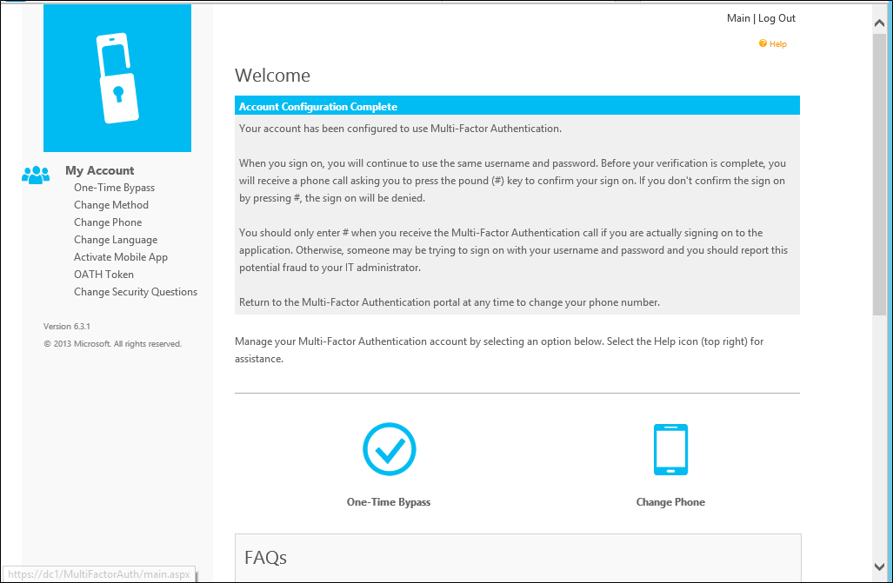

### So konfigurieren Sie die Benutzer Portal Einstellungen in der Azure mehrstufige Authentifizierungsserver

1. Server den Eintrag Azure mehrstufige Authentifizierung klicken Sie auf das Symbol User Portal. Geben Sie die URL in das Textfeld Benutzer Portal-URL-Portal an Benutzer, klicken Sie auf der Registerkarte Einstellungen. Diese URL wird in e-Mail-Nachrichten eingefügt werden, die an Benutzer gesendet werden, wenn sie in dem Azure mehrstufige Authentifizierungsserver importiert werden, wenn die e-Mail-Funktionalität aktiviert wurde.
2. Wählen Sie die Einstellungen, die im Portal Benutzer verwenden möchten. Wenn Benutzer dürfen, deren Authentifizierungsmethoden steuern, stellen Sie sicher, dass Benutzer können die Methode auswählen aktiviert ist, zusammen mit den Methoden können sie beispielsweise auf auswählen.
3. Klicken Sie auf den Link Hilfe in der oberen rechten Ecke Hilfe Grundlegendes zu den Einstellungen angezeigt.

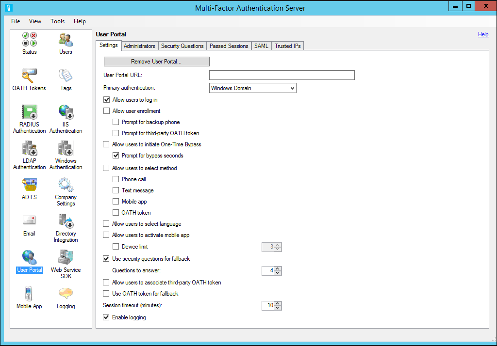

## Registerkarte für Administratoren
Auf dieser Registerkarte können einfach zum Hinzufügen von Benutzern, die über Administratorrechte verfügen sollen.  Wenn Sie einen Administrator hinzufügen möchten, können Sie die Berechtigungen Feinabstimmung, die sie empfangen.  Auf diese Weise können Sie nur die erforderlichen Berechtigungen an dem Administrator gewähren sicher sein.  Klicken Sie einfach auf die Schaltfläche hinzufügen, und wählen Sie dann sowie Benutzer und ihre Berechtigungen, und klicken Sie dann auf Hinzufügen.

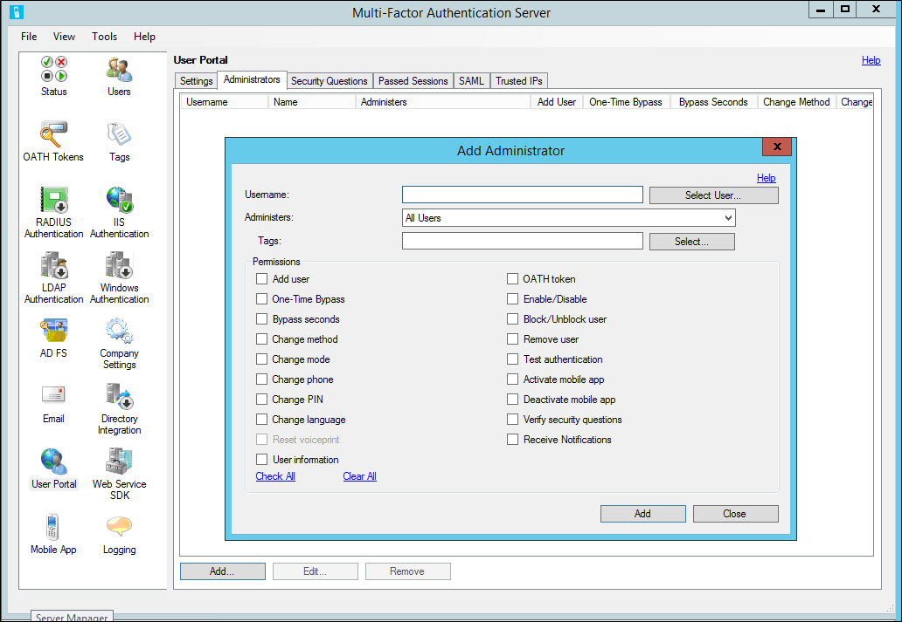

## Fragen zur Sicherheit
Auf dieser Registerkarte können Sie die Sicherheitsfragen angeben, denen Benutzer benötigen, um Antworten auf bereitzustellen, wenn fallbackabfragen Option Fragen Sicherheit verwenden aktiviert ist.  Azure mehrstufige-Authentifizierung Server im Lieferumfang von Standardfragen, die Sie verwenden können.  Außerdem können Sie Ihre eigenen Fragen hinzufügen oder Ändern der Reihenfolge.  Wenn Sie Ihre eigenen Fragen hinzufügen möchten, können Sie die Sprache angeben, diese Frage auch in angezeigt werden sollen.

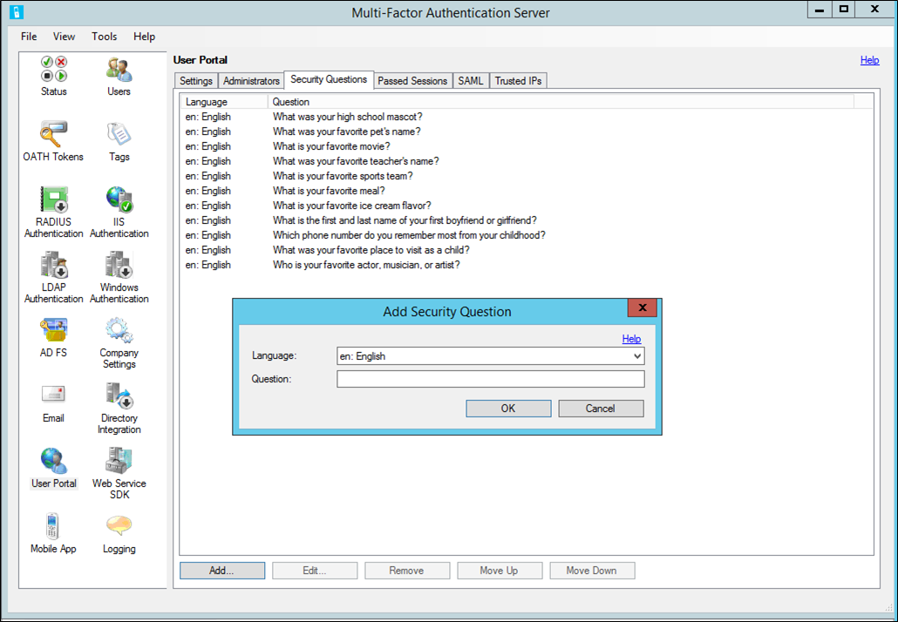

## Übergebene Sitzungen

## SAML
Ermöglicht Ihnen, die für die Einrichtung des Portals Benutzer zum Annehmen der Ansprüche aus einem Identitätsanbieter SAML verwenden.  Sie können die Sitzung Timeout festlegen, das Zertifikat Überprüfung und die Abmelden URL umleiten.

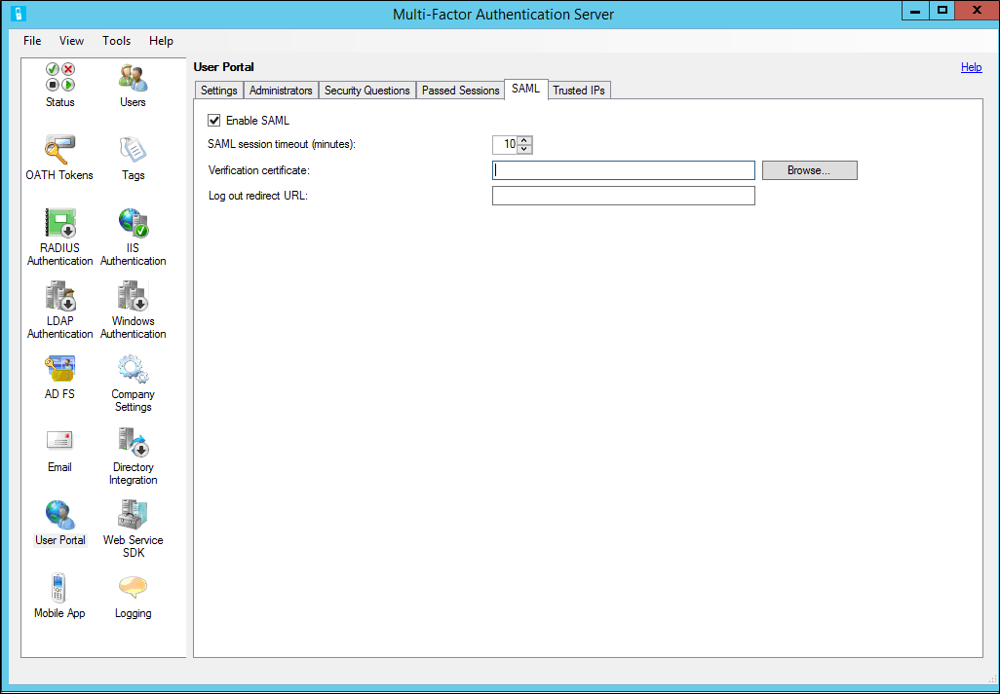

## Vertrauenswürdigen IP-Adressen
Auf dieser Registerkarte können Sie entweder einzelne IP-Adressen oder IP-Adressbereiche, die hinzugefügt werden können, wenn ein Benutzer eine der folgenden IP-Adressen anmelden, dann kombinierte Authentifizierung umgangen angeben.

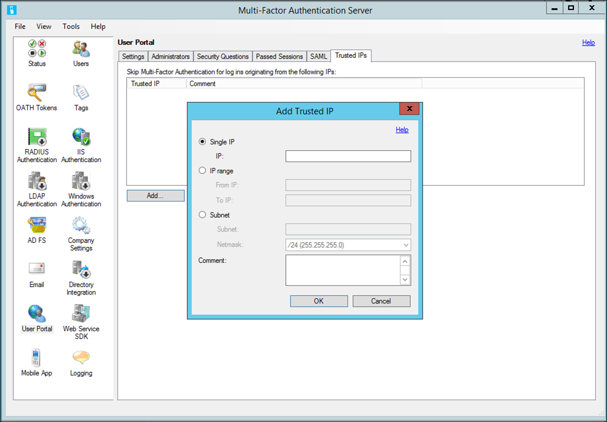

## Self-Service-Benutzer-Registrierung
Wenn Sie möchten, dass Ihre Benutzer anmelden und registrieren, wählen Sie Benutzern erlauben, Login in und Benutzeroptionen für die Registrierung zulassen. Denken Sie daran, dass die Einstellungen, die Sie auswählen das Anmeldeverhalten für Benutzer auswirkt.

Beispielsweise, wenn ein Benutzer auf das Portal Benutzer anmeldet und klickt auf die Schaltfläche anmelden, werden sie dann zur Einrichtungsseite Azure mehrstufige Authentifizierung Benutzer übernommen.  Je nachdem, wie Sie Azure kombinierte Authentifizierung konfiguriert haben möglicherweise der Benutzer ihre Authentifizierungsmethode auswählen können.  

Wenn sie die Auswahl der Authentifizierungsmethode Voicemail anrufen oder vorkonfiguriertes zum Verwenden dieser Methode wurden, fordert die Seite den Benutzer zur Eingabe von ihre primäre Telefonnummer und Erweiterung, falls zutreffend.  Sie können auch eine Sicherung Telefonnummer eingeben zugelassen werden.  

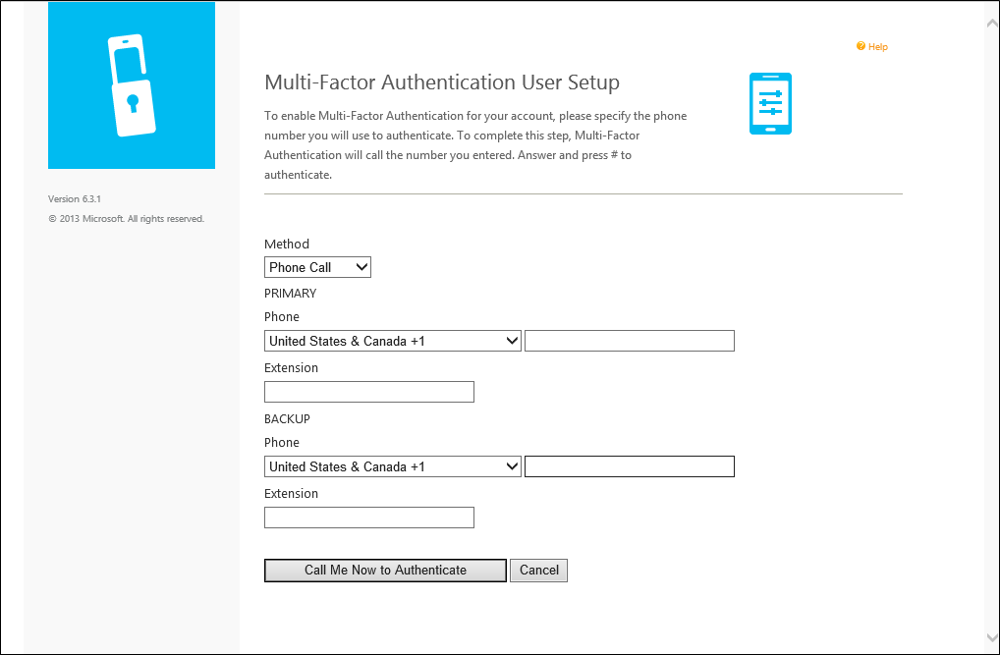

Wenn eine PIN verwenden, wenn sie sich authentifizieren des Benutzers erforderlich ist, wird die Seite auch eine PIN eingeben aufgefordert.  Geben Sie ihre Telefonnummern und eine PIN (falls zutreffend), der Benutzer die anrufen mich auf jetzt klickt authentifizieren Schaltfläche.  Azure kombinierte Authentifizierung wird eine Authentifizierung Anruf an primäre Telefonnummer des Benutzers ausgeführt.  Der Benutzer muss den Anruf annehmen, und geben Sie ihre PIN (falls zutreffend) und drücken Sie #, um mit dem nächsten Schritt des Prozesses Registrierung selbst zu wechseln, klicken Sie auf.   

Wenn der Benutzer die Authentifizierungsmethode SMS-Text markiert oder zum Verwenden dieser Methode vorkonfiguriertes wurde, wird die Seite der Benutzer für ihre Mobiltelefonnummer Aufforderung.  Wenn eine PIN verwenden, wenn sie sich authentifizieren des Benutzers erforderlich ist, wird die Seite auch eine PIN eingeben aufgefordert.  Geben Sie ihre Telefonnummer und eine PIN (falls zutreffend) aus, der Benutzer den Text mich auf jetzt klickt authentifizieren Schaltfläche.  Azure kombinierte Authentifizierung wird eine SMS-Authentifizierung an Mobiltelefon des Benutzers ausgeführt.  Der Benutzer muss die einen eine Uhrzeit Kenncode (OTP) und Antworten auf die Nachricht mit dieser OTP sowie deren PIN, falls zutreffend enthält SMS erhalten) mit dem nächsten Schritt des Prozesses Registrierung selbst zu verschieben, klicken Sie auf.

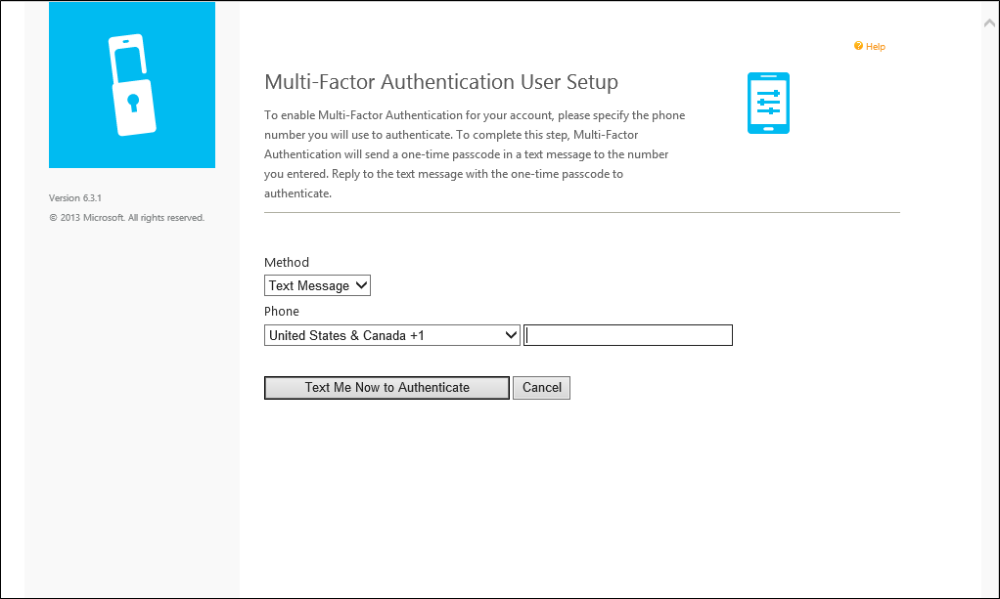   

Wenn der Benutzer die Mobile-app Authentifizierungsmethode wählt oder zum Verwenden dieser Methode vorkonfiguriertes wurde, fordert die Seite den Benutzer die app Azure kombinierte Authentifizierung Geräts installieren und einen Aktivierungscode generieren.  Nach der Installation der app Azure kombinierte Authentifizierung klickt der Benutzer die Schaltfläche Aktivierungs-Code generieren.    

>[AZURE.NOTE]Die Azure kombinierte Authentifizierung app verwenden zu können, muss der Benutzer Pushbenachrichtigungen für ihr Gerät aktivieren.

Die Seite zeigt dann eine Aktivierungscode und einen URL gemeinsam mit einem Bild Barcode.  Wenn eine PIN verwenden, wenn sie sich authentifizieren des Benutzers erforderlich ist, wird die Seite auch eine PIN eingeben aufgefordert.  Der Benutzer gibt die Aktivierungscode sowie die URL in der app Azure kombinierte Authentifizierung oder den Barcode Scanner verwendet, um das Bild Barcode zu scannen und klickt auf die Schaltfläche aktivieren.    

Nach Abschluss die Aktivierung klickt der Benutzer die Schaltfläche jetzt authentifizieren.  Azure kombinierte Authentifizierung wird eine Authentifizierung des Benutzers mobile-App ausgeführt werden.  Der Benutzer muss Geben Sie ihre PIN (falls zutreffend), und drücken Sie die Schaltfläche authentifizieren in ihre mobile-app mit dem nächsten Schritt des Prozesses Registrierung selbst zu verschieben, klicken Sie auf.  

Wenn die Administratoren den Server Azure mehrstufige Authentifizierung Sicherheitsfragen und Antworten zu sammeln konfiguriert haben, wird er dann Sicherheit Fragen zur weitergeleitet.  Der Benutzer muss wählen Sie aus vier Sicherheitsfragen und Antworten auf ihre ausgewählten Fragen.    

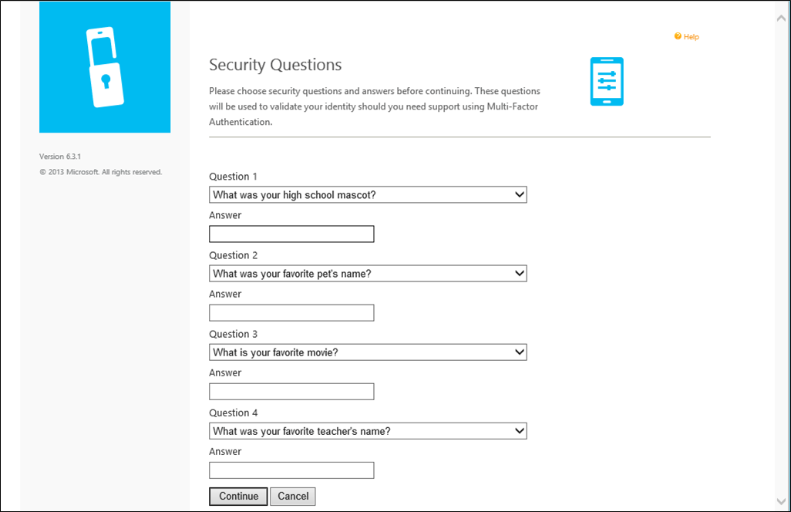  

Die Benutzer Registrierung selbst ist jetzt abgeschlossen, und der Benutzer auf das Portal Benutzer angemeldet ist.  Benutzer können auf das Portal Benutzer zu einem beliebigen Zeitpunkt in der Zukunft zu ändern, deren Telefonnummern, Stifte, Authentifizierungsmethoden und Sicherheitsfragen, wenn die von den Administratoren zulässig melden Sie sich wieder an.
