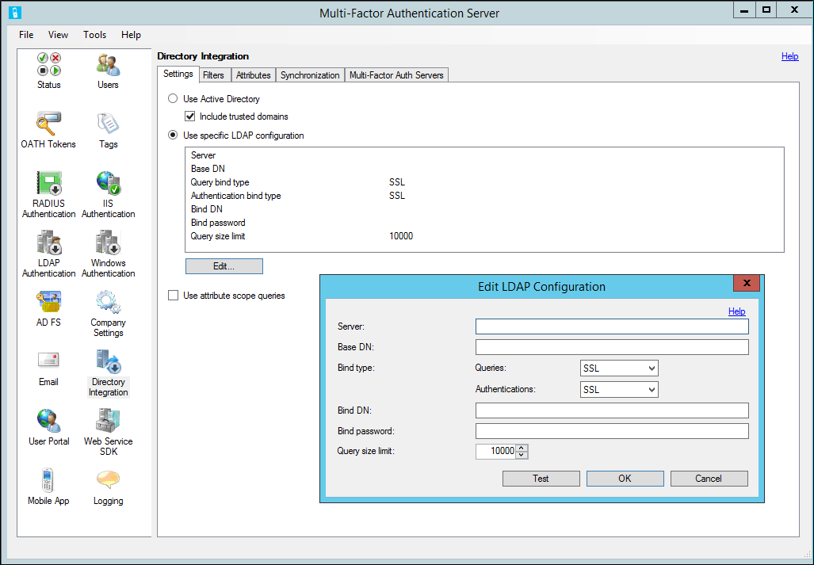
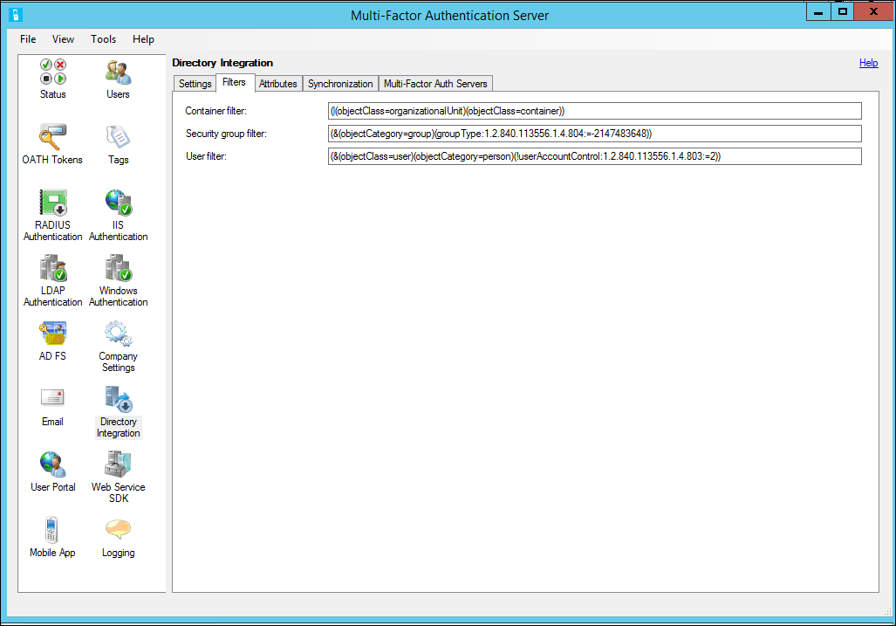
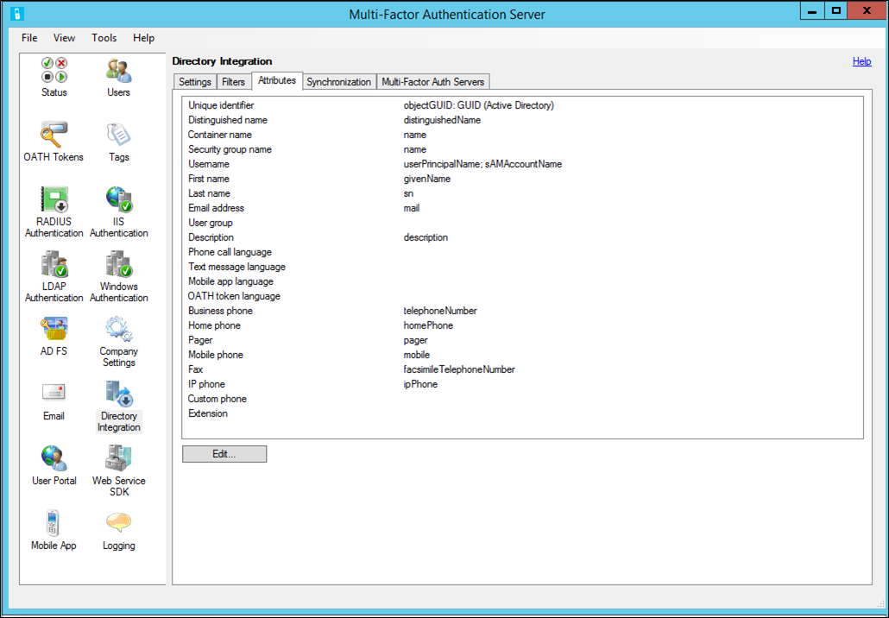
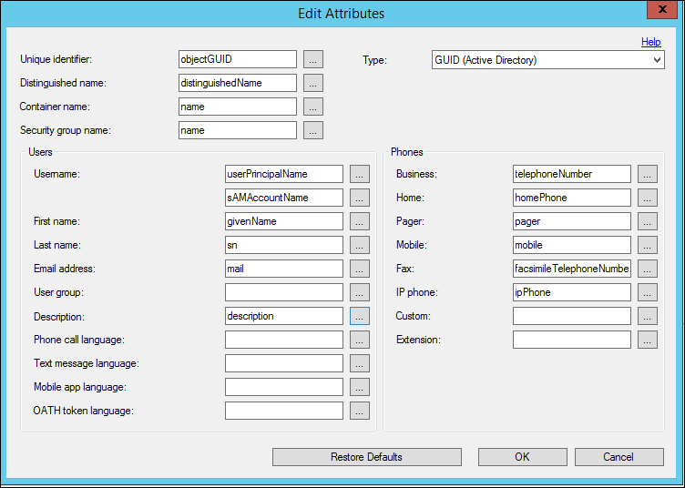
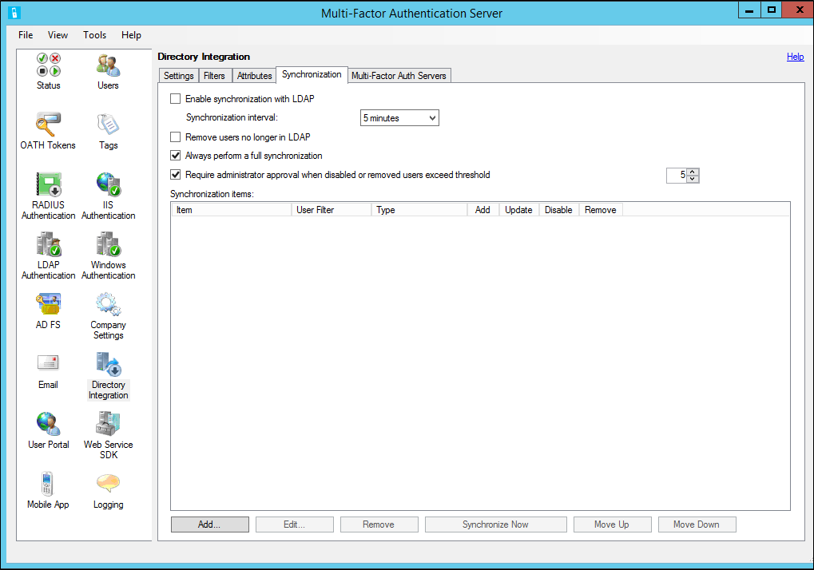
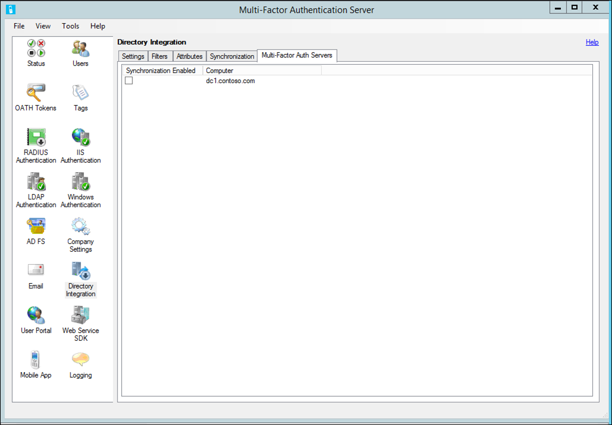

<properties 
    pageTitle="Verzeichnisintegration zwischen Azure kombinierte Authentifizierung und Active Directory"
    description="Dies ist die kombinierte Azure-Authentifizierung-Seite, die beschreibt, wie die Azure mehrstufige Authentifizierungsserver, damit Sie die Verzeichnisse synchronisieren können mit Active Directory integriert werden soll."
    services="multi-factor-authentication"
    documentationCenter=""
    authors="kgremban"
    manager="femila"
    editor="curtand"/>

<tags
    ms.service="multi-factor-authentication"
    ms.workload="identity"
    ms.tgt_pltfrm="na"
    ms.devlang="na"
    ms.topic="get-started-article"
    ms.date="08/04/2016"
    ms.author="kgremban"/>

# Verzeichnisintegration zwischen Azure MFA-Server und Active Directory

Im Abschnitt Verzeichnisintegration können Sie zum Konfigurieren des Servers mit Active Directory oder ein anderes LDAP-Verzeichnis integriert werden soll.  Sie können Sie Attribute, um das Directory-Schema entsprechen, und richten Sie automatische Synchronisierung von Benutzern zu konfigurieren.

## Einstellungen
Standardmäßig ist die Azure mehrstufige Authentifizierung-Server zu importieren oder zu synchronisieren von Benutzern aus Active Directory konfiguriert.  Die Registerkarte können Sie das Standardverhalten außer Kraft setzen und dann auf ein anderes LDAP-Verzeichnis, eine ADAM-Verzeichnis oder eine bestimmte Active Directory-Domänencontroller binden.  Darüber hinaus für die Verwendung der LDAP-Authentifizierung an Proxy LDAP oder LDAP-Bindung als RADIUS Ziel vor dem Authentifizierung für IIS-Authentifizierung oder primären Authentifizierung für User Portal.  Die folgende Tabelle beschreibt die einzelnen Einstellungen.

| Feature | Beschreibung |
| ------- | ----------- |
| Verwenden von Active Directory | Wählen Sie die Option Active Directory verwenden Sie für den Import und Synchronisierung mit Active Directory.  Dies ist die Standardeinstellung.  Hinweis: Der Computer muss verbunden werden in eine Domäne aus, und Sie müssen mit einem Domänenkonto für die Integration von Active Directory ordnungsgemäß funktioniert auf angemeldet sein. |
| Einschließen von vertrauenswürdigen Domänen | Aktivieren Sie das Kontrollkästchen Vertrauenswürdige Domänen enthalten, dass den Agent Verbindungsversuch mit Domänen, die von der aktuellen Domäne, eine andere Domäne in der Gesamtstruktur oder Domänen als vertrauenswürdig eingestuft beteiligt eine Vertrauensstellung aus.  Wenn Sie nicht importieren oder Synchronisieren von Benutzern aus einer vertrauenswürdigen Domänen, deaktivieren Sie das Kontrollkästchen, um die Leistung zu verbessern.  Die Standardeinstellung aktiviert ist. |
| Verwenden von bestimmter LDAP-Konfiguration | Wählen Sie die Option LDAP verwenden Sie die LDAP-Einstellungen für den Import und Synchronisierung angegebenen verwenden. Hinweis: Wenn LDAP verwenden ausgewählt ist, ändert sich die Benutzeroberfläche Verweise von Active Directory in LDAP. |
| Schaltfläche ' Bearbeiten ' | Die Schaltfläche "Bearbeiten" können die aktuellen LDAP-Konfiguration Einstellungen geändert. |
| Verwenden von Abfragen in Attribut Umfang | Gibt an, ob das Attribut Umfang Abfragen verwendet werden soll.  Qualifizieren von Datensätze basierend auf den Einträgen in einem anderen Datensatz Attribut effiziente Suchvorgänge zu Attribut Umfang Abfragen ermöglichen.  Der Server Azure mehrstufige Authentifizierung verwendet Attribut Umfang Abfragen effizient Benutzer Abfragen, die Mitglied einer Sicherheitsgruppe sind.    Hinweis: Es gibt einige Fälle, in dem Attribut Umfang Abfragen werden unterstützt, jedoch dürfen nicht verwendet werden.  Beispielsweise können Active Directory gibt es Probleme mit dem Attribut Umfang Abfragen, wenn eine Sicherheitsgruppe Mitglieder aus mehr als eine Domäne enthält.  In diesem Fall sollte das Kontrollkästchen deaktiviert werden. |

Die folgende Tabelle beschreibt die LDAP-Konfiguration-Einstellungen.

| Feature | Beschreibung |
| ------- | ----------- |
| Server | Geben Sie die Hostname oder IP-Adresse des Servers mit dem LDAP-Verzeichnis.  Ein Sicherung Server kann auch durch ein Semikolon getrennt angegeben werden.  Hinweis: Typ binden SSL, wird eine vollständig qualifiziert Hostname in der Regel erforderlich. |
| Basis-DN | Geben Sie den definierten Namen des Verzeichnisobjekts Basis aus der alle Verzeichnisabfragen gestartet werden kann.  Z. B. dc = Abc, dc = com. |
| Binden Typ - Abfragen | Wählen Sie den entsprechenden Binden zur Verwendung beim Binden LDAP-Verzeichnis zu suchen.  Dies ist für Importe, Synchronisierung und Benutzernamen Auflösung verwendet.     Anonyme - eine anonyme Bindung ausgeführt wird.  Binden DN und das Kennwort binden wird nicht verwendet werden.  Diese Vorgehensweise funktioniert nur, wenn das LDAP-Verzeichnis anonyme Bindung ermöglicht und Berechtigungen die entsprechenden Datensätze und Attribute Abfragen können.     Einfach - Bindung DN und das Kennwort binden wird als nur-Text, der an das LDAP-Verzeichnis binden übergeben.  Nur sollte Hiermit zu Testzwecken stellen Sie sicher, dass der Server erreicht werden kann und das Konto Binden der entsprechenden zugreifen kann.  Es wird empfohlen, dass SSL stattdessen verwendet werden, nachdem das entsprechende Zertifikat installiert wurde.     Verwendung von SSL zum Binden an das LDAP-Verzeichnis werden SSL - Bindung DN und binden Kennwort verschlüsselt.  Dies ist erforderlich, dass ein Zertifikat lokal installiert ist, dass das LDAP-Verzeichnis vertraut.     Windows - Bindung-Benutzernamen und Ihr Kennwort binden wird eine sichere Verbindung herstellen mit einer Active Directory-Domäne-Controller oder ADAM-Verzeichnis verwendet werden.  Wenn Username binden leer ist, wird der angemeldeten Benutzerkonto Binden verwendet werden. |
| Binden Typ - Authentifizierung | Wählen Sie den entsprechenden Binden zur Verwendung beim LDAP-Bindung Authentifizierung durchführen.  Die Bindung, geben Sie Beschreibungen unter Bindung Typ - Abfragen finden Sie unter.  Sie können beispielsweise für anonyme Verbindung für Abfragen verwendet werden, während SSL-Bindung gesichert LDAP-Bindung Authentifizierung verwendet wird. |
| Binden DN oder Bindung Benutzername | Geben Sie den definierten Namen des den Eintrag Benutzer für das Konto zu verwenden, um das LDAP-Verzeichnis binden.  Der Bindung distinguished Name wird nur verwendet, wenn Typ binden einfach oder SSL ist.    Geben Sie den Benutzernamen des Windows-Kontos zu verwenden, um dem LDAP-Verzeichnis binden beim Binden Windows handelt.  Wenn leer, wird der angemeldeten Benutzerkonto Binden verwendet werden. |
| Binden Kennwort | Geben Sie das Kennwort Bindung, für die DN binden oder Benutzername verwendet wird, um dem LDAP-Verzeichnis binden.  Zum Konfigurieren des Kennworts für den mehrstufige autorisierende Server AdSync Dienst Synchronisierung muss aktiviert sein, und der Dienst muss auf dem lokalen Computer ausgeführt werden.  Das Kennwort wird unter dem Konto in Windows gespeicherte Benutzernamen und Kennwörter gespeichert werden, die als kombinierte autorisierende Server AdSync Dienst ausgeführt wird.  Unter das Konto ein, das die kombinierte autorisierende Server-Benutzeroberfläche als ausgeführt wird und das Konto, dem als der kombinierte autorisierende Server-Dienst ausgeführt wird, wird auch das Kennwort gespeichert.     Hinweis: Da das Kennwort nur in des lokalen Servers gespeicherten Windows-Benutzernamen und Kennwörter gespeichert ist, dieses Schritts müssen auf jedem mehrstufige autorisierende Server ausgeführt werden, die Zugriff auf das Kennwort erforderlich ist. |
| Größenlimit Abfrage | Geben Sie die maximale Größe für die maximale Anzahl von Benutzern, die eine Suche im Verzeichnis zurückgibt.  Dieser Grenzwert sollte die Konfiguration auf LDAP-Verzeichnis übereinstimmen.  Für umfangreiche suchen, in dem Seitennavigation nicht unterstützt wird, versucht importieren und Synchronisierung zum Abrufen von Benutzern in Stapeln.  Wenn das Größenlimit hier größer als der Grenzwert für das LDAP-Verzeichnis konfiguriert ist angegeben, können einige Benutzer verpasst. |
| Schaltfläche "testen" | Klicken Sie auf die Schaltfläche Testen klicken Sie zum Testen der Bindung mit dem LDAP-Server.     Hinweis: Die Option LDAP verwenden muss nicht ausgewählt werden, um festzustellen, ob der Bindung.  Dadurch wird die Bindung, um zu testen, bevor Sie mit der LDAP-Konfiguration. |

## Filter
Filtern können Sie zum Festlegen von Kriterien zum Qualifizieren von Datensätzen, wenn die Durchführung einer Suche im Verzeichnis.  Indem Sie den Filter können Sie die Objekte einen Bereich, die Sie synchronisieren möchten.  

Azure kombinierte Authentifizierung weist die folgenden 3 Optionen.

- **Container Filter** – die Filterkriterien zum Container Datensätze kennzeichnen beim Ausführen einer Suche im Verzeichnis angeben.  Für Active Directory und ADAM (| () objectClass=organizationalUnit)(objectClass=container)) wird in der Regel verwendet.  Für andere LDAP-Verzeichnisse durchsuchen sollte Filterkriterien, die jeden Objekttyp Container kennzeichnet, je nach dem Verzeichnisschema verwendet werden.   Hinweis: Wenn leer gelassen, ((objectClass=organizationalUnit)(objectClass=container)) verwendet werden standardmäßig.

- **Sicherheit Gruppenfilter** – die Filterkriterien zum Gruppieren von Datensätzen Sicherheit kennzeichnen beim Ausführen einer Suche im Verzeichnis angeben.  Für Active Directory und ADAM (&(objectCategory=group) (GroupType:1.2.840.113556.1.4.804:=-2147483648)) wird im Allgemeinen verwendet.  Für andere LDAP-Verzeichnisse durchsuchen sollte Filterkriterien, die jeden Objekttyp Sicherheit Gruppe kennzeichnet, je nach dem Verzeichnisschema verwendet werden.   Hinweis: Wenn leer gelassen, (&(objectCategory=group) (GroupType:1.2.840.113556.1.4.804:=-2147483648)) standardmäßig verwendet werden.

- **Benutzerfilter** - die Filterkriterien verwendet, um Benutzerdatensätze qualifizieren beim Ausführen einer Suche im Verzeichnis angeben.  Für Active Directory und ADAM, (& (objectClass=user)(objectCategory=person)) im Allgemeinen verwendet wird.  Für andere LDAP-Verzeichnisse (ObjectClass = InetOrgPerson) oder ähnlichem je nach dem Verzeichnisschema verwendet werden soll.  Hinweis: Wenn leer gelassen, (& (objectCategory=person)(objectClass=user)) wird standardmäßig verwendet werden.

## Attribute
Je nach Bedarf für ein bestimmtes Verzeichnis möglicherweise Attribute angepasst werden.  So können Sie benutzerdefinierte Attribute hinzufügen, und optimieren die Synchronisierung nur den Attributen, die Sie benötigen.  Der Wert für jedes Attributfeld sollten den Namen der das Attribut wie im Verzeichnisschema definiert sind.  Verwenden Sie die Tabelle unter zusätzliche Informationen ein.

| Feature | Beschreibung |
| ------- | ----------- |
| Eindeutige ID | Geben Sie den Attributnamen für das Attribut, das als eindeutigen Bezeichner Container, Sicherheitsgruppe und Benutzerdatensätze fungiert.  Dies ist in Active Directory normalerweise Objekt-GUID.  In anderen LDAP-Implementierungen kann es EntryUUID oder ähnlichem sein.  Die Standardeinstellung ist Objekt-GUID. |
| ... Schaltflächen (select Attribut) | Jedes Attributfeld verfügt über eine Schaltfläche "... neben dem Eintrag, die das Attribut auswählen Dialogfeld gleicht ein Attribut aus einer Liste ausgewählt werden angezeigt werden".   Wählen Sie Dialogfeld Attribut aus.  Hinweis: Attribute manuell eingegeben werden können, und ist nicht erforderlich, ein Attribut in der Attributliste entsprechen. |
| Eindeutige ID Typ | Wählen Sie den Typ der das Attribut eindeutige ID ein.  In Active Directory, ist das Attribut Objekt-GUID vom Typ GUID.  In anderen LDAP-Implementierungen kann es vom Typ ASCII-Byte-Array oder eine Zeichenfolge sein.  Die Standardeinstellung ist GUID.   Hinweis: Es ist wichtig, dies richtig eingestellt, da der Typ des eindeutigen Bezeichners verwendet wird, um das Objekt direkt im Verzeichnis zu suchen und Synchronisierung Elemente sind ihre eindeutige ID verweisen.  Durch Festlegen dieses auf Zeichenfolge nach Verzeichnis tatsächlich den Wert speichert, wie ein Byte-Array von ASCII-Zeichen Synchronisation richtig funktionieren verhindert. |
| Distinguished name | Geben Sie den Attributnamen für das Attribut, das den definierten Namen für jeden Datensatz enthält.  Dies ist in Active Directory normalerweise DistinguishedName.  In anderen LDAP-Implementierungen kann es EntryDN oder ähnlichem sein.  Die Standardeinstellung ist DistinguishedName.   Hinweis: Wenn ein Attribut mit nur den definierten Namen, die nicht vorhanden ist, kann das Attribut Adspath verwendet werden.  Die "LDAP: / /<server>/" Teil des Pfads werden automatisch deaktiviert verlassen nur den definierten Namen des Objekts entfernt. |
| Container mit dem Namen | Geben Sie den Attributnamen für das Attribut, das mit dem Namen eines Datensatzes Container zurück.  Der Wert der dieses Attribut wird in der Hierarchie Container angezeigt, beim Importieren von Active Directory oder Synchronisierung Elemente hinzufügen.  Die Standardeinstellung ist Name.   Hinweis: Wenn verschiedene Container unterschiedliche Attribute für deren Namen verwenden, möglicherweise mehrere Container Namen-Attribute in angegeben werden durch Semikolons getrennt.  Erste Container Namensattribut auf einem Container-Objekt gefunden wird verwendet werden, deren Namen angezeigt werden. |
| Name der Sicherheitsgruppe | Geben Sie den Attributnamen für das Attribut, das mit dem Namen in einer Gruppe Wertpapiers zurück.  Der Wert der dieses Attribut wird in der Liste Sicherheitsgruppe angezeigt, beim Importieren von Active Directory oder Synchronisierung Elemente hinzufügen.  Die Standardeinstellung ist Name. |
| Benutzer | Die folgenden Attribute dienen zum Suchen nach, anzeigen, importieren und Synchronisieren von Benutzerinformationen aus dem Verzeichnis. |
| Benutzername | Geben Sie den Attributnamen für das Attribut, das der Benutzername in einem Benutzerdatensatz enthält.  Der Wert der dieses Attribut wird als mehrstufige autorisierende Server Benutzername verwendet werden.  Eine zweite Attribut möglicherweise als Sicherung für die erste angegeben werden muss.  Das zweite Attribut wird nur verwendet werden, wenn das erste Attribut einen Wert für den Benutzer keine enthält.  Die Standardeinstellungen sind UserPrincipalName und sAMAccountName. |
| Vorname | Geben Sie den Attributnamen für das Attribut, das den Vornamen in einem Benutzerdatensatz enthält.  Die Standardeinstellung ist Vorname. |
| Nachname | Geben Sie den Attributnamen für das Attribut, das den Nachnamen in einem Benutzerdatensatz enthält.  Die Standardeinstellung ist sn. |
| E-Mail-Adresse | Geben Sie den Attributnamen für das Attribut, das die e-Mail-Adresse in einem Benutzerdatensatz enthält.  E-Mail-Adresse wird senden Willkommen und Aktualisieren von e-Mails für den Benutzer verwendet.  Die Standardeinstellung ist Mail. |
| Benutzergruppe | Geben Sie den Attributnamen für das Attribut aus, das die Benutzergruppe in einem Benutzerdatensatz enthält.  Benutzergruppe kann verwendet werden, um Benutzer in der Agent und Berichten im Verwaltungsportal mehrstufige autorisierende Server zu filtern. |
| Beschreibung | Geben Sie den Attributnamen für das Attribut, das die Beschreibung in einem Benutzerdatensatz enthält.  Beschreibung wird nur für die Suche verwendet.  Die Standardeinstellung ist Beschreibung an. |
| Sprache für VoIP-Anruf | Geben Sie den Attributnamen für das Attribut mit dem kurzen Namen der Sprache für VoIP-Anrufe für den Benutzer verwendet werden soll. |
| SMS-Text-Sprache | Geben Sie den Attributnamen für das Attribut mit dem kurzen Namen der Sprache für SMS-Textnachrichten für den Benutzer verwendet werden soll. |
| Telefon app Sprache | Geben Sie den Attributnamen für das Attribut mit dem kurzen Namen der Sprache für Telefon app Textnachrichten für den Benutzer verwendet werden soll. |
| Angehörigen token Sprache | Geben Sie den Attributnamen für das Attribut mit dem kurzen Namen der Sprache für Angehörigen token Textnachrichten für den Benutzer verwendet werden soll. |
| Telefone | Die folgenden Attribute werden verwendet, um zu importieren oder Benutzertelefonnummern synchronisieren.  Wenn ein Attributname nicht für ein Telefon angegeben wird, die Rufnummer ein nicht zur Verfügung Wenn importieren aus Active Directory oder Synchronisierung Elemente hinzufügen. |
| Business | Geben Sie den Attributnamen für das Attribut aus, das die geschäftliche Telefonnummer in einem Benutzerdatensatz enthält.  Die Standardeinstellung ist TelephoneNumber. |
| Start | Geben Sie den Attributnamen für das Attribut aus, das die private Telefonnummer in einem Benutzerdatensatz enthält.  Die Standardeinstellung ist HomePhone. |
| Pager | Geben Sie den Attributnamen für das Attribut aus, das dessen Nummer in einem Benutzerdatensatz enthält.  Die Standardeinstellung ist Pager. |
| Mobile | Geben Sie den Attributnamen für das Attribut aus, das die Mobiltelefonnummer in einem Benutzerdatensatz enthält.  Die Standardeinstellung ist mobile. |
| Faxdeckblatt | Geben Sie den Attributnamen für das Attribut, das die Faxnummer in einem Benutzerdatensatz enthält.  Die Standardeinstellung ist FacsimileTelephoneNumber. |
| IP-Telefon | Geben Sie den Attributnamen für das Attribut, das die IP-Rufnummer in einem Benutzerdatensatz enthält.  Die Standardeinstellung ist "ipPhone". |
| Benutzerdefinierte | Geben Sie den Attributnamen das Attribut aus, das in eine benutzerdefinierten Rufnummer enthält. |
|  | ein Benutzer-Eintrag.  Die Standardeinstellung ist leer. |
| Erweiterung | Geben Sie den Attributnamen für das Attribut aus, das die Durchwahl in einem Benutzerdatensatz enthält.  Der Wert des Felds Erweiterung wird als die Erweiterung nur der primäre Rufnummer verwendet werden.  Die Standardeinstellung ist leer.   Hinweis: Wenn das Extension-Attribut nicht angegeben ist, können Erweiterungen Bestandteil der Telefon-Attribut sein.  Ein "X" sollte die Erweiterung vorangestellt werden, damit es analysiert werden kann.  Beispielsweise ergibt 555-123-4567 x890 555-123-4567 wie die Telefonnummer und 890 als die Erweiterung. |
| Schaltfläche Standard wiederherstellen | Klicken Sie auf die Schaltfläche Standard wiederherstellen, um alle Attribute wieder auf ihren Standardwert zurückzugeben.  Die Standardeinstellungen sollten mit im normalen Active Directory oder ADAM Schema ordnungsgemäß funktioniert. |

Um die Attribute bearbeiten möchten, klicken Sie einfach auf die Schaltfläche ' Bearbeiten ' auf der Registerkarte Attribute.  Dadurch wird ein Fenster, in denen Sie die Attribute bearbeiten können aufzurufen.

## Synchronisierung
Synchronisierung wird erst nach der kombinierte Azure-Datenbank mit den Benutzern in Active Directory oder ein anderes Lightweight Directory Access Protocol (LDAP) Lightweight Directory Access Protocol-Verzeichnis synchronisiert.  Der Prozess ähnelt dem manuell importieren von Benutzern aus Active Directory, jedoch für Active Directory-Benutzer und Sicherheit Gruppe Änderungen Verarbeitungszeit regelmäßig abfragt.  Außerdem werden für das Deaktivieren oder Entfernen von Benutzern aus einer Gruppe Container oder Sicherheit entfernt, und Entfernen von Benutzern aus Active Directory gelöscht.

Mehrstufige Authentifizierung ADSync Dienst ist ein Windowsdienst, der periodische Abruf von Active Directory ausführt.  Dies ist nicht zu mit Azure AD synchronisieren oder Azure AD verbinden verwechselt werden.  die kombinierte Authentifizierung ADSync, ist zwar auf einer ähnlichen Codebasis speziell für den Azure mehrstufige Authentifizierungsserver.  Status angehalten installiert ist, und Sie wird gestartet, indem der kombinierte autorisierende Server Dienst Wenn konfiguriert ausgeführt.  Wenn Sie eine kombinierte autorisierende Server-Konfiguration mit mehreren Servern haben, kann die kombinierte Authentifizierung ADSync nur auf einem Server ausgeführt werden.

Mehrstufige Authentifizierung ADSync Dienst verwendet die DirSync LDAP-Server-Erweiterung von Microsoft bereitgestellten effizient Änderungen abgefragt werden soll.  Diese Dirsync-Steuerelement Anrufer muss "Verzeichnis Änderungen erhalten" rechts und DS-Replikation-Get-Änderungen erweiterten Steuern des Zugriffs nach rechts.  Standardmäßig werden die Konten "Unternehmensadministrator" und "LocalSystem" auf Domänencontroller diese Rechte zugewiesen.  Mehrstufige Authentifizierung AdSync Dienst ist standardmäßig zum Ausführen als lokales System konfiguriert.  Daher ist es am einfachsten, den Dienst auf eine Domänencontroller ausführen.  Der Dienst kann unter einem anderen Konto mit weniger Berechtigungen ausführen, wenn Sie sie immer eine vollständige Synchronisierung durchführen konfigurieren.  Dies ist weniger effizient, erfordert jedoch weniger Berechtigungen für Konten.

Ist so konfiguriert ist, verwenden Sie LDAP und LDAP-Verzeichnis unterstützt das Dirsync-Steuerelement, klicken Sie dann für Benutzer und Sicherheit Gruppe Änderungen abrufen funktionieren ebenso wie bedeutet mit Active Directory.  Wenn das LDAP-Verzeichnis das Dirsync-Steuerelement nicht unterstützt, wird eine vollständige Synchronisierung während jeder Zyklus ausgeführt werden.

Verwenden Sie die Tabelle unter Weitere Informationen zu jedem der einzelnen Einstellungen auf der Registerkarte Synchronisierung.

| Feature | Beschreibung |
| ------- | ----------- |
| Aktivieren Sie die Synchronisierung mit Active Directory | Wenn aktiviert, wird der kombinierte autorisierende Server-Dienst in Active Directory regelmäßig Änderungen abrufen gestartet.   Hinweis: muss mindestens ein Element der Synchronisierung hinzugefügt werden und ein jetzt synchronisieren vor dem mehrstufige autorisierende Server Service anfangen, Verarbeitung von Änderungen ausgeführt werden müssen. |
| Synchronisieren von jeder | Geben Sie den Zeitraum aus, den der kombinierten autorisierende Server-Dienst wartet zwischen abrufen und Verarbeiten von Änderungen an.    Hinweis: Das angegebene Intervall ist der Zeitraum zwischen den Anfang eines jeden Zyklus.  Überschreitet die Zeit für die Verarbeitung von Änderungen auf das Intervall, wird der Dienst erneut sofort abzufragen. |
| Entfernen von Benutzern nicht mehr in Active Directory. | Wenn aktiviert, der kombinierte autorisierende Server-Dienst verarbeitet Active Directory Gelöschte Benutzer veraltete Objekte und den entsprechenden mehrstufige autorisierende Server Benutzer entfernen. |
| Führen Sie immer eine vollständige Synchronisierung | Wenn das Kontrollkästchen aktiviert ist, wird der kombinierte autorisierende Server-Dienst immer eine vollständige Synchronisierung ausgeführt.  Wenn deaktiviert ist, wird der kombinierte autorisierende Server-Dienst eine inkrementelle Synchronisierung ausführen, indem Sie Abfragen nur Benutzer, die geändert wurden.  Die Standardeinstellung ist nicht aktiviert.    Hinweis: Wenn deaktiviert ist, kann eine inkrementelle Synchronisierung nur ausgeführt werden, wenn das Verzeichnis das Dirsync-Steuerelement unterstützt und das an das Verzeichnis Binden verwendete Konto verfügt über die geeigneten Berechtigungen zum Durchführen von DirSync inkrementeller Abfragen.  Wenn das Konto verfügt nicht über die entsprechenden Berechtigungen oder mehrere Domänen die Synchronisierung beteiligt sind, führen Sie eine vollständige Synchronisierung wird empfohlen. |
| Erfordern Sie Genehmigung mehr als X Benutzer Administrator deaktiviert oder entfernt werden | Synchronisierung Elemente können deaktivieren oder Entfernen von Benutzern, die nicht mehr ein Mitglied des Artikels Container oder Sicherheitsgruppe sind konfiguriert werden.  Zur Sicherheit kann Administrator Genehmigung erforderlich sein, wenn die Anzahl der Benutzer, deaktivieren oder entfernen einen Schwellenwert überschreitet.  Wenn das Kontrollkästchen aktiviert ist, werden Genehmigung für die angegebenen Schwellenwert benötigt.  Die Standardeinstellung ist 5 und der Bereich ist 1 bis 999.    Genehmigung wird durch das erste Senden einer e-Mail-Benachrichtigung Administratoren erleichtert. Die e-Mail-Benachrichtigung bietet Anweisungen zur Überprüfung und Genehmigung deaktivieren und Entfernen von Benutzern.  Wenn die kombinierte autorisierende Server-Benutzeroberfläche gestartet wird, fordert sie zur Genehmigung. |

Die Schaltfläche **Jetzt synchronisieren** können Sie für die Ausführung einer vollständigen Synchronisierung für die Synchronisierung Elemente angegeben.  Eine vollständige Synchronisierung ist erforderlich, wenn Synchronisierung Elemente hinzugefügt, geändert, entfernt oder neu angeordnet werden.  Er ist auch erforderlich, bevor der Dienst mehrstufige Authentifizierung AdSync umgesetzt werden soll, da es den Ausgangspunkt legt aus dem Dienst für ändert Umfrage wird.  Wenn auf Synchronisierung Elemente Änderungen vorgenommen wurden, und eine vollständige Synchronisierung nicht ausgeführt wurde, werden Sie jetzt synchronisieren oder beim Navigieren zu einem anderen Abschnitt beim Schließen der Benutzeroberfläche aufgefordert werden.

Die Schaltfläche " **Entfernen** " kann der Administrator eines oder mehrerer Synchronisierung Elemente aus der Liste Synchronisierung mehrstufige autorisierende Server zu löschen.

>[AZURE.WARNING]Wenn Sie ein Synchronisierung Elementdatensatz entfernt haben, kann es nicht wiederhergestellt werden. Sie müssen die Synchronisierung Element erneut hinzu, wenn Sie versehentlich gelöscht haben.

Die Synchronisierung Element oder Synchronisierung Elemente wurden vom mehrstufige autorisierende Server entfernt.  Der kombinierte autorisierende Server-Dienst verarbeitet die Synchronisierung Elemente nicht mehr.

Die Schaltflächen nach oben und nach unten können Administratoren die Reihenfolge der Synchronisierung Elemente zu ändern.  Die Reihenfolge ist wichtig, da derselbe Benutzer ein Mitglied von mehr als einem Synchronisierung Element (z. B. eines Containers und eine Sicherheitsgruppe) sein kann.  Die Einstellungen für den Benutzer während der Synchronisierung angewendet werden das erste Element der Synchronisierung in der Liste stammen, die der Benutzer zugeordnet ist.  Daher sollten die Synchronisierung Elemente Priorität zugeordnet werden.

>[AZURE.TIP]Eine vollständige Synchronisierung sollte nach dem Entfernen der Synchronisierung Elemente ausgeführt werden.  Eine vollständige Synchronisierung sollte nach Bestellung Synchronisierung Elemente ausgeführt werden.  Klicken Sie auf die Schaltfläche jetzt synchronisieren, um eine vollständige Synchronisierung durchführen.

## Mehrstufige Authentifizierung Servers
Möglicherweise zusätzliche kombinierte autorisierende Server dienen als Sicherung RADIUS-Proxy, LDAP-Proxy, oder für IIS-Authentifizierung einrichten. Die Konfiguration für die Synchronisierung wird für alle Agents genutzt werden. Jedoch möglicherweise nur eine der folgenden Agents der kombinierte autorisierende Server ausgeführt. Auf dieser Registerkarte können Sie die kombinierte autorisierende Server auswählen, die für die Synchronisierung aktiviert werden soll.

