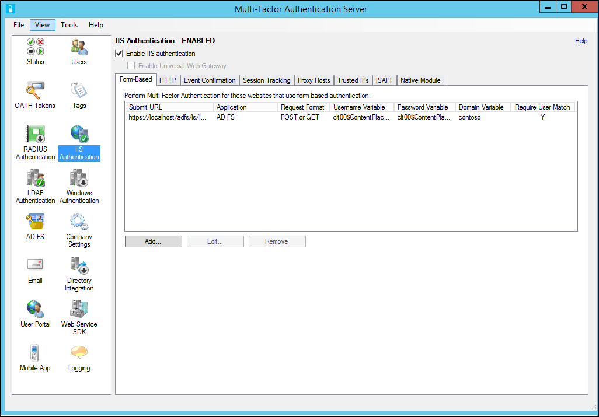

<properties 
    pageTitle="IIS-Authentifizierung und Azure kombinierte Authentifizierungsserver"
    description="Dies ist der Azure mehrstufige Authentifizierungsseite, die bei der Bereitstellung von IIS-Authentifizierung und Azure mehrstufige Authentifizierungsserver unterstützt."
    services="multi-factor-authentication"
    documentationCenter=""
    authors="kgremban"
    manager="femila"
    editor="curtand"/>

<tags
    ms.service="multi-factor-authentication"
    ms.workload="identity"
    ms.tgt_pltfrm="na"
    ms.devlang="na"
    ms.topic="get-started-article"
    ms.date="08/04/2016"
    ms.author="kgremban"/>

# IIS-Authentifizierung

Im Abschnitt IIS-Authentifizierung des Servers Azure mehrstufige Authentifizierung können Sie aktivieren und Konfigurieren der IIS-Authentifizierung für die Integration mit Microsoft IIS-Webanwendungen. Der Server Azure mehrstufige Authentifizierung Installationen ein plug-in die Anfragen an den IIS-Webserver ausgeführt, um die kombinierte Authentifizierung Azure hinzufügen filtern können. IIS-Plug-in unterstützt formularbasierte Authentifizierung und integrierte Windows HTTP-Authentifizierung. Vertrauenswürdige IP-Adressen auch in ausgenommenen internen IP-Adressen aus einer zweistufigen Authentifizierung konfiguriert werden kann.

## Verwenden von IIS formularbasierte Authentifizierung mit Azure kombinierte Authentifizierungsserver

Um eine IIS-Web-Anwendung zu sichern, die formularbasierte Authentifizierung verwendet, die Azure mehrstufige Authentifizierungsserver auf dem Webserver IIS installieren und Konfigurieren des Servers pro das folgende Verfahren.

1. Klicken Sie auf das Symbol IIS-Authentifizierung im linken Menü, innerhalb des Azure mehrstufige Authentifizierungsservers.
2. Klicken Sie auf der Registerkarte formularbasierten.
3. Klicken Sie auf Hinzufügen... Schaltfläche.
4. Zum Ermitteln von Benutzername, Kennwort und die Domäne Variablen automatisch, geben Sie die Anmelde-URL (z. B. https://localhost/contoso/auth/login.aspx) in das Dialogfeld Auto-Configure Form-Based Website und klicken Sie auf OK.
5. Aktivieren Sie das Übereinstimmung Benutzer mehrstufige Authentifizierung erforderlich aus, wenn alle Benutzer waren oder, in dem Server und unterliegen kombinierte Authentifizierung importiert werden. Wenn eine signifikante Anzahl Benutzer noch nicht in den Server importiert wurden und/oder von kombinierte Authentifizierung ausgenommen werden, lassen Sie das Kontrollkästchen deaktiviert.
6. Wenn die Seitenvariablen automatisch erkannt werden können, klicken Sie auf der angeben manuell... Schaltfläche im Dialogfeld Auto-Configure Form-Based-Website.
7. Klicken Sie im Dialogfeld Website Add Form-Based Geben Sie auf der Anmeldeseite in das Feld URL senden die URL, und geben Sie einen Anwendung ein (optional). Der Name der Anwendung wird in Azure kombinierte Authentifizierung Berichte und möglicherweise innerhalb SMS oder Mobile-App-Authentifizierungsnachrichten angezeigt werden. Finden Sie in der Hilfedatei für Weitere Informationen auf die URL senden.
8. Wählen Sie das richtige Anforderungsformat aus. Dies ist für die meisten Webanwendungen "Bereitstellen oder abrufen" festgelegt.
9. Geben Sie Variable Username, Variable Kennwort und Domäne Variable (sofern er auf der Anmeldeseite angezeigt wird). Möglicherweise müssen Sie navigieren Sie zu der Anmeldeseite in einem Webbrowser, mit der rechten Maustaste auf die Seite, und wählen Sie "Datenursprung anzeigen", um die Namen der den Eingabefeldern innerhalb der Seite zu finden.
10. Aktivieren Sie das Übereinstimmung Benutzer Azure kombinierte-Authentifizierung erforderlich aus, wenn alle Benutzer waren oder, in dem Server und unterliegen kombinierte Authentifizierung importiert werden. Wenn eine signifikante Anzahl Benutzer noch nicht in den Server importiert wurden und/oder von kombinierte Authentifizierung ausgenommen werden, lassen Sie das Kontrollkästchen deaktiviert. Finden Sie in der Hilfedatei für Weitere Informationen zu diesem Feature.
11.  Klicken Sie auf die erweiterte... Schaltfläche, um zu überprüfen, Erweiterte Einstellungen, die Möglichkeit, wählen Sie eine benutzerdefinierte DOS-Page-Datei, einschließlich erfolgreiche Authentifizierung zur Website für einen Zeitraum unter Verwendung von Cookies cache und wählen Sie, ob die primären Anmeldeinformationen anhand der Windows-Domäne, einem LDAP-Verzeichnis oder einen RADIUS-Server authentifiziert. Klicken Sie auf die Schaltfläche OK, um das Dialogfeld Add Form-Based Website zurückzukehren, wenn Sie fertig sind. Finden Sie in der Hilfedatei für Weitere Informationen auf erweiterten Einstellungen.
12. Klicken Sie auf die Schaltfläche OK.
13. Nachdem Sie die URL und Seite Variablen erkannt oder eingegeben wurden, werden die Websitedaten im Bereich formularbasierte angezeigt.
14. Finden Sie unter der aktivieren IIS-Plug-ins für Azure mehrstufige Authentifizierungsserver Abschnitt direkt unter zum Abschließen der Konfigurations der IIS-Authentifizierung.

## Integrierte Windows-Authentifizierung verwenden mit Azure kombinierte Authentifizierungsserver

Um eine IIS-Web-Anwendung zu sichern, die integrierte Windows HTTP-Authentifizierung verwendet, die Azure mehrstufige Authentifizierungsserver auf dem Webserver IIS installieren und Konfigurieren des Servers pro das folgende Verfahren.

1. Klicken Sie auf das Symbol IIS-Authentifizierung im linken Menü, innerhalb des Azure mehrstufige Authentifizierungsservers.
2. Klicken Sie auf der Registerkarte HTTP. Klicken Sie auf der Registerkarte formularbasierten.
3. Klicken Sie auf Hinzufügen... Schaltfläche.
4. Klicken Sie im Feld Dialog Basis-URL hinzufügen Geben Sie die URL in das Feld Basis-URL für die Website, wo finde ich HTTP-Authentifizierung (z. B. http://localhost/owa) ausgeführt, und geben Sie einen Anwendung ein (optional). Der Name der Anwendung wird in Azure kombinierte Authentifizierung Berichte und möglicherweise innerhalb SMS oder Mobile-App-Authentifizierungsnachrichten angezeigt werden.
5. Passen Sie im Leerlauf Timeout und Maximum Sitzung Zeiten ist der Standardwert nicht ausreichend ist.
6. Aktivieren Sie das Übereinstimmung Benutzer mehrstufige Authentifizierung erforderlich aus, wenn alle Benutzer waren oder, in dem Server und unterliegen kombinierte Authentifizierung importiert werden. Wenn eine signifikante Anzahl Benutzer noch nicht in den Server importiert wurden und/oder von kombinierte Authentifizierung ausgenommen werden, lassen Sie das Kontrollkästchen deaktiviert. Finden Sie in der Hilfedatei für Weitere Informationen zu diesem Feature.
7. Aktivieren Sie das Cache Cookie aus, falls gewünscht.
8. Klicken Sie auf die Schaltfläche OK.
9. Siehe Abschnitt [Aktivieren IIS-Plug-ins für Azure mehrstufige Authentifizierungsserver](#enable-iis-plug-ins-for-azure-multi-factor-authentication-server) direkt unten, um die Konfiguration der IIS-Authentifizierung abzuschließen.

## Aktivieren Sie IIS-Plug-ins für Azure kombinierte Authentifizierungsserver

Nachdem Sie die formularbasierte konfiguriert haben oder HTTP-Authentifizierung URLs und Einstellungen, müssen Sie die jeweiligen Speicherorten, in dem die Azure mehrstufige Authentifizierung IIS-Plug-ins geladen und aktiviert werden sollte, in IIS auswählen. Gehen Sie folgendermaßen vor:

1. Wenn auf IIS 6 ausgeführt wird, klicken Sie auf der Registerkarte ISAPI, und wählen Sie die Website, die die Webanwendung unter (z. B. Standardwebsite) ausgeführt wird, um den Azure mehrstufige Authentifizierung ISAPI-Filter-Plug-In für diese Website aktivieren.
2. Wenn IIS 7 oder höher ausgeführt werden, klicken Sie auf der Registerkarte systemeigenen Modul, und wählen Sie die Server, Website(s) wurden oder Anwendung(en) bei der gewünschten Ebenen IIS-Plug-in aktivieren.
3. Klicken Sie im Feld aktivieren IIS-Authentifizierung am oberen Rand des Bildschirms auf. Azure kombinierte Authentifizierung ist die ausgewählte IIS-Anwendung jetzt sichern. Stellen Sie sicher, dass Benutzer in den Server importiert wurden. Wenn Sie möchten weißen Liste, die internen-IP-Adressen, damit die Authentifizierung mit zwei Faktoren bei der Anmeldung bei der Website aus diesen Speicherorten nicht erforderlich ist, finden Sie unter Abschnitt vertrauenswürdige IP-Adressen.

## Vertrauenswürdigen IP-Adressen

Vertrauenswürdige IP-Adressen ermöglicht Benutzern Azure kombinierte Authentifizierung für Website-Anfragen von bestimmten IP-Adressen oder Subnetzen umgehen. Beispielsweise sollten für ausgenommenen Benutzer aus Azure kombinierte Authentifizierung Sie bei der Anmeldung aus dem Office. Zu diesem Zweck würden Sie im Office-Subnetz als Eintrag Vertrauenswürdige IP-Adressen angeben. Gehen Sie folgendermaßen vor, um zu konfigurieren vertrauenswürdige IP-Adressen:

1. Klicken Sie im Abschnitt IIS-Authentifizierung auf der Registerkarte Vertrauenswürdige IP-Adressen.
2. Klicken Sie auf Hinzufügen... Schaltfläche.
3. Wenn das Dialogfeld Vertrauenswürdige IP-Adressen hinzufügen angezeigt wird, wählen Sie einzelne IP-Adresse, IP-Bereich oder Subnetz Optionsfeld aus.
4. Geben Sie die IP-Adresse der IP-Adressen oder Subnetz gehören, die weißen Liste hinzugefügt werden soll. Wenn Sie ein Subnetz eingegeben haben, wählen Sie die geeignete Netzmaske, und klicken Sie auf die Schaltfläche OK. Die weißen Liste hat jetzt hinzugefügt wurde.
